[TOC]


# 🔺✨   进度一 - 二

day23- 13:50  CMS- BEGIN-

## 技术栈

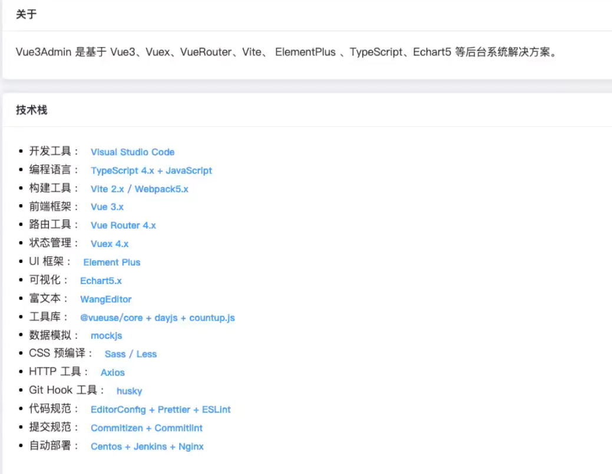


## 文件配置

### 代码格式配置 - .editorConfig

多人开发- 定义规则

下载插件 -  editorConfig for vs-code 对文件生效

```ts
# http://editorconfig.org

root = true

[*] # 表示所有文件适用
charset = utf-8 # 设置文件字符集为 utf-8
indent_style = space # 缩进风格（tab | space）
indent_size = 2 # 缩进大小
end_of_line = lf # 控制换行类型(lf | cr | crlf)
trim_trailing_whitespace = true # 去除行首的任意空白字符
insert_final_newline = true # 始终在文件末尾插入一个新行

[*.md] # 表示仅 md 文件适用以下规则
max_line_length = off
trim_trailing_whitespace = false
```


### prittier配置 代码格式化

```ts
{
  "useTabs": false,
  "tabWidth": 2,
  "printWidth": 80,
  "singleQuote": true,
  "trailingComma": "none",
  "semi": false
}

```


下载prettier依赖（文件内部配置） 和 插件


暂时不生效- 功能不全 只能格式尾部空格， 不确定是否配置调整


### eslint插件下载- VSCOde

    'plugin:prettier/recommended'

> `'plugin:prettier/recommended'` 是一个 ESLint 配置规则，用于结合 ESLint 和 Prettier 来统一管理代码格式和风格。
>
> ESLint 是一个用于静态代码分析的工具，它可以检查代码中的错误、潜在的问题以及代码风格不一致的地方。而 Prettier 是一个代码格式化工具，它可以自动格式化代码，使其符合统一的代码风格。
>
> 当你在 ESLint 配置文件中使用 `'plugin:prettier/recommended'` 规则时，它会结合 ESLint 内置的规则和 Prettier 的规则，使 ESLint 和 Prettier 的功能得以整合。具体来说，该配置规则会启用 ESLint 内置的规则，并在必要时使用 Prettier 来格式化代码。
>
> 使用 `'plugin:prettier/recommended'` 配置的好处是，可以同时使用 ESLint 和 Prettier 的功能，确保代码既符合统一的代码风格，又通过 ESLint 的规则检查。
>
> 示例配置文件：
>
> ```json
> {
> "extends": [
> "eslint:recommended",
> "plugin:prettier/recommended" // 启用 'plugin:prettier/recommended' 规则
> ],
> "rules": {
> // 可以在这里覆盖或添加其他 ESLint 规则
> }
> }
> ```
>
> 通过以上配置，你可以在项目中同时使用 ESLint 和 Prettier，并且在保存代码时，Prettier 将自动格式化代码以符合统一的代码风格。


### Git-Husky 代码提交前检测

### 安装并配置文件

**npx hsky-init && npm install**

> 是的，`npx husky-init` 是用于自动配置 Husky 的命令。
>
> 当你执行 `npx husky-init` 命令时，它会自动初始化 Husky，设置必要的配置文件和目录，使 Husky 能够与 Git Hooks 配合工作。
>
> 具体来说，`npx husky-init` 命令会做以下几件事情：
>
> 1. 创建一个名为 `.husky` 的目录：该目录用于存放 Husky 的配置文件和钩子脚本。
>
> 2. 在 `.husky` 目录下创建 `pre-commit` 钩子脚本：`pre-commit` 钩子脚本会在执行 `git commit` 命令前触发，它允许你在提交代码之前运行自定义的脚本，例如代码检查、格式化等。
>
> 3. 更新 `package.json` 文件：`npx husky-init` 会自动修改 `package.json` 文件，将 `"husky"` 字段添加到其中，用于配置 Husky 的钩子脚本。
>
> 4. 添加 `husky` 的依赖项：`npx husky-init` 会将 Husky 添加为开发依赖项，这样你就可以在项目中使用 Husky 了。
>
> 接下来的 `npm install` 命令是用于安装 Husky 和其他项目依赖项的。
>
> 总的来说，运行 `npx husky-init` 和 `npm install` 命令是为了自动配置 Husky 并安装相关的依赖项，从而使 Husky 在你的项目中正常工作，你就可以在提交代码前运行自定义的脚本，提高代码质量和规范开发流程。
>
> 


可以进行回调， 在开发人员提交前进行回调函数- 

> Git Husky（或简称 Husky）是一个用于在 Git Hooks 中运行脚本的工具。Git Hooks 是在 Git 执行特定操作时触发的钩子，允许你在特定的时机执行自定义的脚本，例如在提交代码前进行代码检查、格式化代码等。
>
> Husky 允许开发者在项目中配置 Git Hooks，并在特定的 Git 操作时自动运行预定义的脚本。它的作用主要有两个：
>
> 1. 提高代码质量：通过在提交代码前运行代码检查、格式化等脚本，可以确保提交的代码符合项目的代码质量要求。
>
> 2. 规范开发流程：通过配置 Husky，在特定的 Git 操作时执行预定的脚本，可以帮助项目团队规范开发流程，保证代码质量和项目的一致性。
>
> 常见的使用场景包括：
>
> - 在提交代码前进行代码检查（例如 ESLint 或 TSLint）。
>
> - 在提交代码前格式化代码（例如 Prettier）。
>
> - 在提交代码前运行单元测试（例如 Jest）。
>
> - 在推送代码前进行代码审查。
>
> 要使用 Husky，首先需要在项目中安装它，可以使用 npm 或 yarn 进行安装：
>
> ```bash
> npm install husky --save-dev
> # 或者
> yarn add husky --dev
> ```
>
> 然后，在项目的 `package.json` 文件中配置 Git Hooks 和对应的脚本。例如，可以在 `package.json` 中添加以下配置：
>
> ```json
> {
>   "husky": {
>     "hooks": {
>       "pre-commit": "npm run lint",
>       "pre-push": "npm run test"
>     }
>   }
> }
> ```
>
> 上面的配置表示在执行 `git commit` 命令前，会先运行 `npm run lint` 脚本，然后在执行 `git push` 命令前，会先运行 `npm run test` 脚本。
>
> 通过 Husky 的配置，你可以灵活地定义项目中需要运行的脚本，并在特定的 Git 操作时自动执行这些脚本，从而提高代码质量和规范开发流程。


执行后 - 并没有格式化 - husky 但是手动 npm run lint 会格式化


## commitizen 规范提交信息

> Commitizen 是一个用于规范化 Git 提交消息的工具，它可以帮助开发团队更好地管理和维护版本控制历史记录。
>
> 在团队合作开发中，良好的提交消息是非常重要的。通过使用 Commitizen，可以强制开发者按照一定的规范书写提交消息，使得提交记录更加清晰、易读和易于维护。这样的规范化提交消息对于版本控制和代码审查非常有益。
>
> 使用 Commitizen 的好处包括：
>
> 1. 统一提交消息格式：Commitizen 提供了预定义的提交消息格式规范，开发者只需要根据规范填写提交信息即可，避免了不同开发者提交消息格式不一致的问题。
>
> 2. 自动生成版本变更日志：通过规范化的提交消息，可以自动生成版本变更日志（Changelog），帮助团队了解每个版本的变更内容。
>
> 3. 提高代码审查效率：清晰的提交消息可以使代码审查更加高效，审查者能更快地理解代码变更的目的和内容。
>
> 要使用 Commitizen，首先需要在项目中安装它，可以使用 npm 或 yarn 进行安装：
>
> ```bash
> npm install commitizen --save-dev
> # 或者
> yarn add commitizen --dev
> ```
>
> 安装完成后，可以使用 `npx commitizen init cz-conventional-changelog --save-dev --save-exact` 命令初始化 Commitizen，并选择预定义的提交消息格式规范（通常选择 `cz-conventional-changelog`）。
>
> 然后，可以通过运行 `git cz` 命令来代替普通的 `git commit` 命令进行提交。运行 `git cz` 后，会自动弹出一个交互式的命令行界面，引导开发者填写规范化的提交消息。
>
> 通过 Commitizen 的配置和使用，可以让团队中的每个成员都遵循相同的提交消息规范，从而使项目的版本控制历史更加清晰、易读和易于管理。


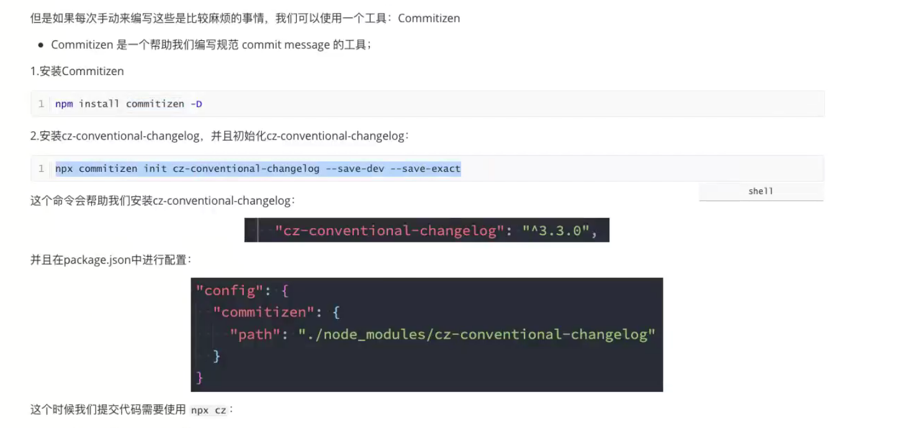


原先配置：

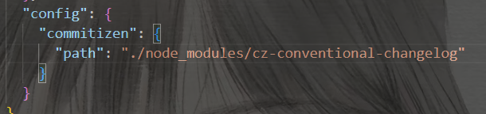

会在上层查找 路径- ， 由于git提交的位置处于上层


需要修改路径

> 是的，`commitizen` 的配置和所在文件目录有关系。当你在 Git 项目中使用 `commitizen` 时，它的配置是相对于 `package.json` 所在的目录的。
>
> 如果你的 Git 提交根目录在上层，而你在上层也想使用 `commitizen`，那么你需要在上层的项目中也安装和配置 `commitizen`。你可以在上层的项目中执行以下命令来安装 `commitizen`：
>
> ```
> npm install commitizen --save-dev
> ```
>
> 然后在上层项目的 `package.json` 文件中添加 `commitizen` 的配置，例如：
>
> ```json
> "commitizen": {
> "path": "cz-conventional-changelog"
> }
> ```
>
> 接下来，在上层项目中也可以使用 `npx cz` 命令来进行提交，`commitizen` 就会按照配置进行提交信息的填写。
>
> 需要注意的是，`commitizen` 的配置是针对每个项目的，如果你在不同的项目中使用不同的 Git 仓库，每个项目都需要单独配置一次 `commitizen`。而且在项目的根目录中配置 `commitizen` 更为常见和推荐，因为这样可以确保不同开发者在不同环境中都可以使用统一的提交方式，不会受到文件目录的影响。


### husky - 和  comitizen 暂时配置不生效 - 暂时不管 ， 这部分主要内容为项目提交规范


## router - vuex 的集成

vue-router

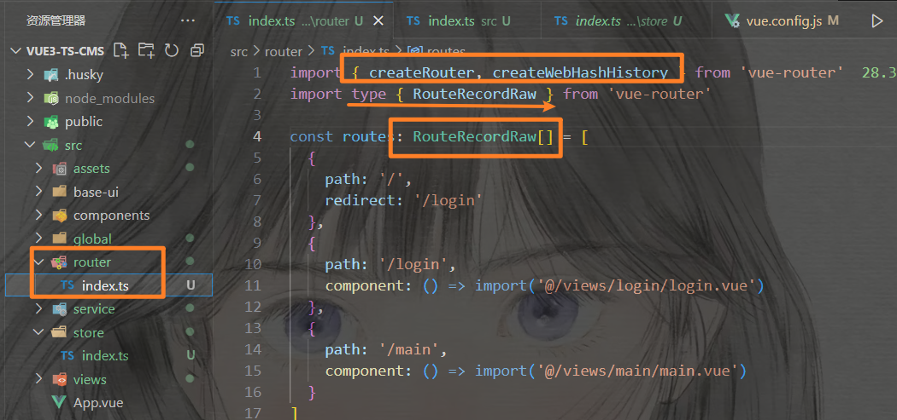


vue-x

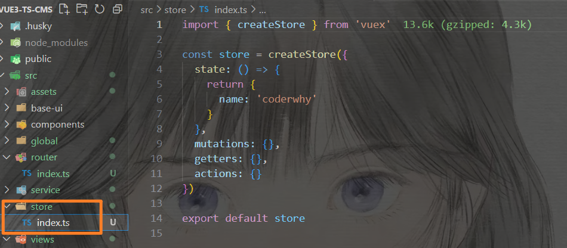


## prettier 配置生效 shift+all+F

启用配置文件的格式进行 自动格式化

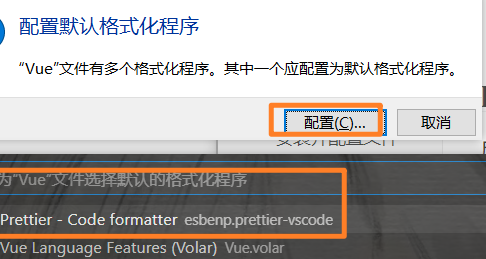

之所以不生效， 未配置 加上 本地有多个-  格式化程序， 需要指定一个


### powerShell  - 终端需要切换 - 

cmd的升级版 - 但是对于一些指令， 会报错， 切换为默认的cmd比较适合， 已切换


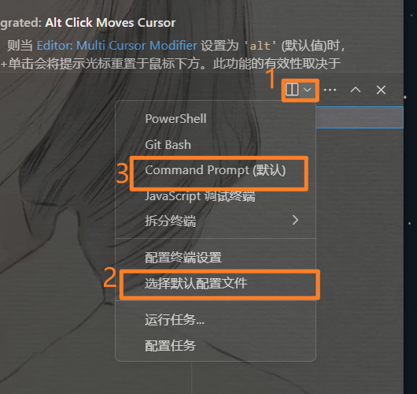


### 💓🐟- **false** 识别- 不出 $store

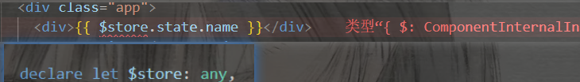

能在网页使用， ts识别不出， 但是已经提前声明还是显示错误， 先躲避


## element-plus

> Element Plus 是一款基于 Vue.js 的 UI 组件库，它是对 Element UI 的一次重写和升级，提供了一系列优雅美观的 UI 组件，方便开发者在 Vue.js 项目中快速构建出现代化的网页应用程序。
>
> Element Plus 提供了丰富的组件，包括但不限于按钮、输入框、表格、对话框、菜单、导航、表单等。这些组件都经过精心设计和开发，具有高度的可定制性，同时也符合现代 Web 应用程序的设计风格。
>
> 要在你的 Vue.js 项目中使用 Element Plus，首先需要在项目中安装 Element Plus 的依赖：
>
> ```bash
> npm install element-plus
> ```
>
> 或者使用 yarn 安装：
>
> ```bash
> yarn add element-plus
> ```
>
> 然后，在项目的入口文件（通常是 `main.js` 或 `main.ts`）中引入 Element Plus 的样式和组件：
>
> ```javascript
> import { createApp } from 'vue';
> import ElementPlus from 'element-plus';
> import 'element-plus/lib/theme-chalk/index.css';
> 
> import App from './App.vue';
> 
> const app = createApp(App);
> 
> app.use(ElementPlus);
> 
> app.mount('#app');
> ```
>
> 以上代码中，我们先导入了 Element Plus 的样式文件 `element-plus/lib/theme-chalk/index.css`，然后使用 `app.use(ElementPlus)` 将 Element Plus 注册为 Vue.js 的插件，这样就可以在整个项目中使用 Element Plus 的组件了。
>
> 之后，你就可以在你的 Vue 组件中按需引入 Element Plus 的组件，并使用它们来构建你的网页应用程序了。例如，在一个 Vue 组件中使用 Element Plus 的按钮组件：
>
> ```vue
> <template>
> <el-button type="primary">点击我</el-button>
> </template>
> 
> <script>
> import { ElButton } from 'element-plus';
> 
> export default {
> components: {
> ElButton,
> },
> };
> </script>
> ```
>
> 这样，你就可以在你的 Vue 项目中使用 Element Plus 提供的丰富组件了。Element Plus 的官方文档也非常详细，可以在其中查找更多组件的用法和配置选项：https://element-plus.org/


### babel-plugin-import

引用插件时， 会自动引用样式， 按需使用， 需要在配置文件中使用

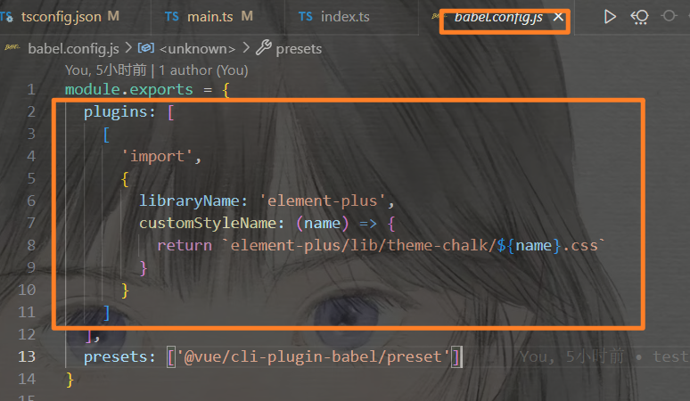

当导入时，才会引入应用样式


> 是的，这部分代码使用了 Babel 插件 `babel-plugin-import`，它的作用是实现按需加载 Element Plus 组件的 CSS 文件。
>
> 具体解释如下：
>
> 1. `plugins` 数组中使用了 `import` 插件，这个插件的作用是帮助我们按需引入 Element Plus 组件以及对应的 CSS 文件。
>
> 2. `libraryName: 'element-plus'` 指定了要按需引入的库名称为 `element-plus`，也就是 Element Plus 库。
>
> 3. `customStyleName` 是一个回调函数，它接收组件名称 `name` 作为参数，并返回对应组件的 CSS 文件路径。这样做是为了指定 Element Plus 组件的 CSS 文件路径，以便按需加载对应的样式文件。
>
> 4. `presets: ['@vue/cli-plugin-babel/preset']` 是 Vue CLI 的 Babel 预设，用于配置 Vue 项目的 Babel 编译选项。
>
> 使用这个配置后，当你在代码中按需引入 Element Plus 组件时，它会自动加载对应的 CSS 文件，而不是将整个样式文件都打包进最终的项目构建文件中，从而减少了项目的体积。这样可以优化网页加载速度和用户体验。


> `babel-plugin-import` 是一个用于按需引入组件的 Babel 插件，主要用于优化代码体积。它通常与 UI 组件库（如 Ant Design、Element Plus 等）一起使用。
>
> 当我们使用 UI 组件库时，如果直接导入整个组件库的样式和代码，会导致最终打包生成的 JavaScript 文件较大，包含了未使用的组件代码，增加了页面加载时间。为了解决这个问题，我们可以使用 `babel-plugin-import` 插件按需引入组件，即只导入需要使用的组件代码，以及相应组件的样式。
>
> 使用 `babel-plugin-import` 插件的步骤如下：
>
> 1. 安装插件：
>
>    ```bash
>    npm install babel-plugin-import --save-dev
>    ```
>
> 2. 在 Babel 配置文件（通常是 `.babelrc` 或 `babel.config.js`）中添加插件配置：
>
>    ```json
>    {
>      "plugins": [
>        [
>          "import",
>          {
>            "libraryName": "element-plus",
>            "styleLibraryName": "theme-chalk"
>          }
>        ]
>      ]
>    }
>    ```
>
>    上面的配置表示使用 `element-plus` 组件库，并按需引入 `theme-chalk` 主题的样式。
>
> 3. 在代码中按需引入组件：
>
>    ```javascript
>    // 在需要使用的组件中直接按需引入
>    import { Button, Input } from 'element-plus';
>    ```
>
> 通过以上配置，`babel-plugin-import` 将会自动按需引入指定的组件，以及相应的样式。这样可以显著减少最终打包后的文件大小，优化页面加载速度。


## .d.ts文件代码解读

```tsx
/* eslint-disable */
declare module '*.vue' {
  import type { DefineComponent } from 'vue'
  const component: DefineComponent<{}, {}, any>
  export default component
}

declare let $store: any,

```

> 这个 `.d.ts` 文件是 TypeScript 的类型声明文件，用于声明 Vue 单文件组件（`.vue` 文件）的类型信息。让 TypeScript 在开发过程中能够正确地识别和推断 `.vue` 文件的类型。
>
> 让我们逐个解析这个声明文件的内容：
>
> 1. `/* eslint-disable */`: 这是一个注释，用于禁用 ESLint 对该文件的检查，表示该文件内的代码不受 ESLint 规则限制。
>
> 2. `declare module '*.vue'`: 声明一个模块，表示导入一个以 `.vue` 结尾的文件时的类型信息。`*.vue` 是通配符，表示所有的 `.vue` 文件。
>
> 3. `import type { DefineComponent } from 'vue'`: 导入 Vue 的类型定义 `DefineComponent`，`import type` 用于只导入类型信息而不导入具体的值。
>
> 4. `const component: DefineComponent<{}, {}, any>`: 声明一个常量 `component`，其类型是 `DefineComponent`。`DefineComponent` 是 Vue 组件的类型定义，需要三个泛型参数：
>    - 第一个空对象 `{}` 表示组件的 Props 类型。这里为空对象，表示没有 Props。
>    - 第二个空对象 `{}` 表示组件的 Emits 类型。这里为空对象，表示没有 Emits。
>    - `any` 表示组件的 `setup` 函数返回值类型。这里用 `any` 表示不对 `setup` 函数的返回值进行类型检查。
>
> 5. `export default component`: 将常量 `component` 导出为默认导出，即当其他文件导入这个模块时，得到的是 `component`。
>
> 6. `declare let $store: any`: 声明一个全局变量 `$store`，类型为 `any`，表示这个全局变量可以接受任何类型的值。
>
> 综上所述，这个声明文件的作用是为了让 TypeScript 在处理 Vue 单文件组件时，能够正确地识别和推断组件的类型信息，同时允许全局使用一个类型为 `any` 的变量 `$store`。


### 全局组件注册

> 全局组件注册是指将一个组件在整个应用程序中都可以使用，而无需在每个使用该组件的地方进行单独的引入或注册。
>
> 在 Vue 2.x 版本中，我们可以通过在 `main.js`（或类似的入口文件）中注册全局组件，使其在整个应用程序中可用。以下是一个示例：
>
> ```javascript
> // main.js
> 
> import { createApp } from 'vue';
> import App from './App.vue';
> import MyGlobalComponent from './components/MyGlobalComponent.vue'; // 导入全局组件
> 
> const app = createApp(App);
> 
> app.component('my-global-component', MyGlobalComponent); // 注册全局组件
> 
> app.mount('#app');
> ```
>
> 在上面的代码中，我们通过 `app.component` 方法将 `MyGlobalComponent` 注册为全局组件，并为其指定了一个名称 `'my-global-component'`，以后在应用程序的任何地方，都可以通过这个名称来使用该组件。
>
> 使用全局组件时，无需在每个组件中再次导入或注册，而是直接在模板中使用它：
>
> ```html
> <!-- 在其他组件的模板中直接使用全局组件 -->
> <template>
> <div>
> <my-global-component></my-global-component>
> </div>
> </template>
> ```
>
> 这样，`MyGlobalComponent` 就可以在整个应用程序中的任何组件模板中使用，无需重复导入或注册，从而提高代码的可维护性和复用性。


函数注册- 函数内部注册组件， 所以注册组件等价 注册函数


```tsx
globalRegister(app)，这二者等价是吗
app.use(globalRegister)

所调用的函数
import { App } from 'vue'
import registerElement from './register-element'

// ts 组件类型声明
export function globalRegister(app: App): void {
  app.use(registerElement)
}
```


> 是的，`globalRegister(app)` 和 `app.use(globalRegister)` 是等价的，都会调用 `globalRegister` 函数并传递 `app` 参数。在这种情况下，`globalRegister` 函数接收一个 `App` 实例作为参数，然后在内部调用 `app.use(registerElement)`，将 `registerElement` 函数注册到应用程序中。
>
> 实际上，`app.use()` 方法用于在 Vue 应用程序中安装插件，而 `globalRegister` 函数可以被视为一个插件，它在内部使用了 `app.use(registerElement)` 来注册一些全局组件。所以，当你调用 `app.use(globalRegister)` 时，它会将 `registerElement` 注册为全局组件，从而使这些组件在整个应用程序中都可用。


## axios 测试请求

http://httpbin.org/， 提供一个测试请求的网站


### interceptors作用

拦截器： 实质上是执行函数， 第一个参数为成功执行，第二个参数为失败，

可在请求发送前进行拦截， 也可在信息返回后进行拦截

> 拦截器（Interceptors）是在发送请求或响应之前拦截并对它们进行处理的功能。在前端开发中，拦截器通常用于以下目的：
>
> 1. 添加公共配置：可以在发送请求前，对请求进行拦截并添加一些公共的配置信息，比如在请求头中添加认证信息、设置请求超时时间等。
>
> 2. 请求/响应的处理：可以在请求发送前或响应返回后对它们进行预处理或后处理，例如，在请求发送前对请求参数进行加密，或者在响应返回后对响应数据进行统一处理。
>
> 3. 错误处理：拦截器可以用来捕获请求或响应中的错误，然后进行相应的处理，比如在请求失败时显示错误提示信息。
>
> 4. 请求取消：拦截器可以用来实现请求的取消功能，当某个请求已经发出，但在响应返回之前需要取消该请求，拦截器可以拦截该请求并取消它。
>
> 拦截器通常是在发送请求之前执行的请求拦截器和在响应返回后执行的响应拦截器两种类型。它们可以用来实现一些通用的功能和处理逻辑，使代码更加模块化和可维护。
>
> 在一些前端框架和库中，比如 Axios 和 Vue.js，拦截器是一个重要的特性，提供了强大的扩展性和灵活性，使开发人员可以在请求和响应的不同阶段进行定制化的处理。


### 只要是通过axios发送的请求都可被拦截器所拦截

> 拦截器需要提前设置在发送的请求前，只对在拦截器后续的请求生效


## 区分环境变量

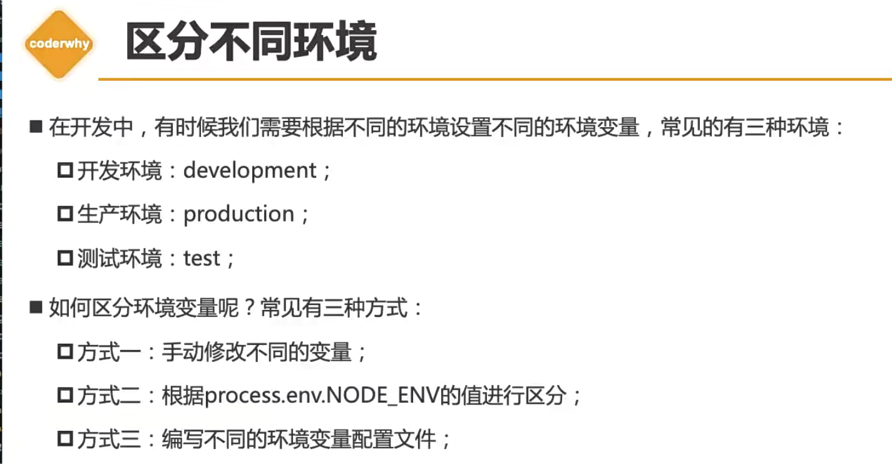


对于base_url,  base_name, 不同环境下，需要用到不同的名字， 有三种方式，一是手动修改， 不推荐（出错率高），二是使用逻辑判断进行赋值， 三是根据配置文件，使用语句进行读取， 自动获取


### 第二种方式 process.env.NODE_ENV

这种方式， 通过逻辑判断此属性赋予不同的值， 在开发中较常用于这种形式

它会根据环境的不同而自动设置

> 是的，`process.env.NODE_ENV` 是一个动态属性，并且是 Vue CLI 内置的一个特殊属性。它的值会根据当前运行的环境而自动设置，例如：
>
> - 在开发环境中，它的值是 "development"。
> - 在生产环境中，它的值是 "production"。
> - 在测试环境中，它的值是 "test"。
>
> 在 Vue CLI 项目中，这个属性的值会根据你启动应用的方式而动态设置，比如使用 `npm run serve` 启动开发服务器时，它会被设置为 "development"，而使用 `npm run build` 打包应用时，它会被设置为 "production"。这样，你可以根据 `process.env.NODE_ENV` 的值来做一些环境相关的配置或判断，例如使用不同的 API 地址、打开/关闭某些开发工具等。


### 第三种方式 process.env.VUE_APP定义变量

**process.env.VUE_APP_BASE_URL**

> `process.env.VUE_APP_BASE_URL` 是 Vue CLI 内置的一个特殊变量，用于设置项目的基础 URL。这个变量在 Vue CLI 项目中使用，并且在编译时会被替换成对应的值。
>
> 在 Vue CLI 项目中，可以在 `.env` 文件或者以 `.env` 开头的文件中设置环境变量。例如，可以在根目录下创建一个名为 `.env` 的文件，并在其中定义 `VUE_APP_BASE_URL` 变量：
>
> ```
> VUE_APP_BASE_URL=http://httpbin.org
> ```
>
> 然后，在你的代码中可以通过 `process.env.VUE_APP_BASE_URL` 获取到这个变量的值：
>
> ```javascript
> console.log(process.env.VUE_APP_BASE_URL); // 输出：http://httpbin.org
> ```
>
> 这样可以在项目中使用不同的环境变量值，而不需要在代码中硬编码这些值，方便在不同环境下进行切换和配置。注意，为了使 `.env` 文件生效，需要重新启动项目，或者在启动项目时加上 `--mode` 参数指定使用的环境模式。例如，使用以下命令启动项目：
>
> ```
> vue-cli-service serve --mode development
> ```
>
> 这样就会加载根目录下的 `.env.development` 文件，并将其中定义的变量设置为开发环境的值。类似地，可以使用 `--mode production` 或其他自定义的模式。


**自动注入**，不需要手动导入

> 是的，你说得对。在 Vue CLI 项目中，定义在以 `.env` 开头的文件中的环境变量会自动注入到应用中，并且可以直接使用 `process.env.VUE_APP_XXX` 的形式来获取它们的值，而不需要手动导入。这是 Vue CLI 内置的特性，方便在项目中使用不同的环境变量值，而无需显式导入或硬编码这些值。只要变量名以 `VUE_APP_` 开头，它们就会被注入到应用中，你可以在整个项目中直接使用它们。

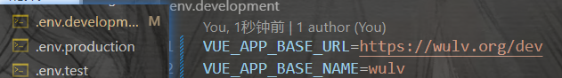

根据当前的所处环境自动注入

开发 - 生产 - 注入


# 🔺✨进度三

**day24- 13点20分**

## 🔺✨axios封装 思路

二次封装， 逻辑封装 ， 类的封装

原生axios实例化对象并没有 InterCepteros拦截器具体实现方法， 为此使用一个接口，ts定义了四个函数类型， 同时再定义一个配置继承自 **AxiosRequestConfig**， 再进行内置此属性， 所以当前配置相当于具备了一个接口， 此接口可以实例化对象实现， 并且此接口时可选参数， 所以实例化对象，可以选择传入接口并给出具体的实现方法，

```ts
import axios from 'axios'
import type { AxiosInstance } from 'axios'
import { HYRequestInterceptors, HYRequestConfig } from './type'
 //自定义接口扩展原config功能，添加拦截器功能  封装进type.ts
 interface HYRequestInterceptors<T = AxiosResponse> {
   requestInterceptor?: (config: AxiosRequestConfig) => AxiosRequestConfig
   requestInterceptorCatch?: (error: any) => any
   responseInterceptor?: (res: T) => T
   responseInterceptorCatch?: (error: any) => any
 }
 interface HYRequestConfig<T = AxiosResponse> extends AxiosRequestConfig {
    //自定义接口使用 并拓展拦截功能- 可选
   interceptors?: HYRequestInterceptors<T>
   showLoading?: boolean
 }
```

**this.instance.interceptors.request.use**, **this.instance.interceptors.response.use**

这个为配置内置方法， 可以通过它调用接口的的方法（所定义的拦截器接收响应方法）


### 为每个实例化 配置拦截器

```tsx
this.instance.interceptors.request.use() 和 this.instance.interceptors.response.use() 是 axios 实例对象的内置方法，用于注册拦截器。
```


> 对的，你理解得没问题！
>
> 在代码中
>
> **`this.instance.interceptors.request.use()`**
>
> **`this.instance.interceptors.response.use()`** 
>
> 是 `axios` 实例对象的内置方法，用于注册拦截器。
>
> 拦截器分为请求拦截器和响应拦截器，每个拦截器都接收两个函数作为参数：
>
> 1. 第一个函数用于处理成功的情况，即请求或响应成功时执行的函数。
> 2. 第二个函数用于处理失败的情况，即请求或响应失败时执行的函数。
>
> 这两个函数都会接收一个参数，请求拦截器的参数是 `config`，响应拦截器的参数是 `res`（响应成功时）或 `err`（响应失败时）。
>
> 在这里，你对 `this.instance.interceptors.request.use()` 注册了一个请求拦截器，用于在请求成功时打印日志，并对请求配置进行处理。而 `this.instance.interceptors.response.use()` 注册了一个响应拦截器，用于在响应成功时打印日志，并对响应结果进行处理。
>
> 这些拦截器可以对请求和响应进行统一的处理，比如添加公共的请求头、处理错误信息等，非常方便。


```ts
    this.instance.interceptors.request.use(
      (config) => {
        console.log('默认实例拦截器: 请求成功拦截')
        return config
      },
      (err) => {
        console.log('默认实例拦截器: 请求失败拦截')
        return err
      }
    )
    this.instance.interceptors.response.use(
      (res) => {
        console.log('默认实例拦截器: 响应成功拦截')
        return res
      },
      (err) => {
        console.log('默认实例拦截器: 响应拦截失败')
        return err
      }
    )	
```


### 为实例化对象 调用其单独拦截器

根据实例化对象，是否传入配置， 在内部进行逻辑判断， 通过直接执行来实现对象特有的传入拦截器

为每个请求配置 个性化的拦截器

```tsx
request(config: HYRequestConfig): void {
    // 执行 请求独有的拦截器
    // 单独请求有自带拦截器执行请求拦截器-
    // 有拦截器的存在时进行执行拦截器内函数，再将config返回
    if (config.interceptors?.requestInterceptor) {
      config = config.interceptors.requestInterceptor(config)
    }

    // 单独请求有自带拦截器执行响应拦截器
    this.instance.request(config).then((res) => {
      if (config.interceptors?.responseInterceptor) {
        res = config.interceptors.responseInterceptor(res)
      }
      console.log(res)
    })
  }
}
```


> 是的，你的理解是正确的。
>
> 在 `HYRequest` 类中的 `request` 方法中，通过传入的 `config` 对象来执行请求，并且在执行请求之前和请求成功后分别执行了请求拦截器和响应拦截器。
>
> 具体逻辑如下：
>
> 1. 首先判断 `config.interceptors?.requestInterceptor` 是否存在，如果存在，则说明传入了请求拦截器函数。在这种情况下，先执行传入的请求拦截器函数，并将其返回的 `config` 赋值给 `config` 变量，以便在请求时使用修改后的配置。
>
> 2. 接着执行请求，即调用 `this.instance.request(config)` 方法，该方法会返回一个 Promise 对象。
>
> 3. 在 Promise 的 `then` 回调中，检查 `config.interceptors?.responseInterceptor` 是否存在，如果存在，则说明传入了响应拦截器函数。在这种情况下，先执行传入的响应拦截器函数，并将其返回的响应结果 `res` 赋值给 `res` 变量，以便在后续处理中使用修改后的响应结果。
>
> 4. 最后，打印响应结果 `res`。
>
> 这样，通过在 `request` 方法中根据传入的配置判断是否执行特定的拦截器函数，实现了在每个请求独有的情况下，能够灵活地定制请求拦截器和响应拦截器的功能。同时，还利用了全局拦截器来处理所有实例的请求和响应。这样的设计非常灵活和易于维护。


### 封装的好处

这样的行为有助于定制个性化的处理，对请求或响应进行个性化的操作， 从而实现不同的操作 ，这样的封装， 让每个请求变得很灵活

> 正是的，你说得非常正确！
>
> 通过在 `HYRequest` 类中对请求和响应拦截器进行封装，以及在实例化 `HYRequest` 对象时可以传入特定的拦截器函数，使得每个请求可以根据具体需求进行个性化的处理。这样的封装让请求变得非常灵活和可定制，能够满足不同场景下的需求，同时也使得代码更加易于维护和扩展。
>
> 通过拦截器的使用，可以实现以下一些功能：
>
> 1. 添加全局的请求头或请求参数，适用于每个请求；
> 2. 在请求前做一些数据的处理，例如在请求中添加 token；
> 3. 在请求失败时进行错误处理，例如弹出错误提示；
> 4. 在响应成功时对数据进行处理，例如提取响应结果中的有效数据；
> 5. 在响应失败时进行错误处理，例如统一处理网络错误或超时错误。
>
> 这样的封装和灵活性可以大大提高开发效率，并且使得代码结构更加清晰和可维护。同时，对于复杂的业务场景，能够轻松应对各种需求变化。总体来说，合理使用拦截器可以提高代码的可复用性和可扩展性，使得整个项目开发更加高效和便捷。


## 拦截失败有两种返回结果 

**服务器设置接口的不同设置**

请求失败-   直接返回失败  response Catch 拦截

请求失败： 返回请求成功， 但data内为错误的状态码， 实际为失败

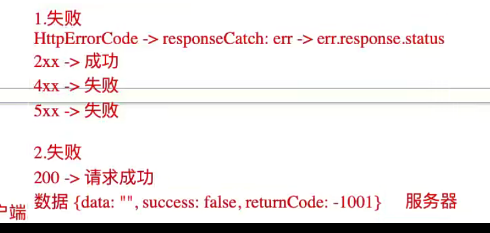

> 你说得很对！在拦截器中，对于请求失败和请求成功但返回的数据中包含错误信息这两种情况，可以分别进行不同的处理。
>
> 1. 对于请求失败，可以直接返回一个 `Error` 对象，让 `catch` 语句捕获并处理错误，从而在请求发生错误时进行统一的错误处理。例如，网络连接失败或服务器返回错误状态码等情况可以直接返回 `Error` 对象，并在 `catch` 中进行错误提示或处理逻辑。
>
> 2. 对于请求成功但返回的数据中包含错误信息，可以在拦截器中对响应数据进行判断，如果数据中包含错误码或错误信息，可以根据具体情况返回一个自定义的错误对象，或者在 `catch` 语句中进行错误处理。这样可以统一处理响应中的错误信息，确保请求成功时也能够及时发现并处理错误。
>
> 在拦截器的使用中，需要根据实际情况进行灵活处理，以满足不同业务需求。通过合理地使用拦截器，可以对请求和响应进行统一处理，提高代码的可复用性和可维护性。同时，对于异常情况的处理也更加方便和规范。


### 对两种情况的响应进行处理

res: 错误以成功的形式返回

err: 直接返回错误

```tsx
    this.instance.interceptors.response.use(
      (res) => {
        console.log('默认实例拦截器: 响应成功拦截')
        const data = res.data
        // 此情况为请求失败，但失败的状态返回在请求成功中
        if (data.returnCode === '-1001') {
          console.log(`请求失败,错误码为${data.returnCode}`)
        } else {
          return data
        }
        return res
      },
      (err) => {
        console.log('默认实例拦截器: 响应拦截失败')
        // 请求失败 在相应失败设置
        if (err.response.status === 404) {
          console.log('404错误')
        }
        return err
      }
    )
  }
```


### 请求前的拦截- 身份标识 token

```tsx
  requestInterceptor: (config) => {
      const token = ''
      if (token) {
        config.headers.Authorization = `Bearer ${token}`
      }
      console.log('请求成功拦截')
      return config
    },
```

> 对的，你说得没错！在这个代码片段中，`token` 相当于身份标识或认证令牌。它用于标识和验证发出请求的用户。
>
> 在 `HYrequest` 类的 `requestInterceptor` 函数中，它检查是否存在 `token`。如果有 `token`，则会将 `Authorization` 头添加到请求的 `config` 对象中，并设置为 `Bearer ${token}`。`Authorization` 头通常用于基于令牌的身份验证，服务器根据令牌验证用户的身份，并确定用户是否有权限访问请求的资源。
>
> `Bearer` 关键字是一种常见的约定，用于指示发送的令牌是承载令牌，这意味着服务器可以使用该令牌验证用户并授予对受保护资源的访问权限。
>
> 通过添加带有 `Bearer` 令牌的 `Authorization` 头，服务器可以验证用户的身份，并根据用户的权限允许或拒绝访问某些部分的应用程序或 API。
>
> 总体而言，在这个代码片段中，使用 `token` 是一种常见的方法来保护 API 请求，并确保只有经过身份验证的用户才能访问特定的资源。


每次的请求都会加上此token是吗， 然后服务器再进行验证， 一般这个token为用户初次使用时，由服务器进行分配?

> 是的，每次的请求都会加上这个 token，服务器再进行验证。通常情况下，token是由服务器在用户初次登录或进行身份验证时进行分配的。
>
> 用户在初次登录时，会提供身份信息（如用户名和密码），服务器会验证用户的身份，并根据验证结果生成一个 token 并分配给该用户。该 token 通常包含一些加密信息，用于标识用户的身份和权限。然后，服务器会将该 token 返回给客户端（例如浏览器或移动应用）。
>
> 客户端在后续的请求中，每次都会将这个 token 添加到请求的头部中的 `Authorization` 字段里。服务器在接收到请求后会验证这个 token，通过检查该 token 的有效性和权限，来确定用户是否有权访问请求的资源。
>
> 这种机制可以有效地保护 API 资源，只有经过身份验证并具有有效 token 的用户才能访问受保护的资源。如果用户没有提供有效的 token 或 token 验证失败，则服务器会拒绝该请求，并返回相应的错误状态码或错误信息。


## 请求添加-加载动画效果（element-plus）

首先需要为接口- 添加属性：showLoading:? : boolean， 设置后

在实例化对象才能使用传入这个属性- 为实例化对象 设置开关


在类中需要定义 

常量   DEAFULT_LOADING = true， 用于赋值showLoading ，逻辑判断，当无传入值时，默认为true执行动画

showLoading: boolean ， 开启动画开关， 当无传入时默认开启动画， 当对象中属性设置为false，将动画关闭

 loading?: ILoadingInstance， 加载的动画组件，需要进行声明类型和导入， 在请求使用时，需要要此参数接收动画组件 

```ts
this.loading = ElLoading.service({
      lock: true,
      text: '正在请求数据....',
      background: 'rgba(0, 0, 0, 0.5)'
     })
```

在信息返回后， 需要对动画进行关闭， 调用

```ts
      // 请求成功后 将loading移除, 不一定有使用加载动画配置，不需要使用if
      this.loading?.close()

```


执行逻辑判断， 最后需要对showLoading 设置为DEAFULT_LOADING （true）

	不设置会影响下次请求

```ts
 // 单独请求有自带拦截器执行响应拦截器
    this.instance.request(config).then((res) => {
      if (config.interceptors?.responseInterceptor) {
        res = config.interceptors.responseInterceptor(res)
      }
      console.log(res.data)

      this.showLoading = true
    })
  }
}
```


## 💓🐟对象的请求封装为Promise对象 （这部分有点懵）

```ts
  request<T>(config: HYRequestConfig<T>): Promise<T> {
    return new Promise((resolve, reject) => {
      // 有拦截器的存在时进行执行拦截器内函数，再将config返回
      if (config.interceptors?.requestInterceptor) {
        config = config.interceptors.requestInterceptor(config)
      }

      // 这个请求开关，将影响加载动画开启， 默认不填入时为true,看类中constructor
      if (config.showLoading === false) {
        this.showLoading = false
      }

      // 单独请求有自带拦截器执行响应拦截器
      this.instance
        .request<any, T>(config)
        .then((res) => {
          // 1. 单个请求数据处理
          if (config.interceptors?.responseInterceptor) {
            res = config.interceptors.responseInterceptor(res)
          }
          // 将showLoading设置为true， 不影响下次请求
          this.showLoading = DEAFULT_LOADING

          // 3. 将结果返回
          resolve(res)
        })
        .catch((err) => {
          // 将showLoading 设置为true, 不影响下个请求
          this.showLoading = DEAFULT_LOADING
          reject(err)
          return err
        })
    })
  }

  
  get<T>(config: HYRequestConfig<T>): Promise<T> {
    return this.request<T>({ ...config, method: 'GET' })
  }

...post ...delete ...patch 其它类似如上

```


```ts
  get<T>(config: HYRequestConfig<T>): Promise<T> {
    return this.request<T>({ ...config, method: 'GET' })
  }

```

代码理解：相当于对request函数进行重写， 并且将原先instance.request方法直接修改为目标所执行的请求，在外界只需直接调用即可，传入配置文件， 底层会自动实现


> 在外部调用 `hyRequest.get()` 时，你需要传入配置信息。对于 `hyRequest.get()` 方法，它接受一个参数 `config`，这个参数包含了发送 GET 请求的相关配置，例如请求的 URL、请求参数、请求头等信息。
>
> 所以，在使用 `hyRequest.get()` 时，你需要像这样传入配置信息：
>
> ```javascript
> hyRequest.get({
> url: '/api/data', // 请求的URL
> params: { key: 'value' }, // 请求参数
> headers: { 'Content-Type': 'application/json' }, // 请求头
> // 其他配置...
> }).then((response) => {
> // 处理响应数据
> }).catch((error) => {
> // 处理请求错误
> });
> ```
>
> 通过这种方式，你可以在外部直接调用 `hyRequest.get()` 并传入相关配置信息来发送 GET 请求，而不需要关心底层的具体实现细节。


# 🔺✨进度四

## tsConfig.json 配置文件


```ts
{
  "compilerOptions": {
    // 目标代码(ts -> js(es5/6/7))
    "target": "esnext",
    // 目标代码需要使用的模块化方案(commonjs require/module.exports/es module import/export)
    "module": "esnext",
    // 严格一些严格的检查(any) 
    "strict": true,
    // 对jsx进行怎么样的处理
    "jsx": "preserve",
    // 辅助的导入功能
    "importHelpers": true,
    // 按照node的方式去解析模块 import "/index.node"
    "moduleResolution": "node",
    // 跳过一些库的类型检测 (axios -> 类型/ lodash -> @types/lodash / 其他的第三方)
    // import { Person } from 'axios'
    "skipLibCheck": true,
    // export default/module.exports = {}
    // es module 和 commonjs
    "esModuleInterop": true,
    "allowSyntheticDefaultImports": true,
    // 要不要生成映射文件(ts -> js)
    "sourceMap": true,
    // 文件路径在解析时, 基本url, 基于当前url
    "baseUrl": ".",
    // 指定具体要解析使用的类型
    "types": ["webpack-env"],
    // 路径解析(类似于webpack alias)
    "paths": {
      "@/*": ["src/*"],
      "components/*": ["src/components/*"]
    },
    // 可以指定在项目中可以使用哪里库的类型(Proxy/Window/Document)
    "lib": ["esnext", "dom", "dom.iterable", "scripthost"]
  },
  "include": [
    "src/**/*.ts",
    "src/**/*.tsx",
    "src/**/*.vue",
    "tests/**/*.ts",
    "tests/**/*.tsx"
  ],
  "exclude": ["node_modules"]
}

```


## defineComponent 包裹组件对象的作用

> 在 Vue.js 3.x 中，`defineComponent` 是一个辅助函数，用于包裹组件对象，并且执行一些必要的处理，以便将组件对象转换为一个 Vue 组件选项对象。
>
> 具体来说，`defineComponent` 的作用有以下几点：
>
> 1. 类型推断：`defineComponent` 使用泛型类型参数来推断组件的 props 类型。这样可以在组件内部使用 props 的类型检查，以及提供类型推断的支持。
>
> 2. 组件选项：`defineComponent` 会将组件对象包裹，并转换为 Vue 组件选项对象。这样就可以在组件内部使用 Vue.js 提供的组件选项，比如 `data`、`methods`、`computed` 等。
>
> 3. 兼容性处理：`defineComponent` 内部会处理一些兼容性问题，以确保组件对象在 Vue.js 3.x 中能够正确地运行。
>
> 示例使用 `defineComponent` 的代码：
>
> ```js
> import { defineComponent } from 'vue';
> 
> const MyComponent = defineComponent({
>   props: {
>     message: {
>       type: String,
>       required: true,
>     },
>   },
>   data() {
>     return {
>       count: 0,
>     };
>   },
>   methods: {
>     increment() {
>       this.count++;
>     },
>   },
>   template: `
>     <div>
>       <p>{{ message }}</p>
>       <p>Count: {{ count }}</p>
>       <button @click="increment">Increment</button>
>     </div>
>   `,
> });
> 
> export default MyComponent;
> ```
>
> 在上面的例子中，`defineComponent` 函数将组件对象转换为了一个 Vue 组件选项对象。组件对象内部定义了 props、data 和 methods，并使用了模板语法来渲染组件。使用 `defineComponent` 可以让组件对象更符合 Vue 组件的规范，提供了更好的类型检查和兼容性。


## normalize.css

对不同的浏览器保持相同的初始化状态

> 是的，您说得对。`normalize.css` 的目标之一就是确保不同浏览器在初始化状态下拥有相同的样式表现，从而消除浏览器之间的样式差异，使页面在各个浏览器上表现一致。
>
> 当我们在开发网页时，浏览器会自动为 HTML 元素应用一些默认样式，这些样式因浏览器而异。这就导致了不同浏览器在显示网页时可能会有细微的差异。`normalize.css` 会通过一系列的规则和样式重置来确保不同浏览器之间的一致性，从而为我们提供一个更统一、更可控的基础样式。
>
> 需要注意的是，`normalize.css` 并不会完全清除浏览器默认样式，而是尽量保持它们在各个浏览器上的一致性。这样做的目的是为了确保页面在不同浏览器中都有较好的表现，同时不会影响到页面的正常功能。


## el-plus的表格标签

```ts
<el-tabs type="border-card" stretch>
      <el-tab-pane>
        <template #label>
          <span><i class="el-icon-user-solid"></i> 账号登录</span>
        </template>
        <login-account ref="accountRef" />
      </el-tab-pane>
      <el-tab-pane>
        <template #label>
          <span><i class="el-icon-mobile-phone"></i> 手机登录</span>
        </template>
        <login-phone />
      </el-tab-pane>
    </el-tabs>


```

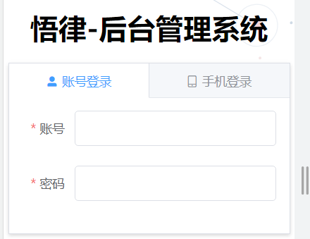


由最外部的el-tabs标签包裹， 内部的el-tab-pane为列表选项， 账号登录和手机登录，通过点击可切换不同的内容， 内置插槽是设置文本内容和图标（设置span 再设置 i标签）

标签login-account 为组件， 将内部信息进行一个抽取作为组件， 再将组件导入该部分内容


### 账号组件设置

```ts
  <div class="login-account">
   
      <!-- ：model表示将对象的信息实时传递给外标签， 进行规则检验 -->
    <el-form label-width="60px" :model="account" :rules="rules" ref="formRef">
      <el-form-item label="账号" prop="name">
        <el-input v-model="account.name" />
      </el-form-item>
      <el-form-item label="密码" prop="password">
        <!-- 对于标签框 需要动态绑定属性 -->
        <el-input v-model="account.password" />
      </el-form-item>
    </el-form>
```

el-form  表单，单行元素， item文本， input输入框， 同时对其传入account信息， 为内部导出的对象，实时动态传入，应用规则 rules 对文本进行检验， 再对文本框的信息进行双向绑定， 


### 规则设置

```ts
// 编写好规则
export const rules = {
  // 检验规则是以数组的形式储存
  name: [
    {
      // 必传， 有此符号才有*号键
      required: true,
      message: '用户名是必传内容~',
      // 失去焦点时检验
      trigger: 'blur'
    },
    {
      pattern: /^[a-z0-9]{5,10}$/,
      message: '用户名必须是5~10个字母或者数字~',
      trigger: 'blur'
    }
  ],
  password: [
    {
      required: true,
      message: '密码是必传内容~',
      trigger: 'blur'
    },
    {
      pattern: /^[a-z0-9]{3,}$/,
      message: '用户名必须是3位以上的字母或者数字~',
      trigger: 'blur'
    }
  ]
    
}

```

抽取出来放置config， 内部检验数组形式， 多种应用规则


### 登录逻辑验证

在account-用户组件中

设置登录逻辑

  const formRef = ref<InstanceType<typeof ElForm>>()

需先import 该组件， instanceType， 为ts内置方法用于识别类型，此方法将绑定ElForm组件， 转换为响应式数据， .value 为获取当前组件实例


```ts
const loginAction = () => {
      formRef.value?.validate((valid) => {
        if (valid) {
          console.log('真正执行登录逻辑')
        }
      })
    }
```

逻辑判断， 当存在时Elform实例时， 调用其validate方法- 去验证定义的rules，检验是否通过rules判断， 是则执行内部语句


> 这段代码是在Vue 3中使用了Composition API的`ref`函数和TypeScript的泛型语法，同时还使用了Element UI（`ElForm`）的表单组件。
>
> 让我来解析这段代码：
>
> 1. `ref`函数：和之前解释的一样，`ref`函数是Vue 3中用于创建响应式数据的函数。
>
> 2. `<InstanceType<typeof ElForm>>`：这部分是TypeScript的泛型语法，它的作用和之前解释的一样，用于获取`ElForm`组件的实例类型。
>
> 3. `const formRef = ref<InstanceType<typeof ElForm>>()`: 这行代码声明了一个变量`formRef`，它是一个响应式引用，可以持有`ElForm`组件的实例。
>
> 4. `const loginAction = () => { ... }`: 这行代码定义了一个名为`loginAction`的函数。
>
> 5. `formRef.value?.validate((valid) => { ... })`: 这部分代码调用了`ElForm`组件的`validate`方法。`formRef.value`用于获取`formRef`的当前值（即`ElForm`组件的实例），然后通过`?.`安全导航操作符来确保`validate`方法存在，并在其存在的情况下执行它。
>
> 6. `if (valid) { console.log('真正执行登录逻辑') }`: 这部分代码在`validate`方法的回调中执行，它会根据表单验证的结果来决定是否执行真正的登录逻辑。如果表单验证通过（即`valid`为`true`），则输出'真正执行登录逻辑'。
>
> 综合起来，这段代码的作用是创建一个响应式引用`formRef`，用于持有`ElForm`组件的实例。然后，通过`loginAction`函数来处理登录逻辑，其中调用了`ElForm`组件的表单验证方法`validate`来验证表单的合法性。如果表单验证通过，则执行真正的登录逻辑。
>
> 请注意，以上代码中使用了Element UI的表单组件（`ElForm`），在实际应用中，你需要确保正确引入并注册Element UI组件，以及正确设置表单的验证规则和相关逻辑。


# 🔺✨进度五

**day25  -  20点30分**


## 20-31详解instanceOF

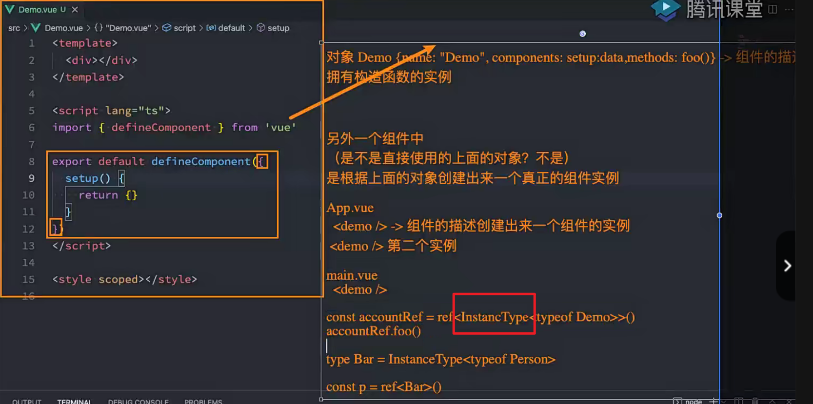


## 依赖报错- 重启vscode- 重装依赖问题

IDE问题：有时候IDE（集成开发环境）可能会出现缓存问题，导致识别不到新安装的类型声明。尝试重启IDE，或者清理IDE的缓存，然后再次打开项目。


E问题：有时候IDE（集成开发环境）可能会出现缓存问题，导致识别不到新安装的类型声明。尝试重启IDE，或者清理IDE的缓存，然后再次打开项目。


> 是的，如果你在`node_modules`目录中删除了`element-plus`依赖，并重新运行`npm install`或`yarn install`重新安装依赖，有时候IDE（如VSCode）可能会缓存之前的类型信息，导致在VSCode中依然显示找不到`element-plus`模块或其相应的类型声明。
>
> 在这种情况下，可以尝试以下方法来解决问题：
>
> 1. 在VSCode中尝试重启IDE，以便刷新缓存，有时候这个简单的操作就能解决问题。
>
> 2. 在VSCode中尝试执行"清除缓存并重启"操作。在VSCode的命令面板中（按下`Ctrl + Shift + P`或`Cmd + Shift + P`），输入"Reload Window"，选择"Developer: Reload Window"来重启VSCode，并清除缓存。
>
> 3. 确保你的VSCode已经安装了TypeScript插件，并且是最新版本。有时候，TypeScript插件的更新可能会修复一些问题。
>
> 4. 确保你的项目根目录下包含了正确的`tsconfig.json`文件，并且其中配置了正确的类型声明文件路径。
>
> 5. 确保你的项目中已经正确安装了`@types/element-plus`类型声明包。
>
> 6. 尝试关闭VSCode，删除项目根目录下的`node_modules`目录和`package-lock.json`（或`yarn.lock`）文件，然后重新运行`npm install`或`yarn install`重新安装依赖。
>
> 如果你尝试了上述方法仍然无法解决问题，可以尝试在VSCode中打开另一个TypeScript文件，然后再切换回你的目标文件，有时候这样能够刷新缓存并解决问题。


## 使用vueX 接收信息-  组件触发事件

使用了vuex ， vuex所在文件夹 store, 建立子文件夹去对应所要开发的组件（store）， 在组件中将信息发送出去， 触发patch， 子模块的actions函数

```ts
import { Module } from 'vuex'
// 表示为 vuex的子模块

// import { IAccount } from '@/service/login/types'
import { ILoginState } from './types'
import { IRootState } from '../types'

// 第一个参数为此模块的state数据类型， 第二个为根模块的state数据类型
const loginModule: Module<ILoginState, IRootState>
```

**// 第一个参数为此模块的state数据类型， 第二个为根模块的state数据类型**
**const loginModule: Module<ILoginState, IRootState>**


## 组件响应绑定

```ts
    <el-tabs type="border-card" stretch v-model="currentTab">
      <el-tab-pane name="account">
        <template #label>
          <span><i class="el-icon-user-solid"></i> 账号登录</span>
        </template>
        <login-account ref="accountRef" />
      </el-tab-pane>

      <el-tab-pane name="phone">
        <template #label>
          <span><i class="el-icon-mobile-phone"></i> 手机登录</span>
        </template>
        <login-phone ref="phoneRef" />
      </el-tab-pane>
    </el-tabs>
```


currentTab 默认设置为account, 需要为每个tab设置name属性， el-plus内部为我们识别当前tab，并绑定当前所在页面， 每个组件的tab下的文本框都绑定来了一个ref相应属性，获得该实例对象


需对其进行类型声明， 并获得该实例组件对象

```ts
    const accountRef = ref<InstanceType<typeof LoginAccount>>()
    const phoneRef = ref<InstanceType<typeof LoginPhone>>()
```


通过结合currentTab当前值，去触发不同的逻辑

```ts
    const handleLoginClick = () => {
      // 判断当前 currentTab 是哪个标签
      if (currentTab.value === 'account') {
        accountRef.value?.loginAction(isKeepPassword.value)
      } else {
        console.log('phoneRef调用loginAction')
      }
    }
```


## 💓🐟 转换策略 -  直接看视频 跟代码- 

### 原码 比对-  学会逻辑   35-	1:30


### 设置全局接口的办法

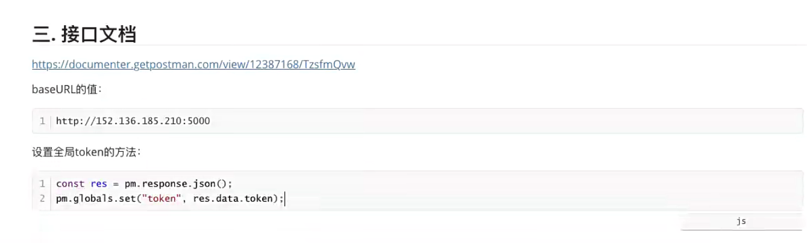


## 登录逻辑的异步处理


```ts
async accountLoginAction({ commit }, payload: IAccount) {
      // 1.实现登录逻辑
      const loginResult = await accountLoginRequest(payload)
      const { id, token } = loginResult.data
      commit('changeToken', token)
      localCache.setCache('token', token)
```


> 在这个代码片段中，使用`await`关键字是因为`accountLoginRequest(payload)`是一个异步函数。在JavaScript中，使用`async/await`是一种处理异步操作的便捷方式，它可以帮助我们更清晰地编写和处理异步代码。
>
> `async/await`是ES2017引入的一种异步编程模型。通过将`async`关键字添加到函数声明前，函数就变成了一个异步函数，表示这个函数可能包含异步操作，其中的某些操作需要等待结果。
>
> 在这个例子中，`accountLoginAction`函数是一个异步函数，它执行登录逻辑。在这个函数中，调用`accountLoginRequest(payload)`发起登录请求，这是一个异步操作，会返回一个Promise对象。
>
> 通过使用`await`关键字，可以等待`accountLoginRequest`异步操作的结果。当使用`await`关键字调用一个返回Promise对象的函数时，JavaScript会暂停函数的执行，直到Promise对象状态变为`resolved`（已解决）或`rejected`（已拒绝）。一旦Promise对象状态变为已解决，`await`表达式就会返回Promise对象的解决值。
>
> 在这里，`await accountLoginRequest(payload)`会等待登录请求的结果，并将结果赋值给`loginResult`变量。然后，通过`loginResult.data`获取登录结果的数据，包括`id`和`token`，并将`token`存储到Vuex store中，以及使用`localCache`工具将`token`缓存到本地。
>
> 使用`async/await`可以使异步代码看起来更像同步代码，增强代码的可读性和可维护性。它避免了回调地狱（callback hell）的问题，并使错误处理更加直观。


## proxy代理绕过  同源策略

```ts
module.exports = {
  // 1.配置方式一: CLI提供的属性
  outputDir: './build',
  // publicPath: './',
  devServer: {
    proxy: {
      '^/api': {
        target: 'http://152.136.185.210:5000',
        pathRewrite: {
          '^/api': ''
        },
        changeOrigin: true
      }
    }
  }
```

> 在这个代码片段中，使用了代理来绕过同源策略。同源策略是一种安全机制，限制了一个网页上的脚本如何与另一个源（域、协议或端口）的资源进行交互。同源策略的目的是防止恶意网站获取用户的敏感数据或进行未经授权的操作。
>
> 然而，有时候我们需要在前端代码中访问不同源的服务器接口，这就会受到同源策略的限制。为了绕过同源策略，可以使用代理来将前端请求转发到目标服务器，并在代理服务器上处理跨域请求。
>
> 在这个代码片段中，使用了webpack的`devServer`配置中的`proxy`选项来设置代理规则。具体解析如下：
>
> 1. `'^/api'`: 这是一个正则表达式，用来匹配请求URL中以`/api`开头的部分。例如，对于请求`/api/login`，这个规则就会匹配上。
>
> 2. `target: 'http://152.136.185.210:5000'`: 这是目标服务器的地址，所有匹配到的请求将被转发到该地址。也就是说，所有以`/api`开头的请求都会被转发到`http://152.136.185.210:5000`这个服务器上。
>
> 3. `pathRewrite: { '^/api': '' }`: 这是对请求路径进行重写的设置。在这里，将请求路径中的`/api`部分替换为空字符串，即将`/api`从请求路径中移除。例如，对于请求`/api/login`，经过重写后变为`/login`，这样请求就不再带有`/api`前缀了。
>
> 4. `changeOrigin: true`: 这是一个布尔值，用于控制是否改变请求头中的`Host`字段为目标服务器的域名。设置为`true`表示将请求头中的`Host`字段修改为目标服务器的域名，这在某些情况下可能是必要的。
>
> 通过以上配置，当前端发起一个以`/api`开头的请求时，Webpack Dev Server会将该请求转发到`http://152.136.185.210:5000`这个服务器上，并且将请求路径中的`/api`前缀去掉。这样就绕过了同源策略，从而可以在前端代码中访问不同源的服务器接口。


**Request - 内 config.ts  =>  BASE_URL = /API**


### 异步逻辑处理

login定义- 类型

```ts
export interface IAccount {
  name: string
  password: string
}

export interface ILoginResult {
  id: number
  name: string
  token: string
}
```


### 封装请求Login 请求并返回

```ts
import hyRequest from '../index'

import { IAccount, IDataType, ILoginResult } from './type'

enum LoginAPI {
  AccountLogin = '/login',
  LoginUserInfo = '/users/', // 用法: /users/1
  UserMenus = '/role/' // 用法: role/1/menu
}

export function accountLoginRequest(account: IAccount) {
  return hyRequest.post<IDataType<ILoginResult>>({
    url: LoginAPI.AccountLogin,
    data: account
  })
}


```

表示post<IDataType<ILoginResult>>， 接受的对象类型， 将用户表信息发送


## 请求标识代码解析

```ts
export interface ILoginResult {
  id: number
  name: string
  token: string
}

export interface IDataType<T = any> {
  code: number
  data: T
}

```


```ts
export function accountLoginRequest(account: IAccount) {
  return hyRequest.post<IDataType<ILoginResult>>({
    url: LoginAPI.AccountLogin,
    data: account
  })
```

**post<IDataType<ILoginResult>>** 表示返回参数内置 声明参数， 传入时，声明所得到的data的数据类型


类型 json-ts， 将类型转化为类型， 用于ts提前声明， 如不同用户具有不同信息


## 使用枚举保存常量- type.ts文件

可以直接使用，作为请求的路径， 变量添加的形式

```ts
enum LoginAPI {
  AccountLogin = '/login',
  LoginUserInfo = '/users/', // 用法: /users/1
  UserMenus = '/role/' // 用法: role/1/menu
}

export function accountLoginRequest(account: IAccount) {
  return hyRequest.post<IDataType<ILoginResult>>({
    url: LoginAPI.AccountLogin,
    data: account
  })
}

export function requestUserInfoById(id: number) {
  return hyRequest.get<IDataType>({
    url: LoginAPI.LoginUserInfo + id,
    showLoading: false
  })
}

export function requestUserMenusByRoleId(id: number) {
  return hyRequest.get<IDataType>({
    url: LoginAPI.UserMenus + id + '/menu',
    showLoading: false
  })
}
```


## 登录逻辑实现完毕

一个点击， 通过网络接口获取该用户的信息， 权限信息， 用户菜单， 再调到登录界面， 同时设置localStorage缓存

```ts
enum LoginAPI {
  AccountLogin = '/login',
  LoginUserInfo = '/users/', // 用法: /users/1
  UserMenus = '/role/' // 用法: role/1/menu
}

export function accountLoginRequest(account: IAccount) {
  return hyRequest.post<IDataType<ILoginResult>>({
    url: LoginAPI.AccountLogin,
    data: account
  })
}

export function requestUserInfoById(id: number) {
  return hyRequest.get<IDataType>({
    url: LoginAPI.LoginUserInfo + id,
    showLoading: false
  })
}

export function requestUserMenusByRoleId(id: number) {
  return hyRequest.get<IDataType>({
    url: LoginAPI.UserMenus + id + '/menu',
    showLoading: false
  })
}
```


## 根路径设置为main路径，再添加路由守卫

```ts
router.beforeEach((to) => {
  if (to.path !== '/login') {
    const token = localCache.getCache('token')
    if (!token) {
      return '/login'
    }
  }
})

```

如果没有token时， 返回主页面，进行账户登录


如果页面已经进入main路径， 用户使用了刷新， vueX已保存的信息会消失

在Store根模块，将此函数导出（子模块定义的函数）


```ts
export function setupStore() {
  store.dispatch('login/loadLocalLogin')
}

```

在vueX封装此函数， 在main.ts,导入， 当用户刷新时自动执行，


## 刷新 本地Local数据提取 - 详细函数

```ts
    loadLocalLogin({ commit }) {
      const token = localCache.getCache('token')
      if (token) {
        commit('changeToken', token)
      }
      const userInfo = localCache.getCache('userInfo')
      if (userInfo) {
        commit('changeUserInfo', userInfo)
      }
      const userMenus = localCache.getCache('userMenus')
      if (userMenus) {
        commit('changeUserMenus', userMenus)
      }
    }
```

在网页进行刷新后， 防止vueX的数据消失， Action重新提取LocalStorage信息， 触发mutations，相当于重新设置VueX , 从本地提取，一般有token的情况下，就有其它类似数据


# 🔺✨进度六

**day26 -  15点20分**


## vueX  优化- 

vueX 对Ts支持较差， 如果直接使用useStore，里面类型不可取，无法取到子模块的state类型，所以为了让子模块- 登录获取的state内部信息可取

```ts
import { ILoginState } from './login/types'

export interface IRootState {
  name: string
  age: number
}

export interface IRootWithModule {
  login: ILoginState
}

export type IStoreType = IRootState & IRootWithModule

```

> 在Vuex中，如果你使用TypeScript（Ts）来定义和管理状态（state），可能会遇到一些类型推断方面的挑战，特别是涉及到子模块的状态类型。使用`useStore`时，其类型定义可能无法直接获取子模块的状态类型。
>
> 为了解决这个问题，你可以使用`IRootWithModule`和`IStoreType`这部分代码。让我们逐步解释：
>
> 1. `IRootState`: 这是定义根模块（Root Module）的状态类型的接口。在这里，你定义了`name`和`age`两个属性的类型。
>
> 2. `IRootWithModule`: 这是定义包含子模块的根状态类型的接口。在这里，你引入了一个名为`login`的子模块，并将其状态类型定义为`ILoginState`。这样，`IRootWithModule`接口包含了`login`子模块的状态类型。
>
> 3. `IStoreType`: 这是整个Vuex store的状态类型的合并接口。通过使用`IRootState & IRootWithModule`，将根模块的状态类型和子模块的状态类型合并成一个完整的状态类型。这样，`IStoreType`可以同时访问根模块和子模块的状态类型，从而让你能够获取子模块的状态信息。
>
> 例如，假设你有一个名为`login`的子模块，它有一个名为`userInfo`的状态属性。通过使用`IStoreType`，你就可以在使用`useStore`获取store实例时，访问和获取`login`子模块的`userInfo`状态的类型，而不会出现类型错误。
>
> 总的来说，使用`IRootWithModule`和`IStoreType`这部分代码是为了让子模块的状态类型在使用`useStore`时可取，并解决VueX对TypeScript支持较差的问题，从而更好地利用TypeScript的类型推断和类型安全性。


## -vueX 模块 代码解析

```ts
import { createStore, Store, useStore as useVuexStore } from 'vuex'

import login from './login/login'

import { IRootState, IStoreType } from './types'

const store = createStore<IRootState>({
  state() {
    return {
      name: 'coderwhy',
      age: 18
    }
  },
  mutations: {},
  getters: {},
  actions: {},
  modules: {
    login
  }
})

export function setupStore() {
  store.dispatch('login/loadLocalLogin')
}

export function useStore(): Store<IStoreType> {
  return useVuexStore()
}

export default store

```

导入两个types的作用， 第一个为声明根模块 state类型声明， 第二个为导入定制的useVuxStore方法， 这个作用是访问store时， 在main组件进行访问store时， 可以访问到根组件信息， 也能访问到 login组件的state信息， 因为IstoreType相当于做了一个类型合并， 将根模块和login子模块组件的state数据合并


**export type IStoreType = IRootState & IRootWithModule**

相当于对store类型进行重构， state的类型为IrootState, 内部类型为 login: ILoginState类型， 所以在访问数据时， 会有类型提示


> 你的说法是正确的，让我们来对代码进行解析：
>
> 1. `import { IRootState, IStoreType } from './types'`: 这行代码导入了你之前定义的`IRootState`和`IStoreType`，这两个类型在上面的代码片段中已经解释过了。`IRootState`用于声明父组件的状态类型，而`IStoreType`是通过合并根模块和子模块的状态类型得到的最终的Vuex store的状态类型。
>
> 2. `const store = createStore<IRootState>({...})`: 这行代码创建了一个VueX的store实例。在`createStore`函数中，你传入了一个泛型参数`IRootState`，用于指定根模块的状态类型。在`state()`方法中，你定义了根模块的初始状态，包含了`name`和`age`属性。
>
> 3. `modules: { login }`: 这里通过`modules`选项将`login`子模块添加到了根模块中。
>
> 4. `export function setupStore() {...}`: 这是一个辅助函数，用于在Vue应用程序启动时调用，来执行一些初始化操作。在这里，你调用了`store.dispatch('login/loadLocalLogin')`，这个操作可能是为了加载本地缓存中的登录信息。由于你使用了模块化的store结构，所以需要通过子模块的namespace来调用对应的action，即`login/loadLocalLogin`。
>
> 5. `export function useStore(): Store<IStoreType> {...}`: 这是一个自定义的`useStore`函数，它返回一个经过泛型指定为`Store<IStoreType>`类型的`vuex` store实例。在这里，`useVuexStore()`是VueX提供的原生函数用于获取store实例。通过在`useStore`函数中指定返回类型为`Store<IStoreType>`，你确保了在Vue组件中使用`useStore`时，可以访问到根模块和子模块的状态信息，从而能够获取到完整的状态类型。
>
> 总的来说，这些代码确保了在Vue组件中使用`useStore`函数获取的store实例的类型是经过合并的，包含了根模块和子模块的状态信息。这样，在使用store时，你可以访问到父组件和子组件的状态信息，从而更方便地管理和操作全局状态。


## 对菜单信息进行获取

```ts
import { defineComponent, computed } from 'vue'
import { useStore } from '@/store'


setup() {
    const store = useStore()
    const userMenus = computed(() => store.state.login.userMenus)
    return {
      userMenus
    }
  }
```


## Pinia（Vue3 状态管理库）

> Pinia是一个状态管理库，是为Vue 3开发的下一代状态管理解决方案。它由Vue.js核心团队推荐，并且旨在为Vue开发者提供更简单、更强大和更类型安全的状态管理工具。
>
> 与传统的Vue状态管理库（如Vuex）相比，Pinia在设计上有一些不同之处：
>
> 1. 基于Vue 3：Pinia是专门为Vue 3设计的，充分利用了Vue 3的新特性和生态系统。因此，使用Pinia需要在Vue 3项目中使用，无法在Vue 2项目中使用。
>
> 2. 更简单的API：Pinia的API设计非常简洁和直观，易于学习和使用。它提供了一组清晰的API，使状态的定义、修改和访问变得更加直观和自然。
>
> 3. 更强大的类型支持：Pinia是完全支持TypeScript的，它提供了更强大的类型定义和类型推断功能。这使得在使用TypeScript开发Vue应用时，可以更轻松地定义和管理状态的类型，从而提高代码的安全性和可维护性。
>
> 4. 状态分割：Pinia支持将状态划分为多个模块，使得大型应用程序的状态管理变得更加灵活和可扩展。
>
> 5. 插件系统：Pinia具有灵活的插件系统，允许开发者轻松地扩展其功能，并与其他库进行集成。
>
> 总的来说，Pinia旨在提供一个优雅而强大的状态管理解决方案，使Vue开发者能够更轻松地管理和共享状态，并提供更好的开发体验。如果你使用Vue 3，并且希望拥有更好的状态管理功能和类型支持，那么Pinia是一个值得考虑的选择


##  vuex - typescript  => pinia

> 在你的提问中，你提到了从Vuex到Pinia的迁移，从TypeScript到Pinia。让我解释一下：
>
> 1. Vuex到Pinia的迁移：Vuex是Vue.js官方推荐的状态管理库，而Pinia是由Vue.js核心团队推荐的下一代状态管理库。Pinia提供了更简单、更强大和更类型安全的状态管理解决方案，同时它也支持Vue 3的新特性和生态系统。如果你正在从Vuex迁移到Pinia，你可以按照Pinia的官方文档和迁移指南来进行迁移，以便更好地利用Vue 3和Pinia的优势。
>
> 2. TypeScript到Pinia：在Vue 3中，由于其使用了TypeScript来重写代码，对于使用TypeScript的开发者来说，与Vue 2相比，Vue 3提供了更好的类型支持和类型推断。而Pinia作为Vue 3的状态管理库，天然支持TypeScript，并且提供了更强大的类型定义和类型推断，使得在使用TypeScript开发Vue应用时，能够更轻松地定义和管理状态的类型，从而提高代码的安全性和可维护性。
>
> 总的来说，从Vuex到Pinia的迁移可以带来更好的性能和开发体验，而TypeScript对于Vue 3和Pinia的使用也提供了更强大的类型支持，让你在开发过程中更加舒心和自信。在迁移过程中，确保按照官方文档和指南进行操作，以确保平稳完成迁移，并充分利用Pinia和TypeScript的优势来优化你的Vue应用


## 💓🐟测试- 用postMen 想学 并进行测试 


## 能导入i标签跟elementplus- index.tss有关系

```ts
main.ts
import 'element-plus/lib/theme-chalk/index.css'

//在main组件中
    <i
      class="fold-menu"
      :class="isFold ? 'el-icon-s-fold' : 'el-icon-s-unfold'"
      @click="handleFoldClick"
    ></i>
```


## 🔺✨  使用el-plus的界面布局设计

采取的布局是- 左侧边栏， 右头部， 下部内容

aside- 侧边栏 - header-右头部- container内容

并导入子组件，分别位于aside（功能权限  对应菜单渲染）， header有执行侧边栏收缩按钮


主要逻辑 ： header图标可点击， emit触发父组件信息，emit再将布尔值传入侧边栏， 通过此布尔值，侧边栏组件进行接收collapse, collapse 默认为false(不折叠)， 菜单属性有collapse这个属性， 当传入为true时，收缩


菜单细节问题：需要为每个菜单赋予index值（需是字符串，为number时需要为其加“ ”拼接转换为 字符串）， 标识为唯一，能正确识别当前所处菜单， 才可对其样式进行处理，如选中时高亮等其他处理


userMenus此为登录时已经返回的菜单信息， 已被存储于 vueX-login下的state中， 此部分也代表着 用户的功能权限，在组件中 用 computed属性导入（响应式）

 const userMenus = computed(() => store.state.login.userMenus)


```ts
   <el-container class="main-content">
      <el-aside :width="isCollapse ? '60px' : '210px'">
        <!-- 传入折叠布尔值 -  -->
        <nav-menu :collapse="isCollapse" />
      </el-aside>
      <el-container class="page">
        <el-header class="page-header">
          <nav-header @foldChange="handleFoldChange" />
        </el-header>
        <el-main class="page-content">悟律的后台冲冲</el-main>
      </el-container>
    </el-container>
```


## RBAC， 角色访问控制

> RBAC（Role-Based Access Control）是一种**基于角色的访问控制模型**，用于管理和控制系统中的资源访问权限。在RBAC模型中，权限控制是根据用户的角色来进行的，而不是直接给予每个用户具体的权限。这样可以简化权限管理，并提高系统的安全性和可维护性。
>
> RBAC模型包含以下几个核心概念：
>
> 1. 角色（Role）：角色是一组相同权限的用户的集合。每个角色代表了一类用户，例如管理员、普通用户、访客等。
>
> 2. 用户（User）：用户是系统中的具体个体，每个用户可以被分配到一个或多个角色。
>
> 3. 权限（Permission）：权限是对系统资源的访问权限，例如访问某个功能、查看某个页面等。
>
> 4. 分配（Assignment）：分配是将用户与角色关联起来，即将某个角色分配给某个用户，从而赋予用户相应的权限。
>
> 5. 继承（Inheritance）：继承是指角色之间可以相互关联并继承权限。例如，一个角色可以继承另一个角色的权限。
>
> RBAC模型的核心思想是将权限的管理从用户层面抽象到角色层面，通过给角色分配权限，再将角色分配给用户，来实现对用户访问权限的控制。这样做的好处是可以简化权限管理，降低系统复杂性，并且在需要修改权限时，只需要调整角色与权限的关系，而不必逐个修改每个用户的权限。
>
> RBAC模型在许多系统中广泛应用，特别是在企业级应用和系统中，用于管理复杂的用户权限和访问控制需求。它是一种成熟且高效的访问控制策略，有助于保护系统的安全性和完整性。


## 🔺✨ 添加路由三种方法   36-   2:20 -2:30

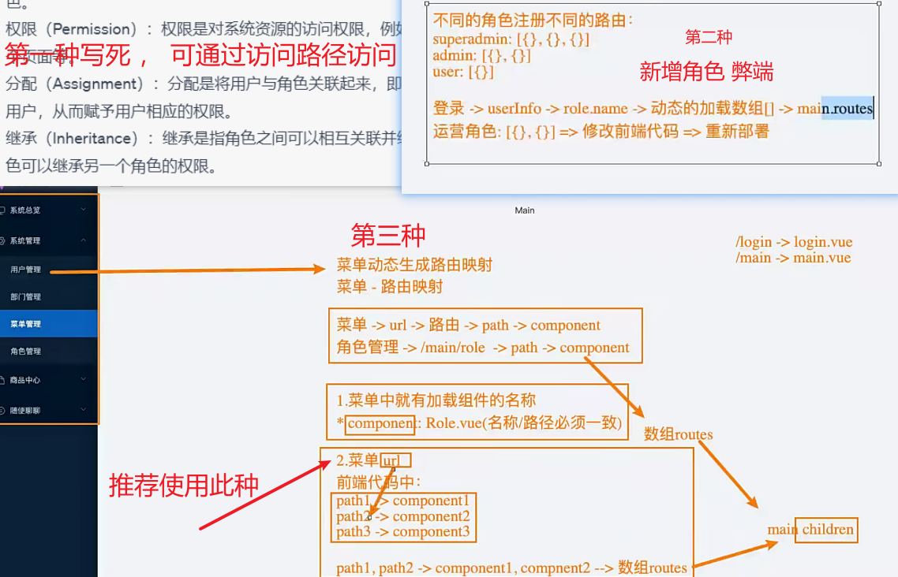


第一种是为main组件添加所有子组件，写死，或许界面能隐藏部分组件显示按钮， 但是当用户在url直接进行输入，能看到未属于自身该有的权限 组件


第二种添加方式： 如枚举方式， 为角色添加对应组件映射

vue-router加载， 这种保证角色获得的组件唯一， 但是有缺陷  当新增角色时， 需要生成枚举类型


第三种： （两种）

- 一种是后端给出的数据中，菜单属性中有对应的加载 组件名称，需要求前端编写时， 以这种匹配时要保持名称路径的一致
- 另外一种- 课程所应用的为： url，每个菜单含有对应的url属性， 通过在路由中通过路由


## coder_why老师 自动化生成代码

组件和路由映射快速生成

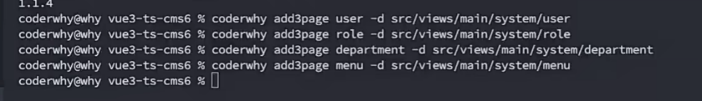


会自动生成- views下  路径/组件，再将此路径匹配到routers 添加映射关系


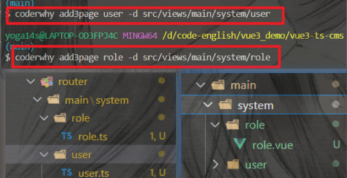


### 路由路径生成- 代码解析


```ts
const dashboard = () => import('@/views/main/analysis/dashboard/dashboard.vue')
export default {
  path: '/main/analysis/dashboard',
  name: 'dashboard',
  component: dashboard,
  children: []
}

```

**这是一个路由routes, 可在主路径中，添加此routes，相当于拥有此路径， 动态权限组件， 就是进行匹配，将url同这个path进行匹配， 有该url就对当前组件进行注册**


> 是的，你理解得很正确！
>
> 这个路由配置代码表示一个路由对象，它描述了一个路径为 `/main/analysis/dashboard` 的路由。在 Vue Router 中，路由配置对象用于描述页面的路径、名称以及对应的组件。
>
> 具体解释如下：
>
> 1. `const dashboard = () => import('@/views/main/analysis/dashboard/dashboard.vue')`：这里使用动态导入的方式来引入 `dashboard` 组件。动态导入的语法是 `() => import('组件路径')`，它是异步加载组件的方式，可以实现按需加载，提高应用的性能。
>
> 2. `export default { ... }`：这是一个默认导出的对象，表示一个 Vue Router 的路由配置。在这里，它描述了一个路径为 `/main/analysis/dashboard` 的路由。
>
> 3. `path: '/main/analysis/dashboard'`：表示这个路由对应的路径是 `/main/analysis/dashboard`。
>
> 4. `name: 'dashboard'`：给这个路由设置一个名称为 `dashboard`，可以在代码中使用这个名称来进行路由导航。
>
> 5. `component: dashboard`：表示这个路由对应的组件是 `dashboard`，即上面动态导入的组件。
>
> 6. `children: []`：这个路由没有子路由，所以是一个空数组。
>
> 在主路径中添加这个路由配置，相当于告诉 Vue Router，当用户访问 `/main/analysis/dashboard` 这个路径时，要渲染 `dashboard` 组件。同时，你可以根据后端提供的菜单数据来动态生成类似这样的路由配置，从而实现根据菜单权限来动态加载组件和配置路由。这样做可以实现前端的权限控制，使用户只能访问具有权限的页面。


# 🔺✨进度七

day27 - 18点20分


## 面试要领

候机法则-   聊天- 沟通 -  技巧-  扩展


##    所有路由组件导入

```ts
  // 1.先去加载默认所有的routes
  const allRoutes: RouteRecordRaw[] = []
  const routeFiles = require.context('../router/main', true, /\.ts/)
  routeFiles.keys().forEach((key) => {
    const route = require('../router/main' + key.split('.')[1])
    allRoutes.push(route.default)
  })
```


这里使用require.context获取一个上下文对象，并且内部有keys()放回，返回的所匹配到的模块路径, 这个路径是相对路径，如在main下, 会显示为 **./ system/xx.ts**, 所以在这里要以spilit对其进行分割， 并取下标为1的 xx， 再进行拼接，获取模块

再将各模块规则进行导入（routes），用push导入， 相当于现在的allRoutes获得了所有main下的组件routes， 如果此时将规则增加给 vue-router则拥有所有访问权限


allRoutes.push(route） 和 ..(route.defalut)， 二者没区别， 但是常用语route.default更直观表示了模块的默认导出


**context内部结构**

> 在使用 `require.context` 时，会得到一个上下文对象，这个对象内部包含了匹配到的模块信息。上下文对象具有以下属性：
>
> 1. `resolve`：一个函数，用于获取模块的绝对路径。
> 2. `keys`：一个函数，用于获取所有匹配到的模块的路径数组。
> 3. `id`：一个字符串，表示上下文模块的唯一标识符。
> 4. `default`：一个函数，用于获取默认导出的模块。
> 5. `context`：一个函数，用于获取匹配到的模块。
> 6. 匹配到的模块路径：作为上下文对象的属性，每个匹配到的模块路径都指向对应的模块。
>
> 举个例子：
>
> 假设在目录 `./modules` 下有两个文件：`a.ts` 和 `b.ts`。我们使用 `require.context` 来获取这两个文件：
>
> ```javascript
> const context = require.context('./modules', true, /\.ts/)
> ```
>
> 上下文对象 `context` 的结构如下：
>
> ```javascript
> {
>   resolve: Function,
>   keys: Function,
>   id: './modules sync \\.ts$',
>   default: Function,
>   context: Function,
>   './a.ts': ModuleA,
>   './b.ts': ModuleB
> }
> ```
>
> 其中，`ModuleA` 和 `ModuleB` 表示分别匹配到的模块内容。这些模块内容会根据匹配到的路径作为属性，存放在上下文对象内部。这样，在使用 `keys()` 方法时，就能够根据路径获取对应的模块。例如，`context('./a.ts')` 将返回 `ModuleA`，`context('./b.ts')` 将返回 `ModuleB`。


## 💓🐟bug 重现 - 一级路径需要命名

添加动态路由时

```ts
  {
    // 路径需要为其添加名字
    name: 'main',
    path: '/main',
    component: () => import('@/views/main/main.vue')
  },
  
  
 const routes = mapMenusToRoutes(userMenus)
     //逐一遍历添加进规则- mainChildren
   routes.forEach((route) => {
   router.addRoute('main', route)
  })
```

​	

**添加路由时， children， 一个参数为路径名， 如在main下添加其children， 标识子路径，路径需要存在 且命名， 否则会识别为根路径直接跳转， demo中已犯过这次错误**


## 🔺✨ 动态路由权限配置- 思路理清

定义函数， 将所有组件（最高权限时所拥有的配置，全部功能模块）路由加载规则，全部注册在RouteRecordRaw


### **mapMenusToRoutes 函数 - 动态分配路由权限**

1.找到所有路由路径配置模块 并进行注册

使用到require这个函数，webPack自带函数，require.context去指定路径递归查找，三个参数（路径， 递归查找（boolean）, / \\.ts /(文件类型- 正则表达式) ），返回对象， 通过keys() 获取所匹配到 包含模块路径的数组， 但是路径是 相对路径，需要用split对其进行分割， 拼接为完整路径， 用require导入所有模块， 最后将模块规则放入allRoutes中

```ts
 // 先加载默认所有routes
  const allRoutes: RouteRecordRaw[] = []
  // 这里使用webpack的require方法执行context 返回上下文
  //  参数解析： 路径， 递归查找（设置为true）， 正则表达式， \转义
  const routeFiles = require.context('../router/main', true, /\.ts/)
  // 返回所有路径的方法， 但是需要对相对路径进行分跟 ./system/xx.ts ,以. 分割
  routeFiles.keys().forEach((key) => {
    const route = require('../router/main' + key.split('.')[1])
    allRoutes.push(route.default)
  })
```


2. **为用户赋值 匹配权限**

根据传入的menus进行匹配 ，遍历，menu路径与已保存Allroutes的进行匹配， 使用find方法， const route = allRoutes.find((route) => route.path === menu.url), 再将匹配到的进行返回， 当为多级菜单时， 进行递归调用

```ts
  const _recurseGetRoute = (menus: any[]) => {
    for (const menu of menus) {
      if (menu.type === 2) {
        const route = allRoutes.find((route) => route.path === menu.url)
        //  应该提前注册所有组件， 一般不可能出现匹配不了的情况
        //  但是当路径写错， 后端新增menu， 前端未更新会导致false
        if (route) routes.push(route)
      } else {
        _recurseGetRoute(menu.children)
      }
    }
  }
```


### 在登陆逻辑处理时匹配用户权限并进行注册组件

使用mapMenusToRoutes， 并对路径规则数组，遍历后注册

	-有坑， 一级路径需要命名， 否则变成路径跳转

```ts
    changeUserMenus(state, userMenus: any) {
      state.userMenus = userMenus

      // 注册动态路由组件
      console.log('注册动态路由组件')
      // 将userMenus -> routes， 数组
      const routes = mapMenusToRoutes(userMenus)
      //逐一遍历添加进规则- mainChildren
      routes.forEach((route) => {
        router.addRoute('main', route)
      })
    }
```


**不能直接赋予整个数组是routes，不进行遍历**

> 你是对的，`router.addRoute` 函数需要将每个路由规则逐个添加，而不是将整个数组直接赋给 `router.main.children`。这是因为 `router.addRoute` 是用来**动态添加单个路由规则**的方法。
>
> 在你的代码中，`routes` 是一个包含多个路由规则的数组，你需要逐个将每个路由规则添加到路由器中。所以你使用了 `forEach` 遍历 `routes`，对每个路由规则都调用了 `router.addRoute('main', route)` 来添加到名为 `'main'` 的路由配置下。
>
> 如果直接将整个数组赋给 `router.main.children`，Vue Router 不会正确解析它，并将其视为单独的路由规则。因此，你需要遍历数组，并将每个路由规则逐个添加到路由器中，确保每个路由规则都被正确解析和添加。这样，当用户点击菜单时，路由器就会根据配置的路由规则正确显示相应的组件。


### 为每个子孙 菜单绑定点击事件 修改Url

功能实现完毕


```
     <el-menu-item
                :index="subitem.id + ''"
                @click="handleMenuItemClick(subitem)"
              >
```

并将当前的subItem传入， 菜单信息进行传入


点击事件： 修改Url, 当前url不存在/未定义时 时， 则not-found

```ts
    //  使用路由
    const router = useRouter()

    // 触发事件， 将当前所点击的菜单信息获取，并修改url
    const handleMenuItemClick = (item: any) => {
      console.log('------')
      router.push({
        path: item.url ?? '/not-found'
      })
    }
```


### 补充 - 优化用户体验

可将默认路径，重定向至main， 当用户登录过，有了缓存数据后（token）， 可直接进入主界面，无需重回登录界面

定义导航守卫， 对初次登录用户（无token）return 至login界面， 当用户手动输入 /main/不存在的路径时， 将其返回至users界面

```ts
//  添加导航守卫
router.beforeEach((to) => {
  if (to.path !== './login') {
    const token = localCache.getCache('token')
    if (!token) {
      return './login'
    }
  }

  console.log(router.getRoutes())
  console.log(to)

  // 这里主要实现 当去达路径 在main下- 当不存在时将其返回user界面
  if (to.path.indexOf('/main') !== -1) {
    if (to.name === 'notFound') {
      to.name = 'user'
    }
  }
})
```


## 37-	1：30核心知识


## "Ant Design Pro"（蚂蚁设计专业版）

> "Ant Design Pro"（蚂蚁设计专业版）很可能是指"Ant Design Pro"（蚂蚁设计专业版），这是一个由蚂蚁金服开发的流行设计系统和前端UI框架。Ant Design Pro 提供了一组预设计的组件、布局和样式，开发人员可以使用它们来构建高效和专业外观的Web应用程序。
>
> Ant Design Pro 基于 Ant Design 系统，后者是由阿里巴巴集团的关联公司蚂蚁金服创建的一种综合性设计语言和组件库。它遵循简约、一致和易用的原则，使开发人员能够轻松创建视觉上吸引人且用户友好的应用程序。
>
> 使用 Ant Design Pro 的一些关键特点和优势包括：
>
> 1. 预设计的组件：Ant Design Pro 提供了大量预先设计的组件，如表单、表格、图表等，大大加快了开发过程。
>
> 2. 自适应布局：该框架提供了自适应布局，可以适应不同的屏幕尺寸和设备，确保在桌面和移动设备上都能实现无缝的用户体验。
>
> 3. 内置主题：Ant Design Pro 提供多种主题和样式，使开发人员可以自定义应用程序的外观和风格，以匹配其品牌或设计偏好。
>
> 4. 集成数据可视化：该框架包括各种数据可视化组件和库，便于创建交互式和信息丰富的图表和图形。
>
> 5. 国际化支持：Ant Design Pro 支持国际化，使开发人员可以构建易于翻译成多种语言的应用程序。
>
> 6. 代码生成：Ant Design Pro 配备了一套命令行工具，用于自动生成页面、组件和路由的代码，进一步简化开发流程。
>
> 总体而言，Ant Design Pro 是一个功能强大且功能丰富的设计系统，可以显著提升构建 Web 应用程序的开发工作流程和用户体验。它在 Web 开发社区中被广泛使用，并拥有庞大和活跃的开发人员和贡献者社区。


## 引用类型需要使用箭头函数return返回

组件设置-  当子组件的props接收数据时， 设置默认值时，需要使用return返回， 防止  ->     当不设置return（重新生成实例）， 如果在一个父组件对该属性进行修改时， 会修改所有引用该组件的组件

 

```ts
    itemStyle: {
      type: Object,
      // 对象或数组类型 使用默认值 需要使用箭头函数- 否则会出问题
      default: () => ({ padding: '10px 40px' })
    },
```


> 在 Vue 组件中，如果 `props` 的默认值是一个对象或数组，使用箭头函数作为默认值是为了避免在多个组件实例之间共享同一个对象或数组的引用。
>
> 考虑以下情况：
>
> 假设有两个父组件，分别使用了相同的子组件，并且在使用子组件时，没有显式地传递 `itemStyle` 属性：
>
> ```html
> <!-- 父组件1 -->
> <template>
> <div>
> <my-form />
> </div>
> </template>
> 
> <!-- 父组件2 -->
> <template>
> <div>
> <my-form />
> </div>
> </template>
> ```
>
> 子组件 `MyForm` 声明了一个 `itemStyle` 的 `props`，默认值为一个对象：
>
> ```javascript
> props: {
> itemStyle: {
> type: Object,
> default: () => ({ padding: '10px 40px' })
> }
> }
> ```
>
> 由于默认值是一个函数，每次创建新的 `MyForm` 实例时，都会调用该函数来创建一个新的对象作为 `itemStyle` 的默认值。这样，每个 `MyForm` 实例都会拥有自己独立的 `itemStyle` 对象，不会共享同一个引用。
>
> 如果默认值是一个普通对象而不是函数，那么多个 `MyForm` 实例之间将共享同一个对象引用。这可能导致一个实例修改了 `itemStyle` 对象，其他实例的 `itemStyle` 也会受到影响，从而引发意外的错误和副作用。
>
> 因此，使用箭头函数作为 `props` 默认值，能够保证每个组件实例拥有独立的对象或数组，避免不必要的副作用和错误。


## v-bind, 语法糖，传入为对象或属性内部处理

如果传入的是对象，可以直接使用语法糖，要赋值的属性名一致时

**v-bind = "collapse",   等价于   :collapse = "collapse"**


如果传入的是对象， 内部会自动解析， 一 一赋值 

v-bind="item.otherOptions"

> 对的，你说得没错。在 Vue 中，使用 `v-bind` 或简写的 `:` 时，可以将一个对象作为参数传递，Vue 会自动解析这个对象，并将其属性一一赋值给对应的组件属性。
>
> 在代码片段中的这个地方：
>
> ```html
> <el-input
> :placeholder="item.placeholder"
> v-bind="item.otherOptions"
> :show-password="item.type === 'password'"
> />
> ```
>
> `v-bind="item.otherOptions"` 将会将 `item.otherOptions` 这个对象中的所有属性都传递给 `el-input` 组件。这样做的好处是可以简化代码，避免手动一个个属性进行赋值。如果 `item.otherOptions` 包含了 `el-input` 组件所需的所有属性，那么可以直接传递整个对象。
>
> 这样的语法非常方便，尤其在传递大量配置选项时，可以让代码更简洁易读。不过需要确保 `item.otherOptions` 的属性和 `el-input` 组件的属性是匹配的，否则可能会导致意外的错误。


### 遍历元素， 需使用动态绑定

能理解为如果遍历中 ， 使用普通绑定， 只能使用第一次传入得值， 是因为静态绑定的值在初次传递时已经固定无法更改

​	

> 是的，你的理解是正确的。
>
> 在遍历中使用普通绑定，会导致静态绑定的值在初次传递时已经固定，无法更改。这是因为在遍历时，每个子组件会复用同一个 prop 值，而不会根据遍历项的不同来动态更新。所以，所有子组件都会使用第一次传递的 prop 值，导致它们之间的数据相互覆盖，无法实现独立的数据绑定。
>
> 而使用动态绑定 `:propName="item.data"`，会使每个子组件根据当前遍历项的值动态生成不同的 `propName` 值，从而确保每个子组件都有自己独立的数据绑定。这样，子组件之间的数据就不会相互影响，每个子组件都可以独立地维护自己的数据状态。


## 高级组件封装

主要思路： 对搜索表格进行一个封装


这部分内容， 对搜索表单进行一个抽取， 作为一个模板组件， 接收由父组件（使用者）传递而来的数据（config），内部进行解析

1. labelWidth， 文本宽度
2. colLayout   单行分布数， 24/x ， 有默认值， 为相应数据- 识别像素分布
3. 最基本的label ， 表格类型- input password  select datepicker, 在遍历中， 内部设置多个template进行  逻辑判断渲染


涉及面经特点：父组件- 再次进行组件封装- , 将配置信息抽取出去， 在直接以import形式导入


### Config:   配置文件

> ```ts
> // 使用联合联合类型声明
> 
> type IFormType = 'input' | 'password' | 'select' | 'datepicker'
> 
> export interface IFormItem {
> type: IFormType
> label: string
> rules?: any[]
> placeholder?: any
> // 针对select
> options?: any[]
> // 针对特殊的属性
> otherOptions?: any
> }
> 
> export interface IForm {
> formItems: IFormItem[]
> labelWidth?: string
> colLayout: any
> itemLayout: any
> }
> 
> ```
>
> 


### 代码解析

```ts
    formItems: {
      // vue3兼容性- 为prop属性设置 proType- 类型断言
      type: Array as PropType<IFormItem[]>,
      // 默认需要使用函数返回， 使得父组件引用为 专属的实例对象
      default: () => []
    },
```

默认： default 函数导出， 懂~ 	

    type: Array as PropType<IFormItem[]>
    
    类型断言： **声明数组类型**


### 函数-	加下划线_， 表示意义

 // 加下划线_表示内部辅助函数_ 内有递归处理，不适用于外部


# 🔺✨进度八

**day28   7.28  - 20点**


## 💓🐟进度七遗留bug


正确顺序：

刷新后 - 

 **先setup去重注册Router（**刷新重新注册路由， path路径恢复 ）**App.use(Router)（ **  **匹配路由**  所有已注册完毕）


> 刷新后， 页面跳转至 notFound， 跟 setupStore函数调用顺序有关
>
> 原先为app.use(Router),  排序在setup前（刷新重新获取数据- 并去触发方法  注册路由）
>
> 需要 将注册路由（动态权限） 提前在useStore前， route的正确转发 ， 需要路由注册完毕， 才能实现跳转


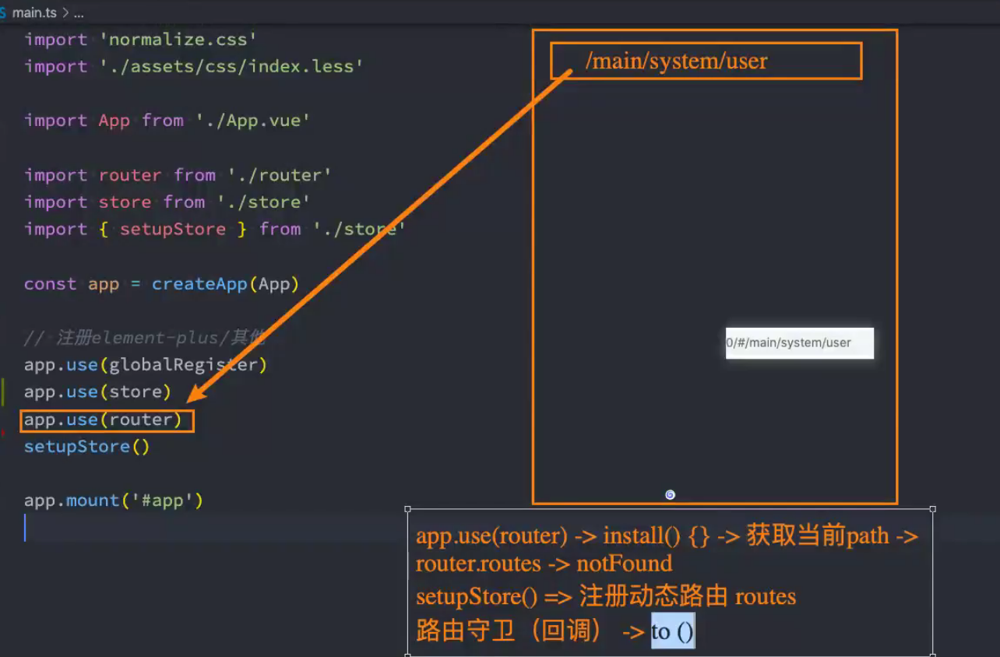


## 混淆概念- Router- route

Router: 为路由实例（将所有route路由串联者）， 可通过其进行编程导航， 导航至指定Route

Route： 当前所在路由， 能获取当前路由信息， params, path等信息


> 您的理解是基本正确的，但我稍作补充：
>
> 1. Router（路由器）：
>    - 路由器是 Vue Router 的核心部分，负责整个路由的管理和控制。
>    - 它包含了所有定义的路由规则（Route）和路由状态，是所有 Route 的管理者。
>    - 通过 Router，您可以进行编程式导航，例如使用 `router.push` 或 `router.replace` 等方法导航到指定的路由。
>
> 2. Route（路由）：
>    - 路由是 Vue Router 中的一个重要概念，表示当前所在的路由。
>    - 每当 URL 发生变化时，路由器会根据配置的路由规则匹配到相应的 Route，并将其激活，然后在组件中进行渲染。
>    - 路由包含了当前路由的信息，例如路由路径（path）、参数（params）、查询参数（query）等。
>    - 在组件中，您可以通过 `useRoute` Composition API 函数访问当前 Route 的信息。
>
> 综上所述，Router 是路由的管理者，负责整个路由的配置和导航控制；而 Route 则是当前所在的路由，包含了当前路由的信息，可以在组件中访问和利用这些信息。使用 Router 的导航方法，您可以将应用程序导航到指定的 Route，实现页面的跳转和切换。

### useRouter - useRoute

> `useRoute` 和 `useRouter` 是 Vue Router 提供的两个 Composition API 函数，用于在 Vue 3 中更方便地访问当前路由信息和路由实例。
>
> 1. `useRoute`：
>
>    - `useRoute` 函数用于在组件中访问当前路由的信息。
>
>    - 它返回一个包含当前路由信息的响应式对象，包括 `path`、`params`、`query`、`hash` 等路由信息。
>
>    - 当前路由信息会随着路由的变化而更新，因此组件中使用的数据会自动响应路由的变化。
>
>    - 使用示例：
>
>      ```javascript
>      import { useRoute } from 'vue-router';

>      export default {
>        setup() {
>          const route = useRoute();

>          // 使用当前路由信息
>          console.log('当前路由路径：', route.path);
>          console.log('当前路由参数：', route.params);
>          console.log('当前路由查询参数：', route.query);
>          return {};
>        },
>      };
>      ```
>
> 2. `useRouter`：
>
>    - `useRouter` 函数用于在组件中访问路由实例，可以通过该实例进行编程式导航。
>
>    - 它返回当前路由的路由实例，通过这个实例，我们可以使用诸如 `push`、`replace` 等方法进行页面导航。
>
>    - 使用示例：
>
>      ```javascript
>      import { useRouter } from 'vue-router';
>      
>      export default {
>        setup() {
>          const router = useRouter();
>      
=======
>                                    
>      export default {
>        setup() {
>          const router = useRouter();
>                                    

>          // 编程式导航示例
>          const handleButtonClick = () => {
>            router.push('/some-route'); // 导航至 '/some-route'
>          };
<<<<<<< HEAD
>      
=======
>                                    
>          return {
>            handleButtonClick,
>          };
>        },
>      };
>      ```
>
> 使用这两个 Composition API 函数可以让我们更方便地在 Vue 3 中处理路由相关的逻辑，并且能够更好地利用 Composition API 的特性来组织和管理代码。 


## 💓🐟侧边栏 刷新优化

## （一）刷新  重定向至原访问菜单

主要思路： 

nav-Bar组件中， 不能将default-active写死，导致默认重定向固定

 需要使用动态传入， 为每个菜单赋予其特有 Menu.id值（后端已提供）


## （二）为 菜单 绑定 特定的Menu ID


### 1. **获取当前菜单**

对二级菜单的递归查询， type为1 

 currentPath传入， 遍历路由，进行url比对 获取对应的Menu

出口为 type === 2, url&&CurrentPath比对成功返回

		**递归**多级菜单-> 从内部到外层 

menu.children ?? []  当传入的menu无Children， 将空数组赋值，匹配不上


```ts
export function pathMapToMenu(userMenus: any, currentPath: string): any {
  for (const menu of userMenus) {
    if (menu.type === 1) {
      // 进行遍历获取匹配， 将当前路径与菜单信息 进行比对
      const findMenu = pathMapToMenu(menu.children ?? [], currentPath)
      if (findMenu) {
        return findMenu
      }
    }
    // 此部分是为 无子菜单的  菜单逻辑判断，返回本身，
    // 在此案例中，作为递归的调用出口
    //  遍历至子菜单时， 将菜单Menu 进行返回
    else if (menu.type === 2 && menu.url === currentPath) {
      return menu
    }
  }
}

```

### 2. 对应ID 绑定，为每个子菜单绑定 default-active

```ts
<el-menu  :default-active="defaultValue"   el-menu>

    // 路由规则
    const route = useRoute()
    const currentPath = route.path

    // data , 传入时 应将ref属性的value值传入
    const menu = pathMapToMenu(userMenus.value, currentPath)
    const defaultValue = ref(menu.id + '')
    
    return {
    	...
    	defaultValue
    }

```


## （三）解决Main刷新  页面显示失败-  无ID

因为为菜单绑定了MenuId, 但是当直接访问main路径时， 会先进行渲染 Nav-menu, 但是当前的path- 是在main路径下，  并不存在 Menu，会报错


因为刷新  与初次 无选菜单一致， currenPath都为 Main, 它无法进行匹配，menu.id

		此时 的 default active 无值， 侧边栏显示不出  页面无显示 （报错）

> ```ts
> const currentPath = route.path
> 
> // data , 传入时 应将ref属性的value值传入
> 
> const menu = pathMapToMenu(userMenus.value, currentPath)
> 
> const defaultValue = ref(menu.id + '') //需为字符串形式
> ```


### 3.1 为to- Main, 重定向至第一个子菜单

FirstMenu的获取， 在初次赋予权限（组件）时，进行逻辑判断赋值

>   **map-menus**   遍历赋值初始子菜单

> ```ts
> 	const _recurseGetRoute = (menus: any[]) => {
> for (const menu of menus) {
> if (menu.type === 2) {
>   const route = allRoutes.find((route) => route.path === menu.url)
>   //  应该提前注册所有组件， 一般不可能出现匹配不了的情况
>   //  但是当路径写错， 后端新增menu， 前端未更新会导致false
> 
>   if (route) routes.push(route)
> 
>   // 将首个Menu进行赋值， 解除main刷新无法导向
>   if (!firstMenu) {
>     firstMenu = menu
>   }
> } else {
>   _recurseGetRoute(menu.children)
> }
> }
> }
> 
> ```


### 3.2 为main重定向至 首个子菜单

```ts
  if (to.path === '/main') {
    return firstMenu.url
  }
```


## （四）面包屑的封装使用

菜单文本有序获取， 需用到map-menus， 复合函数使用， 将原函数添加剂第三选项参数

（面包屑参数）

获得当前所处的菜单 的父子菜单文本 和 path路径


> 上级菜单 不传入path, 因为其没有 path路径， 当前所处子菜单不生效进行跳转是因为，路径一致所以页面不会重新加载， 可使用window.reload方法进行刷新， 但一般处于当前页面没必要执行刷新功能


	为原先菜单绑定   后端数据菜单函数中，添加可选参数，面包屑对象数组， 在目标菜单时，进行面包屑文本的获取，使用push添加了上级菜单  和 当前所处菜单的文本和path

```ts
// 为注册映射函数 进行扩展功能， 直接在面包屑函数 进行调用即可
//  获得面包屑文本数组
// 获取面包屑 文本 路径文本
export function pathMapBreadcrumbs(userMenus: any, currentPath: string): any {
  const breadcrumbs: IBreadcrumb[] = []
  pathMapToMenu(userMenus, currentPath, breadcrumbs)

  return breadcrumbs
}

export function pathMapToMenu(
  userMenus: any,
  currentPath: string,
  breadcrumbs?: IBreadcrumb[]
): any {
  for (const menu of userMenus) {
    if (menu.type === 1) {
      const findMenu = pathMapToMenu(menu.children ?? [], currentPath)
      if (findMenu) {
        breadcrumbs?.push({ name: menu.name })
        breadcrumbs?.push({ name: findMenu.name, path: findMenu.url })
        return findMenu
      }
    } else if (menu.type === 2 && menu.url === currentPath) {
      return menu
    }
  }
}
```


### 4.1 面包屑组件的封装使用

```ts
<template>
  <div class="nav-breadcrumb">
    <!-- 面包屑封装
      为遍历面包屑数组，文本 不同组件对应不同文本/aa/xx
    -->
    <el-breadcrumb separator="/">
      <template v-for="item in breadcrumbs" :key="item.name">
        <el-breadcrumb-item :to="{ path: item.path }">{{
          item.name
        }}</el-breadcrumb-item>
      </template>
    </el-breadcrumb>
  </div>
</template>

<script lang="ts">
import { defineComponent, PropType } from 'vue'
import { IBreadcrumb } from '../types'

export default defineComponent({
  props: {
    breadcrumbs: {
      type: Array as PropType<IBreadcrumb[]>,
      default: () => []
    }
  },
})
</script>

<style scoped></style>

```


### 4.2  面包屑的使用- computed实现动态变化

这里主要应用到的为： computed返回 breadMenus对象类型数组， 并且它会随路径变化去进行更新

```ts
    const store = useStore()
    const breadcrumbs = computed(() => {
      const userMenus = store.state.login.userMenus
      const route = useRoute()
      const currentPath = route.path
      // return 返回为： 面包屑 菜单对象（名字 、 path）
      return pathMapBreadcrumbs(userMenus, currentPath)
    })
```


## 💓🐟38 -  1：30 - 1：43 

讲 v-model， 不建议直接传引用 ， 建议保留单向数据流， 举例子-， 不直接修改父组件

 例子中都为： 父组件传进reactive对象属性， 通过filed识别对应的表格进行赋值， 从而使得id进行绑定， 各数据进行绑定成功 ， 但这种方法都是直接修改父组件，直接修改引用值  进行同步   

比较重点  暂时听 = 度过


## （五）model-value

> `modelValue` 是一个常见的 Vue 组件 props 名称，通常用于实现自定义的双向绑定。在 Vue 3 中，组件可以通过 `v-model` 指令与父组件进行双向数据绑定。当父组件更新 `v-model` 绑定的属性时，子组件的 `modelValue` 属性会自动更新为父组件传递的值；反之，当子组件修改了 `modelValue` 的值时，父组件绑定的数据也会随之更新。
>
> 在使用 `v-model` 进行双向绑定时，可以通过自定义 `modelValue` 和 `update:modelValue` 两个 props 来实现数据的传递和更新。以下是一个使用 `modelValue` 的示例：
>
> ```vue
> // ChildComponent.vue
> <template>
> <div>
> <input :value="modelValue" @input="$emit('update:modelValue', $event.target.value)" />
> </div>
> </template>
> 
> <script setup>
> import { defineProps } from 'vue'
> 
> const { modelValue } = defineProps(['modelValue'])
> </script>
> ```
>
> ```vue
> // ParentComponent.vue
> <template>
> <div>
> <child-component v-model="value" />
> <p>Parent Value: {{ value }}</p>
> </div>
> </template>
> 
> <script setup>
> import { ref } from 'vue'
> 
> const value = ref('')
> </script>
> ```
>
> 在上述代码中，`ChildComponent.vue` 中的 `<input>` 元素使用了 `:value` 绑定 `modelValue`，并在输入时通过 `@input` 事件将新的值传递给父组件，父组件使用 `v-model` 来接收子组件的更新，并更新自己的 `value` 属性。
>
> 总结来说，`modelValue` 是一个用于接收父组件传递数据并实现双向绑定的常见 props 名称。在实际使用中，可以根据需要将其重命名为其他名称，但需要保持 `v-model` 和 `:value` 的对应关系，以确保双向绑定正常工作。


## （六）违背数据单向流危害

> 直接修改 `props` 可能会导致以下问题：
>
> 1. **数据不同步：** 在 Vue 中，父组件传递给子组件的 `props` 是单向数据流，意味着子组件不能直接修改 `props` 中的数据。如果子组件直接修改了 `props` 的值，可能会导致父组件和子组件之间的数据不同步，破坏了数据的单向流动，使得数据变得不可预测。
>
> 2. **不可追踪变化：** 当组件层级较深时，直接修改 `props` 可能会导致数据变化的来源不可追踪。通过 `props` 和 `emit` 实现双向绑定可以更好地追踪数据的变化和传递，方便调试和维护。
>
> 3. **性能问题：** Vue 中的响应式系统会自动追踪数据的变化并更新 DOM，但是直接修改 `props` 会绕过响应式系统，可能导致组件的更新不被触发，从而引发性能问题。
>
> 4. **可维护性差：** 直接修改 `props` 可能会使代码变得难以维护。在大型应用中，很难跟踪到哪个组件在哪里修改了 `props` 的值，从而增加了代码维护的难度。
>
> 通过使用 `props` 和 `emit`，可以确保数据在父子组件之间保持单向流动，避免了上述问题，并使代码更易于理解、调试和维护。另外，`props` 和 `emit` 遵循了 Vue 的设计原则，使得组件之间的通信更加清晰和可预测。
>
> 


## （七）展开运算符间接修改父组件数据


父组件传入子组件为对象， 通过新增field标识， Form接收config的类型

```ts
    {
      field: 'id',
      type: 'input',
      label: 'id',
      placeholder: '请输入id'
    },
    {
      field: 'name',
      type: 'input',
      label: '用户名',
      placeholder: '请输入用户名'
    },
```


父组件使用v-model将对象传入， 子组件props接收后使用展开运算符，重新生成对象，将对象转化为响应式后， 赋值给每个标签， 再用watch监听值变换， 再将新值触发传递给父组件， 相等于是自身对象属性（拷贝父组件传递的数据）的变化值传递出去， 从而让父组件的信息改变


**接受父组件传递信息**

```ts
  props: {
    modelValue: {
      type: Object,
      required: true
    },
```


展开运算符，转化为自身对象属性，为各模板表格赋值，

```ts
 emits: ['update:modelValue'],
  setup(props, { emit }) {
    const formData = ref({ ...props.modelValue })
    watch(
      formData,
      (newValue) => {
        console.log(newValue)
        emit('update:modelValue', newValue)
      },
      {
        deep: true
      }
    )
     
    return {
      formData
    }
```


为各模板标签赋值， 对象[属性名] 取值  如id， 则取出id: '空字符串'， 与此值双向绑定

```ts
  v-model="formData[`${item.field}`]"
```

 


## （八）很顶的组件封装

user组件中， 不断抽取而出， 从传入配置， 绑定双向Value， 设置搜索框的顶部文本， 底部按钮， 最后抽取封装为 只需传入配置， 封装为 page - seach,

**组件封装**： 组件复用思想， 相当于 套模板

```ts
<template>
  <div class="user">
    <page-search :search-form-config="searchFormConfig"></page-search>
    <div class="content"></div>
  </div>
</template>

<script lang="ts">
import { defineComponent } from 'vue'
import PageSearch from '@/components/page-search'

import { searchFormConfig } from './config/search-form-config'

export default defineComponent({
  name: 'user',
  components: {
    PageSearch
  },
  setup() {
    return {
      searchFormConfig
    }
  }
})
```


### 复用组件- Page-Search

使用了 插槽， template 具名插槽

```ts
<template>
  <div class="page-search">
    <hy-form v-bind="searchFormConfig" v-model="formData">
      <template #header>
        <h1 class="header">高级检索</h1>
      </template>
      <template #footer>
        <div class="handle-btns">
          <el-button icon="el-icon-refresh">重置</el-button>
          <el-button type="primary" icon="el-icon-search">搜索</el-button>
        </div>
      </template>
    </hy-form>
  </div>
</template>

<script lang="ts">
import { defineComponent, ref } from 'vue'
import HyForm from '@/base-ui/form'

export default defineComponent({
  props: {
    searchFormConfig: {
      type: Object,
      reuqired: true
    }
  },
  components: {
    HyForm
  },
  setup() {
    const formData = ref({
      id: '',
      name: '',
      password: '',
      sport: '',
      createTime: ''
    })

    return {
      formData
    }
  }
})
</script>

<style scoped>
.handle-btns {
  text-align: right;
  padding: 0 50px 20px 0;
}
</style>

```


### 8.1 hyTable

2.15  -- 3:17

对table一个抽取封装， 封装用户表

	封装 request 请求， 去请求表单数据 post{ 内可加限制  偏移量 个数 - 分页器}
	
		重新生成一个 系统store, 提取数据 并放入其中 并注册    

表格设置

表格数据处理， 插槽- 作用域插槽-  具名插槽 - 属性， 去个性化某一列  


## { Commit}  从上下文对象中 解构 

等价于  context. commit, commit用于触发 multation


> 在Vuex中，`commit`是用来触发mutations的方法，它是一个上下文对象，但是它不是直接传递到组件或action中的。在action中，第一个参数通常是一个上下文对象，用来提供一些方法和属性，比如`commit`、`dispatch`等，以及一些全局状态和设置。
>
> 当你在`async getPageListAction({ commit }, payload: any)`中写`{ commit }`，这实际上是使用了ES6的解构语法。这样写的目的是从上下文对象中提取出`commit`属性，并将其赋值给一个局部变量`commit`，方便在action中直接使用`commit`方法而无需使用`context.commit`。
>
> 这种写法等同于：
>
> ```javascript
> async getPageListAction(context, payload: any) {
> const commit = context.commit;
> console.log(payload.pageUrl);
> console.log(payload.queryInfo);
> // 使用commit方法
> commit('mutationName', payload.data);
> }
> ```
>
> 通过使用解构语法，可以简化代码，并且更加直观地使用`commit`方法，提高代码的可读性和维护性。


### （九）🔺✨ 用户table组件的封装 HY - table 

思路：

首先需要在Service中封装请求， vueX 中生成System状态管理器， 用于发送请求， 将用户表格信息存储于state中

将table表格进行抽取放置 ui-base中作为模板组件， 接收来自user中的配置信息， 和用户数据

 在user中使用了vueX中存储的用户信息， 并将信息传入 hy-table中， 在此中通过通过配置每一行表格中单元格信息和 特定单元格的slotName信息（需使用到作用域插槽）， 后续可传入插槽信息， 去对指定单元格进行样式修改


## 1. 封装请求- （用户信息获取请求）

在service， 封装user请求

创建文件夹 - system,  生成 system.ts 

```ts
//请求的类型信息
export interface IDataType<T = any> {
  code: number
  data: T
}

//导出请求函数， 外界传入请求url和限制条件
import hyRequest from '../../index'

import { IDataType } from '../../types'

export function getPageListData(url: string, queryInfo: any) {
  return hyRequest.post<IDataType>({
    url: url,
    data: queryInfo
  })
}
```


## 2. Vux中生成System子模块，保存请求数据

### 2.1  定义action发送请求 触发mutation保存数据

在action中定义函数getPageListAction， 接收user中传入的请求路径和限制条件， 并触发mutation保存数据


```ts
 state() {
    return {
      userList: [],
      userCount: 0
    }
  },
  mutations: {
    changeUserList(state, userList: any[]) {
      state.userList = userList
    },
    changeUserCount(state, userCount: number) {
      state.userCount = userCount
    }
  },
  actions: {
    async getPageListAction({ commit }, payload: any) {
      console.log(payload.pageUrl)
      console.log(payload.queryInfo)

      // 1.对页面发送请求
      const pageResult = await getPageListData(
        payload.pageUrl,
        payload.queryInfo
      )
      const { list, totalCount } = pageResult.data
      commit('changeUserList', list)
      commit('changeUserCount', totalCount)
    }
  }
```


### 2.2在根模块中注册使用system模块， 并对useStore类型补充

需要注册， 并补充useStore类型


```ts
 // 根模块中 使用 
modules: {
    login,
    system
  }
  
  export interface IRootWithModule {
  login: ILoginState
  system: ISystemState
}

export interface ISystemState {
  userList: any[]
  userCount: number
}
    
```


## 3. Hy-table的组件抽取 及设置


		接收配置文件， 内部通过遍历proList, 获取proItem 设置每列单元格的格式， 并提供了具名插槽， 当传入的proItem中具有SlotName属性时， 表示该插槽可被个性化

user传递的配置信息 包括要显示的单元格信息， 单元格格式

	prop信息的设置与后端的接口信息给出有关， 需要知道对应的userList对应信息


scope为作用域对象， 表示通过其获取当前所在单元格信息， 在外界通过使用scope对象， 可对具名插槽进行 样式调整， 当无SlotName属性， 未传入或不具备时， 默认显示

 **{{ scope.row[propItem.prop] }}**， 显示原数据 

```ts
<div class="hy-table">
    <el-table :data="listData" border style="width: 100%">
      <template v-for="propItem in propList" :key="propItem.prop">
        <el-table-column v-bind="propItem" align="center">
          <!-- 设置插槽， 为父组件提供 动态设置指定具有插槽名的指定列样式 -->
          <template #default="scope">
            <slot :name="propItem.slotName" :row="scope.row">
              {{ scope.row[propItem.prop] }}
            </slot>
          </template>
        </el-table-column>
      </template>
    </el-table>
  </div>
```


## 4. user使用table组件， 并传入配置信息

### 4.1 触发System中action, 获取用户信息

触发时， 传入参数， 路径、  限制- 偏移量  数量，  从第一行开始取10行数据

> 在请求用户表单信息时，`offset` 和 `size` 是用来分页查询数据的参数。
>
> - `offset` 表示偏移量，它指的是从结果集的第一行开始偏移的数量。例如，当 `offset` 为 0 时，表示从第一行开始查询数据，当 `offset` 为 10 时，表示从结果集的第 11 行开始查询数据。
> - `size` 表示每页返回的数据条数，它决定了每次查询返回多少条数据。例如，当 `size` 为 10 时，表示每页返回 10 条数据。
>
> 通常，分页查询是为了在大量数据中获取指定页的数据，以提高查询效率和减少网络传输数据量。通过指定偏移量和每页数据条数，可以获取指定页的数据。通常情况下，分页查询还会结合总数据量一起使用，来计算总页数等信息。

```ts
 setup() {
    const store = useStore()
    // 触发animation 去发送post请求获得数据
    store.dispatch('system/getPageListAction', {
      pageUrl: '/users/list',
      // 加入用户清单- 偏移量0， 数量为10
      queryInfo: {
        offset: 0,
        size: 10
      }
    })
```


### 4.2 传递配置信息 至table组件中

proList为 单元格格式设置， 传递后将限制显示的内容， 请求的用户表格数据只显示传入的 prop属性显示，  具有slotName的表格， 可进行个性化设置属性


```ts
// 获取用户信息表格信息 和 用户数量信息
    const userList = computed(() => store.state.system.userList)
    // 暂时未对userCount信息进行使用
    const userCount = computed(() => store.state.system.userCount)

    // 设置表格 列信息 单元格样式, hy-table 接收并设置
    const propList = [
      { prop: 'name', label: '用户名', minWidth: '100' },
      { prop: 'realname', label: '真实姓名', minWidth: '100' },
      { prop: 'cellphone', label: '手机号码', minWidth: '100' },
      // 当传入的slotName时， 意味着使用具名插槽，为当前列使用插槽形式
      //  在父组件中可对该列进行样式调整
      { prop: 'enable', label: '状态', minWidth: '100', slotName: 'status' },
      {
        prop: 'createAt',
        label: '创建时间',
        minWidth: '250',
        slotName: 'createAt'
      },
      {
        prop: 'updateAt',
        label: '更新时间',
        minWidth: '250',
        slotName: 'updateAt'
      }
    ]

    return {
      searchFormConfig,
      userList,
      propList,
      userCount
    }
  }
```


### 4.3 HY- table， 个性化插槽使用

		之前的table组件传出的 scope对象 ， 通过使用 slotName = ‘scope’， 通过作用域对象去获取指定的单元格， 并对单元格进行设置， 其中对状态进行样式重写， 状态为1 时转化为启用按钮， 否则为禁用按钮
	
			对 创建时间的单元格， 进行字体加粗

------

 #status="scope"， 表示选中 属性为 scope的作用域对象， stats的作用域对象， 包含当前列， 通过row指定为当前行， 由于为遍历而出， 固会对在此列的每个statues属性的单元格进行逻辑判断

> 是的，你理解得很对！
>
> `#status="scope"` 这里的 `status` 是插槽名，`scope` 是作用域对象。当插槽名与某一列的 `slotName` 相匹配时，这个插槽就会被应用到该列上，并且作用域对象 `scope` 会包含当前列的所有信息。
>
> `scope` 包含了当前列的所有数据和属性，包括 `row` 和 `column`，分别代表当前行和当前列的数据。通过 `scope.row` 可以访问当前行的数据，通过 `scope.column` 可以访问当前列的属性，例如 `prop`、`label` 等。
>
> 在这个例子中，通过 `scope.row.enable` 可以访问当前行的 `enable` 属性（这个属性在 `propItem.prop` 中被指定为 `enable`），然后根据该属性的值进行逻辑判断，如果 `enable` 是 `true`，则显示 "启用"，否则显示 "禁用"。这样就实现了对该列的自定义处理，根据不同行的 `enable` 属性来显示不同的内容。这样的灵活性使得我们可以根据不同的需求定制不同的列样式和内容，增强了表格组件的可定制性和适用性。

scope.row. enable， 表示通过作用域对象，获取当前行的enable表格属性值


```ts
  <div class="content">
      <hy-table :listData="userList" :propList="propList">
        <!-- 动态插槽 - 设置样式 转为button 原状态码为 0/ 1 -->
        <!--
          首先需要拿到scope 作用域对象
          通过对象拿到内部 具名插槽， 对插槽的展示内容进行调整
         -->
        <template #status="scope">
          <el-button>{{ scope.row.enable ? '启用' : '禁用' }}</el-button>
        </template>
        <!-- 插槽 选择 用户创建时间列 -->
        <template #createAt="scope">
          <strong>{{ scope.row.createAt }}</strong>
        </template>
      </hy-table>
```


## **scope作用域对象拥有的属性**


> 在Vue中，作用域对象（通常命名为`scope`）是在插槽内部使用的一个特殊对象，它包含了一些有用的属性，用于在插槽中访问父组件传递的数据。作用域对象的常见属性有：
>
> 1. `props`: 一个包含了父组件传递的所有 prop 的对象。可以通过 `scope.props` 来访问这些 prop 的值。
>
> 2. `slots`: 一个包含了父组件传递的所有插槽内容的对象。可以通过 `scope.slots` 来访问这些插槽内容。
>
> 3. `attrs`: 一个包含了父组件传递的非 prop 的特性 (attributes) 的对象。可以通过 `scope.attrs` 来访问这些特性。
>
> 4. `parent`: 指向当前组件的父组件实例。
>
> 5. `root`: 指向当前组件树的根 Vue 实例。
>
> 6. `listeners`: 一个包含了父组件传递的所有事件监听器的对象。可以通过 `scope.listeners` 来访问这些事件监听器。
>
> 除了上述常见属性外，作用域对象还可能包含其他一些由父组件传递的属性，这取决于父组件在插槽使用时传递的数据。
>
> 需要注意的是，作用域对象在不同版本的Vue中可能会有一些差异，具体的属性可能会有所变化。因此，在使用作用域对象时，最好查阅Vue官方文档以获得最准确的属性信息。


# 🔺✨进度九

**day 29  7.30   20点20分**


## 全局属性声明后仍报错- 待处理- 能正常使用


## （一）对user- table表格样式优化

### 1. 对按钮进行显示优化

plain表示镂空显示， 背景色空白

type为其逻辑判断为其选择样式 -  绿钮  和 红钮


**Plain属性** -  朴素色， 淡化背景色 将其转化为 更清爽的颜色

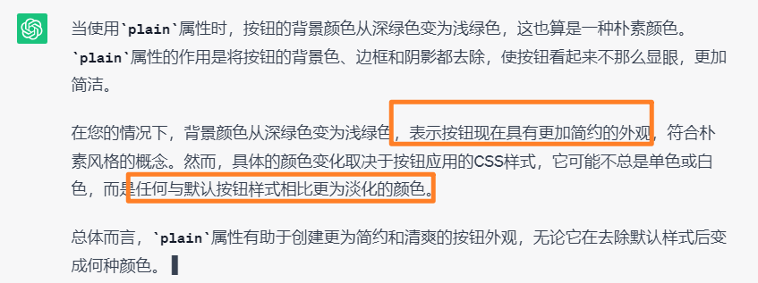

```ts
<el-button
            plain
            size="mini"
            :type="scope.row.enable ? 'success' : 'danger'"
            >{{ scope.row.enable ? '启用' : '禁用' }}</el-button
```


### 2. 对UTC时间进行转化

### 2.1.  全局注册属性- $filters对象

#### 2.1.1.  引入dayjs，并实现格式化time函数

```ts
utils 文件
import dayjs from 'dayjs'
import utc from 'dayjs/plugin/utc'

// 默认 dayJs 插件不对utc时间进行处理
dayjs.extend(utc)

const DATE_TIME_FORMAT = 'YYYY-MM-DD HH:mm:ss'

export function formatUtcString(
  utcString: string,
  format: string = DATE_TIME_FORMAT
) {
  // 表示对utc时间使用 格式转化- 转化为 format格式
  return dayjs.utc(utcString).format(format)
}

```


#### 2.1.2 全局注册属性

导出函数  至 Global  -   index.ts， 为$filters全局属性装载 -  格式化**time**函数

```ts
import { App } from 'vue'
import { formatUtcString } from '@/utils/date-format'

// 全局注册的属性对象， 具有多个函数
export default function registerProperties(app: App) {
  app.config.globalProperties.$filters = {
    foo() {
      console.log('foo')
    },
    formatTime(value: string) {
      return formatUtcString(value)
    }
  }
}
```


**index.ts中使用**

```ts
import { App } from 'vue'
import registerElement from './register-element'
import registerProperties from './register-properties'

// ts 组件类型声明
export function globalRegister(app: App): void {
  app.use(registerElement)
  app.use(registerProperties)
}

```


**在main.ts， 直接使用该函数即可注册全局属性**

#### 2.1.3. 在动态插槽中  格式化时间

```ts
  <template #createAt="scope">
          <span>{{ $filters.formatTime(scope.row.createAt) }}</span>
        </template>
```


## （二）增加表格三列

### 1. 增加选择列和序号列

让其变得更灵活， 在遍历元素前添加此列， 并使用配置传入 **showSelectColumn，showIndexColumn**  决定是否显示该列

**父组件传入配置信息**

```ts
      <hy-table
        :listData="userList"
        :propList="propList"
        :showSelectColumn="showSelectColumn"
        :show-index-column="showIndexColumn"
      >
      
    const showIndexColumn = true
    const showSelectColumn = true

    return {
      searchFormConfig,
      userList,
      propList,
      userCount,
      showIndexColumn,
      showSelectColumn
    }
```


```ts
        <!-- 添加序号列 和 选择列  -->
      <el-table-column
        v-if="showSelectColumn"
        type="selection"
        align="center"
        width="60"
      >
      </el-table-column>
      <el-table-column
        v-if="showIndexColumn"
        type="index"
        label="序号"
        align="center"
        width="80"
      >
```

序号列不传入label， 因为具有默认属性， 全选or 全不选

#### 1-1选中的属性通过表头设置

触发事件， 事件可设置emit传递， 串联组件间， 对选中数据进行处理

```ts
    <el-table
      :data="listData"
      border
      style="width: 100%"
      @selection-change="handleSelectionChange"
    >
```

向父组件， 传递选中的数据

```ts
  emits: ['selectionChange'],
  setup(props, { emit }) {
    const handleSelectionChange = (value: any) => {
      console.log(value)
      // 触发事件， 向父组件传递
      emit('selectionChange', value)
    }
```


### 2. 配置中传入自定义操作列

```ts
 // 插入自定义列操作列
      { label: '操作', minWidth: '120', slotName: 'handler' }
      
```

#### 2.1 父组件使用动态插槽， 个性化样式

因为该列为自定义列， 数据中并无对应 数据， 不需要使用 作用域对象去进行获取数

```ts
 <template #handler>
          <el-button icon="el-icon-edit" size="mini" type="text">
            编辑
          </el-button>
          <el-button icon="el-icon-delete" size="mini" type="text">
            删除
          </el-button>
        </template>
```


##   (三) 表头表尾设置

### 1. 增加表头

两个插槽

 传入文本表头名， 居左显示 表头名

选择插槽二    slot-- 通过headerHander   传入右表头功能块  新建用户

直接对整个表头进行插槽 插入

```ts
<div class="header">
      <slot name="header">
        <div class="title">{{ title }}</div>

        <div class="handler">
          <slot name="headerHandler"></slot>
        </div>
      </slot>
    </div>
```

#### 1.1 表头使用

```ts
  <!-- 头部插槽 -->
        <template #headerHandler>
          <el-button type="primary" size="mini">新建用户</el-button>
        </template>

表头名为传入参数， 将用户列表直接插入
```


### 2. 表尾直接固定化插入完整分页器

```ts
  <el-pagination
          @size-change="handleSizeChange"
          @current-change="handleCurrentChange"
          :current-page="currentPage4"
          :page-sizes="[100, 200, 300, 400]"
          :page-size="100"
          layout="total, sizes, prev, pager, next, jumper"
          :total="400"
        >
```


#### 2.2 对elementsUi 汉化

思路： 将app.vue根组件， 包裹提供的汉化组件， el-config-provider ， 设置local= 'zhcn'

```ts
    <el-config-provider :locale="zhCn">
      <router-view></router-view>
    </el-config-provider>
    
    import { ElConfigProvider } from 'element-plus'
	import zhCn from 'element-plus/lib/locale/lang/zh-cn'

<script>
components: {
    ElConfigProvider
  },
  setup() {
    return {
      zhCn
    }
  }

```

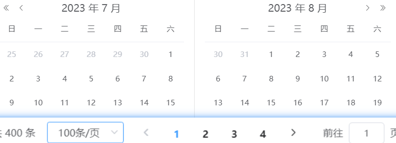


## （四）Content 组件配置抽取封装

将user组件抽取而出， 放入page-content, 再将配置信息（静态）直接传入content.config.js文件中 ， page-content 再将配置信息传入 table， user界面 直接引入- page-content即可


### 1.  将静态属性抽取为content.config.js

```ts
export const contentTableConfig = {
  title: '用户列表',
  propList: [
    { prop: 'name', label: '用户名', minWidth: '100' },
    { prop: 'realname', label: '真实姓名', minWidth: '100' },
    { prop: 'cellphone', label: '手机号码', minWidth: '100' },
    { prop: 'enable', label: '状态', minWidth: '100', slotName: 'status' },
    {
      prop: 'createAt',
      label: '创建时间',
      minWidth: '250',
      slotName: 'createAt'
    },
    {
      prop: 'updateAt',
      label: '更新时间',
      minWidth: '250',
      slotName: 'updateAt'
    },
    { label: '操作', minWidth: '120', slotName: 'handler' }
  ],
  showIndexColumn: true,
  showSelectColumn: true
}
```


### 2.  将content内容封装为组件page-content

将原先 使用动态插槽等template模板内直接传入 该组件， 再将user内部所要传入的静态属性抽取放在config文件， 最后在user引用并传入该配置文件

```ts
引入重点
<hy-table :listData="dataList" v-bind="contentTableConfig">
      <!-- 头部插槽 -->
      <template #headerHandler>
        <el-button type="primary" size="mini">新建用户</el-button>
      </template>...


```


#### 2.1  动态disPatch 触发action

通过接收pageName, 在内部使用字符拼接的形式,  将pageName发送

```ts
setup(props) {
    const store = useStore()
    store.dispatch('system/getPageListAction', {
      pageName: props.pageName,
      queryInfo: {
        offset: 0,
        size: 10
      }
    })

    const dataList = computed(() =>
      store.getters[`system/pageListData`](props.pageName)
    )
    // const userCount = computed(() => store.state.system.userCount)

    return {
      dataList
    }
```


### 3.   System模块中  对action重写

 由于接口规范，根据取得的pageName, 在内部进行字符拼接，发送不同post请求，

再用slice方法， pageName.slice(0,1).toUppercase( ) + PageName.slice(1)拼接为mutation的方法， 去发送请求并保存数据至 state内部


当api不规范时， 也可使用switch去匹配对应的路径， 发送请求， 或map映射关系？

```ts
actions: {
    async getPageListAction({ commit }, payload: any) {
      // 1.获取pageUrl
      const pageName = payload.pageName
      // 由使用者传入pageName, 比较规范可以用拼接的形式
      const pageUrl = `/${pageName}/list`
      // switch (pageName) {
      //   case 'users':
      //     pageUrl = '/users/list'
      //     break
      //   case 'role':
      //     pageUrl = '/role/list'
      //     break
      // }

      // 2.对页面发送请求
      const pageResult = await getPageListData(pageUrl, payload.queryInfo)
      // 3.将数据存储到state中
      const { list, totalCount } = pageResult.data

      // 触发的事件 需要PageName首字母大写
      // 相当于取出字符串首字母再拼接第一个后的所有字母
      const changePageName =
        pageName.slice(0, 1).toUpperCase() + pageName.slice(1)
      commit(`change${changePageName}List`, list)
      commit(`change${changePageName}Count`, totalCount)

      // switch (pageName) {
      //   case 'users':
      //     commit(`changeUserList`, list)
      //     commit(`changeUserCount`, totalCount)
      //     break
      //   case 'role':
      //     commit(`changeRoleList`, list)
      //     commit(`changeRoleCount`, totalCount)
      //     break
      // }
    }
  }
```

 

#### 3.1  定义getter方法 获取 State数据

字符串形式  拼接获取

```ts
 getters: {
    pageListData(state) {
      return (pageName: string) => {
        return (state as any)[`${pageName}List`]
        // switch (pageName) {
        //   case 'users':
        //     return state.usersList
        //   case 'role':
        //     return state.roleList
        // }
      }
    }
```


### 4. page-content 更加灵活获取ListData

在特定页， 传入特定的名， 即可根据需求获得对应的数据


取出子模块的 pageListData 方法

```ts
 const dataList = computed(() =>
      store.getters[`system/pageListData`](props.pageName)
    )
```


## （五）Components 组件（搜索表单） 优化

原先的标签value值为写死的

```ts
  setup() {
    const formData = ref({
      id: '',
      name: '',
      password: '',
      sport: '',
      createTime: ''
    })
```


### 1  重置功能实现， 动态决定Prop属性 

现将其转为  遍历formItems, 由fiedld决定 


formOriginData是静态对象数据，  formData是将前者数据拷贝作为其数据，并转化为响应式， 但是与前者无关， 所以后面通过遍历

 formData.value[`${key}`] = formOriginData[key]， 将其进行重置

```ts
 setup(props) {
    // 双向绑定的属性应该是由配置文件的field来决定
    // 1.优化一: formData中的属性应该动态来决定
    const formItems = props.searchFormConfig?.formItems ?? []

    // 保留原始的空数据， 定义一个对象去存储原数据 实现重置功能
    const formOriginData: any = {}
    for (const item of formItems) {
      formOriginData[item.field] = ''
    }
    // 将formData响应式数据初始为''传入 form组件
    // form 间接emit时修改formData, 并不影响originData
    const formData = ref(formOriginData)

    // 2.优化二: 当用户点击重置
    const handleResetClick = () => {
      for (const key in formOriginData) {
        formData.value[`${key}`] = formOriginData[key]
      }
    }

    return {
      formData,
      handleResetClick
    }
  }
})
```


## (六) 快速生成Role界面

由于Component已转化为独立极强的组件， 只需传入配置文件， 即可快速搭建界面


### 1. 将有表格组件值具有默认值的参数转化为 可选参数

```ts
type IFormType = 'input' | 'password' | 'select' | 'datepicker'

export interface IFormItem {
  field: string
  type: IFormType
  label: string
  rules?: any[]
  placeholder?: any
  // 针对select
  options?: any[]
  // 针对特殊的属性
  otherOptions?: any
}

export interface IForm {
  formItems: IFormItem[]
  labelWidth?: string
  colLayout?: any
  itemLayout?: any
}

```

  labelWidth?: string
  colLayout?: any
  itemLayout?: any

在 user中配置文件中 可不传入此类型


### 2.  Role页面 引入 搜索&内容配置组件- 

```ts
<template>
  <div class="role">
    <page-search :searchFormConfig="searchFormConfig"></page-search>
    <page-content
      :contentTableConfig="contentTableConfig"
      pageName="role"
    ></page-content>
  </div>
</template>

<script lang="ts">
import { defineComponent } from 'vue'

import PageSearch from '@/components/page-search'
import PageContent from '@/components/page-content'

import { searchFormConfig } from './config/search.config'
import { contentTableConfig } from './config/content.config'

export default defineComponent({
  name: 'role',
  components: {
    PageContent,
    PageSearch
  },
  setup() {
    return {
      searchFormConfig,
      contentTableConfig
    }
  }
})
```


#### 2.1 内容配置文件

```ts
export const contentTableConfig = {
  title: '用户列表',
  propList: [
    { prop: 'name', label: '角色名', minWidth: '100' },
    { prop: 'intro', label: '权限介绍', minWidth: '100' },
    {
      prop: 'createAt',
      label: '创建时间',
      minWidth: '250',
      slotName: 'createAt'
    },
    {
      prop: 'updateAt',
      label: '更新时间',
      minWidth: '250',
      slotName: 'updateAt'
    },
    { label: '操作', minWidth: '120', slotName: 'handler' }
  ],
  showIndexColumn: true,
  showSelectColumn: true
}

```


#### 2.2搜索配置文件

```ts
import { IForm } from '@/base-ui/form'

export const searchFormConfig: IForm = {
  labelWidth: '120px',
  formItems: [
    {
      field: 'name',
      type: 'input',
      label: '角色名称',
      placeholder: '请输入角色名称'
    },
    {
      field: 'intro',
      type: 'input',
      label: '权限介绍',
      placeholder: '请输入权限介绍'
    },
    {
      field: 'createTime',
      type: 'datepicker',
      label: '创建时间',
      otherOptions: {
        startPlaceholder: '开始时间',
        endPlaceholder: '结束时间',
        type: 'daterange'
      }
    }
  ]
}

```


## cookie的作用


> 是的，Cookie 是由服务器通过 HTTP 响应头部设置并发送给客户端（浏览器）的一小段数据。一旦客户端接收到 Cookie 后，它会保存在浏览器中，并在后续的请求中通过 HTTP 请求头部携带回服务器。这样，服务器就可以通过读取客户端携带的 Cookie 来识别用户，实现状态管理和会话跟踪。
>
> Cookie 在 Web 开发中有多种用途，主要包括以下几个方面：
>
> 1. 会话管理：服务器可以通过在响应中设置一个会话标识符（通常是一个随机的唯一字符串）来创建一个会话，并在后续的请求中识别该会话。这样，服务器就可以知道不同请求来自同一个用户，从而实现用户会话的管理。
>
> 2. 用户认证：当用户登录时，服务器可以设置一个包含用户信息的 Cookie，以便在后续请求中进行用户认证。客户端每次请求都会携带这个 Cookie，服务器就可以根据其中的用户信息判断用户是否登录。
>
> 3. 状态管理：服务器可以通过 Cookie 来存储一些状态信息，比如用户的偏好设置、浏览历史等。这样，当用户再次访问网站时，服务器可以读取这些状态信息，为用户提供个性化的体验。
>
> 4. 购物车功能：在电商网站中，服务器可以使用 Cookie 来保存用户的购物车内容，以便用户在不同页面之间保持购物车的状态。
>
> 5. 跨站请求伪造（CSRF）防御：服务器可以通过在 Cookie 中设置一个 CSRF token 来防止 CSRF 攻击。
>
> 由于 Cookie 存储在客户端的浏览器中，因此它具有一定的缓存功能。当服务器设置了一个包含过期时间的 Cookie，浏览器会将其保存在本地，并在过期时间之前都会携带这个 Cookie 发送给服务器。这样，服务器就可以在一段时间内持续识别和管理用户状态。
>
> 需要注意的是，Cookie 是存储在客户端的，因此它可能会被用户篡改或删除。出于安全考虑，不应将敏感信息存储在 Cookie 中，而应该使用安全的方式进行用户认证和数据传输。此外，为了保护用户隐私，网站通常会设置一些策略，限制 Cookie 的使用和访问。


### cookie作用之一：跨站请求伪造（CSRF）防御

跨站请求伪造（CSRF）防御：服务器可以通过在 Cookie 中设置一个 CSRF token 来防止 CSRF 攻击


> 跨站请求伪造（CSRF）是一种常见的网络攻击，攻击者通过伪造用户的请求来执行未经授权的操作。为了防止这种攻击，服务器可以采取一些措施，其中之一是在 Cookie 中设置一个 CSRF token。
>
> CSRF token 是一个随机生成的字符串，服务器在返回给客户端的页面或响应中，将该 token 存储在 Cookie 中。每次用户发起请求时，服务器会验证请求中是否包含正确的 CSRF token。如果请求中的 token 与 Cookie 中的 token 不匹配，服务器将拒绝该请求，从而防止 CSRF 攻击。
>
> 具体的步骤如下：
>
> 1. 用户登录：当用户成功登录后，服务器会在响应中设置一个包含 CSRF token 的 Cookie，并将其返回给客户端。
>
> 2. 存储 CSRF token：客户端收到响应后，将 CSRF token 存储在本地，通常是在浏览器的内存或本地存储中。
>
> 3. 发起请求：用户在进行任何需要身份验证的操作时，客户端会将 CSRF token 添加到请求头部或请求参数中，并发送给服务器。
>
> 4. 服务器验证：服务器在接收到请求后，会从请求中获取 CSRF token，并与 Cookie 中的 token 进行比较。如果两者匹配，说明请求是合法的，服务器继续处理该请求；如果不匹配，服务器将拒绝该请求，并返回错误提示，从而防止 CSRF 攻击。
>
> 需要注意的是，为了增加安全性，服务器应该设置 CSRF token 的有效期，并在一段时间后更新 token。另外，为了防止跨站脚本攻击（XSS），服务器还应该设置 HttpOnly 属性，确保 CSRF token 只能在 HTTP 请求中使用，而不能通过 JavaScript 脚本获取。同时，服务器还可以设置 SameSite 属性，限制 Cookie 的跨域访问，从而进一步增强 CSRF 防御的效果。
>
> 总结而言，通过在 Cookie 中设置 CSRF token，并在请求中验证 token 的方式，可以有效防止跨站请求伪造攻击，提升应用的安全性。


#### 防止CSRF 的方法

> 防止CSRF攻击，可以采取以下措施：
>
> 1. 使用CSRF令牌：在用户发起的请求中添加一个CSRF令牌，该令牌由服务器生成并存储在Cookie中。在提交请求时，需要同时提交该令牌，服务器会验证该令牌是否有效，从而防止CSRF攻击。
> 2. 设置SameSite属性：将Cookie的SameSite属性设置为Strict或Lax，限制Cookie在跨站请求中的发送，从而减少CSRF攻击的可能性。
> 3. 验证Referer头：服务器可以通过验证请求中的Referer头字段，确保请求来源于合法的网站，从而防止CSRF攻击。
> 4. 不使用敏感操作的GET请求：将敏感操作（如修改数据、执行付款等）改为使用POST、PUT、DELETE等请求方法，这样这些请求不会被CSRF攻击利用。
>
> 通过采取以上措施，可以有效地防止跨站请求伪造攻击，保护用户的信息安全。


### CSRF和XSS

> CSRF（Cross-Site Request Forgery）攻击和XSS（Cross-Site Scripting）攻击是两种不同类型的安全漏洞，它们具有不同的原理和影响。
>
> 1. CSRF 攻击（跨站请求伪造）：
>    - 原理：CSRF 攻击利用用户已登录的身份，通过伪造请求来执行非授权的操作。攻击者诱导用户访问恶意网站，触发用户在已登录状态下向目标网站发送请求，从而执行攻击者指定的操作。
>    - 影响：CSRF 攻击可以导致用户在不知情的情况下执行恶意操作，例如修改用户资料、转账、发布内容等。
>
> 2. XSS 攻击（跨站脚本攻击）：
>    - 原理：XSS 攻击通过插入恶意脚本代码到目标网页中，使得这些恶意脚本在用户的浏览器上执行。攻击者可以利用这些脚本窃取用户的信息、劫持用户会话或修改网页内容。
>    - 影响：XSS 攻击可以导致用户的敏感信息被窃取，用户的账号被盗用，或者网页内容被篡改，给用户带来损失和隐私泄露风险。
>
> 虽然 CSRF 攻击和 XSS 攻击是不同的攻击类型，但它们都涉及到对网站的安全漏洞进行利用，从而危害用户和网站的安全。为了防止这些攻击，网站开发者需要采取相应的安全措施，如使用 CSRF token、对用户输入进行有效的过滤和转义、设置 Content Security Policy（CSP）等。综合使用这些安全措施可以帮助提高网站的安全性，保护用户和网站的数据安全。


## HTTPS- 证书验证


> 一个网站要具备证书验证功能，需要申请数字证书并进行安装配置。数字证书由受信任的证书颁发机构（CA）签发，网站管理员需要向CA申请数字证书。
>
> 申请数字证书的过程通常涉及以下步骤：
>
> 1. 选择证书类型：根据网站的需求和规模，选择适合的证书类型，常见的有域名验证证书、组织验证证书和增强验证证书等。
>
> 2. 提供信息：在申请过程中，网站管理员需要提供一些基本信息，例如域名、组织信息、联系方式等。
>
> 3. 验证身份：CA会对申请者的身份进行验证，以确保其拥有合法的权利来申请该域名的证书。
>
> 4. 生成证书：经过身份验证后，CA会为网站生成数字证书，并将私钥和公钥一同打包成证书文件。
>
> 5. 安装配置证书：网站管理员将收到的证书文件安装配置到服务器上，使服务器能够使用该证书进行加密通信。
>
> 6. 验证成功：当配置完成后，网站就具备了证书验证功能。用户在访问该网站时，浏览器会自动获取网站的证书，并进行验证。如果验证通过，浏览器会显示安全标志，如绿色的锁形图标，告知用户连接是安全的。
>
> 通过申请和安装数字证书，网站可以实现HTTPS加密通信，保障用户的数据安全和隐私保护，提升网站的可信度和安全性。


## HTTPS 知识总结

### 1. https证书具备说明拥有https加密功能

HTTPS 证书的具备， 一般而言说明网站具有支持发送https请求， https请求的具备是对用户信息的保密， 当用户注册登录账户时采用https请求， 可防止信息被非法第三方窃取， 但是不排除 所访问当前的网站就是非法网站， 将账户密码直接发送至目标服务器


### 2. 不法分子动机及应用的登录验证

不法分子一般用于窃取账户的信息， 去登录相关的社媒账户，或支付应用， 这也是为什么大部分网站即使可以密码登录， 但是识别IP地址变动时，会进行用户手机验证， 相当于一层加密登录

​	

> 是的，你说得很对。不法分子通常会利用窃取账户的信息来进行各种恶意行为，如盗取用户的个人信息、登录用户的社交媒体账户、进行欺诈支付等。为了增加账户的安全性，很多网站采取了多种安全措施，其中包括：
>
> 1. 多因素认证：除了账户密码，还会要求用户进行额外的身份验证，如手机验证码、邮箱验证码、指纹识别等。这样可以确保即使密码泄露，不法分子仍然无法轻易登录。
>
> 2. IP地址识别：网站会监测用户的登录地点和IP地址，如果发现用户登录地点突然发生变化，可能会触发安全警报，要求用户进行额外的身份验证。
>
> 3. 安全登录提醒：一些网站会向用户发送安全登录提醒，通知用户最近的登录时间和地点，帮助用户发现异常登录行为。
>
> 4. 密码安全策略：网站会要求用户设置强密码，并定期提示用户修改密码，以增加密码的安全性。
>
> 5. 安全监测和防御系统：大部分网站都会部署安全监测和防御系统，用于检测和阻止潜在的恶意行为，如密码破解、暴力破解等。
>
> 这些安全措施的目的是确保用户账户的安全性，防止不法分子进行恶意攻击和盗取用户信息。用户也应该增强自己的安全意识，保护好自己的账户信息，避免轻易泄露个人信息和密码。


### 3.https请求也可理解为加密请求， 管道密文包裹

> 是的，你理解得很对。HTTPS请求通过使用SSL/TLS协议对原始数据进行加密，将数据包装成密文，然后在网络中传输。这样做的目的是保护数据的机密性和完整性，防止数据在传输过程中被窃听、篡改或伪造。
>
> 在HTTPS请求中，客户端和服务器之间的通信会经过一系列的加密和解密过程，以确保数据的安全。具体来说，HTTPS请求的加密过程如下：
>
> 1. 客户端向服务器发起连接请求时，服务器会将自己的数字证书发送给客户端。
>
> 2. 客户端收到服务器的数字证书后，会验证证书的合法性。这包括检查证书的签名是否有效，是否过期，是否和服务器的域名匹配等。
>
> 3. 客户端生成一个随机的对称密钥，称为"会话密钥"或"对称密钥"。
>
> 4. 客户端使用服务器的公钥（包含在数字证书中）对会话密钥进行加密，并将加密后的密钥发送给服务器。
>
> 5. 服务器收到客户端加密的会话密钥后，使用自己的私钥进行解密，得到原始的会话密钥。
>
> 6. 客户端和服务器现在都拥有相同的会话密钥，它们将使用这个密钥来加密和解密后续的通信数据。
>
> 7. 之后的通信过程中，客户端和服务器会使用会话密钥对数据进行加密和解密，确保数据在传输过程中是安全的。
>
> 通过这种加密方式，HTTPS请求可以确保数据在传输过程中是安全的，只有具有正确的密钥才能解密数据，保护了用户的隐私和敏感信息。这是为什么许多网站都采用HTTPS来保护用户数据和提供更安全的网络体验。


### 4. https性能消耗相比于收益微乎其微

https多了加密解密这步操作， 是否意味传输时会相比于http获得数据缓慢

> 使用HTTPS相比于HTTP会稍微增加一些传输的开销，因为在加密和解密过程中会消耗一些计算资源。但是，在现代计算机和服务器的性能下，这个开销通常是可以忽略不计的，对于大多数网站和应用来说，用户不会感知到明显的延迟或缓慢。
>
> 实际上，HTTPS提供了更高的安全性和数据保护，这些优势通常超过了微小的性能开销。随着网络和硬件技术的不断发展，HTTPS的性能也在不断优化，使得它成为现代互联网中标准的安全传输协议。
>
> 总的来说，对于绝大多数网站和应用，使用HTTPS是值得的，因为它能够提供更好的数据保护和用户隐私，而微小的性能开销可以忽略不计。对于特别注重性能的高流量网站，可以通过优化服务器配置和使用加速技术来降低HTTPS带来的影响。


### 5. 常见的加密算法- 网站应用

> 常见的加密解密算法包括：
>
> 1. 对称加密算法：使用同一个密钥对数据进行加密和解密。常见的对称加密算法有AES（高级加密标准）、DES（数据加密标准）和3DES（三重DES）等。
>
> 2. 非对称加密算法：使用一对公钥和私钥进行加密和解密，公钥用于加密数据，私钥用于解密数据。常见的非对称加密算法有RSA（Rivest-Shamir-Adleman）、ECC（椭圆曲线加密）等。
>
> 3. 散列算法：将数据映射成固定长度的哈希值，常用于校验数据的完整性和生成唯一标识。常见的散列算法有MD5（消息摘要算法5）、SHA-1（安全哈希算法1）、SHA-256等。
>
> 4. 消息认证码（MAC）：使用密钥对数据进行加密，同时生成一个与数据相关的认证标签，用于验证数据的完整性和真实性。常见的MAC算法有HMAC（Hash-based Message Authentication Code）等。
>
> 这些加密解密算法在不同场景和需求下有各自的优缺点，选择合适的加密算法要考虑安全性、性能和适用性等因素。在实际应用中，常常会结合多种加密算法来达到更高的安全性和效率。


> 一般网站应用使用的加密算法主要包括：
>
> 1. SSL/TLS：用于在HTTP协议上进行加密通信，保护数据在传输过程中的安全性。SSL/TLS使用非对称加密算法来进行握手过程，协商出一个对称加密密钥，之后的通信过程都使用对称加密算法来加密数据。
>
> 2. AES（Advanced Encryption Standard）：对称加密算法，被广泛应用于保护敏感数据的加密和解密，具有高安全性和高效率。
>
> 3. RSA（Rivest-Shamir-Adleman）：非对称加密算法，用于保护非对称密钥的传输和身份验证，常用于数字签名和数据加密。
>
> 4. SHA（Secure Hash Algorithm）系列：包括SHA-1、SHA-256等散列算法，用于生成数据的哈希值，验证数据的完整性和真实性。
>
> 5. HMAC（Hash-based Message Authentication Code）：用于生成消息认证码，确保数据的完整性和真实性。
>
> 6. JWT（JSON Web Token）：一种基于JSON的轻量级令牌，用于在网络间传递信息，常用于用户认证和授权。
>
> 7. Bcrypt：一种单向散列算法，常用于存储用户密码的安全哈希。
>
> 这些加密算法和安全技术在网站应用中起到了关键作用，保护用户的隐私和数据安全，防止信息泄露和黑客攻击。在实际应用中，还需要根据具体需求和安全要求来选择合适的加密算法和措施。


### 6. SSL/TLS的握手过程和TCP的三次握手

#### 6.1  TCP 详解

TCP：三次握手   --  **确保客户端和服务器间的通信路径可用，以便后续的数据传输** 

1. 客户端 发出连接请求  （确认是否能连接到目标网站）
2. 服务端  连接确认，同意连接（ 收到请求， 返回 客户端： 你的连接有效， 同意连接）
3. 客户端：  正式连接-  启用连接  （正式发起连接）


> 1. 客户端发送SYN包给服务器，请求建立连接。
> 2. 服务器收到SYN包后，回复一个SYN-ACK包给客户端，确认收到连接请求并同意建立连接。
> 3. 客户端收到服务器的SYN-ACK包后，回复一个ACK包给服务器，确认连接建立


##### 6.1.1 **syn包是什么**

> SYN（Synchronize）包是TCP协议中用于建立连接的一个数据包。在TCP三次握手过程中，客户端向服务器发送一个带有SYN标志的数据包，表示请求建立连接。具体握手过程如下：
>
> 1. 客户端向服务器发送一个带有SYN标志的数据包，这个数据包称为SYN包。SYN包中包含了客户端的初始序列号（ISN）。
> 2. 服务器接收到客户端的SYN包后，会回复一个带有SYN和ACK标志的数据包，称为SYN-ACK包。SYN-ACK包中包含了服务器的初始序列号（ISN+1），并确认收到了客户端的连接请求。
> 3. 客户端接收到服务器的SYN-ACK包后，会回复一个带有ACK标志的数据包，称为ACK包。ACK包中确认服务器的初始序列号（ISN+1），表示连接已经建立。
>
> 这样，通过三次握手过程，客户端和服务器都确认了对方的初始序列号，并且双方都知道彼此已经准备好进行通信，连接就建立起来了。
>
> SYN包是建立TCP连接的第一步，它是一个特殊的数据包，用于触发三次握手过程，确保通信的可靠性和正确性。在握手过程中，每个数据包的序列号都是重要的，用于确认数据包的顺序和完整性。


##### 6.1.2 **初始序列号（ISN）**

标记数据包序列的起始值， 确认客户端已接收的数据包

> 初始序列号（Initial Sequence Number，简称ISN）是TCP连接中用于序列号的起始值。在TCP协议中，每个传输的数据包都会被标记一个序列号，用于对数据包进行排序和重组。ISN是用来初始化这个序列号的值，它在建立TCP连接时起到了重要的作用。
>
> ISN的生成通常是由系统随机产生的一个32位无符号整数，它的作用是防止网络中旧的、已失效的数据包被误认为是新的数据包。通过随机生成ISN，可以避免恶意攻击者通过猜测序列号来欺骗系统，从而提高了连接的安全性。
>
> 在TCP的三次握手过程中，客户端和服务器都会在握手数据包中携带自己的ISN，并交换这些序列号。通过交换ISN，双方可以确认对方的初始序列号，并在之后的通信中使用正确的序列号来进行数据包的排序和重组。
>
> 总结来说，初始序列号（ISN）是TCP连接中用于标记数据包序列的起始值，通过随机生成的ISN可以提高连接的安全性和可靠性。


**每次链接都是建立在序列号之上是吗， 可理解它为标识客户端身份吗**

> 是的，每次TCP连接建立后，通信双方会通过序列号来标识和排序数据包。序列号是用来追踪数据包的顺序，以确保数据的可靠传输和正确重组。
>
> 在TCP连接建立后，通信双方会相互交换序列号信息，并根据对方发送的确认序列号（ACK）来确认收到的数据包。通过确认序列号，通信双方可以知道对方已经接收了哪些数据包，从而实现数据包的可靠传输。
>
> 序列号也可以用来标识客户端的身份。在TCP连接的握手过程中，双方会交换初始序列号（ISN），这个ISN是由随机数生成的，因此在理论上具有一定的唯一性。虽然序列号并不是用来验证客户端身份的主要手段，但它确实可以在一定程度上辅助识别客户端。
>
> 总的来说，序列号在TCP连接中起着非常重要的作用，它用于追踪数据包的顺序，实现数据包的可靠传输和正确重组，同时也可以辅助标识客户端身份。


**序列号是对数据请求的标识， 每次资源的请求应该是一次独立的请求**

> 是的，序列号在TCP连接中用于标识数据包的顺序，确保数据的可靠传输和正确重组。每次资源的请求应该是一次独立的请求，每个请求都会在TCP层面上生成一个新的序列号，这样可以确保每个请求的数据包都可以按照正确的顺序到达目标服务器，并且不会混淆和干扰其他请求的数据包。
>
> TCP协议是一种面向连接的协议，每次建立TCP连接都会进行三次握手，建立了连接后才能进行数据传输。每个请求都会独立建立自己的TCP连接，并使用不同的序列号来标识数据包，这样可以保证每个请求的数据包在传输过程中不会与其他请求的数据包混淆。
>
> 在HTTP协议中，每个请求都是一次独立的请求，它们使用TCP连接来进行数据传输。每个HTTP请求都会在TCP层面上生成一个新的序列号，用于标识该请求的数据包，从而确保数据的有序传输和正确重组。
>
> 总的来说，序列号在TCP连接中用于标识数据包的顺序，确保数据的可靠传输和正确重组，每个请求都应该是一次独立的请求，并使用不同的序列号来保证数据包的有序传输。


> 当涉及到TCP协议时，序列号充当连接中每个数据包的唯一标识符。它允许发送端和接收端跟踪网络传输中数据包的顺序。序列号确保接收端按照正确的顺序接收和组装数据包。
>
> 在HTTP请求中，数据包通过TCP连接传输，序列号帮助维护请求资源的数据包顺序。这确保了资源按照正确的顺序被接收端接收和重建，使用户能够按照预期的顺序访问所请求的资源。
>
> 总的来说，序列号在保证TCP连接中数据的可靠和有序传输中起着关键作用，这对于高效准确地将所请求的资源传送到用户端至关重要。


#### 6.2 SSL/TLS的握手过程

SSL/TLS的握手过程是在TCP连接建立后，用于建立安全通信的过程。它确保了客户端和服务器之间的通信是加密和安全的

> SSL/TLS的握手过程是在TCP连接建立后，用于建立安全通信的过程。它确保了客户端和服务器之间的通信是加密和安全的。SSL/TLS的握手包括以下步骤：
>
> 1. 客户端发送Hello消息，告知服务器客户端支持的SSL/TLS版本、加密算法等信息。
> 2. 服务器回复Hello消息，告知客户端服务器选择的SSL/TLS版本、加密算法等信息。
> 3. 服务器发送数字证书给客户端，客户端验证证书的有效性和服务器的身份。
> 4. 客户端生成随机数，用于生成会话密钥。
> 5. 客户端使用服务器公钥加密随机数，发送给服务器。
> 6. 服务器使用私钥解密随机数，得到会话密钥。
> 7. 握手完成，之后的通信使用会话密钥进行加密和解密


#### 6.2.1   对称加密和非对称加密


> 对称加密和非对称加密是两种常见的加密算法，它们用于保护数据的安全性和机密性。
>
> 1. 对称加密：
>    对称加密是一种加密算法，使用相同的密钥来加密和解密数据。发送方和接收方在进行数据传输之前都必须共享同一个密钥。这种加密算法适用于大量数据的加密和解密，因为它的计算速度较快。然而，由于需要在发送方和接收方之间传递密钥，对称加密在安全性上存在一定的风险，因为密钥可能会被截获或泄露，从而导致数据被解密。
>
> 2. 非对称加密：
>    非对称加密是一种加密算法，使用一对密钥，即公钥和私钥。公钥用于加密数据，而私钥用于解密数据。发送方可以公开分享其公钥，而私钥必须保密。接收方使用发送方的公钥加密数据，然后发送给发送方，发送方再使用自己的私钥解密数据。这种加密算法相对较安全，因为即使公钥被截获，也无法解密数据，只有持有私钥的接收方才能解密数据。然而，由于非对称加密计算复杂，它在加密和解密大量数据时可能会比较慢。
>
> 综合而言，对称加密适用于大量数据的加密和解密，但需要确保密钥的安全性；而非对称加密提供更高的安全性，但在处理大量数据时可能效率较低。因此，通常在实际应用中，两种加密算法会结合使用，以取得安全性和效率的平衡。例如，可以使用非对称加密来安全地传输对称加密所需的密钥，从而确保数据在传输过程中的安全性和机密性。


##### 6.2.2 对称加密， 共用私匙解密

> 是的，对称加密是一种加密方式，其中客户端和服务器使用相同的密钥（也称为私钥）来加密和解密数据。这意味着在对称加密中，加密和解密都使用相同的密钥，因此密钥必须在客户端和服务器之间安全地共享。
>
> 对称加密的优点是速度较快，加密和解密过程简单，适用于大量数据的加密和解密操作。然而，对称加密的主要问题在于密钥的管理和分发。由于客户端和服务器都共用相同的密钥，如果密钥泄漏或被未经授权的人获取，那么加密的数据将不再安全。
>
> 因此，在实际应用中，对称加密通常用于加密数据传输的过程，但密钥的安全管理是非常重要的。为了解决密钥管理的问题，通常会使用非对称加密来安全地协商出对称加密所需的密钥，如在 HTTPS 握手过程中使用非对称加密来协商出对称加密的会话密钥。这样可以在安全的环境下将对称加密的密钥传输给客户端和服务器，从而保证数据在传输过程中的安全性。


> 对称加密是一种加密方式，其中加密和解密使用相同的密钥（也称为对称密钥）。这个密钥在加密数据时用于加密数据，然后在解密数据时用于解密数据。因为加密和解密使用相同的密钥，所以称为对称加密。
>
> 对称加密的过程可以类比为用同一把钥匙对文件进行加锁和解锁。只有持有正确的密钥，才能正确地进行加解密操作。这种方式在加密和解密的过程中非常高效，因为只需要一个密钥即可完成操作。
>
> 然而，对称加密的主要问题在于密钥的管理和分发。由于加密和解密都使用相同的密钥，密钥的安全性非常重要。如果密钥泄漏或被未经授权的人获取，那么加密的数据将不再安全。
>
> 为了解决对称加密的密钥管理问题，通常会使用非对称加密来安全地协商出对称加密所需的密钥，如在 HTTPS 握手过程中使用非对称加密来协商出对称加密的会话密钥。这样可以在安全的环境下将对称加密的密钥传输给客户端和服务器，从而保证数据在传输过程中的安全性。这种结合使用对称加密和非对称加密的方式被称为混合加密或者公钥加密。


##### **6.2.3 非对称加密来协商出对称加密的会话密钥**

> 在 HTTPS 握手过程中，确实使用了非对称加密来协商出对称加密的会话密钥，从而实现加密通信。
>
> 具体步骤如下：
>
> 1. 客户端向服务器发送一个加密通信请求，开始建立 HTTPS 连接。
> 2. 服务器收到请求后，会向客户端返回自己的数字证书。该证书包含了服务器的公钥和其他相关信息。
> 3. 客户端收到服务器的数字证书后，会首先验证证书的合法性。这个过程包括验证证书的颁发机构、有效期等信息，以确保服务器的身份是可信的。
> 4. 客户端接下来会生成一个随机的对称密钥（会话密钥），用于后续的对称加密通信。
> 5. 客户端使用服务器的公钥来加密会话密钥，并将加密后的会话密钥发送给服务器。
> 6. 服务器收到客户端发送的加密后的会话密钥后，使用自己的私钥进行解密，得到原始的会话密钥。
> 7. 服务器和客户端现在都拥有相同的会话密钥，它们将使用这个密钥进行后续的对称加密通信。
>
> 在这个过程中，服务器的公钥用于加密会话密钥，而服务器的私钥用于解密会话密钥。客户端只有在解密成功后才能得到会话密钥，从而确保只有服务器和客户端拥有相同的密钥，其他人无法获取这个密钥。然后，双方就可以使用对称加密算法来加密和解密后续的通信内容，保证通信的安全性和隐私性。这样的过程确保了通信的加密和安全性，防止了信息被窃取和篡改。


##### 6.2.3  非对称加密

> 非对称加密中，私钥是由密钥的所有者（通常是服务器）持有和保管的，而公钥是公开分享给其他人（如客户端）的。
>
> 在传统的客户端-服务器通信场景中，服务器持有私钥，而客户端可以获取服务器的公钥。客户端可以使用服务器的公钥对数据进行加密，然后将加密后的数据发送给服务器。服务器使用自己的私钥对数据进行解密。这样做的好处是客户端可以确保只有服务器可以解密其发送的数据，从而保护数据的安全性。
>
> 需要注意的是，私钥和公钥是一对密钥，它们是相关联的，但是私钥无法从公钥中推导出来，反之亦然。因此，即使客户端拥有服务器的公钥，也无法推导出服务器的私钥，从而保证了加密通信的安全性。只有服务器持有私钥，才能解密客户端发送的数据。
>
> 总结起来，私钥是由服务器持有的，用于解密客户端加密的数据。公钥是公开分享给客户端的，用于加密数据，确保只有服务器可以解密。这样的设计保证了通信的安全性和机密性。


### HTTPS 建立在tcp连接之上

> HTTPS（Hypertext Transfer Protocol Secure）和 TCP（Transmission Control Protocol）是两种不同的网络协议，它们在网络通信中扮演不同的角色。
>
> 1. TCP（Transmission Control Protocol）：
>    - TCP是一种传输层协议，用于在网络中可靠地传输数据。它负责将数据分割成小的数据包，并确保这些数据包按照正确的顺序发送到目标设备。如果数据包丢失或出现错误，TCP会负责重新发送这些数据包，以确保数据的可靠性和完整性。
>    - TCP是面向连接的协议，它在数据传输之前需要先建立一个连接。连接的建立和释放由握手过程和挥手过程完成，确保通信双方都能同步建立和终止连接。
>
> 2. HTTPS（Hypertext Transfer Protocol Secure）：
>    - HTTPS是HTTP的安全版本，在HTTP的基础上添加了安全性和加密功能。它在应用层使用SSL/TLS协议来对数据进行加密和认证，从而确保通信的安全性。
>    - HTTPS通过在通信开始时进行握手过程，使用非对称加密来协商出对称加密的会话密钥。之后的通信过程中，使用对称加密来加密和解密数据，保障通信内容的机密性和完整性。
>    - HTTPS常用于保护敏感信息的传输，例如用户登录信息、支付信息等，确保这些数据在传输过程中不被窃取或篡改。
>
> 总结：
> TCP是一种传输层协议，负责可靠地传输数据，而HTTPS是一种在HTTP基础上增加安全性的协议，使用SSL/TLS来加密和认证数据，确保通信的安全性和隐私性。在实际应用中，HTTPS通常是在TCP的基础上实现的，通过SSL/TLS协议对通信数据进行加密和解密。


# 🔺✨进度十


## (一） form表格 （另一种方案传递数据）

### 1. 不采用v-bind 语法糖

这部分有点懵， 暂时记录下


#### 1.1 动态传入， @ 触发传出

直接回归原始的绑定， 直接使用数据

为每个表格直接绑定

```ts
 :model-value="modelValue[`${item.field}`]"
 @update:modelValue="handleValueChange($event, item.field)"
```


emit触发，解构传出

```ts
const handleValueChange = (value: any, field: string) => {
  emit('update:modelValue', { ...props.modelValue, [field]: value })}
```


### 2.  外部直接赋值修改

```ts
    const formItems = props.searchFormConfig?.formItems ?? []
    const formOriginData: any = {}
    for (const item of formItems) {
      formOriginData[item.field] = ''
    }
    const formData = ref(formOriginData)

    // 2.优化二: 当用户点击重置
    const handleResetClick = () => {
      // for (const key in formOriginData) {
      //   formData.value[`${key}`] = formOriginData[key]
      // }
      formData.value = formOriginData
      emit('resetBtnClick')
    }
```


## （二） 实现搜索

主要思路：将page-search的按钮 emit到父组件， 因为请求数据在page-content中， 对其请求函数进行封装， 在父组件通过ref获取content实例， 通过调用其方法， 根据条件去dispatch， 搜索主要是将 queryInfo 加入到请求中， 然后数据重新显示而出

### Search Type-Config需要与content数据对应

fied 需要保持一致

```ts
formItems: [
    {
      field: 'id',
      type: 'input',
      label: 'id',
      placeholder: '请输入id'
    },
    {
      field: 'name',
      type: 'input',
      label: '用户名',
      placeholder: '请输入用户名'
    },
    {
      field: 'realname',
      type: 'input',
      label: '真实姓名',
      placeholder: '请输入真实姓名'
    },
    {
      field: 'cellphone',
      type: 'input',
      label: '电话号码',
      placeholder: '请输入电话号码'
    },
    {
      field: 'enable',
      type: 'select',
      label: '用户状态',
      placeholder: '请选择用户状态',
      options: [
        { title: '启用', value: 1 },
        { title: '禁用', value: 0 }
      ]
    },
    {
      field: 'createAt',
      type: 'datepicker',
      label: '创建时间',
      otherOptions: {
        startPlaceholder: '开始时间',
        endPlaceholder: '结束时间',
        type: 'daterange'
      }
```


### 1. 将Content的disPatch请求封装为函数

```ts
 // 有默认值， 当未传入参数时， 默认调用 空对象
    const getPageData = (queryInfo: any = {}) => {
      store.dispatch('system/getPageListAction', {
        pageName: props.pageName,
        queryInfo: {
          offset: 0,
          size: 10,
          ...queryInfo
        }
      })
    }
        ！！！
     return {
      dataList,
      getPageData
    }

```


### 2. 将Search的搜索/重置行为 emit到父组件

```ts
  emits: ['resetBtnClick', 'queryBtnClick'],
  
  // 2.优化二: 当用户点击重置
    const handleResetClick = () => {
      for (const key in formOriginData) {
        formData.value[`${key}`] = formOriginData[key]
        emit('resetBtnClick')
      }
    }

    // 3. 优化三: 当用户点击搜索
    const handleQueryClick = () => {
      emit('queryBtnClick', formData.value)
    }

```


### 3. 父组件 ref绑定 content实例，调用封装disPatch的函数

```ts
 <page-content
      ref="pageContentRef"
      :contentTableConfig="contentTableConfig"
      pageName="users"
    ></page-content>
      const pageContentRef = ref<InstanceType<typeof PageContent>>()

    const handleResetClick = () => {
      pageContentRef.value?.getPageData()
    }
    const handleQueryClick = (queryInfo: any) => {
      pageContentRef.value?.getPageData(queryInfo)
    }
    return {
      pageContentRef
    }
    
```


#### 3.1 抽装为Hook- use- page- search 

```ts
import { ref } from 'vue'
import PageContent from '@/components/page-content'

export function usePageSearch() {
  const pageContentRef = ref<InstanceType<typeof PageContent>>()

  const handleResetClick = () => {
    pageContentRef.value?.getPageData()
  }
  const handleQueryClick = (queryInfo: any) => {
    pageContentRef.value?.getPageData(queryInfo)
  }

  return [pageContentRef, handleResetClick, handleQueryClick]
}

```

```ts
import { usePageSearch } from '@/hooks/use-page-search'

setup() {
const [pageContentRef, handleResetClick, handleQueryClick] = usePageSearch()

```


### 💓🐟 bug Return  解构顺序需要一致！

如果想要在组件中函数需被父组件调用时， 需要将函数return出去

如在搜索过程中， 未return， 导致无法父组件无法正确识别该属性


ref绑定时， 也要绑定的对象return 出去， 否则无法绑定到实例， 导致调用方法失败

数组解构顺序需要一致！！ 在hook中因为导出的顺序颠倒， 导致请求失败！！


## （三）分页器设置

功能实现： 页数变化请求    单页量变化请求   用户数动态显示实际值

**主要思路：** 

1. 设置用户总数为实时更新（根据getter请求store获取），从page-content传入至table（高级组件中）, 在vueX的 system中重新生成getUserCount方法

2. page-content组件中  传入pageInfo对象（currentPage)  **ref**  转入， v-model:page = pageInfo ，（为事件重命名， :page= pageInfo  @"up: page,  pageInfo"  (语法糖) ）， 对象中有属性：currentPage 和 pageSize, 决定当前页数和 页包含用户量， 而后将请求转化为 动态， 由于双向绑定， 请求偏移量（页数）等价于 跳转页 乘 页数， 再使用watch监听， 当页数发生改变时， 自动触发请求，更新content

3. 在table中， 对current-change的方法实现， 触发事件emit(update:page')

   	修改页用户量， contenet监听后重新发送请求， handleSizeChanges		实现， 触发事件， content监听后，重新发送请求（watch监听）

 

### 1. 分页器（table）需要传入的值

size-change为页用户修改实现， 当页数修改时，触发修改页数重新发送请求（双向绑定info - pageSize）

current-change页面跳转实现(双向绑定- info: currentPage)

page-sizes: 页用户数设置 向外传递

layout- 布局排序：总数- 单页用户数-  上页- 所在页面-  下页- 跳转

```ts
		@size-change="handleSizeChange"
          @current-change="handleCurrentChange"
          :current-page="page.currentPage"
          :page-size="page.pageSize"
          :page-sizes="[10, 20, 30]"
       layout="total, sizes, prev, pager, next, jumper"
          :total="listCount"
```


重新设置默认值：可不传数据

```ts
    listCount: {
      type: Number,
      default: 0
    },
    page: {
      type: Object,
      default: () => ({ currentPage: 0, pageSize: 10 })
    }
```


### 2. page-content双向绑定传入数据

新增：动态传入用户数，修改modelValue为page, 内部触发需要是emit(up: page, .....)， 传入Info对象

```ts
    <hy-table
      :listData="dataList"
      :listCount="dataCount"
      v-model:page="pageInfo"
      v-bind="contentTableConfig"
    >
```


#### 2.1 动态获取用户数， 拓展content组件可用性

字符串拼接， 同时system内部重新定义getters方法

```ts
   const dataCount = computed(() =>
   store.getters[`system/pageListCount`](props.pageName)
    )
```


getters定义

```ts
 getters: {
    pageListData(state) {
      return (pageName: string) => {
        return (state as any)[`${pageName}List`]
      }
    },
    pageListCount(state) {
      return (pageName: string) => {
        return (state as any)[`${pageName}Count`]
      }
    }
  },
```


### 3. 动态传入Info（所在页数， 页用户量）

将网络请求， 为动态设置， 请求体限制， 为动态传入， 同时使用watch监听 Info, 当内部数据变化时， 重新执行根据新数据重新请求

```ts
  // 1. 双向绑定pageInfo 传入table
    const pageInfo = ref({ currentPage: 0, pageSize: 10 })
    watch(pageInfo, () => getPageData())

    // 有默认值， 当未传入参数时， 默认调用 空对象
    const getPageData = (queryInfo: any = {}) => {
      store.dispatch('system/getPageListAction', {
        pageName: props.pageName,
        queryInfo: {
            offset: pageInfo.value.currentPage * 									pageInfo.value.pageSize,
          size: pageInfo.value.pageSize,
          ...queryInfo
        }
      })
    }
```


### 4. 变化时,  触发Content重新更新表格

```ts
 const handleCurrentChange = (currentPage: number) => {
      // 此处表示将对象解构间接修改  并将currentPage传递
      emit('update:page', { ...props.page, currentPage })
    }

    const handleSizeChange = (pageSize: number) => {
      emit('update:page', { ...props.page, pageSize })
    }
```


## （四） 搭建商品列表- 优化插槽

主要思路： page-content引用hyTable, 当需要生成表格需要有特定功能时（显示图片）， 需要为page-content建立独有插槽，otherPropSlots， 在script中逻辑判断后， 筛选未处理的表格， 如在引用时传入配置， 则content将引用配置， 

### 1  为page-content建立其它插槽配置（优化）

otherPropSlots

```ts
<!-- 在page-content 动态插入剩余的插槽 -->
<template
v-for="item in otherPropSlots"
:key="item.prop"
#[item.slotName]="scope"
>
    <template v-if="item.slotName">
        <slot :name="item.slotName" :row="scope.row"></slot>
</template>
</template>


    // 获取动态插槽， 为其它独有表格设置插槽
const otherPropSlots = props.contentTableConfig?.propList.filter(
    (item: any) => {
        if (item.slotName === 'status') return false
        if (item.slotName === 'createAt') return false
        if (item.slotName === 'updateAt') return false
        if (item.slotName === 'handler') return false
        return true
    }
)

```


### 2. store-system存储商品表信息

```ts
state() {
    return {
      usersList: [],
      usersCount: 0,
      roleList: [],
      roleCount: 0,
      goodsList: [],
      goodsCount: 0,
      menuList: [],
      menuCount: 0
    }
  },
  
   changeGoodsList(state, list: any[]) {
      state.goodsList = list
    },
    changeGoodsCount(state, count: number) {
      state.goodsCount = count
    },
```


### 3. 传入配置- 快速创建

#### 3.1  对img表格个性化定制 💓🐟（有点懵）

为img使用 el-img标签包裹， 显示图片， 可点击展示

要使用插槽前 ， 需要为传入的配置信息， 具体列  加上slot-Name

```ts
<template #image="scope">
        <el-image
          style="width: 60px; height: 60px"
          :src="scope.row.imgUrl"
          :preview-src-list="[scope.row.imgUrl]"
        >
        </el-image>
</template>

<template #oldPrice="scope">{{ '¥' + scope.row.oldPrice }}</template>
<template #newPrice="scope">{{ '¥' + scope.row.newPrice }}</template>
```


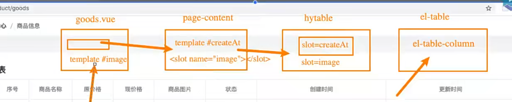


​		

> 在这个例子中，涉及到了 Vue 中的插槽（slot）功能。
>
> 首先，我们看子组件的 `<template>` 部分：
>
> ```html
> <template v-if="item.slotName">
> <slot :name="item.slotName" :row="scope.row"></slot>
> </template>
> ```
>
> 在子组件的模板中，有一个条件判断 `v-if="item.slotName"`，表示如果 `item.slotName` 存在（非空），则显示这部分模板内容。`item.slotName` 似乎是一个属性或者变量，这里暂时没有完整的上下文，无法确定其具体含义。
>
> 接着，通过 `<slot>` 元素来定义插槽。插槽是用于向父组件传递内容的特殊标记。在这个例子中，`:name="item.slotName"` 表示这是一个具名插槽，并使用 `item.slotName` 作为插槽的名称。`:row="scope.row"` 则表示将 `scope.row` 对象作为插槽的属性传递给父组件。
>
> 现在，我们来看父组件的模板部分：
>
> ```html
> <template #image="scope">
> <el-image
> style="width: 60px; height: 60px"
> :src="scope.row.imgUrl"
> :preview-src-list="[scope.row.imgUrl]"
>   >
> </el-image>
> </template>
> ```
>
> 在父组件的模板中，我们使用了一个具名插槽，并指定插槽的名称为 `image`。当子组件使用 `slot` 标签传递 `name="image"` 的插槽时，这部分内容会被插入到父组件的模板中。同时，父组件通过 `scope` 属性接收了传递过来的插槽属性对象，并将其命名为 `scope`。
>
> 在这个插槽中，父组件使用 `el-image` 组件来显示图片，`:src="scope.row.imgUrl"` 表示图片的 URL 来自 `scope.row.imgUrl`，而 `:preview-src-list="[scope.row.imgUrl]"` 则表示预览的图片列表中只有这一张图片。
>
> 综合起来，这个例子中，子组件动态决定是否显示插槽，而父组件使用了一个具名插槽 `image` 来接收子组件传递的内容，并在插槽中展示图片的相关信息。父组件通过 `scope.row` 对象来访问子组件传递的 `row` 属性，从而获取图片的 URL，并使用 `el-image` 组件显示图片。

#### 3.2.文本收缩配置

```ts
<template v-for="propItem in propList" :key="propItem.prop">
    <el-table-column v-bind="propItem" align="center" show-overflow-tooltip>
```

**文本溢出收缩** 

 **\<template v-for="propItem in propList" :key="propItem.prop">**

### 商品搜索待完善


## （五）菜单管理页面开发

主要思路： 保存基本请求的数据信息同搭建商品一样，这里不赘述

主要操作：

在配置中要设置展示子菜单（点击可扩展）， 添加对象， 内含rowKey和 treeProp属性， id 为标识每个菜单， treeProp 树形Prop也指子菜单 ， 添加配置后， 需要为table双向绑定改配置， 并设置默认配置， 因为菜单不含底部分页器， 重新对table设置属性将showFooter默认为true传 false不展示


### 1.  配置信息传入属性

```ts
 childrenProps: {
    rowKey: 'id',
    treeProp: {
      children: 'children'
    }
  },
  // 由于菜单不需要分页器
  showFooter: false
}
```


#### 1.1  store存储信息 省略

### 2. table双向绑定childrenProps

此部分功能给表格添加属性， 用于展示子菜单

```ts
    <el-table
      :data="listData"
      border
      style="width: 100%"
      @selection-change="handleSelectionChange"
      v-bind="childrenProps"
    >
    
    props接收属性
   childrenProps: {
      type: Object,
      default: () => ({})
    },
    
```


#### 2.1 提高table扩展性

分页设置： 提供v-if传入  是否显示分页器

```ts
<!-- 插入尾部 -->
    <div class="footer" v-if="showFooter">

props设置
showFooter: {
type: Boolean,
default: true
}
```


## （六）用户按钮权限管理

主要思路： 为用户分配权限， 每个用户需要 获取权限permission， 去决定是否拥有某部分功能， 为有功能的菜单重构， 以权限布尔值去决定是否展示

### 1. 获取用户登录权限

在utiles文件中， 建立获取用户按钮函数

按钮权限存储于菜单type为3的子菜单的属性 permission中， 在这里使用函数获取后将权限字符串数组返回

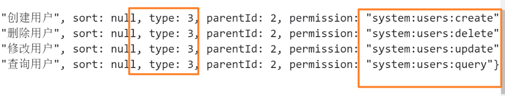

```ts
// 函数为获取 级别为3的菜单权限 转化为字符串
export function mapMenusToPermissions(userMenus: any[]) {
  const permissions: string[] = []

  const _recurseGetPermissions = (menus: any[]) => {
    for (const menu of menus) {
      if (menu.type === 1 || menu.type === 2) {
        _recurseGetPermissions(menu.children ?? [])
      } else if (menu.type === 3) {
        permissions.push(menu.permission)
      }
    }
  }
  _recurseGetPermissions(userMenus)

  return permissions
}
```


### 2. 路由注册对应菜单时，获取所拥有按钮权限

在login登录逻辑中处理，在菜单注册时， 调用函数获取拥有按钮权限,  需要为state添加permissions数组属性

```ts
changeUserMenus(state, userMenus: any) {
      state.userMenus = userMenus

      // 注册动态路由组件
      // console.log('注册动态路由组件')
      // 将userMenus -> routes， 数组
      const routes = mapMenusToRoutes(userMenus)
      //逐一遍历添加进规则- mainChildren
      routes.forEach((route) => {
        router.addRoute('main', route)
      })

      // 在为用户生成菜单时 就需为其绑定权限
      const permissions = mapMenusToPermissions(userMenus)
      state.permissions = permissions
    }
```


### 3. page-content所展示内容由权限决定（优化）

#### 3.1  创建权限比对函数，返回布尔值

在hooks生成函数比对， 在content中使用该函数判断是否拥有某权限

```ts
import { useStore } from '@/store'

export function usePermission(pageName: string, handleName: string) {
  const store = useStore()
  const permissions = store.state.login.permissions
  // 拼接权限Name 去进行比对
  const verifyPermission = `system:${pageName}:${handleName}`
  // 返回布尔值  判断是否有无某项权限
  return !!permissions.find((item) => item === verifyPermission)
}

```


#### 3.2 page-Content 权限判断化 

通过使用hook函数， 获取权限布尔值 ， 去对页面显示内容v-if判断， 网络请求是否发送也由isQuery权限决定


##### 3.2.1 判断是否拥有权限- script

```ts
import { usePermission } from '@/hooks/use-permission'


  // 0. 获取操作的权限
    const isCreate = usePermission(props.pageName, 'create')
    const isUpdate = usePermission(props.pageName, 'update')
    const isDelete = usePermission(props.pageName, 'delete')
    const isQuery = usePermission(props.pageName, 'query')
```


##### **3.2.2 页面显示- table显示 内容判断决定**

```ts
<!-- 头部插槽 -->
<template #headerHandler>
<el-button v-if="isCreate" type="primary" size="mini">新建</el-button>
</template>


<template #handler>
<el-button v-if="isUpdate" icon="el-icon-edit" size="mini" type="text">
编辑
</el-button>
<el-button
v-if="isDelete"
icon="el-icon-delete"
size="mini"
type="text"
>
删除
</el-button>
</template>
```


##### 3.2.3 网络请求限制

```ts
const getPageData = (queryInfo: any = {}) => {
    if (!isQuery) return
    
    store.dispatch('system/getPageListAction', {
        pageName: props.pageName,
        queryInfo: {
            offset: pageInfo.value.currentPage * 			pageInfo.value.pageSize,
            size: pageInfo.value.pageSize,
            ...queryInfo
        }
```


# 🔺✨ 进度十一

day 31 20:30 


## （一） 删除按钮- 功能实现

主要思路：发送网络请求- delete，

1. 需先在Service封装delete请求，将删除操作放至vueX进行处理
2. 在page-content通过作用域插槽Scope绑定行，并为DeleteBtn绑定删除处理函数💓🐟
3. 在vueX中Action中定义发送删除请求函数，需接受从pageContent接受的id和pageName, 执行aXios封装的删除请求，  删除后重新对数据进行获取
4. 在DeleteBtn删除处理函数中，将id和pageName传递并触发VueX的Action删除请求


### 1. 封装Service- Delete网络请求

在Service为System封装删除请求， 需要接受url 

```ts
// url: /users/id
export function deletePageData(url: string) {
  return hyRequest.delete<IDataType>({
    url: url
  })
}

```


### 2. VueX定义disPatch调用请求

接收pageName和id后，拼接成路径，发送删除请求， 并重新获取最新数据

```ts
 async deletePageDataAction({ dispatch }, payload: any) {
      //  1. 获取pageName  和 id
      // 删除需要获取 /users/id
      const { pageName, id } = payload
      const pageUrl = `/${pageName}/${id}`

      // 2.调用删除网络请求
      await deletePageData(pageUrl)

      // 3. 删除后需要重新请求最新数据
      dispatch('getPageListAction', {
        pageName,
        // 这部分数据可以优化、 暂不不处理
        queryInfo: {
          offset: 0,
          size: 10
        }
      })
    }
```

queryInfo可以关联，写死的数据会导致用户如果在非默认页面删除时，会跳转至默认页面

### 3. 为数据绑定click处理函数，并返回当前行

scope.row表示将当前行返回

```ts
 <template #handler="scope">
     <el-button
        v-if="isDelete"
        icon="el-icon-delete"
        size="mini"
        type="text"
        @click="handleDeleteClick(scope.row)"
        >
     
```


### 4. Content函数调用disPatch函数进行删除

由于接收作用域scope返回的行数据，参数item接收， 此时传递item.id对数据传递至disPatch，最终实现删除效果

```ts
// 5. 删除/ 编辑/ 新建操作
    const handleDeleteClick = (item: any) => {
      console.log(item)
      store.dispatch('system/deletePageDataAction', {
        pageName: props.pageName,
        id: item.id
      })
    }
```


##  （二） 新建用户表单实现

主要思路:

1. 使用到form组件， 暂时先在user界面显示， 引入el-dialog弹窗显示， 由v-model的dialogVisible bool值决定是否显示
2. el-dialog包裹hy-form组件， 并插入footer插入两个标签，为标签绑定点击将弹窗销毁

### 1. user界面使用el-dialog对话窗

```ts
 <el-dialog title="新建用户" v-model="dialogVisble" width="30%" center>
     <hy-form v-bind="modalConfig" v-model="formData"></hy-form>
<template #footer>
    <el-button @click="dialogVisble = false">取消</el-button>
<el-button type="primary" @click="dialogVisble = false"
>确定</el-button>

传入modelConfig配置后， 需要传入 formData
```


### 2. 根据用户信息 传入配置信息

```ts
import { IForm } from '@/base-ui/form'

export const modalConfig: IForm = {
  formItems: [
    {
      field: 'name',
      type: 'input',
      label: '用户名',
      placeholder: '请输入用户名'
    },
    {
      field: 'realname',
      type: 'input',
      label: '真实姓名',
      placeholder: '请输入真实姓名'
    },
    {
      field: 'password',
      type: 'password',
      label: '用户密码',
      placeholder: '请输入密码'
    },
    {
      field: 'cellphone',
      type: 'input',
      label: '电话号码',
      placeholder: '请输入电话号码'
    }
  ],
  colLayout: { span: 24 },
  itemStyle: {}
}

```


### 3. 将该新建弹窗封装为组件- components- page-modal

提升该功能的复用性， 在其他菜单中只需要导入该组件 

主要思路：

1. 将弹窗进行抽取， 原先组件引用相关属性全部移入到pagemodal组件
2. 父组件传入配置时， 需要时**动态绑定**💓🐟

```ts
 <page-modal :modalConfig="modalConfig"></page-modal>
```


#### 3.1 pageModal组件封装完成

```ts
<template>
  <div class="page-modal">
    <el-dialog title="新建用户" v-model="dialogVisble" width="30%" center>
      <hy-form v-bind="modalConfig" v-model="formData"></hy-form>
      <template #footer>
        <el-button @click="dialogVisble = false">取消</el-button>
        <el-button type="primary" @click="dialogVisble = false">确定</el-button>
      </template>
    </el-dialog>
  </div>
</template>

<script lang="ts">
import { defineComponent, ref } from 'vue'
import HyForm from '@/base-ui/form'

export default defineComponent({
  components: {
    HyForm
  },
  props: {
    modalConfig: {
      type: Object,
      required: true
    }
  },
  setup() {
    const formData = ref({})
    const dialogVisble = ref(true)
    return {
      formData,
      dialogVisble
    }
  }
})
</script>

<style scoped lang="less"></style>

```


### 4. 将表单与content按钮绑定

#### 4. 1将Content组件新建按钮绑定dialogVisble显示

主要思路： 从Content emit到父组件 user， user监听事件，并使用ref绑定pageModel组件， 将pageModal.value.dialogVisble = true

#### 4.2  content绑定事件， 向外触发事件 新建

```ts
    <template #headerHandler>
        <el-button
          v-if="isCreate"
          type="primary"
          size="mini"
          @click="handleNewClick"
          >新建数据</el-button
        >
        
            // 新建操作
    const handleNewClick = () => {
      console.log('向外触发')
      emit('newBtnClick')
    }
```


#### 4.3 父组件监听事件，ref绑定modal实例， 修改dialogVisble

```ts
  <page-content
      ref="pageContentRef"
      :contentTableConfig="contentTableConfig"
      pageName="users"
      @newBtnClick="handleNewData"
    ></page-content>

    <page-modal :modalConfig="modalConfig" ref="pageModalRef"></page-modal>
```

修改dialogVisble为true显示

```ts
    const pageModalRef = ref<InstanceType<typeof PageModal>>()

    // 处理Contentemit的新建数据，对新建用户的弹窗设置为true
    const handleNewData = () => {
      if (pageModalRef.value) {
        pageModalRef.value.dialogVisble = true
      }
    }
```


## （三） 编辑按钮功能实现

主要思路： 回显在modal组件显示，将数据传递父组件，在传递至modal显现

1. 对编辑绑定事件editBtn, 触发父组件， 并将当前作用scope.row传递，行数据传递至父组件
2. 父组件进行监听conten触发的事件，接收数据，并定义后以defaultInfo对象接收， 展开符赋值，并将modal组件显示Visible改为true
3. 将defaultInfo传入modal组件， modal组件使用Props接收后，并对其进行监听，当传入时，watch侦听后触发事件， 根据配置传入限制（原先传入hy-form表单数据）， 对formData对应的 field表格进行赋值


### 1. Content编辑按钮绑定事件，并将当前行数据传递父组件

```ts
<el-button
v-if="isUpdate"
icon="el-icon-edit"
size="mini"
type="text"
@click="handleEditClick(scope.row)"
>
编辑
// 编辑操作
const handleEditClick = (item: any) => {
emit('editBtnClick', item)
}
```


### 2. 父组件中，定义响应式对象接受数据并传递给modal组件

之所以要定义为响应式， 响应式才能触发动态传入modal的数据

```ts
<page-modal
      :defaultInfo="defaultInfo"
      :modalConfig="modalConfig"
      ref="pageModalRef"
></page-modal>
    
 const defaultInfo = ref({})
    // 处理Contentemit的新建数据，对新建用户的弹窗设置为true
    const handleNewData = () => {
      if (pageModalRef.value) {
        pageModalRef.value.dialogVisble = true
      }
    }
    const handleEditData = (item: any) => {
      // 将子组件的行数据赋值给defaultInfo
      defaultInfo.value = { ...item }
      if (pageModalRef.value) {
        pageModalRef.value.dialogVisble = true
      }
    }
```


### 3. modal组件以config配置限制接收指定的数据

formData为modal组件传入form的数据， 将响应式对象以moal配置存在的propItem.field 属性   赋值对应的数据 给 formData, 后显示的内容为原content所处行的数据

**使用watch监听defaultInfo**， 同时 formData也为响应式数据，改变引起form变化

```ts
  <hy-form v-bind="modalConfig" v-model="formData"></hy-form>


props: {
    modalConfig: {
      type: Object,
      required: true
    },
    defaultInfo: {
      type: Object,
      default: () => ({})
    }
  },
  setup(props) {
    const formData = ref({})
    const dialogVisble = ref(false)

    // 对defalutInfo 进行监听
    watch(
      () => props.defaultInfo,
      (newValue) => {
        // 限制item为已传入的配置类型，显示的为form添加表格类型
        for (const item of props.modalConfig.formItems) {
          formData.value[`${item.field}`] = newValue[`${item.field}`]
        }
      }
    )
```


## (四) 将user中setup函数内通用逻辑操作封装为hook

封装好处， 在其他类同界面组件， 直接引入hook就具备了以上功能


```ts
import { ref } from 'vue'
import PageModal from '@/components/page-modal'

export function usePageModal() {
  const pageModalRef = ref<InstanceType<typeof PageModal>>()
  const defaultInfo = ref({})
  // 处理Contentemit的新建数据，对新建用户的弹窗设置为true
  const handleNewData = () => {
    if (pageModalRef.value) {
      pageModalRef.value.dialogVisble = true
    }
  }
  const handleEditData = (item: any) => {
    // 将子组件的行数据赋值给defaultInfo
    defaultInfo.value = { ...item }
    if (pageModalRef.value) {
      pageModalRef.value.dialogVisble = true
    }
  }
  return [pageModalRef, defaultInfo, handleNewData, handleEditData]
}

```


## （五）解决数据- 显示优化问题

### 1. 新建用户 引用数据为旧数据， 需要重置空对象

因为在点击编辑时， 对modal的formData数据进行修改，但是关闭未销毁对话， 所以在下次新建打开时， formData默认传入form有值， 显示为上次编辑的值

有两个原因 会话未销毁， 会话传入值未清空 

1. el-dialog设置属性 - destroy-on-close 关闭时将当前实例销毁
2. hook中， 新建事件将对象defaultInfo重置为空

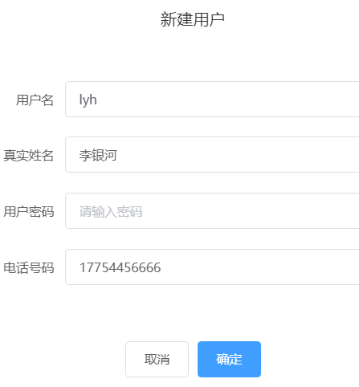

```ts
    <el-dialog
      title="新建用户"
      v-model="dialogVisble"
      width="30%"
      center
      destroy-on-close
    >
```

```ts
  const handleNewData = () => {
    defaultInfo.value = {}
    if (pageModalRef.value) {
      pageModalRef.value.dialogVisble = true
    }
  }
```


### 2. 新建用户和编辑用户- 密码标签显示与否

解决问题：新建弹窗需要包含密码， 编辑不显示密码

主要思路： 修改isHidden值

1. 为配置传入新属性 isHidden，为true时隐藏，false显示，并且该属性为可选参数，不同页面 isHidden存在非必要
2. 根据Hidden， 对form，Item渲染时进行逻辑判断
3. 属于user界面的新建、编辑在此逻辑处理，生成两个函数，新建修改Hidden为false, 编辑将isHidden修改为false传入 hook中的use- modal， 并且都为可选函数

将函数放置user页面，是因为显示与否由该页面决定， 且hook中应当放的数据为共享， 再将函数传入进hook中， hook为可选参数接收回调函数， 加强hook的可拓展性，共享性

#### 2.1 设置isHidden属性， 并在form进行判断

此属性为可选参数， 通过在el-form对v-if进行判断， 未含该属性的formItem该属性为undefined， v-if =  !isHidden, 为true， 意味着默认渲染

```ts
    {
      field: 'password',
      type: 'password',
      label: '用户密码',
      placeholder: '请输入密码',
      isHidden: true
    },
        
        <el-form-item
        :label="item.label"
        :rules="item.rules"
        :style="itemStyle"
		v-if="!item.isHidden"
			>
```


#### 2.2 在user组件对新建/编辑操作定义两个函数修改 isHidden

```ts
    // pageModal相关的hook逻辑
    // 1. 处理密码的逻辑
    const newCallback = () => {
      const passwordItem = modalConfig.formItems.find(
        (item) => item.field === 'password'
      )
      passwordItem!.isHidden = false
    }
    const editCallback = () => {
      const passwordItem = modalConfig.formItems.find(
        (item) => item.field === 'password'
      )
      passwordItem!.isHidden = true
    }

```


#### 2.3 传入Hook- use-modal函数， 调用修改isHidden

hook为共享函数， 具有共同逻辑的抽取， 对于部分页面不需要isHidden属性的修改， 所以对2.2 两个函数的接收为可选， 拓展hook可用性

```ts
type CallbackFn = () => void
export function usePageModal(newCb?: CallbackFn, editCb?: CallbackFn) {
  const pageModalRef = ref<InstanceType<typeof PageModal>>()
  const defaultInfo = ref({})
  // 处理Contentemit的新建数据，对新建用户的弹窗设置为true
  const handleNewData = () => {
    defaultInfo.value = {}
    if (pageModalRef.value) {
      pageModalRef.value.dialogVisble = true
    }
    newCb && newCb()
  }
  const handleEditData = (item: any) => {
    // 将子组件的行数据赋值给defaultInfo
    defaultInfo.value = { ...item }
    if (pageModalRef.value) {
      pageModalRef.value.dialogVisble = true
    }
    editCb && editCb()
  }
  return [pageModalRef, defaultInfo, handleNewData, handleEditData]
}
```


## （六）动态添加新增的部门/角色选择

需求： 将部门和角色选择转化为动态更新， 数据更新选项更新

**思路：** 

1. 从vueX发起请求获取数据保存至根模块中
2. 在user中使用computed包裹从vueX获取的数据，
3. modalConfigRef为config的计算属性，转化为ref对象属性
4. 更新时，会同步更新
5. 不转化为响应式属性， 由于请求为异步请求，进入页面时 请求未返回结果时，配置已赋值， 导致选项不可选， 所以应该以computed计算包裹将配置文件转化为响应式配置


### 1.  config的部门/角色options设置为空

```ts
 {
      field: 'departmentId',
      type: 'select',
      label: '选择部门',
      placeholder: '请选择部门',
      options: []
    },
    {
      field: 'roleId',
      type: 'select',
      label: '选择角色',
      placeholder: '请选择角色',
      options: []
    }

```


### 2. vueX根模块请求并保存部门/角色列表数据

之所以放在根组件是因为该属性，在其他地方也能使用

```ts
state() {
    return {
        name: 'coderwhy',
        age: 18,
        entireDepartment: [],
        entireRole: []
    }

mutations: {
    changeEntireDepartment(state, list) {
      state.entireDepartment = list
    },
    changeEntireRole(state, list) {
      state.entireRole = list
    }
  },
  getters: {},
  actions: {
    async getInitialDataAction({ commit }) {
      // 1.请求部门和角色数据
      const departmentResult = await 				getPageListData('/department/list', {
        offset: 0,
        size: 1000
      })
      const { list: departmentList } = departmentResult.data
      const roleResult = await getPageListData('/role/list', {
        offset: 0,
        size: 1000
      })
      const { list: roleList } = roleResult.data

      // 2.保存数据
      commit('changeEntireDepartment', departmentList)
      commit('changeEntireRole', roleList)
    }
```


**并在setupStore添加进getInitialDataAction请求函数， 每当刷新重新发送请求，保持数据一致性**

```ts
export function setupStore() {
  store.dispatch('login/loadLocalLogin')
  store.dispatch('getInitialDataAction')
}
```


### 3. 在users组件中，为config中的部门/角色options绑定对应数组数据

#### 3.1🔺✨   将Modalconfig转化为ref对象，并传入modal组件

```ts
  const modalConfigRef = computed(() => {
      const departmentItem = modalConfig.formItems.find(
        (item) => item.field === 'departmentId'
      )
      departmentItem!.options = store.state.entireDepartment.map((item) => {
        return { title: item.name, value: item.id }
      })
      const roleItem = modalConfig.formItems.find(
        (item) => item.field === 'roleId'
      )
      roleItem!.options = store.state.entireRole.map((item) => {
        return { title: item.name, value: item.id }
      })
      return modalConfig
    })

```

#### 3.2	computed的作用

- 解决异步请求，数据绑定延迟导致无选项的问题
- 每次刷新页面都会重新请求，且由于配置是ref对象，当数据发生变更时，选项能进行更新，更加灵活！


## （七）新建用户/编辑用户功能实现

**思路：**

1. 首先需要在system子模块中，Service分别定义新建请求（post）和编辑请求(patch)
2. 在vueX中定义不同action, 对数据进行更改时，都需重新获取数据
3. 为modal组件的确定功能绑定函数，需要进行逻辑处理，编辑新建表单重用，需要对确定按钮功能进行逻辑判断， 根据- form.value.length进行判断
4. 新建时，去触发post请求， 编辑触发patch请求


### 1. Service 封装edit & create请求

```ts
// 创建
export function createPageData(url: string, newData: any) {
  return hyRequest.post<IDataType>({
    url: url,
    data: newData
  })
}

// 编辑
export function editPageData(url: string, editData: any) {
  return hyRequest.patch<IDataType>({
    url: url,
    data: editData
  })
}
```


### 2. 在system定义action请求实现新建/编辑

```ts
 // 创建数据
    async createPageDataAction({ dispatch }, playload: any) {
      const { pageName, newData } = playload
      const pageUrl = `/${pageName}`
      await createPageData(pageUrl, newData)

      // 请求最新的数据
      dispatch('getPageListAction', {
        pageName,
        queryInfo: {
          offset: 0,
          size: 10
        }
      })
    },

    async editPageDataAction({ dispatch }, payload: any) {
      // 编辑数据请求
      const { pageName, editData, id } = payload
      const pageUrl = `/${pageName}/${id}`
      await editPageData(pageUrl, editData)

      // 请求最新的数据
      dispatch('getPageListAction', {
        pageName,
        queryInfo: {
          offset: 0,
          size: 10
        }
      })
    }
```


### 3.🔺✨users传入pageName属性—> page-modal

```ts
    <page-modal
      :defaultInfo="defaultInfo"
      :modalConfig="modalConfigRef"
      pageName="users"
      ref="pageModalRef"
    ></page-modal>
```


### 4. page-modal为确认绑定事件- 实现功能

绑定事件， 并触发vueX定义的 action- 新建/编辑

编辑需要传入ID， 确认需进行逻辑判断- 判断defaultInfo对象keys值化绑定数组长度，去分别触发不同事件

在这里使用展开符- 将最新的值传入

```ts
const handleConfirmClick = () => {
      dialogVisble.value = false
      // 将对象的属性名转化为数组，键数组，判断其长度
      if (Object.keys(props.defaultInfo).length) {
        // 编辑
        console.log('编辑用户')
        store.dispatch('system/editPageDataAction', {
          pageName: props.pageName,
          editData: { ...formData.value },
          // defaultInfo为传入的行数据，具有用户数据，取出其id
          id: props.defaultInfo.id
        })
      } else {
        // 新建用户
        console.log('新建用户')
        store.dispatch('system/createPageDataAction', {
          pageName: props.pageName,
          newData: { ...formData.value }
        })
      }
    }
```


# 🔺✨进度十二

**day 32   21点40分**

## （一） 对遗留问题进行解决/ 修改

### 1. 时区问题，调用utcOffset（8）解决

因为所处为东八区， utc为0区， 所以需偏移量8小时

```ts
export function formatUtcString(
  utcString: string,
  format: string = DATE_TIME_FORMAT
) {
  // 表示对utc时间使用 格式转化- 转化为 format格式
  return dayjs.utc(utcString).utcOffset(8).format(format)
}

```


### 2. 原请求数据部门/角色与请求token放置导致数据请求失败

当用户进行刷新时，会重新执行VuxX根模块的setup去将本地缓存取出，维持表单现状（vueX刷新会丢失数据）， 但是由于请求和获取角色/部门请求都为异步操作，会出现token慢响应的状态， 当未含token直接调用时会出现 部门/角色选项无数据

思路： 

1. 将intialDataAction重新放置登录逻辑token获取后调用
2. 本地token缓存取出后（刷新页面时取得token后的操作），调用， 确保该请求在含token的情况下去发送请求
3. 为nav-header中绑定退出函数， 并处理响应逻辑， 测试， 成功~


#### 2.1 在VueX- Login模块的逻辑代码中/刷新处理中触发intialDataAction

二者的作用：

1. 确保登录时token获取后去发送请求获取角色/部门选项

2. 确保刷新时， token获取后发送请求..

   **登录逻辑处理模块**

```ts
  actions: {
    // 第一个参数为上下文对象
    async accountLoginAction({ commit }, payload: IAccount) {
      // 1.实现登录逻辑
      const loginResult = await accountLoginRequest(payload)
      const { id, token } = loginResult.data
      commit('changeToken', token)
      localCache.setCache('token', token)

      // 💓🐟fix: 登录获得token对 部门/角色表单数据请求- 触发根路径的animation
      this.dispatch('getInitialDataAction', null, { root: true })

```

刷新缓存取出模块

```ts
   loadLocalLogin({ commit }) {
      const token = localCache.getCache('token')
      if (token) {
        commit('changeToken', token)
        // 💓🐟
        this.dispatch('getInitialDataAction', null, { root: true })
      }
```


##### disPatch参数解析- 第三个参数

第二个为传入的payload信息

> 第三个参数是一个选项对象，可以传递给 Vuex action 的选项。除了 `root` 属性外，还有其他一些属性可以在这个选项对象中使用。以下是常用的一些属性：
>
> 1. `root`: 用于指定是否在根级别触发 action，设置为 `true` 表示在根级别触发，设置为 `false`（默认）表示在当前 module 内触发。
>
> 2. `dispatch`: 一个布尔值，表示是否要在触发 action 时自动调用 `dispatch` 方法。默认为 `true`。如果设置为 `false`，则不会触发任何其他 action。
>
> 3. `commit`: 一个布尔值，表示是否要在触发 action 时自动调用 `commit` 方法。默认为 `true`。如果设置为 `false`，则不会触发任何 mutation。
>
> 4. `rootGetters`: 一个对象，包含根级别的 getters 函数。可以通过这个属性访问根 module 的 getters。
>
> 5. `rootState`: 一个对象，包含根级别的 state。可以通过这个属性访问根 module 的 state。
>
> 6. `silent`: 一个布尔值，表示是否在触发 action 时抑制 console 警告，默认为 `false`。如果设置为 `true`，则不会显示任何 console 警告。
>
> 7. 其他自定义属性：你还可以在这个选项对象中添加其他自定义属性，以便在 action 中使用。

#### 2.2 为user-info实现退出功能并测试- 成功

```ts
  setup() {
    const store = useStore()
    const name = computed(() => store.state.login.userInfo.name)

    const router = useRouter()
    const exitLogin = () => {
      LocalCache.deleteCache('token')
      router.push('/main')
    }
```


## 🔺✨（简历- 面经）封装思想

1. 如有独有的逻辑无法合并，则在相关的组件进行逻辑处理
2. 公共逻辑的组件禁止混入不可共享的逻辑信息， 提高更高的组件复用性， 如有复杂的功能需要实现，再对组件进行封装， 一层不能解决的事件， 就进行多次封装 
3. 封装相当于： 组件- 组装成界面- 设置开关（props的数据接收）去决定是否使用哪个组件， 组件灵活性很高， 可快速开发具有相同功能不同数据的界面

> 你的总结对封装思想有一定的理解，但还可以进行一些补充和调整。以下是对你总结中提到的几个点的进一步说明：
>
> 1. **独有逻辑的处理：**
>    正确，当某个逻辑只适用于特定组件，而无法在其他地方进行合并，将这些逻辑放在相关的组件中进行处理是合适的。这有助于保持代码的清晰性和可维护性。
>
> 2. **公共逻辑的复用和组装：**
>    正确，确保公共逻辑的组件能够被广泛复用是很重要的。避免在这些组件中混入与其它不相关的逻辑，这有助于提高组件的复用性和维护性。而对于复杂功能的实现，可以在需要时对组件进行更深层次的封装，但同时要确保不要让组件变得过于庞大和难以理解。
>
> 3. **封装的灵活性：**
>    正确，封装的目的之一是为了提供一种灵活的方式来组装和配置界面。通过设置开关或提供不同的属性，可以轻松地改变组件的行为，从而适应不同的使用场景。
>
> 总体来说，你的总结已经涵盖了封装思想的核心要点。然而，还可以进一步强调以下几点：
>
> - **单一职责原则：** 在封装组件时，努力使每个组件只专注于一个特定的职责或功能。这有助于提高组件的可维护性和重用性。
>
> - **可测试性：** 考虑如何设计组件，使其更易于进行单元测试。良好的封装能够让你更容易编写和执行针对特定功能的测试。
>
> - **文档和示例：** 封装的组件应该伴随着清晰的文档和示例，以便其他开发人员能够理解如何正确使用这些组件，以及它们的可配置选项和功能。
>
> - **权衡抽象和复杂性：** 封装应该追求合适的抽象层次，不要过度封装导致组件过于复杂。要在可读性、可维护性和功能完整性之间找到平衡。
>
> 最终，封装是一个不断演进的过程。通过实践和与其他开发人员的交流，你将不断提升自己在封装思想上的技能。

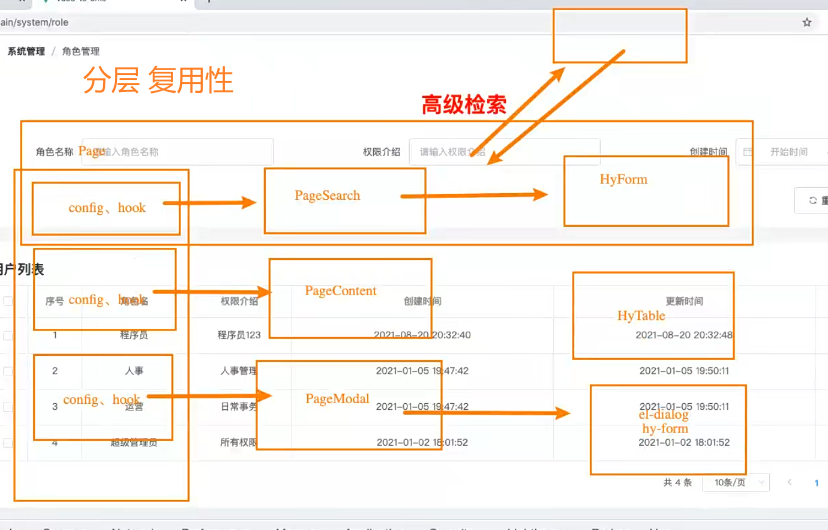

## （二） 利用封装好的组件- 快速开发角色页面

原界面有conten和search组件， 现需引入modal组件

 		新建用户功能由于需要为其添加权限，  此部分不属于modal所拥有，只展示角色名（具体拥有权限无展示） 需要额外独立开发， 不将其放置modal组件中- 尽量使组件可用性强， 不属于公共逻辑的代码不放入中间组件

**简单功能开发思路（不含权限分配）**

1.  引入modal组件， hook函数， 建立modal配置文件
2.  将 hook函数return将元组数据return并绑定对应组件或事件
3.  需传入pageName, 传入defaultInfo和配置信息后， 简单功能开发完成


### 1. 配置文件设置

```ts
import { IForm } from '@/base-ui/form'

export const modalConfig: IForm = {
  formItems: [
    {
      field: 'name',
      type: 'input',
      label: '角色名',
      placeholder: '请输入角色名'
    },
    {
      field: 'intro',
      type: 'input',
      label: '角色介绍',
      placeholder: '请输入角色介绍'
    }
  ],
  colLayout: { span: 24 },
  itemStyle: {}
}

```


### 2. 组件引入，和相应属性的设置- 配置modal组件

```ts
  <div class="role">
    <page-search :searchFormConfig="searchFormConfig"></page-search>
    <page-content
      :contentTableConfig="contentTableConfig"
      pageName="role"
      @new-btn-click="handleNewData"
      @edit-btn-click="handleEditData"
    ></page-content>

    <page-modal
      pageName="role"
      :modalConfig="modalConfig"
      ref="pageModalRef"
      :defaultInfo="defaultInfo"
    ></page-modal>
  </div>
  

import PageModal from '@/components/page-modal'
import { modalConfig } from './config/modal.config'
import { usePageModal } from '@/hooks/use-page-modal'

  setup() {
 	 const [pageModalRef, defaultInfo, handleNewData, handleEditData] =  usePageModal()

```


## 🔺✨（三）为role界面的modal新添用户界面中绑定权限菜单

**需求：**

**为角色菜单表：定义新的角色并绑定具有的权限**

新建菜单需要包括具体的权限菜单， 该权限在content中只是一个展示权限命名， 该部分内容需要额外添加（获取权限数据并进行绑定）， 相当于拓展了modal的功能， 最终需要需要实现在点击添加权限时， 能显示具体的权限菜单，并能上传数据至服务端

**思路：**

1.  在vueX的system模块中， 请求菜单getPageListData，（ 获取菜单数据列表，拥有菜单= 拥有权限）， 并保存至state中 EnitreMenu中
<<<<<<< HEAD
2.  modal设置插槽供 父组件插入- 传入数据
3.  role组件为modal插入 菜单组件eleTree(可选多级菜单展开box)至插槽中
4.  role组件获取vueX中的菜单数组，并将特定的信息传入至modal中
5.  eleTree绑定函数可获取选择的菜单信息， 在role中获取后进行保存，并将选中的菜单信息传入modal
6.  modal定义otherConfig属性接收父组件传入的属性（默认为空对象）
7.  modal 对新建数据和编辑数据的函数进行重写， 对新建数据- 编辑数据 传入的otherInfo 同配置的otherConfig进行合并
8.  合并后的数据在user组件中这个实例中既拥有原先的用户名-权限名 + 接收进的具体拥有的权限， 再去发送请求， 从而使得新建数据功能实现， 并且对其它组件不影响（相当于这为一个功能拓展， 进一步拓展modal功能）
=======
2. modal设置插槽供 父组件插入- 传入数据
3. role组件为modal插入 菜单组件eleTree(可选多级菜单展开box)至插槽中
4. role组件获取vueX中的菜单数组，并将特定的信息传入至modal中
5. eleTree绑定函数可获取选择的菜单信息， 在role中获取后进行保存，并将选中的菜单信息传入modal
6. modal定义otherConfig属性接收父组件传入的属性（默认为空对象）
7.  modal 对新建数据和编辑数据的函数进行重写， 对新建数据- 编辑数据 传入的otherInfo 同配置的otherConfig进行合并
8. 合并后的数据在user组件中这个实例中既拥有原先的用户名-权限名 + 接收进的具体拥有的权限， 再去发送请求， 从而使得新建数据功能实现， 并且对其它组件不影响（相当于这为一个功能拓展， 进一步拓展modal功能）


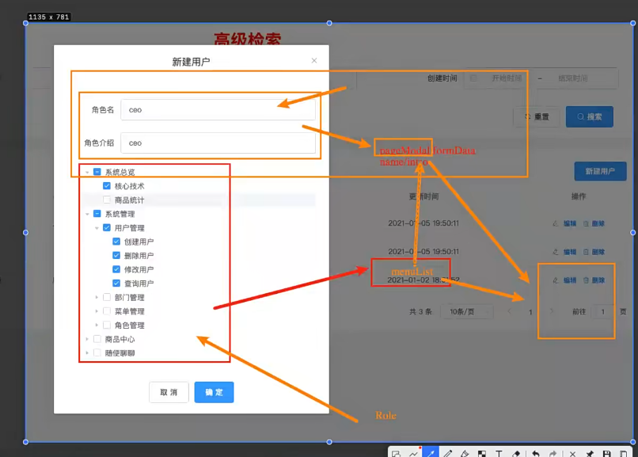

该图表示从- role通过vueX取出menList 传递给elTree组件，role接收elTree选中信息传递进modal， modal获取otherInfo配置信息合并后， 发送请求- 修改 和 创建请求（成功）


### 1. VueX中请求所有权限数据（菜单数据）并保存

```ts
    changeEntireMenu(state, list) {
      state.entireMenu = list
    }
    
        const menuResult = await getPageListData('/menu/list', {})
      const { list: menuList } = menuResult.data

      // 2. 保存数据
      commit('changeEntireDepartment', departmentList)
      commit('changeEntireRole', roleList)
      commit('changeEntireMenu', menuList)
```

### 2. modal组件设置插槽- role组件插入el-tree菜单组件

```ts
modal组件中<slot></slot>

role父组件
      <el-tree
        :data="menus"
        show-checkbox
        node-key="id"
        :props="{ children: 'children', label: 'name' }"
        @check="handleCheckChange"
      >

```

data表示：传入的菜单数据

show-checkbox： 表示为菜单具有可选框

props: 表示具有children： 菜单children对应字段， label 对应字段

@check: 表示监听选中的菜单， 向外传递两个参数

> 1. **data1: any** 这个参数代表传递给 `data` 属性的数组中该节点所对应的对象。在 `ElTree` 组件中，你可能会将一个对象数组传递给 `data` 属性，每个对象代表一个树节点。这个参数表示当前处理的节点的信息，可以包含节点的 id、label、children 等属性。
> 2. **data2: any** 这个参数是树目前的选中状态对象，包含了四个属性：
>    - `checkedNodes`: 一个数组，包含当前选中的所有节点的对象。
>    - `checkedKeys`: 一个数组，包含当前选中的所有节点的 key（可能是节点的 id 等唯一标识）。
>    - `halfCheckedNodes`: 一个数组，包含当前半选中状态的节点的对象。
>    - `halfCheckedKeys`: 一个数组，包含当前半选中状态的节点的 key


### 3. role组件将选中的菜单数据传入modal中

#### 3.1 role组件传入菜单数据到el-tree中

```ts
      <el-tree
        :data="menus"
        show-checkbox
        node-key="id"
        :props="{ children: 'children', label: 'name' }"
        @check="handleCheckChange"
      >
```

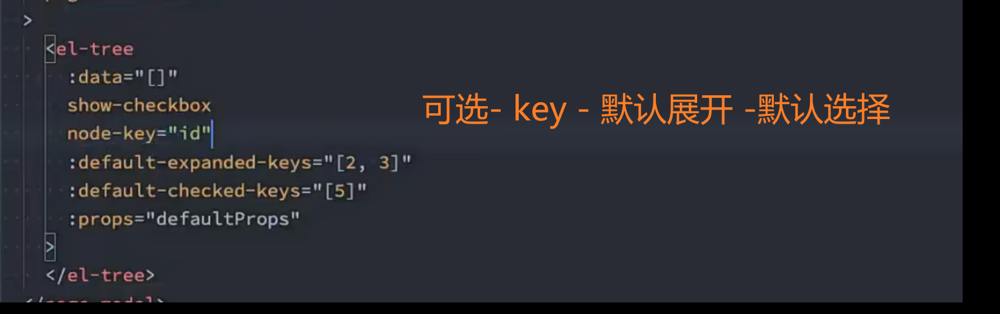

#### 3.2	对选中数据进行获取， 以响应式对象接收

```ts
  	const otherInfo = ref({}) 
	const handleCheckChange = (data1: any, data2: any) => {
      console.log(data2)
      // 所选中的子菜单权限
      const checkedKeys = data2.checkedKeys
      // 所选中的父菜单权限（半选中表示当该父菜单 被选中其子属性该项默认为半选中状态）
      const halfCheckedKeys = data2.halfCheckedKeys
      const menuList = [...checkedKeys, ...halfCheckedKeys]
      otherInfo.value = { menuList }
    }
```

> 在这个函数中，主要的逻辑是从 `data2` 参数中解构出选中的节点和半选中的节点，将它们的 keys（或标识）合并成一个新的数组 `menuList`，然后将这个数组存储在 `otherInfo` 变量中。

 **otherInfo.value = { menuList }**

> `otherInfo` 是一个对象，通过赋值的方式在其 `value` 属性中创建了一个名为 `menuList` 的属性，该属性的值是一个数组。


#### 3.3	将选中的菜单数据传入modal组件

otherInfo的传入，将选中的菜单数据传入

```ts
    <page-modal
      pageName="role"
      :modalConfig="modalConfig"
      ref="pageModalRef"
      :defaultInfo="defaultInfo"
      :otherInfo="otherInfo"
    >
```


### 4. modal接收选中的菜单信息，并重写编辑/创建请求

```ts
    otherInfo: {
      type: Object,
      default: () => ({})
    }
    
     const handleConfirmClick = () => {
      dialogVisble.value = false
      // 将对象的属性名转化为数组，键数组，判断其长度
      if (Object.keys(props.defaultInfo).length) {
        // 编辑
        console.log('编辑用户')
        store.dispatch('system/editPageDataAction', {
          pageName: props.pageName,
          editData: { ...formData.value, ...props.otherInfo },
          // defaultInfo为传入的行数据，具有用户数据，取出其id
          id: props.defaultInfo.id
        })
      } else {
        // 新建用户
        console.log('新建用户')
        store.dispatch('system/createPageDataAction', {
          pageName: props.pageName,
          // 将otherInfo传入的权限表也赋值其中
          newData: { ...formData.value, ...props.otherInfo }
        })
      }
    }
```

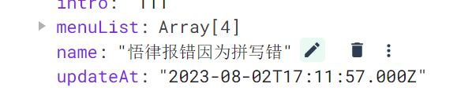


## （三）编辑功能菜单回显

**需求：** 使用编辑功能时，默认菜单显示为空白未选中状态，未同步角色具有的menuList数据,  现需将el-tree绑定，点击编辑时绑定菜单数据

**思路：**

1.  点击编辑时获取菜单数据，需要使用到hook的回调函数， 将回调函数设置为可传入 可选参数， role
2.  **role组件**传入回调函数后，Hook（upm）将当前行数据 item 传入，获取menuItem成功
3.  为elTree设置传入菜单数据- 叶子结点（mapLeav函数）
    - 传入的菜单数据应是从叶子节点开始勾选，因为如选择根节点时会将所有子菜单进行绑定，导致数据不准确
4.  在回调函数中对elTree的菜单属性进行设置， 需使用ref获取elTree实例， 同时在内部需要使用nextTick函数
    -  在点击编辑的那一时刻，还未获取到实例，所以需使用nextTick（微任务原理）函数， 将获取实例置于其中，确保绑定实例后进行操作


### 1. 获取选中角色菜单数据- 使用hook- UPM回调函数传出

在content使用编辑时触发父组件Role的事件中， 所绑定的函数中有item， 所以需要在role中使用editCallback传入其中， 接收来自content传出的item

#### 1.1  在UPM将Item传入回调函数

将回调函数设置为可接收可选参数，Role传入回调函数获取ITem

编辑被点击时， 传入item，当前角色信息传入  **editCb(item)**

```ts
type CallbackFn = (item?: any) => void

  const handleEditData = (item: any) => {
    // 将子组件的行数据赋值给defaultInfo
    defaultInfo.value = { ...item }
    if (pageModalRef.value) {
      pageModalRef.value.dialogVisble = true
    }
    editCb && editCb(item)
  }
```


### 2.	获取菜单的叶子节点

#### 2.1  获取菜单的叶子节点

ElTree， 需要选中叶子结点去选中框， 因为选中根菜单时默认选中所有子菜单， 导致数据出错

#### 2.2	map-menu定义函数获取叶子节点

```ts
// 获取叶子结点
export function menuMapLeafKeys(menuList: any[]) {
  const leftKeys: number[] = []

  const _recurseGetLeaf = (menuList: any[]) => {
    for (const menu of menuList) {
      if (menu.children) {
        _recurseGetLeaf(menu.children)
      } else {
        leftKeys.push(menu.id)
      }
    }
  }
  _recurseGetLeaf(menuList)

  return leftKeys
}
```


### 3.   绑定ElTree实例，并将叶子节点菜单传入匹配

#### 3. 1  ref绑定ElTree实例

```ts
 <el-tree
        ref="elTreeRef"
        :data="menus"
        show-checkbox
        node-key="id"
        :props="{ children: 'children', label: 'name' }"
        @check="handleCheckChange"
      >
  // 处理pageModal的hook - 获取item数据 并设置编辑 菜单选中状态
    const elTreeRef = ref<InstanceType<typeof ElTree>>()
```


#### 3.2	role定义回调函数， 在回调函数对Eltree进行设置

使用nextTick是避免数据为undefined， 在点击编辑的那一时刻， ref组件未绑定实例， 需要使用nextTIck确保绑定成功后执行函数

- 根据item的muenList传入MapLeafKeys获取叶子节点
- 再将叶子节点使用实例的setCheckedKeys设置菜单

```ts
 // 处理pageModal的hook - 获取item数据 并设置编辑 菜单选中状态
    const elTreeRef = ref<InstanceType<typeof ElTree>>()
    const editCallback = (item: any) => {
      // 将角色的菜单数组传入函数， 获取叶子节点
      const leafKeys = menuMapLeafKeys(item.menuList)
      nextTick(() => {
        console.log(elTreeRef.value)
        elTreeRef.value?.setCheckedKeys(leafKeys, false)
      })
    }
```

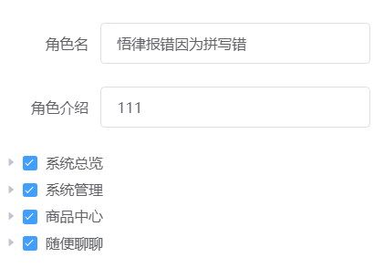


## （四）数据可视化- Echarts

### 1. 数据可视化


### 2. 数据可视化工具

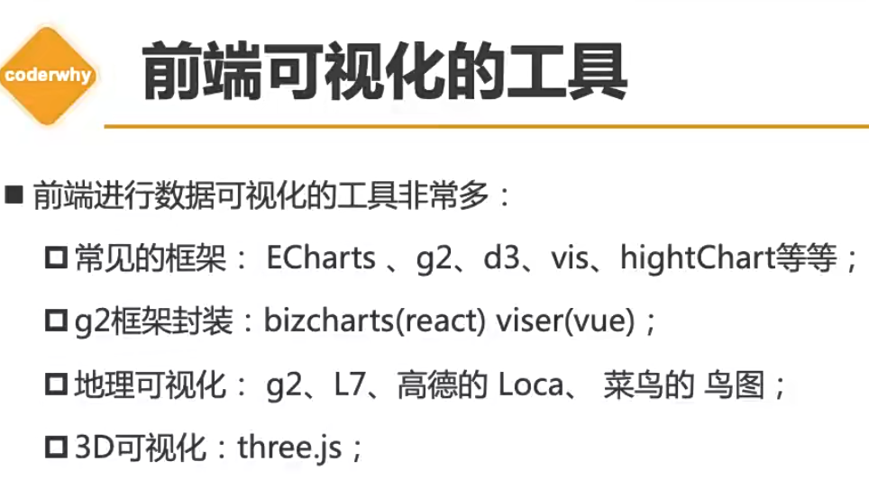


### 2. 认识Echarts- 特点面试相关🔺✨

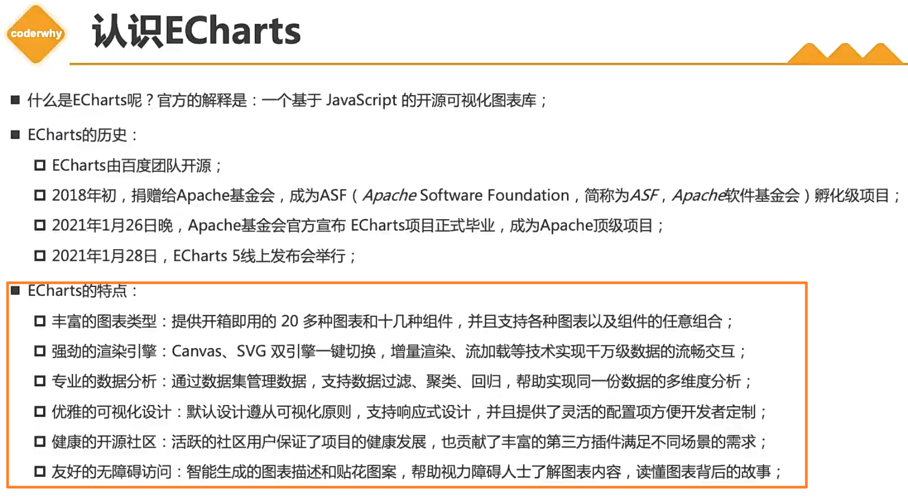


### 3. Echart的使用

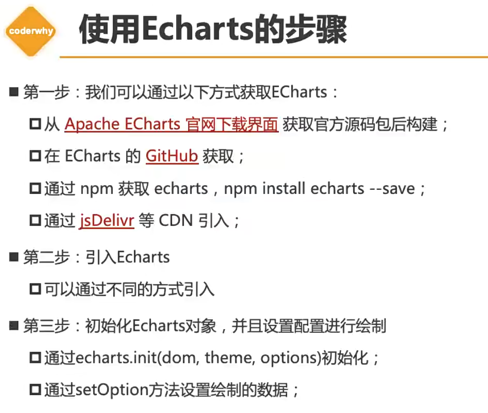


## （五）Echarts的简单使用

思路：

1. 导入Echart包， import * as 'echarts'
2. 需要绑定dom元素， 对dom元素进行初始化， echarts.init初始化
3. 编写配置文件
4. 设置配置文件  （生效）

🔺✨ 注意：r绑定初始化需要在onMounted 组件挂载后， 实例存在时初始化


### 1. 简单使用- 官方案例

```ts
setup() {
    const divRef = ref<HTMLElement>()
    // 需要使用onmounted, 组件挂完在对其进行echarts配置
    onMounted(() => {
      // 1. 初始化echarts实例
      const echartInstance = echarts.init(divRef.value!)
      // 2. 编写配置文件
      const option = {
        title: {
          text: 'ECharts 入门示例',
          subtext: '哈哈哈啊'
        },
        tooltip: {
          trigger: 'axis',
          axisPointer: {
            type: 'cross'
          }
        },
        legend: {
          data: ['销量']
        },
        xAxis: {
          data: ['衬衫', '羊毛衫', '雪纺衫', '裤子', '高跟鞋', '袜子']
        },
        yAxis: {},
        series: [
          {
            name: '销量',
            type: 'bar',
            data: [18, 20, 36, 10, 10, 20]
          }
        ]
      }
      // 3.设置配置,并且开始绘制
      echartInstance.setOption(option)
    })
```


> 这段代码是在 Vue 3 中使用 Composition API 的 `setup` 函数来集成 ECharts 图表的配置和渲染。下面逐步解释这段代码的内容：
>
> 1. `const divRef = ref<HTMLElement>()`：这行代码创建了一个 ref 变量 `divRef`，用于引用一个 DOM 元素。在这里，这个变量将用于获取一个 HTML 元素，通常用于包含 ECharts 图表的容器。
>
> 2. `onMounted(() => { ... })`：`onMounted` 是 Vue Composition API 提供的一个钩子函数，它会在组件挂载后（DOM 渲染完毕后）执行传入的回调函数。在这里，你通过这个函数确保在组件挂载后再初始化和渲染 ECharts 图表。
>
> 3. 初始化 ECharts 实例：
>    - `const echartInstance = echarts.init(divRef.value!)`：这行代码创建了一个 ECharts 实例，并将其绑定到之前定义的 `divRef` 所引用的 DOM 元素上。`echarts.init` 接受一个 DOM 元素作为参数，用于承载图表。
>
> 4. 编写 ECharts 配置文件：
>    - 这部分代码定义了 ECharts 图表的配置选项，包括标题、工具提示、图例、X 轴、Y 轴和系列数据等内容。这些配置会决定图表的展现方式和数据呈现。
>
> 5. 设置配置并绘制图表：
>    - `echartInstance.setOption(option)`：这行代码将之前定义的配置选项 `option` 应用到 ECharts 实例上。调用这个方法会根据配置绘制相应的图表。
>
> 总体来说，这段代码的逻辑是在组件挂载后，通过 `divRef` 获取一个 DOM 元素，然后使用这个元素来初始化 ECharts 实例，将配置选项应用到实例上，从而绘制相应的图表。这是一种常见的方式来在 Vue 中使用 ECharts 来绘制图表。


### 2. 配置文件解析

> 当你编写 ECharts 配置文件时，实际上是在定义如何呈现图表以及图表的各个组成部分的样式和数据。以下是你提供的示例配置文件的各个部分的解释：
>
> ```javascript
> const option = {
> title: {
> text: 'ECharts 入门示例', // 图表标题文本
> subtext: '哈哈哈啊' // 图表副标题文本
> },
> tooltip: {
> trigger: 'axis', // 提示框触发类型，axis 表示通过轴触发
> axisPointer: {
> type: 'cross' // 提示框的指示器类型，cross 表示显示十字准星指示器
> }
> },
> legend: {
> data: ['销量'] // 图例，用于标识每个系列的含义，这里仅有一个系列 '销量'
> },
> xAxis: {
> data: ['衬衫', '羊毛衫', '雪纺衫', '裤子', '高跟鞋', '袜子'] // X 轴的刻度数据
> },
> yAxis: {}, // Y 轴配置
> series: [
> {
> name: '销量', // 系列名称，与图例关联
> type: 'bar', // 系列类型，这里是柱状图
> data: [18, 20, 36, 10, 10, 20] // 每个系列的数据
> }
> ]
> };
> ```
>
> 现在逐个解释各个部分：
>
> 1. **title：** 设置图表的标题和副标题。`text` 表示主标题，`subtext` 表示副标题。
>
> 2. **tooltip：** 提示框配置，当鼠标悬停在图表上时会显示的信息。`trigger` 指定触发类型，这里使用 `axis` 表示通过轴触发，`axisPointer` 指示器配置，用于在轴上显示指示器。
>
> 3. **legend：** 图例配置，图例用于标识图表中的每个系列（数据系列）的含义。`data` 数组中的值与系列名称相关联，这里只有一个系列 '销量'。
>
> 4. **xAxis：** X 轴配置，定义图表的横轴（水平轴）。`data` 数组包含了 X 轴的刻度标签数据，这些标签对应于数据点。
>
> 5. **yAxis：** Y 轴配置，定义图表的纵轴（垂直轴）。在这个示例中，只是一个空的配置，你可以在其中定义 Y 轴的样式和刻度等。
>
> 6. **series：** 系列配置，用于定义图表的数据系列。每个系列可以是不同类型的图表（如柱状图、线图等）。这里使用的是柱状图 (`type: 'bar'`)，每个数据点的值在 `data` 数组中。
>
> 这些配置项一起定义了图表的外观和数据呈现方式。你可以根据自己的需求调整这些配置项，以达到想要的图表效果。在 ECharts 中，配置项非常丰富，可以通过配置实现各种不同类型的图表，以及添加交互、动画等效果。


#### 2.1 init配置信息

```
 const echartInstance = echarts.init(divRef.value!, 'light', {  renderer: 'svg'})
```

> 代码片段 `const echartInstance = echarts.init(divRef.value!, 'light', { renderer: 'svg' })` 是初始化 ECharts 图表实例的代码，并且在初始化时传入了一些配置选项。与你之前提供的代码相比，这段代码在初始化 ECharts 实例时多了一个配置项 `renderer: 'svg'`。
>
> 让我解释一下这段代码：
>
> 1. `divRef.value!`：这是之前提到的 `divRef`，它是一个 `ref` 变量，引用了一个 DOM 元素。通过 `divRef.value`，你将这个 DOM 元素传递给 `echarts.init` 函数，作为 ECharts 图表的容器。
>
> 2. `'light'`：这是 ECharts 的主题设置。ECharts 提供了不同的主题，'light' 是其中一种。主题可以影响图表的颜色、样式等外观效果。
>
> 3. `{ renderer: 'svg' }`：这是一个配置对象，用于设置 ECharts 初始化时的一些选项。在这里，`renderer` 选项设置为 `'svg'`，表示使用 SVG 渲染器来绘制图表。SVG（可缩放矢量图形）是一种用于绘制图形的 XML 格式，它可以在不失真的情况下缩放。ECharts 支持多种渲染器，包括 'canvas' 和 'svg'，你可以根据需要选择适合的渲染器。
>
> 与你之前提供的代码相比，这段代码的区别在于主题和渲染器的设置。你之前的代码并没有显式地指定主题和渲染器，而是在 `setOption` 部分配置了图表的样式和数据。而这段代码在初始化时直接指定了主题为 'light'，并设置了渲染器为 'svg'。
>
> 两段代码的核心逻辑都是为了初始化 ECharts 实例，然后通过不同的方式来配置图表的样式和数据，从而实现图表的呈现。

### 3. 渲染- Canva  VS  SVG

**canva:** 适合渲染大规模图标，动画渲染效果好， 不适用于高分辨率显示- 失真

**SVG：** 渲染规模正常图形， 动画效果较差， 但是不失真，适用于高分辨率显示（移动端 使用此渲染效果比canva好， 对移动端适配强）

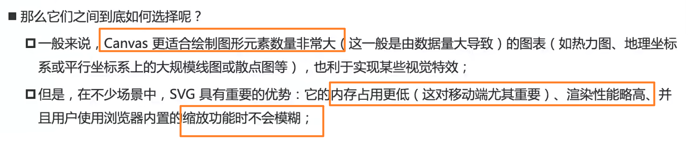

> 'canvas' 和 'svg' 是两种不同的渲染技术，用于在浏览器中绘制图形和图表。ECharts 提供了对这两种渲染技术的支持，你可以根据具体需求选择适合的渲染方式。
>
> 以下是 'canvas' 和 'svg' 的比较：
>
> **Canvas 渲染：**
>
> - **绘图方式：** Canvas 使用 JavaScript 来绘制图形，可以通过绘制像素点来创建图形。整个图形被绘制在一个画布上，你可以控制每个像素的颜色和位置。
>
> - **性能：** 'canvas' 渲染器通常在大规模图表绘制时具有较好的性能，因为它在底层操作像素。适用于需要高性能绘制的场景。
>
> - **动画：** 在 'canvas' 渲染模式下，ECharts 会生成一系列图像帧，通过更新像素来实现动画效果。因此，'canvas' 渲染对于图表动画的支持较好。
>
> - **分辨率：** 'canvas' 绘制的图形在不同分辨率下可能会出现失真。需要自行处理高分辨率屏幕适配。
>
> **SVG 渲染：**
>
> - **绘图方式：** SVG 使用 XML 格式来描述图形，它是一种矢量图形格式。图形被定义为具有几何属性和样式的对象，可以在不同分辨率下无损缩放。
>
> - **性能：** 'svg' 渲染器在处理大量图形时性能可能会受到影响，因为它要解析 XML 并渲染矢量对象。
>
> - **动画：** SVG 渲染支持一些基本的动画效果，但相对于 'canvas' 渲染，动画效果可能不如 'canvas' 流畅。
>
> - **分辨率：** 'svg' 绘制的图形可以在不同分辨率下保持清晰，适合高分辨率屏幕。
>
> 选择 'canvas' 还是 'svg' 取决于你的需求和场景。如果需要绘制大规模的图表，特别是涉及大量数据和动画效果时，'canvas' 渲染可能更适合。如果需要保持图表在不同分辨率下的清晰度，或者需要支持复杂的矢量图形，'svg' 渲染可能更适合。通常情况下，ECharts 默认会根据浏览器性能和图表复杂度自动选择合适的渲染方式。


#### 3.1 两者优缺点对比

> 当比较 'canvas' 和 'svg' 渲染时，它们各自有一些优点和缺点，适用于不同的使用场景：
>
> **Canvas 渲染的优点：**
>
> 1. **性能优势：** Canvas 渲染在大规模图表绘制时通常具有较好的性能。因为它在底层操作像素，可以更高效地绘制大量的图形和数据点。
>
> 2. **动画效果：** Canvas 渲染对于图表动画的支持较好。由于它可以在像素级别进行更新，所以可以实现更流畅的动画效果。
>
> 3. **适用于实时数据：** 如果你的图表需要实时更新，比如实时监控图表，Canvas 渲染可能更适合，因为它能够更快地绘制变化的数据。
>
> **Canvas 渲染的缺点：**
>
> 1. **分辨率适应：** Canvas 绘制的图形在不同分辨率下可能会失真，需要额外的适应工作来保持图形的清晰度。
>
> 2. **矢量支持不足：** Canvas 渲染不支持矢量图形，无法保证图形在不同尺寸下保持清晰。
>
> **SVG 渲染的优点：**
>
> 1. **矢量图形：** SVG 渲染可以保证图形在不同分辨率下保持清晰，适合于需要高质量图形展示的场景。
>
> 2. **多样性：** SVG 支持更多的样式和效果，比如渐变、滤镜等，使得图形更具创意性。
>
> 3. **适合静态图表：** 如果你的图表是静态的、包含复杂矢量图形的，SVG 渲染可能更适合。
>
> **SVG 渲染的缺点：**
>
> 1. **性能相对较低：** 在处理大量图形时，SVG 渲染的性能可能较低，因为需要解析 XML 并渲染矢量对象。
>
> 2. **动画效果受限：** SVG 渲染支持一些基本的动画效果，但相对于 Canvas 渲染，动画效果可能不如Canvas流畅。
>
> 综合来说，Canvas 渲染在大规模图表绘制和动画效果上具有优势，适合需要高性能的场景。而 SVG 渲染则适合于静态图表、需要保持高分辨率和矢量图形的场景。在实际使用中，你可以根据图表的复杂度、性能需求和展示效果来选择适合的渲染方式。


#### 3.2  二者性能测试

> 对于数据量较少的适用于Svg, 移动端使用Svg渲染效果佳


#### 3.3	二者选择

总结：对于一般场景， 规模不大的渲染图标时， 优先使用SVG， 因为其渲染性能更高(PC端)， Svg足以支撑显示， 移动端 优先使用SVG， 各方面都领先！

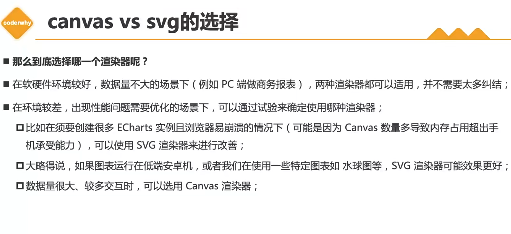

<<<<<<< HEAD
# day33-   14点10分

# 🔺✨ 进度十三（项目完结篇）

**day33-   22点10分**
=======
# day33-   22点10分

# 🔺✨ 进度十三（项目完结篇）


### 🔺✨Tip 高级检索

#### 格式： site: 域名

**案例**

想学下高级检索：

site:v2ex.com/t 毕设项目

site表示域名是吗

> 是的，您理解得正确。在搜索引擎中，`site:` 后面可以跟一个域名，用来指定搜索结果限定在特定的域名下。这样可以帮助您在特定的网站上查找相关信息，而不必搜索整个互联网。

/t是可加的条件，默认不加是

> 对的，您理解得很对。在 V2EX 这种类型的网站上，通常 `/t` 表示主题或话题的路径。您可以通过在 `site:v2ex.com` 后添加 `/t` 路径来限制搜索结果仅在主题路径下进行搜索。如果不添加 `/t`，则搜索引擎会搜索整个网站，包括所有页面和内容。


## （其它）MD5加密 - CountUp库获取函数

### 1. MD5加密 /其它加密

在新建用户中， 老师登录无法使用原因， 未对上传的密码数据进行加密，但是用户登录发送密码时，服务器验证的为加密后的密码

- 服务器保存的用户密码是加密保存（MD5其中一种）
- 登录时验证的也为加密的密码
  - 保证了用户密码的安全性-
  - 保存密码一致性（服务器保存的密码为机密转换后的）
    - 这样的处理逻辑是用户在上传过程中为上传加密的密码，即使中间被人截取了，只要非法分子不知道加密的方式， 就无法对密码进行破解

**总结： 服务器  保存or验证的为加密后的密码**

> 你提到的方式是常见的密码安全策略，这些措施旨在确保用户密码的安全性和隐私保护。让我对你所描述的内容进行解释：
>
> 1. **密码加密保存：** 使用加密算法（如 MD5 或其他更强大的哈希算法）对用户密码进行加密后，将加密后的值存储在服务器上。这样，即使服务器遭受数据泄露，实际密码也不会直接被泄露。
>
> 2. **登录时验证加密密码：** 当用户尝试登录时，输入的密码会经过相同的加密算法进行加密，然后与服务器上存储的加密密码进行比较。如果匹配，就表示密码正确。
>
> 3. **安全性保障：** 这种方法确保了用户密码的安全性。即使黑客获取了数据库中的加密密码，由于正常情况下无法将加密密码还原回原始密码（这就是哈希函数的特性），所以密码泄露的风险相对较低。
>
> 4. **密码一致性：** 由于所有用户的密码都经过相同的加密算法处理，服务器上存储的是加密后的一致性值。这样的设计确保了用户的密码在存储时被统一处理。
>
> 5. **传输过程中的保护：** 你提到即使密码被中间人截取，只要不知道加密方式，就无法破解密码。这是正确的，加密的目的之一是确保即使在传输过程中被拦截，攻击者也无法获得有意义的原始密码。
>
> 需要注意的是，尽管使用哈希函数（如 MD5）是一种好的做法，但现在一些更强大的哈希函数和加密算法（如 SHA-256、bcrypt 或 Argon2）更受推荐，因为它们提供了更高的安全性。
>
> 然而，密码安全不仅仅是加密和哈希，还涉及到许多其他因素，如防止暴力破解、防范社会工程学攻击等。所以在设计密码系统时，综合考虑各种安全因素是很重要的。


### 2. 一般大型企业， 采用多层密码进行加密的

> 是的，大型企业通常会采用多层密码进行加密和安全保护，以提高系统和用户数据的安全性。这种多层密码的方法通常被称为“防御性安全”策略，旨在为系统和数据提供更全面的保护。
>
> 以下是一些大型企业在密码加密方面常见的安全实践：
>
> 1. **多重哈希加密：** 企业可能会使用多重哈希算法，如将用户密码经过多次哈希迭代，以增加密码破解的难度。
>
> 2. **Salt（盐）：** 使用随机的“盐”值来加强哈希过程。盐是一个随机字符串，与用户密码组合后再进行哈希。这样即使两个相同的密码在数据库中存储的哈希值也不同，提高了安全性。
>
> 3. **加密传输：** 在数据传输过程中使用加密来保护数据，确保用户输入的密码在传输中不被拦截和窃取。
>
> 4. **安全认证和授权：** 使用多层身份验证和授权机制来确保只有授权的用户可以访问敏感数据和系统。
>
> 5. **访问控制：** 使用细粒度的访问控制来限制用户对系统和数据的访问权限，避免未经授权的访问。
>
> 6. **安全审计和监控：** 对系统进行持续的安全审计和监控，以及时发现和应对异常活动。
>
> 7. **密码策略：** 强制用户采用强密码，并定期要求更改密码，以减少密码泄露的风险。
>
> 8. **双因素认证：** 引入双因素认证，除了密码外，还需要另一种身份验证方式，如手机验证码或硬件令牌。
>
> 9. **密码管理：** 使用密码管理工具，确保员工使用不同的复杂密码，并定期更改密码。
>
> 总之，大型企业在密码安全方面会采用多种方法和层次的保护措施，以应对不同的威胁和风险。这些措施的目标是确保数据的机密性、完整性和可用性，以及保护用户隐私。

#### 2.1	企业具体采用的加密方式

​	

> - **哈希函数（如 MD5）：** 哈希函数是一种单向的、不可逆的转换，将输入数据映射为固定长度的输出。MD5 是一个广泛使用的哈希函数，但因为它的特性，如碰撞（不同的输入产生相同的输出）和易受暴力破解等问题，不再被推荐用于密码存储。
>
> 
>
> 在登录时上传密码时，一般情况下不会使用非对称加密，而是使用一种更强大的哈希函数，如 **SHA-256、bcrypt 或 Argon2** 等。
>
> 这些哈希函数能够将密码转换为固定长度的哈希值，但由于哈希函数的单向性，无法从哈希值还原出原始密码。当用户登录时，服务器会将输入的密码使用相同的哈希函数进行哈希，然后与存储在数据库中的哈希值进行比较，以进行验证。
>
> 总之，非对称加密和哈希函数在密码保护中扮演不同的角色。哈希函数用于密码存储和验证，而非对称加密用于建立安全通信通道和数字签名等。

#### 2.2  SHA-256、bcrypt 或 Argon2(登录加密方式)

由于用户标识不同（ID或用户名），即使不同用户输入相同密码，加盐后也会生成不同的哈希函数， 且由于哈希函数具有不可推导性，服务器验证就为加密后的密码， 所以即使黑客获得了哈希函数也无法取得密码，破解难度大

> 这种密码存储和验证方式的核心原理是**哈希函数的单向性和不可逆性**。让我进一步解释为什么这种方式能够提供较高的密码安全性，防止黑客破解密码：
>
> 1. **不可逆性：** 哈希函数是单向的，意味着从哈希值无法推导出原始的密码。当用户输入密码进行注册或登录时，服务器将密码经过哈希函数转换成固定长度的哈希值。即使黑客获取到这些哈希值，也不能将其逆向转换为原始密码，因为这个过程是不可逆的。
>
> 2. **碰撞问题：** 好的哈希函数应该具有抗碰撞的特性，即不同的输入不能产生相同的哈希值。这意味着即使两个不同用户设置相同的密码，它们的哈希值也会是不同的。这种特性降低了黑客通过猜测相同哈希值密码的可能性。
>
> 3. **加盐：** 在存储密码的过程中，常常使用“盐”（salt）来增加密码哈希的随机性。盐是一个随机生成的字符串，与密码组合后再进行哈希。这样即使两个相同密码的用户，由于盐值不同，产生的哈希值也会不同。这增加了黑客破解密码的难度。
>
> 4. **计算成本：** 强大的哈希函数（如 bcrypt 或 Argon2）被设计为计算成本较高，意味着计算其哈希值需要较长的时间。这有效地降低了黑客使用暴力破解方法破解密码的效率。
>
> 总之，这种密码存储和验证方式的核心在于将密码转化为不可逆的哈希值，并采取多重技术措施来提高黑客破解密码的难度。这样即使黑客获得了哈希值，也无法轻易将其还原成原始密码。然而，安全性仍然需要综合多种措施来确保。

**加盐应该是使用用户的唯一标识 进行加盐 后与密码结合  进行绑定**

<<<<<<< HEAD
	加盐后可使得密码和哈希不具有 1：1对比性， 彩虹表破解失效
=======
​	加盐后可使得密码和哈希不具有 1：1对比性， 彩虹表破解失效
>>>>>>> 2c71df13d1160bd0a997f47ae53285ae0c5ea158

> 是的，你理解得很正确。在密码存储中，"加盐" 是指将一个随机生成的、唯一的、不可预测的值与用户的密码结合起来，然后再进行哈希。这个随机值被称为 "盐"（salt）。盐的作用是增加密码哈希的随机性和不可预测性，从而提高密码存储的安全性。
>
> 加盐通常会使用一个与用户相关的唯一标识，如用户的用户名、用户 ID 或电子邮件地址。这样确保了每个用户都有不同的盐值，即使两个用户设置了相同的密码，由于盐值不同，产生的哈希值也会不同。
>
> 这种做法的好处包括：
>
> 1. **防止彩虹表攻击：** 彩虹表是一种预先计算出的密码和哈希值对照表，用于加快破解过程。使用盐值后，即使密码相同，由于盐的存在，哈希值也会不同，使彩虹表攻击变得无效。
>
> 2. **增加哈希值随机性：** 盐值是随机的，使得黑客无法预测不同用户的盐值，从而无法通过事先准备好的攻击方法来破解哈希。
>
> 3. **保护常用密码：** 使用盐值使得即使用户使用常见密码，由于盐的存在，产生的哈希值也会与预先计算的不同。
>
> 综上所述，加盐是密码存储中的重要策略之一，能够有效提高密码的安全性，防止常见攻击方法。然而，盐值的生成和管理需要小心处理，以确保安全性。


### 3. CounterUp库的使用

创作表头数据


> `countUp` 是一个 JavaScript 库，用于创建数字增加的动画效果，通常用于展示数字的动态变化，比如金额、计数等。它可以在网页中产生平滑的数字过渡效果，增加用户体验。
>
> 这个库允许你将起始数字和目标数字作为参数，然后创建一个动画，使数字从起始值逐渐增加到目标值。你可以在特定的 HTML 元素中显示这个动画，比如一个 `<span>` 元素。
>
> 在使用 `countUp` 库之前，你需要引入它的 JavaScript 文件，通常是通过在 HTML 页面的 `<head>` 或底部引入相关的 `<script>` 标签来实现。然后，你可以在自己的 JavaScript 代码中使用 `countUp` 函数来创建数字增加的动画效果。
>
> 以下是一个简单的示例，展示如何使用 `countUp` 库：
>
> ```html
> <!DOCTYPE html>
> <html lang="en">
> <head>
<<<<<<< HEAD
> <meta charset="UTF-8">
> <meta name="viewport" content="width=device-width, initial-scale=1.0">
> <title>countUp Example</title>
> <script src="path-to-countup.js"></script> <!-- 引入 countUp.js 文件 -->
> </head>
> <body>
> <span id="count"></span> <!-- 用于显示数字动画的元素 -->
> <script>
> const countElement = document.getElementById('count');
> const startValue = 0;
> const endValue = 1000;
> const options = {
> duration: 2, // 动画持续时间（秒）
> };
> 
> const countUpInstance = new CountUp(countElement, startValue, endValue, options);
> 
> if (!countUpInstance.error) {
> countUpInstance.start(); // 开始动画
> } else {
> console.error(countUpInstance.error);
> }
> </script>
=======
>   <meta charset="UTF-8">
>   <meta name="viewport" content="width=device-width, initial-scale=1.0">
>   <title>countUp Example</title>
>   <script src="path-to-countup.js"></script> <!-- 引入 countUp.js 文件 -->
> </head>
> <body>
>   <span id="count"></span> <!-- 用于显示数字动画的元素 -->
>   <script>
>     const countElement = document.getElementById('count');
>     const startValue = 0;
>     const endValue = 1000;
>     const options = {
>       duration: 2, // 动画持续时间（秒）
>     };
> 
>     const countUpInstance = new CountUp(countElement, startValue, endValue, options);
> 
>     if (!countUpInstance.error) {
>       countUpInstance.start(); // 开始动画
>     } else {
>       console.error(countUpInstance.error);
>     }
>   </script>
>>>>>>> 2c71df13d1160bd0a997f47ae53285ae0c5ea158
> </body>
> </html>
> ```
>
> 在这个示例中，`path-to-countup.js` 是 `countUp` 库的 JavaScript 文件路径，你需要替换成实际路径。通过创建 `CountUp` 实例并调用 `.start()` 方法，你可以触发数字增加的动画效果。
>
> 记得要查阅 `countUp` 的文档以获取更多详细信息和选项。


## （一）dashBoard的数据请求保存

需求：需要对信息中心（仪盘表【多种展示方法】）的四个数据发起请求并保存至vueX,此为Echarts数据来源

**五图- 四数据**  

分类商品数量（饼图、玫瑰图） 、销量（曲线图） 、 收藏量（柱状图）

不同城市商品销量（中国地图）

思路：

1. 需要先定义四种数据的请求（service —  dashBoard模块）
2. VueX - dashBoard模块发送四种数据请求并保存至dashBoard的state中，action触发mutatoin并保存
3. dashoBoard组件 使用useStore，disPatch发送请求， 获得四种数据


### 1. Service - Analysis- dashboard定义四种数据请方法

```ts
import hyquest from '@/service/index'

enum DashboardAPI {
  categoryGoodsCount = '/goods/category/count',
  categoryGoodsSale = '/goods/category/sale',
  categoryGoodsFavor = '/goods/category/favor',
  addressGoodsSale = '/goods/address/sale'
}

export function getCategoryGoodsCount() {
  return hyquest.get({
    url: DashboardAPI.categoryGoodsCount
  })
}
export function getCategoryGoodsSale() {
  return hyquest.get({
    url: DashboardAPI.categoryGoodsSale
  })
}
export function getCategoryGoodsFavor() {
  return hyquest.get({
    url: DashboardAPI.categoryGoodsFavor
  })
}
export function getAddressGoodsSale() {
  return hyquest.get({
    url: DashboardAPI.addressGoodsSale
  })
}

```


### 2. vueX中dashboard模块定义Action发送四种请求并保存数据

```ts
 state() {
    return {
      categoryGoodsCount: [],
      categoryGoodsSale: [],
      categoryGoodsFavor: [],
      addressGoodsSale: []
    }
  },
  mutations: {
    changeCategoryGoodsCount(state, list) {
      state.categoryGoodsCount = list
    },
    changeCategoryGoodsSale(state, list) {
      state.categoryGoodsSale = list
    },
    changeCategoryGoodsFavor(state, list) {
      state.categoryGoodsFavor = list
    },
    changeAddressGoodsSale(state, list) {
      state.addressGoodsSale = list
    }
  },
  actions: {
    async getDashboardDataAction({ commit }) {
      const categoryCountResult = await getCategoryGoodsCount()
      console.log(categoryCountResult)

      commit('changeCategoryGoodsCount', categoryCountResult.data)
      const categorySaleResult = await getCategoryGoodsSale()
      commit('changeCategoryGoodsSale', categorySaleResult.data)
      const categoryFavorResult = await getCategoryGoodsFavor()
      commit('changeCategoryGoodsFavor', categoryFavorResult.data)
      const addressGoodsResult = await getAddressGoodsSale()
      commit('changeAddressGoodsSale', addressGoodsResult.data)
    }
```


### 3. dashBoard 组件中触发 VueX/dashboard模块的Action

触发后， 发送四种请求， 并保存数据至VueX中

```ts
     const store = useStore()
      store.dispatch('dashboard/getDashboardDataAction')
    })
```


## （二）dashboard界面布局设置 上三 下二 ，并设置title

需求： 需要界面显示上三下二（ 五图表分布） 并且每个图表内部需要使用上下分布的样式

思路： 

<<<<<<< HEAD
	**上三下二：**

1.  页面上部分： el-col 行组件包裹， 内部3 el-row组件， 分别对应 ：span 7   10   7  左中右比例分布
2.  页面下部分：  同理： span: 12 12 （24）各占一半

	内部上下结构： 使用el -card 组件，封装hy-card组件引入至 dashboard
=======
​	**上三下二：**

1.  页面上部分： el-col 行组件包裹， 内部3 el-row组件， 分别对应 ：span 7   10   7  左中右比例分布
2. 页面下部分：  同理： span: 12 12 （24）各占一半

​	内部上下结构： 使用el -card 组件，封装hy-card组件引入至 dashboard
>>>>>>> 2c71df13d1160bd0a997f47ae53285ae0c5ea158


### 1. 引入el-card 卡片组件（内容分层）

分为title - 图表

将图表分为显示， title可插入标题

<<<<<<< HEAD
	内容设置插槽 供图表插入
=======
​	内容设置插槽 供图表插入
>>>>>>> 2c71df13d1160bd0a997f47ae53285ae0c5ea158

样式解析：  

 &:deep(.el-card__header) {
    padding: 10px 20px !important;
  }

表示深层穿透器， 选择组件内部的头部， 并将样式重新调整， 这里主要调整为上下10px，左右20px, 不设置时， 该header高度过高，样式不好看


```ts
  <el-card class="box-card">
    <template #header>
      <div class="card-header">
        <span>{{ title }}</span>
      </div>
    </template>
    <div class="item">
      <slot></slot>
    </div>

.box-card {
  &:deep(.el-card__header) {
    padding: 10px 20px !important;
  }
}

.card-header {
  display: flex;
  justify-content: space-between;
  align-items: center;
  height: 30px;
}

.item {
  margin-bottom: 10px;
  // border: 1px solid red;
}
```


### 2. 使用el-row 行组件 和 单元格 el-col组件 构成 上三下二

gutter属性传入表示单元格间距x元素， span表示划分，行内按照 x/24 划分区域

```ts
 <el-row :gutter="10">
      <el-col :span="7">
        <hy-card title="分类商品数量(饼图)"></hy-card>
      </el-col>
      <el-col :span="10">
        <hy-card title="不同城市商品销量"></hy-card>
      </el-col>
      <el-col :span="7">
        <hy-card title="分类商品数量(玫瑰图图)"></hy-card>
      </el-col>
    </el-row>
    <el-row :gutter="10" class="content-row">
      <el-col :span="12">
        <hy-card title="分类商品销量(饼图)"></hy-card>
      </el-col>
      <el-col :span="12">
        <hy-card title="分类商品的收藏量"></hy-card>
      </el-col>
    </el-row>
```


## （三）对图表进行抽取为base-ui组件， 通过传入配置，生成图表-    setup内置script的使用

需求： 在图表需要进行抽取， 并且由父组件传入配置，设置图标的样式， 结合vue3 setup内置脚本的使用， props的接受 属性声明和默认参数（setUp内置写法）

后面可对使用配置这些操作在进行一层抽取

思路： 

1. 抽取为base-ui图表组件， 父组件引用该组件并传入配置即可使用
2. setup 内置脚本， 使用defineProps定义接收的参数类型（不加？默认必传）， witheDefaults接收的第一个参数为defineProps函数， 第二个为参数赋值 默认值

后面可对父组件传入的配置再次抽取 ， 只需传入动态的数据即可


### 1. 初次抽取为组件base-echart - 并使用setup内置script

props的接收改变， 现在脚本本身就为seup函数， 不需要return

Props接收： 

- defineProps 为定义接收父组件的数据
- withDefaults 包含两个参数， 第一个参数defineProps，格式d..s<对象，接收的数据类型> （）， 第二个参数： 对参数进行默认赋值 

💓🐟： 图表需要为其设置style, 设置其宽度高度 ， 否则图表不显示， 并且需动态传入， 静态传入时，传入的变量值只会被**解析为字符串**


三部曲： echarts.init(echartDivRef.value!) 初始化，编写配置，再进行配置加载**（onMounted）**须在组件挂载完才能对其绑定

```ts
<template>
  <div
    class="base-echart"
    ref="echartDivRef"
    :style="{ width: width, height: height }"
  ></div>
</template>

<script lang="ts" setup>
import { ref, onMounted, defineProps, withDefaults } from 'vue'
import { EChartsOption } from 'echarts'
import * as echarts from 'echarts'

// 定义props
const props = withDefaults(
  defineProps<{
    options: EChartsOption
    width?: string
    height?: string
  }>(),
  {
    width: '100%',
    height: '360px '
  }
)
const echartDivRef = ref<HTMLElement>()
onMounted(() => {
  const echartInstance = echarts.init(echartDivRef.value!)
  echartInstance.setOption(props.options)
  console.log(props.options)
})
```


### 2.  dashboard 传入配置


```ts
  setup() {
    const store = useStore()
    store.dispatch('dashboard/getDashboardDataAction')

    const option = {
      title: {
        text: 'ECharts 入门示例',
        subtext: '哈哈哈啊'
      },
      tooltip: {
        trigger: 'axis',
        axisPointer: {
          type: 'cross'
        }
      },
      legend: {
        data: ['销量']
      },
      xAxis: {
        data: ['衬衫', '羊毛衫', '雪纺衫', '裤子', '高跟鞋', '袜子']
      },
      yAxis: {},
      series: [
        {
          name: '销量',
          type: 'bar',
          data: [18, 20, 36, 10, 10, 20]
        }
      ]
    }

    return {
      option
    }
```


## 🔺✨ SSR（后端开发技术）提升用户体验-返回骨架Html页面

SSR 是通过在服务器端预先渲染页面内容， 可以理解为请求的数据由原先的需要转化为html页面并再进行加载， 现在直接返回一个加载好的骨架页面


> 您理解得很正确！服务器端渲染（SSR）的基本概念就是在服务器端预先渲染页面内容，并将渲染好的 HTML 页面直接返回给客户端，而不仅仅是返回数据。这样，客户端浏览器在接收到 HTML 页面时，就能够立即显示出页面的内容，而无需等待浏览器下载和执行 JavaScript，以及发起其他数据请求。
>
> 具体来说，SSR 的过程可以总结为以下几个步骤：
>
> 1. **请求：** 用户访问网页时，浏览器向服务器发出请求。
> 2. **服务器端渲染：** 服务器接收到请求后，会预先渲染页面的 HTML 内容，并将数据嵌入到 HTML 中。
> 3. **返回 HTML：** 渲染好的 HTML 页面直接发送给客户端浏览器。
> 4. **显示页面：** 浏览器接收到 HTML 后，可以立即显示页面内容，无需等待其他资源加载。
>
> 这种方式确实能够提供更快的首屏加载速度，因为用户能够立即看到页面的核心内容，而不需要等待其他资源加载和 JavaScript 执行。同时，SSR 也有助于改善搜索引擎优化（SEO），因为搜索引擎能够更容易地抓取和索引服务器端渲染的页面内容。
>
> 需要注意的是，虽然 SSR 能够提供更好的首屏加载性能和 SEO，但在一些情况下也会带来一些额外的开发和配置复杂性。开发人员需要确保在服务器端正确处理数据获取、页面渲染和路由等方面，以实现良好的 SSR 效果。


 应该会使得服务器消耗性能吧， 还是说这样会使请求的数据增多， 但是体验感提升

> 您提到的两个方面都是考虑服务器端渲染（SSR）时需要权衡的因素：
>
> 1. **服务器性能：** 确实，在进行 SSR 时，服务器会更多地参与页面的渲染和数据处理，这可能会增加服务器的负载和消耗性能。与传统的客户端渲染（CSR）相比，SSR 要求服务器在每次请求时都进行页面渲染，而不仅仅是返回静态资源。因此，您可能需要为服务器提供足够的计算资源，以确保它能够有效地处理大量的页面渲染请求。
>
> 2. **数据请求增多：** 另一方面，由于页面在服务器端渲染时需要获取数据并嵌入到 HTML 中，可能会导致页面请求的数据量增加。每次请求需要获取页面内容和数据，这可能会导致一些额外的网络流量。但是，通过在服务器端渲染时将页面的核心内容直接嵌入到 HTML 中，用户在访问页面时能够更快地看到内容，从而提升了用户体验。
>
> 在决定是否使用 SSR 时，您需要根据项目的需求和优先级进行权衡。如果您的应用需要更快的首屏加载速度、更好的 SEO 和更好的用户体验，那么使用 SSR 是一个不错的选择。然而，您也需要确保您的服务器具备足够的性能来处理 SSR 请求，并且在开发过程中需要关注页面渲染的性能优化，以确保服务器能够高效地处理大量的页面渲染请求。


## (四) 将base-echart公共逻辑封装为hook

需求： 当使用新的图表库时不需在base-echart修改，并且需要使这部分代码具有可共享性，相同的逻辑处理（初始化， 使用配置, setSize）可在别处使用

**思路：**

1. 将base-echart图表的初始化和使用配置等逻辑代码抽取为hook
2. 在hook进行相关的逻辑处理， 并对页面缩小，页面自动调整做优化，setSize
3. hook中暂时实现功能
   1. 初始化图表实例
   2. 返回配置使用函数（参数接收： 配置）
   3. 监听页面变化重新设置size， 并将该函数返回至调用该hook组件， 可进行其他逻辑处理 ，
<<<<<<< HEAD
   4. 后续有其他共同的逻辑代码 或是需要修改某功能，直接在此hook修改
=======
   4.  后续有其他共同的逻辑代码 或是需要修改某功能，直接在此hook修改
>>>>>>> 2c71df13d1160bd0a997f47ae53285ae0c5ea158

### 1. 将e-chart公共逻辑抽取为hook, 并使用resize函数动态调整

抽取的函数为

  const echartInstance = echarts.init(echartDivRef.value!)
  echartInstance.setOption(props.options)

为什么不使用元组return？

<<<<<<< HEAD
1. 	因为 这样可以按需使用{进行解构}， 元组需要全部解构
2. 	echart的当前使用并不需使用全部
=======
1. ​	因为 这样可以按需使用{进行解构}， 元组需要全部解构
2. ​	echart的当前使用并不需使用全部
>>>>>>> 2c71df13d1160bd0a997f47ae53285ae0c5ea158

经过外部调用该hook后， dom绑定元素成功实例化， 并可以使用内部函数，setOption和updataSize， 外部直接调用传入配置直接调用setOption, 更简洁， 且还添加了 resize功能函数， 自动调整表格函数

```ts
import * as echarts from 'echarts'

export default function (el: HTMLElement) {
  console.log('11')

  const echartInstance = echarts.init(el)

  const setOptions = (options: echarts.EChartsOption) => {
    echartInstance.setOption(options)
  }

  // 返回更新图表
  const updateSize = () => {
    echartInstance.resize()
  }

  // 对浏览器进行监听， 变化是自动调整图表
  window.addEventListener('resize', () => {
    echartInstance.resize()
  })

  return {
    echartInstance,
    setOptions,
    updateSize
  }
}
```


### 2. base-echat 调用 公共hook函数 useEchart

```ts
const echartDivRef = ref<HTMLElement>()
onMounted(() => {
  const { setOptions } = useEchart(echartDivRef.value!)
  setOptions(props.options)
})
</script>
```


## （五） 将配置信息抽取为对应不同类型图表组件，父组件只需要传入具体展示的数据

**需求如图：** 

需要进行解耦， 父组件只需要传入动态数据， 相应的使用模型（图表类型）展示数据封装为 xx组件（如pip chart）， 使得界面更简洁， 不同组件对应不同信息， 我在父组件只需要传入显示的数据即可（具体展示类型 由使用模型决定），模型动态接收数据

**思路**：

1.  将配置信息抽取放置对应模型（具体图表类型）组件
<<<<<<< HEAD
2.  模型只需接收来自父组件的动态数据
3.  模型需要进行监听，当数据配置发生改变时， 重新传递配置信息至base-echart，此部分需用到computed包裹， 将设置属性函数包裹为响应式属性
4.  base-echart 需要使用 watchEffect侦听 配置信息 ， 当配置信息更改时， 重新渲染图表
=======
2. 模型只需接收来自父组件的动态数据
3. 模型需要进行监听，当数据配置发生改变时， 重新传递配置信息至base-echart，此部分需用到computed包裹， 将设置属性函数包裹为响应式属性
4. base-echart 需要使用 watchEffect侦听 配置信息 ， 当配置信息更改时， 重新渲染图表
>>>>>>> 2c71df13d1160bd0a997f47ae53285ae0c5ea158


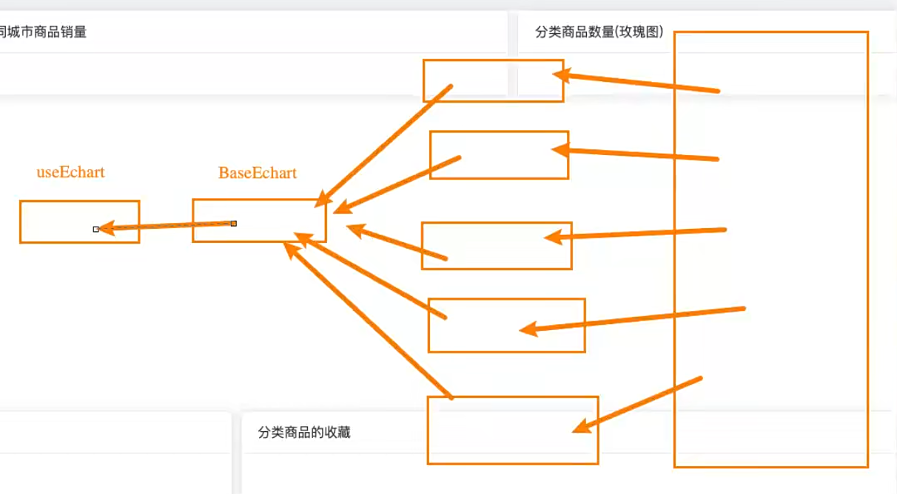


### 1. 封装pipEchart模型， 并动态接收来自父组件的数据

在该饼模型中， 动态接收来自父组件传递的数据， 使用computed包裹，并将配置信息传入base-echart组件中

 pieData: IDataType[]， 此行表示接受的数据为 {name: string, value:any} 对象  数组

<<<<<<< HEAD
	父组件传入时， 需将组件数据 使用map映射为 属性名相同的 对象 数组  并传入
=======
​	父组件传入时， 需将组件数据 使用map映射为 属性名相同的 对象 数组  并传入
>>>>>>> 2c71df13d1160bd0a997f47ae53285ae0c5ea158

```ts
import { IDataType } from '../types'

const props = defineProps<{ pieData: IDataType[] }>()

const options = computed(() => {
  return {
    tooltip: {
      trigger: 'item'
    },
    legend: {
      orient: 'horizontal',
      left: 'left'
    },
    series: [
      {
        name: '分类数据',
        type: 'pie',
        radius: '50%',
        // 动态接收父组件传递的数据
        data: props.pieData,
        emphasis: {
          itemStyle: {
            shadowBlur: 10,
            shadowOffsetX: 0,
            shadowColor: 'rgba(0, 0, 0, 0.5)'
          }
        }
      }
    ]
  }
})
```

**样式解析：**

> 1. **tooltip：** 这是提示框组件的配置，`trigger: 'item'` 表示触发方式是在图形项上触发。
>
> 2. **legend：** 这是图例组件的配置，`orient: 'horizontal'` 表示图例水平排列，`left: 'left'` 表示图例位于图表的左侧。
>
> 3. **series：** 这是系列数据配置的数组，其中包含一个对象，定义了一个饼图的系列。具体解析如下：
>
>    - **name：** 系列的名称，这里设置为 '分类数据'。
>
>    - **type：** 系列的类型，这里设置为 'pie'，表示是一个饼图。
>
>    - **radius：** 饼图的半径，这里设置为 '50%'，表示半径为图表宽度的一半。
>
>    - **data：** 饼图的数据，这里使用了 `props.pieData`，表示从外部传入的饼图数据。
>
>    - emphasis：
>
<<<<<<< HEAD
>      强调样式配置，这里设置了阴影效果。
>
>      - itemStyle：
>
>        图形项的样式配置。
=======
>       强调样式配置，这里设置了阴影效果。
>
>      - itemStyle：
>
>         图形项的样式配置。
>>>>>>> 2c71df13d1160bd0a997f47ae53285ae0c5ea158
>
>        - **shadowBlur：** 阴影的模糊大小。
>        - **shadowOffsetX：** 阴影的 X 方向偏移。
>        - **shadowColor：** 阴影的颜色。


### 2. 父组件动态获取数据，并传入pip-echart中

因为pip组件接受的数据类型为 {name: string , value: any}， 但是 父组件所获取的信息为{name: string,  goodsCount: string}数组， 所以需要使用map将属性名转化为一致， 再传入

```ts
<pie-echart :pieData="categoryGoodsCount"></pie-echart>

 // 请求数据
    store.dispatch('dashboard/getDashboardDataAction')

    // 获取商品数量数据
    const categoryGoodsCount = computed(() => {
      return store.state.dashboard.categoryGoodsCount.map((item: any) => {
        return { name: item.name, value: item.goodsCount }
      })
    })
```


### 3. 💓🐟base-echart 使用watchEffect进行侦听数据并实时更新数据

💓🐟 确认下为什么切换为computed无法执行， 使用watchEffect会默认执行一次， 后面数据发生变化时， 会自动调用渲染函数

```ts
const echartDivRef = ref<HTMLElement>()
onMounted(() => {
  const { setOptions } = useEchart(echartDivRef.value!)
  watchEffect(() => {
    setOptions(props.options)
  })
})
```


## （六） 玫瑰图-  曲线图的配置

玫瑰图大致思路同饼图一致， 曲线图需要传入的数据不是成对的， 需要分开传两个数组， 一个为Xlabel数组（x轴显示的内容）， Ylabel（Y轴显示的内容）

曲线图主要思路：

1. 在父组件中， 获取数据， 在map前定义两个数组， 在map内部直接push将对应的属性push进去
2. 将两个数组合并为一个对象返回， 使用v-bind进行绑定传入给line-echart组件，会自动解构赋值

### 1. 玫瑰配置文件基本一致 （需要查下样式）

很晚了， 先略过 ， 看到记得重新查下样式

```ts
 return {
    // legend: {
    //   top: 'bottom'
    // },
    toolbox: {
      show: true,
      feature: {
        mark: { show: true },
        dataView: { show: true, readOnly: false },
        restore: { show: true },
        saveAsImage: { show: true }
      }
    },
    series: [
      {
        name: '类别数据',
        type: 'pie',
        // 半径设置
        radius: [10, 100],
        center: ['50%', '50%'],
        roseType: 'area',
        itemStyle: {
          borderRadius: 8
        },
        data: props.roseData
      }
    ]
  }
```


### 2.	曲线图的模型创建

思路：大致思路一致， 主要为传入的参数需为两个数组，原先只需要传入一个数组对象（对象具有两个属性- 为两个数组 ）

1. 定义两个数组对象，对数据进行获取
2. 遍历商品销量数组， 对其属性进行分割， 分别push至两个数组
3. 返回一个数组对象， 使用v-bind绑定传入line-echart 会自动解构传入数组
4. 曲线图内部需要对 接收props声明属性 

样式需要再过一遍💓🐟


#### 2.1 分类销量 -  数据获取  v-bind 解构传入

```ts
<hy-card title="分类商品销量(曲线图)">
    <line-echart v-bind="categoryGoodsSale"></line-echart>
</hy-card>


    // 获取分类商品销量
    const categoryGoodsSale = computed(() => {
      const xLabels: string[] = []
      const values: any[] = []
      const categoryGoodSale = store.state.dashboard.categoryGoodsSale
      for (const item of categoryGoodSale) {
        xLabels.push(item.name)
        values.push(item.goodsCount)
      }
      return { xLabels, values }
    })
```


#### 2.2  LineEchart接收配置， 声明数据并将配置传入-BaseEchart

```ts
<template>
  <div class="pie-echart">
    <base-echart :options="options"></base-echart>
  </div>
</template>

<script lang="ts" setup>
import { computed, defineProps, withDefaults } from 'vue'
import BaseEchart from '@/base-ui/echart'

const props = withDefaults(
  // 需要对象 包裹
  defineProps<{
    title?: string
    xLabels: string[]
    values: any[]
  }>(),
  {
    title: ''
  }
)
const options = computed(() => {
  return {
    title: {
      text: props.title
    },
    tooltip: {
      trigger: 'axis',
      axisPointer: {
        type: 'cross',
        label: {
          backgroundColor: '#6a7985'
        }
      }
    },
    legend: {},
    toolbox: {
      feature: {
        saveAsImage: {}
      }
    },
    grid: {
      left: '3%',
      right: '4%',
      bottom: '3%',
      containLabel: true
    },
    xAxis: [
      {
        type: 'category',
        boundaryGap: false,
        data: props.xLabels
      }
    ],
    yAxis: [
      {
        type: 'value'
      }
    ],
    series: [
      {
        name: '分别销量',
        type: 'line',
        stack: '总量',
        areaStyle: {},
        emphasis: {
          focus: 'series'
        },
        data: props.values
      }
    ]
  }
})
</script>
<style scoped lang="less"></style>

```


## (七) 条形图模型 配置

此部分 类同（玫瑰图 ）

**样式解析**

> ```ts
> const options = computed(() => {
<<<<<<< HEAD
> return {
> xAxis: {
> data: props.xLabels,   // x 轴的标签数据
> axisLabel: {
>   inside: true,         // x 轴标签文本显示在轴内部
>   color: '#fff'         // x 轴标签文本颜色
> },
> axisTick: {
>   show: false          // 不显示 x 轴刻度线
> },
> axisLine: {
>   show: false          // 不显示 x 轴线
> },
> z: 10                  // x 轴所在层级
> },
> yAxis: {
> axisLine: {
>   show: false          // 不显示 y 轴线
> },
> axisTick: {
>   show: false          // 不显示 y 轴刻度线
> },
> axisLabel: {
>   color: '#999'        // y 轴标签文本颜色
> }
> },
> dataZoom: [
> {
>   type: 'inside'       // 数据缩放类型为内部
> }
> ],
> series: [
> {
>   type: 'bar',          // 数据系列类型为条状图
>   showBackground: true, // 显示背景
>   itemStyle: {
>     color: new echarts.graphic.LinearGradient(0, 0, 0, 1, [
>       { offset: 0, color: '#83bff6' },
>       { offset: 0.5, color: '#188df0' },
>       { offset: 1, color: '#188df0' }
>     ])                  // 条状图每个柱子的渐变颜色样式
>   },
>   emphasis: {
>     itemStyle: {
>       color: new echarts.graphic.LinearGradient(0, 0, 0, 1, [
>         { offset: 0, color: '#2378f7' },
>         { offset: 0.7, color: '#2378f7' },
>         { offset: 1, color: '#83bff6' }
>       ])                 // 鼠标悬停时的强调颜色样式
>     }
>   },
>   data: props.values    // 数据系列的具体数据，从 props 中传入
> }
> ]
> }
=======
>   return {
>     xAxis: {
>       data: props.xLabels,   // x 轴的标签数据
>       axisLabel: {
>         inside: true,         // x 轴标签文本显示在轴内部
>         color: '#fff'         // x 轴标签文本颜色
>       },
>       axisTick: {
>         show: false          // 不显示 x 轴刻度线
>       },
>       axisLine: {
>         show: false          // 不显示 x 轴线
>       },
>       z: 10                  // x 轴所在层级
>     },
>     yAxis: {
>       axisLine: {
>         show: false          // 不显示 y 轴线
>       },
>       axisTick: {
>         show: false          // 不显示 y 轴刻度线
>       },
>       axisLabel: {
>         color: '#999'        // y 轴标签文本颜色
>       }
>     },
>     dataZoom: [
>       {
>         type: 'inside'       // 数据缩放类型为内部
>       }
>     ],
>     series: [
>       {
>         type: 'bar',          // 数据系列类型为条状图
>         showBackground: true, // 显示背景
>         itemStyle: {
>           color: new echarts.graphic.LinearGradient(0, 0, 0, 1, [
>             { offset: 0, color: '#83bff6' },
>             { offset: 0.5, color: '#188df0' },
>             { offset: 1, color: '#188df0' }
>           ])                  // 条状图每个柱子的渐变颜色样式
>         },
>         emphasis: {
>           itemStyle: {
>             color: new echarts.graphic.LinearGradient(0, 0, 0, 1, [
>               { offset: 0, color: '#2378f7' },
>               { offset: 0.7, color: '#2378f7' },
>               { offset: 1, color: '#83bff6' }
>             ])                 // 鼠标悬停时的强调颜色样式
>           }
>         },
>         data: props.values    // 数据系列的具体数据，从 props 中传入
>       }
>     ]
>   }
>>>>>>> 2c71df13d1160bd0a997f47ae53285ae0c5ea158
> })
> 
> ```
>
> 


## （八）中国地图绘制

**主要思路：**

1.  需要绘制中国地图（全局注册）（json文件），全局注册地图，在use-echartHook中进行注册，由echarts.registerMap('china', chinaMapData)
2.  获取所有中国城市经纬度  Ts文件 
3.  定义城市名映射经纬度函数，匹配城市经纬度文件， 将value值前拼接经纬度， 确保城市能显示在正确位置
4.  最终显示在地图的数据实际为： name,  geoCoord(经纬度)拼接value值（第二个值会在正确的位置显示）
5.  父组件中 传入的为对象， 需要将对象属性重命名后 使用map 遍历返回


### 1.  引入中国data文件， 并在hook注册该地图


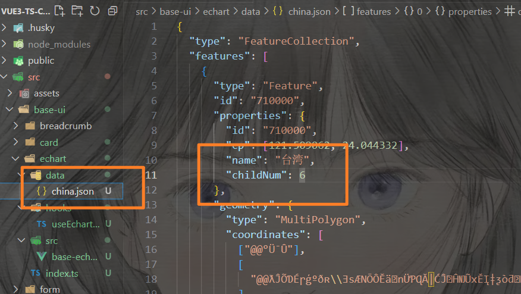


JSon文件需要在decalare文件中声明才能正确使用✔

```ts
// 需要使用decalre 声明该json文件
import chinaMapData from '../data/china.json'

// 为图表全局注册地图
echarts.registerMap('china', chinaMapData)

```


### 2.  定义函数根据字典文件，去对value值进行拼接经纬度

在page-echart下，

 创建文件夹-（utitles） 

- coordinate为经纬度城市字典
<<<<<<< HEAD
- covert- coordinate-data ，value转换为 经纬度- value， 匹配地图正确显示
=======
-  covert- coordinate-data ，value转换为 经纬度- value， 匹配地图正确显示
>>>>>>> 2c71df13d1160bd0a997f47ae53285ae0c5ea158

字典 - 部分显示

```ts
export const coordinateData: any = {
  海门: [121.15, 31.89],
  鄂尔多斯: [109.781327, 39.608266],
  招远: [120.38, 37.35],
  舟山: [122.207216, 29.985295],
  齐齐哈尔: [123.97, 47.33],
  盐城: [120.13, 33.38],
  赤峰: [118.87, 42.28],
  青岛: [120.33, 36.07],
  乳山: [121.52, 36.89],...}
```


**函数 - value拼接**

res为对象数组，  每个对象为 城市名  经纬度value值 

```ts
import { coordinateData } from './coordinate-data'

export const convertData = function (data: any) {
  const res = []
  for (let i = 0; i < data.length; i++) {
    // 在这里相当于对传入的城市名进行转换，获取经纬度
    // 最后将数据切换为 经纬度 拼接 value

    // 最终具体城市所处位置能在地图的具体位置显示
    const geoCoord = coordinateData[data[i].name]
    if (geoCoord) {
      res.push({
        name: data[i].name,
        value: geoCoord.concat(data[i].value)
      })
    }
  }
  return res
}

```


### 3. 父组件动态传入-对象（城市销量数组）

 传入的属性要转化为 IDtype形式， 属性名需要对应

```ts
<el-col :span="10">
<hy-card title="不同城市商品销量">
<map-echart :mapData="addressGoodsSale"></map-echart>
</hy-card>
</el-col>
      
      
    // 获取全部商品销量
    const addressGoodsSale = computed(() => {
    return store.state.dashboard.addressGoodsSale.map((item: any) => {
    return { name: item.address, value: item.count }
    })
    })
```

<<<<<<< HEAD


# 🔺✨进度Eventually- 项目打包与部署

**day34 -  10点**

## (接口文档)

[接口文档](https://documenter.getpostman.com/view/12387168/TzzDKb12)

## （一）传统的开发模式和DevOps开发模式

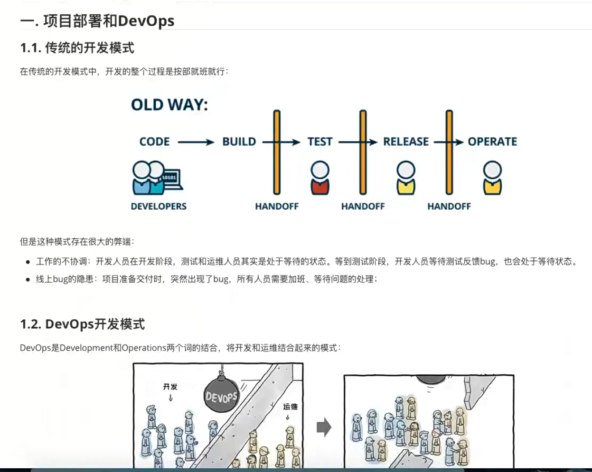


## （二）持续集成和持续交互

### 2.1	持续交付

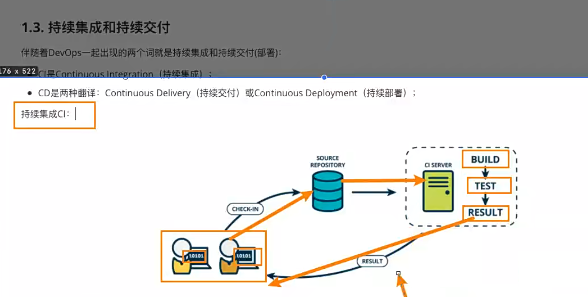


### 2.1 	持续部署


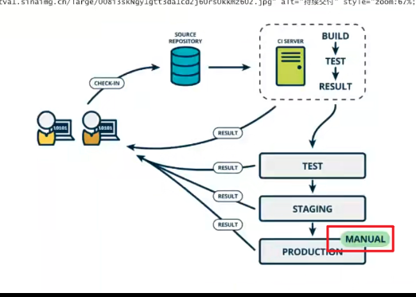

																**（手动部署）**


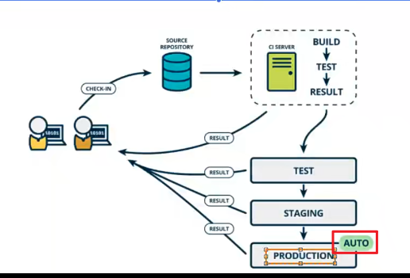

																**（自动部署）**


## （三）jenkins服务器和Nginx反向代理服务器

### 1.	Jenkins服务器

> 当谈到"Jenkins服务器"时，通常指的是用于持续集成和持续交付（CI/CD）的Jenkins软件的安装和配置。Jenkins是一个开源的自动化服务器，用于构建、测试和部署代码。它可以帮助开发团队在项目的不同阶段自动化各种任务，从代码编译、测试到部署。
>
> 以下是一些关于Jenkins服务器的重要信息：
>
> 1. **安装和配置：** 您可以在服务器上安装Jenkins软件，然后通过Web界面进行配置。Jenkins提供了丰富的插件，可以支持不同的项目类型、编程语言和工具。
>
> 2. **任务（Jobs）：** 在Jenkins中，您可以创建各种任务，例如构建任务、测试任务、部署任务等。每个任务可以配置为在特定的触发事件或计划时间点上运行。
>
> 3. **构建（Builds）：** 构建是指将源代码转换为可执行的软件或应用的过程。Jenkins可以自动执行这些构建过程，生成可用的应用程序。
>
> 4. **集成版本控制：** Jenkins可以与版本控制系统（如Git、Subversion等）集成，以便在代码提交时自动触发构建和测试。
>
> 5. **持续集成和持续交付：** Jenkins的主要目标之一是实现持续集成和持续交付。持续集成是指频繁地将代码合并到共享存储库，并进行自动构建和测试，以减少集成问题。持续交付是在通过测试后自动部署应用程序的过程。
>
> 6. **插件生态系统：** Jenkins有一个丰富的插件生态系统，允许您扩展其功能以适应不同的需求。您可以从Jenkins插件市场安装各种插件，例如与不同工具的集成、报告生成、通知等。
>
> 7. **可扩展性：** 您可以根据团队和项目的需求自定义Jenkins服务器的配置。您可以设置多个代理节点以分散构建负载，也可以设置几个不同的构建环境。
>
> 8. **日志和报告：** Jenkins会生成构建日志和报告，以便您能够查看构建的状态、错误和警告。
>
> 要使用Jenkins服务器，您需要安装Jenkins软件并进行适当的配置。然后，您可以创建并配置各种不同类型的任务，并设置触发条件，以便在代码更改时自动执行这些任务。总之，Jenkins是一个强大的工具，可用于实现自动化的持续集成和持续交付流程。


### 2.	 Nginx-Web服务器和反向代理服务器

> Nginx（发音为"engine-x"）是一个高性能的开源Web服务器和反向代理服务器。它也可以用作负载均衡器、HTTP缓存、以及作为应用程序服务器的反向代理。Nginx的设计目标是提供高并发、低内存占用和高度可扩展的特性，使其成为处理静态资源和处理大量并发连接的优秀选择。
>
> Nginx通常用于配置服务器，但它并不是一个编译环境。它的主要用途是处理网络流量，接受来自客户端的请求并将其分发给适当的后端服务器，然后将后端服务器的响应返回给客户端。以下是一些Nginx的用途：
>
> 1. **Web服务器：** Nginx可以用作静态文件服务器，用于提供HTML、CSS、JavaScript和其他静态资源。它也支持虚拟主机配置，使多个域名可以共享一个服务器。
>
> 2. **反向代理：** Nginx可以作为反向代理，将客户端的请求转发给后端的应用服务器，然后将应用服务器的响应返回给客户端。这对于负载均衡和提高应用程序性能非常有用。
>
> 3. **负载均衡：** Nginx可以分发客户端请求到多个后端服务器，以平衡服务器的负载，提高性能和可用性。
>
> 4. **HTTP缓存：** Nginx可以用来缓存静态和动态内容，从而减少对后端服务器的请求，加快内容的传输速度。
>
> 5. **安全性和访问控制：** Nginx支持配置访问控制、SSL/TLS加密以及防止恶意请求的功能，提供了一定程度的网络安全。
>
> 虽然Nginx本身并不提供编译环境，但它可以与其他软件一起使用，如应用程序服务器（例如Node.js、Ruby on Rails、Django等）来提供完整的Web应用程序堆栈。与编译环境相关的任务（如构建和编译代码）通常由开发人员在开发环境中完成，然后将编译好的代码部署到服务器上。

#### 2.1	Nginx相当于中介服务器

​	

> 是的，您可以将Nginx看作是一个中介服务器或中间层服务器，因为它在客户端和后端服务器之间充当了一个转发和处理请求的角色。Nginx可以用于多种用途，其中一个重要的方面是它在网络中的中介作用。
>
> 以下是一些Nginx充当中介服务器的典型情况：
>
> 1. **反向代理：** Nginx作为反向代理服务器，接收来自客户端的请求，然后将请求转发给后端服务器。这允许您隐藏后端服务器的真实IP地址和细节，提供负载均衡、缓存、SSL终端、访问控制等功能。
>
> 2. **负载均衡：** Nginx可以将客户端请求分发到多个后端服务器，实现负载均衡。这有助于分散流量，确保服务器的高可用性，并提高性能。
>
> 3. **缓存：** Nginx可以缓存静态和动态内容，将内容保存在内存中，以便更快地提供给客户端，减轻后端服务器的压力。
>
> 4. **安全性和防护：** Nginx可以用于防止恶意请求、DDoS攻击等。它可以配置为拦截恶意流量，并将合法的请求转发给后端服务器。
>
> 5. **SSL终端：** Nginx可以处理SSL/TLS连接，充当应用程序和客户端之间的SSL终端，从而减轻后端服务器的SSL负担。
>
> 总之，Nginx作为一个中介服务器，能够在客户端和后端服务器之间提供许多有用的功能，帮助提高性能、可用性和安全性。它在构建Web应用程序、管理网络流量和优化服务器环境方面发挥着重要作用。

​		

**前后端连接的桥梁**

> 是的，您可以将Nginx看作是前端和后端之间的桥梁，它在这两者之间充当了一个连接点和中介角色。具体而言，Nginx可以在以下方面充当桥梁：
>
> 1. **请求转发：** Nginx接收来自前端客户端的请求，并将其转发给后端服务器，这可以是Web应用程序服务器、数据库服务器等。通过这种方式，Nginx将客户端的请求传递给适当的后端资源。
>
> 2. **负载均衡：** 如果您有多个后端服务器来处理请求，Nginx可以实现负载均衡，确保请求均匀地分布到不同的后端服务器上，从而提高性能和可用性。
>
> 3. **缓存和加速：** Nginx可以缓存静态资源，如图片、CSS和JavaScript文件，减少对后端服务器的请求，从而提高页面加载速度。
>
> 4. **SSL终端：** 如果您的应用程序需要使用SSL/TLS加密，Nginx可以处理SSL/TLS连接，充当前端和后端之间的加密终端。
>
> 5. **安全性和访问控制：** Nginx可以实施访问控制、拦截恶意请求，并提供一定程度的安全保护，以保护后端服务器免受恶意攻击。
>
> 总之，Nginx在前端和后端之间起到了连接和中介的作用，帮助优化流量管理、提高性能、保障安全，并提供了一种有效的方式来处理不同类型的请求和响应。这使得Nginx成为构建复杂的Web应用程序和服务的重要组成部分。

​	

### 3.	NGinx和Jekins之间的关系

> Nginx和Jenkins是两个完全不同的工具，它们在软件领域的不同层次和用途中发挥作用。虽然它们可以在一些情况下一起使用，但它们的主要功能和目的不同。
>
> 1. **Nginx：** Nginx是一个高性能的Web服务器和反向代理服务器，用于处理网络流量、负载均衡、缓存和安全性等。它主要用于将客户端请求路由到适当的后端服务器，并处理静态和动态内容的传输。Nginx在网络基础设施中起到关键作用，用于提供Web服务并改善性能、可用性和安全性。
>
> 2. **Jenkins：** Jenkins是一个用于持续集成和持续交付（CI/CD）的自动化服务器。它用于自动化构建、测试和部署代码，以便团队能够频繁地集成新代码并自动进行各种测试，从而减少错误和提高交付速度。Jenkins可用于自动化整个软件开发生命周期中的各种任务，从代码编译到部署。
>
> 尽管Nginx和Jenkins有不同的用途，但在一些场景中，它们可以结合使用：
>
> - **反向代理Jenkins：** 您可以使用Nginx作为Jenkins服务器的反向代理，以提供安全性、负载均衡和访问控制。Nginx可以处理客户端的HTTPS请求，并将其转发到后端运行Jenkins的服务器。这有助于保护Jenkins服务器并分散负载。
>
> - **代理应用程序服务器：** 如果您的应用程序服务器需要外部访问，并且您希望通过Nginx进行流量管理和负载均衡，您可以将Nginx配置为反向代理，将流量分发给多个应用程序服务器。这与Jenkins的场景不同，但是概念上类似。
>
> 总之，尽管Nginx和Jenkins有一些交集的使用情况，但它们的主要功能和用途在软件开发和服务器管理领域中是不同的。


### 4.部署流程

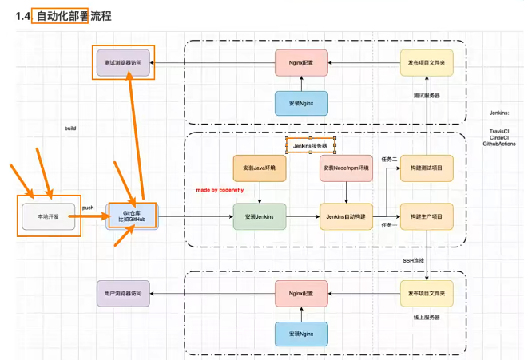


### 5.服务器

服务器可以理解为 一台可以操控的电脑， 它具备上网的功能， 它的配置分别对应机子的内存，及网速， 这种对应的配置分别是，具体讲下有哪些


> 是的，您对服务器的理解基本正确。服务器可以被看作是一台特定用途的计算机，专门用于提供各种服务，如Web服务、数据库服务、文件存储等。服务器的配置通常与其用途和性能需求密切相关，以下是一些与服务器配置相关的主要方面：
>
> 1. **CPU（中央处理器）：** CPU是服务器的计算引擎，影响服务器处理能力。更多的核心和更高的时钟频率通常意味着更好的性能。
>
> 2. **内存（RAM）：** 内存用于存储正在运行的应用程序和数据。较大的内存容量能够支持更多的同时运行的应用程序和更大的数据集。
>
> 3. **存储：** 存储可以分为硬盘驱动器（HDD）和固态驱动器（SSD）。SSD通常比HDD具有更快的读写速度，适用于需要高速访问的应用程序。
>
> 4. **网络带宽：** 网络带宽指的是服务器与互联网之间的数据传输速率。高带宽适用于处理大量流量的应用，如视频流媒体和在线游戏。
>
> 5. **网络接口：** 服务器通常有多个网络接口，用于连接到网络和其他设备。这些接口可能支持以太网、无线网络等。
>
> 6. **操作系统：** 服务器操作系统可以是Linux、Windows Server等。选择操作系统通常基于应用程序的兼容性和性能需求。
>
> 7. **虚拟化技术：** 虚拟化技术如VMware、KVM和Hyper-V允许在一台物理服务器上运行多个虚拟服务器，从而提高资源利用率。
>
> 8. **安全性：** 安全性配置涉及防火墙、身份验证、访问控制等，以确保服务器和其上运行的应用程序的安全性。
>
> 9. **监控和管理：** 配置监控工具和管理软件可以实时监视服务器的性能和状态，并及时进行维护和管理。
>
> 10. **扩展性：** 服务器应当具备扩展性，以便在需要时进行硬件升级或添加更多的服务器节点。
>
> 11. **备份和恢复：** 配置备份和恢复策略以确保数据的安全性和可恢复性。
>
> 服务器的配置需要根据具体的应用需求和预期负载来进行定制。不同类型的应用程序可能需要不同的硬件和软件配置，以便实现最佳性能和可用性。

##### 5.1 虚拟化技术

虚拟化技术就相当于一台服务器可以充当多台服务器

> 是的，您理解得很对。虚拟化技术允许一台物理服务器（宿主机）同时运行多个虚拟服务器（虚拟机），每个虚拟服务器都仿佛是一台独立的物理服务器，拥有自己的操作系统、应用程序和资源。这种方式可以充分利用硬件资源，提高服务器的利用率，并降低成本。
>
> 以下是一些虚拟化技术的关键概念：
>
> 1. **宿主机（Host）：** 宿主机是物理服务器，运行虚拟化软件，负责管理和分配资源给虚拟机。
>
> 2. **虚拟机（Virtual Machine，VM）：** 虚拟机是在宿主机上创建的独立环境，它模拟了一个完整的计算机，包括操作系统、应用程序和资源。多个虚拟机可以同时运行在同一台宿主机上。
>
> 3. **虚拟化层：** 虚拟化软件在宿主机上创建虚拟化层，用于管理和分配物理资源（如CPU、内存、存储）给虚拟机。
>
> 4. **资源隔离：** 虚拟化技术通过资源隔离，确保每个虚拟机之间互相独立，不会相互影响。这样，一个虚拟机的问题不会影响其他虚拟机的稳定性。
>
> 5. **快照和克隆：** 虚拟机可以创建快照，记录特定时刻的状态，以便将来可以回滚到该状态。还可以从现有虚拟机创建克隆，用作测试或复制环境。
>
> 6. **弹性和扩展性：** 虚拟化使得根据需求快速创建、删除和调整虚拟机，从而提供灵活性和弹性。
>
> 7. **应用隔离：** 不同的应用程序可以在不同的虚拟机中运行，从而隔离应用程序之间的影响，提高安全性和稳定性。
>
> 常见的虚拟化技术包括 VMware vSphere、Microsoft Hyper-V、KVM（Kernel-based Virtual Machine）、Xen 等。虚拟化技术在数据中心管理、开发测试环境、云计算等领域都具有重要作用，使多个虚拟服务器共享一台物理服务器的资源，从而提高效率和资源利用率。


##### 5.2 网络接口

它和端口相同吗？ 

> 网络接口和网络端口是两个不同的概念，尽管它们都涉及到计算机网络，但含义和用途是不同的。
>
> 1. **网络接口：** 网络接口是指计算机或设备与网络连接的物理或逻辑连接点。每个计算机通常有一个或多个网络接口，例如以太网接口、Wi-Fi接口等。网络接口具有唯一的硬件地址（MAC地址），用于在局域网中识别设备。它们用于实际物理连接或数据链路连接。
>
> 2. **网络端口：** 网络端口是在计算机通信中使用的抽象概念，用于标识不同的服务或应用程序。网络端口是一个16位的数字，可以与IP地址一起唯一标识一个通信通道。例如，HTTP服务通常使用端口80，HTTPS使用端口443，SSH使用端口22，而端口8080通常用于访问Web应用程序。
>
> 虽然这两个术语都与计算机网络有关，但它们的概念和作用是不同的。网络接口涉及到物理或逻辑连接到网络的设备，而网络端口涉及到在计算机通信中标识不同服务和应用程序的逻辑标识符。


##### 5.3	服务器选择

[云服务器了解及选择](file://D:\code-english\other_zs\服务器选择篇\云服务器了解及选择.md)   

txy-15

## （四）搭建服务器环境


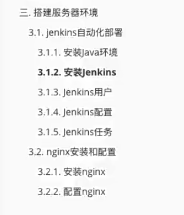

### 1. 安装并启动Jenkins代理服务器 （踩坑篇）

视频教学地址应修改为：  （https://pkg.jenkins.io/redhat-stable/）


#### 1.1 下载Jenkins依赖的jdk-11 版本

搭建服务器- jenkins
  yum install fontconfig java-11-openjdk  （jenkins最新版本依赖于11版本）


#### 1.2 安装Jenkins的提前准备


因为Jenkins本身是  没有在dnf的软件仓库包中的,所以我们需要连接Jenkins仓库:

wget是Linux中下载文件的一个工具，-O 表示输出到某个文件夹并且命名文件；
rpm:全称为The RPM Package Manage，是Linux下一个软件包管理器


1. DNF并未注册- jenkins 需先来连接仓库
   并导入密匙  声明软件合法 （最新方式）

2. **sudo wget -O /etc/yum.repos.d/jenkins.repo https://pkg.jenkins.io/redhat-stable/jenkins.repo**
   **sudo rpm --import https://pkg.jenkins.io/redhat-stable/jenkins.io-2023.key**

3. 安装适配的jdk版本- 并安装jenkins 
   yum install fontconfig java-11-openjdk （已提前安装）
     yum install jenkins

#### 1.3  防火墙开启端口8080为可用

注意： Jenkins默认使用8080端口， 需要提前为其开启端口使用性（在腾讯云中启动防火墙 允许进行访问）

💓🐟启动失败： 未配置正确的jdk版本 由于原视频安装为jdk-8导致后期一直失败，重新安装了11-
 		照着步骤走，不会出错


#### 1.4  设置JDK环境变量  并为Jenkins配置 JDK

/usr/lib/jvm/jre-11-openjdk-11.0.19.0.7-1.el7_9.x86_64  （这个为下载后的jdk路径）

运行时需要- 配置环境变量 
（1）进入文件： nano ~/.bashrc
（2）在文件末尾添加： 

		**export JAVA_HOME=/usr/lib/jvm/jre-11-openjdk-11.0.19.0.7-1.el7_9.x86_64** 
（3）退出保存后重新加载文件：  source ~/.bashrc


#### 1.5   配置生效- 解决措施

如配置后失效：  [参考文章 ](https://blog.csdn.net/u012795439/article/details/126587372)

jenkins启动依赖于 ： /usr/lib/systemd/system/jenkins.service文件
（1）nano打开文件： 在java home directory  （三个 Location 后）
（2）将注释去除 ， 为Envioment添加正确的路径 ： 

				Enviroment: "/usr/lib/jvm/jre-11-openjdk-11.0.19.0.7-1.el7_9.x86_64"
（3） 成功启动， 我是用这种方式解决的 （搞了一上午 😓）


#### 1.6 启动Jenkins  并设置开机自启

启动 Jenkins 服务并设置开机自启
**sudo systemctl start jenkins**
**sudo systemctl enable jenkins**


#### 1.7   其它配置（提前配置）


进入/etc/sysconfig/jenkins文件， 将JENKINS_USER = "root" 设置为管理者
后面的定时任务移动需要访问 管理文件（**需要权限**）

**启动配置篇：** 

1. 在浏览器打开 ip地址8080端口：  并配置相关服务/工具   
   在系统中 使用cat /var/lib/jenkins/secrets/initialAdminPassword 找到密码输入

2. 进入选择默认安装所需工具
   注册用户名： Kaden - 密码 W v 123


#### 💓🐟 命令bug解决


[root@VM-8-10-centos lighthouse]# cd ~
bash: __bp_precmd_invoke_cmd: command not found
bash: __bp_interactive_mode: command not found

[参考](https://blog.csdn.net/lzsm_/article/details/126083649)
进入root， 显示隐藏文件

 进入.bashrc文件， 添加一行  **unset PROMPT_COMMAND**


### 2. Nginx中介服务器- 安装及配置

#### 2.1  Nginx的安装

外界访问 是访问到Nginx， 中介转发 数据- 可在之中设置Htps或http， 主要是对服务器尽心一个配置， 提高安全性等


dnf install nginx

**启动Nginx并自启动-** 

systemctl start nginx
systenctl status nginx
systemctl enable nginx


**外界访问 是访问到Nginx， 中介转发 数据- 可在之中设置Htps或http， 主要是对服务器尽心一个配置， 提高安全性等**

> 是的，你的理解是正确的。Nginx作为中介服务器的主要作用是接收来自外部的请求，并将这些请求转发到内部的服务器上。这可以实现多种功能，包括负载均衡、反向代理、缓存、HTTPS加密等。
>
> Nginx可以帮助你实现以下目标：
>
> 1. **负载均衡：** Nginx可以将来自多个客户端的请求分发到多个后端服务器上，以平衡负载，提高系统的可靠性和性能。
> 2. **反向代理：** Nginx可以作为反向代理，将外部请求转发到后端服务器，并将响应返回给客户端。这种方式可以隐藏后端服务器的真实IP地址，提供额外的安全性。
> 3. **缓存：** Nginx可以将部分静态内容缓存在内存中，减轻后端服务器的负载，加快响应速度。
> 4. **SSL终止：** Nginx可以处理SSL/TLS加密和解密，将HTTPS请求转发到后端服务器，并在客户端与Nginx之间建立加密连接。
> 5. **安全性：** Nginx可以设置访问控制、防止恶意请求、限制连接数等，提高系统的安全性。
> 6. **HTTP重定向：** Nginx可以将HTTP请求重定向到HTTPS，从而实现网站的安全访问。
> 7. **静态文件服务：** Nginx可以直接提供静态文件，如图片、CSS和JavaScript文件，从而减轻后端服务器的负载。
>
> 总之，Nginx是一个功能强大且高度可配置的中介服务器，可以根据你的需求实现各种不同的功能。你的理解是准确的，如果你想深入了解Nginx的各种用法和配置选项，可以继续学习Nginx的文档和相关资源。


#### 2.2 Nginx配置


#### 1. Nginx配置

思路：

1. 使用下载并启动Nginx（自启动）
2. 在vsCode打开，并修改配置  并生成文件夹 CMs
3. 修改源文件Local 显示路径 为 cms


### 2.自动化部署

首先需要将项目上传到GitHub， 此部分已完成


手动部署- 代表需要手动去导入文件

	Nginx 自动化部署， 由它半小时将gitHub仓库的src文件进行拉取到本地（服务器中）， 此时该项目为实时跟进， 测试人员每隔半小时（可自定义时间），就能收到最新的项目情况


建立任务， 描述那些自定义后

服务器下载git ,连接仓库- 需要写入gitHub用户名 + token


## 2023-11-16前需要 升级服务器系统

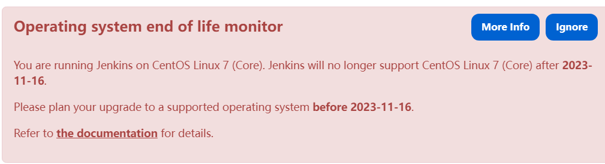


=======
>>>>>>> 2c71df13d1160bd0a997f47ae53285ae0c5ea158
