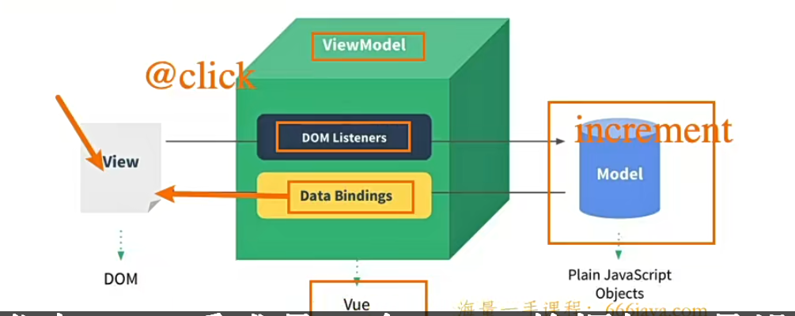

[TOC]


# vue3 ：6.11 -15：13

## TypeScript推出的目的

> ts的推出是为了解决JavaScript类型检测是吗，在编译时即可对错误排解
>
>
>
>是的，TypeScript的推出主要是为了解决JavaScript在开发过程中的一些缺点，其中包括类型检测和编译时错误排查。
>
>JavaScript是一种弱类型的语言，它允许灵活的数据类型转换和动态属性修改，但也容易导致类型错误和运行时错误。这在大型项目或团队协作中可能会带来一些问题，因为开发者很难在编写代码时发现和预防这些错误。
>
>TypeScript是JavaScript的一个超集，它添加了静态类型系统和其他语言特性，可以在编译时检测类型错误和潜在的问题。通过在代码中定义变量的类型、函数参数的类型以及其他数据结构的类型，TypeScript可以在编译过程中提前发现错误，并给出相应的警告或错误信息。这样可以帮助开发者更早地发现和解决潜在的问题，提高代码的质量和可维护性。
>
>另外，TypeScript还支持最新的ECMAScript标准，并提供了一些其他的语言特性，如类、模块化、接口、泛型等，这些特性可以提高代码的可读性、可重用性和可扩展性。
>
>总而言之，TypeScript的推出主要是为了在开发过程中提供更好的类型检测和编译时错误排查，以提高代码的质量和开发效率。它允许开发者在编写代码时发现和解决错误，并提供了更丰富的语言特性来支持大型项目和复杂的应用开发。


## 系统学习vue3 + TypeScript


## vue3 变化


## 如何使用vue


## CDN

>
>
>CDN是内容分发网络（Content Delivery Network）的缩写。它是一种用于提供高性能、可扩展和可靠内容传输的网络架构。
>
>在传统的网络架构中，当用户请求访问某个网站或应用程序时，服务器会直接响应请求并返回相应的内容。这可能会导致服务器的负载过大，响应时间延迟，尤其在全球范围内的用户访问时更为明显。
>
>CDN通过在全球各地部署大量的边缘节点（Edge Nodes）来解决这个问题。这些边缘节点位于离用户更近的地理位置，它们保存了源服务器上的内容的副本。当用户请求访问某个资源时，CDN会自动将请求路由到离用户最近的边缘节点上，边缘节点直接提供相应的内容，从而实现更快的响应时间和更低的延迟。
>
>CDN的工作原理如下：
>1. 静态内容缓存：CDN会缓存静态资源（例如图片、CSS、JavaScript文件等），以便将内容快速交付给用户。
>2. 负载均衡：CDN使用负载均衡算法将用户请求分配到最优的边缘节点上，以实现更好的性能和可伸缩性。
>3. 动态内容加速：有些CDN还可以缓存和加速动态内容，通过与源服务器进行实时通信，将最新的内容缓存到边缘节点，从而加速动态内容的传输。
>
>CDN的优势包括：
>1. 加速内容传输：由于边缘节点分布广泛，用户可以从最近的节点获取内容，从而减少网络延迟和响应时间。
>2. 减轻源服务器负载：CDN可以分担源服务器的负载，通过将请求路由到边缘节点处理，减少了源服务器的压力。
>3. 提高可靠性：CDN采用冗余部署和智能路由，可以提供更高的可靠性和容错能力。
>4. 全球覆盖：CDN的边缘节点分布在全球各地，可以为全球用户提供更好的访问体验。
>
>因此，CDN是一种通过将内容分发到全球边缘节点来提供高性能、可靠的内容传输的网络架构，可用于加速网站、应用程序和其他在线内容的传输。


## 声明式编程和命令式编程

>
>
>声明式编程和命令式编程是两种不同的编程范式，用于描述解决问题的方法和思维方式。
>
>1. 声明式编程：
>   - 声明式编程更关注于"做什么"，而不是"如何做"。
>   - 在声明式编程中，你描述了要达到的目标或所需的结果，而不需要详细指定具体的实现步骤。
>   - 声明式编程更注重描述问题的本质，以及通过定义问题和规则来找到解决方案。
>   - 常见的声明式编程语言和工具包括SQL、HTML、CSS、函数式编程语言（如Haskell）和一些声明式UI框架（如React、Vue）。
>
>2. 命令式编程：
>   - 命令式编程更关注于"如何做"，以及解决问题的具体步骤和控制流程。
>   - 在命令式编程中，你通过编写一系列明确的指令和步骤来描述如何实现结果。
>   - 命令式编程更注重算法、控制结构和可变状态。
>   - 常见的命令式编程语言和工具包括C、Java、Python、JavaScript（特别是面向对象编程）和一些命令式编程框架（如jQuery）。
>
>原生和框架是指开发应用程序时使用的工具和技术的不同。
>
>1. 原生开发：
>   - 原生开发是指使用底层平台或语言提供的原始功能和API来开发应用程序。
>   - 在原生开发中，你直接使用底层语言或平台的特性，编写自己的代码来实现应用程序的各个方面。
>   - 原生开发通常提供了更高的灵活性和自由度，但也需要更多的编码和维护工作。
>   - 例如，使用原生JavaScript编写Web应用程序，或使用Java编写Android应用程序。
>
>2. 框架开发：
>   - 框架开发是指使用特定的软件框架或库来构建应用程序。
>   - 在框架开发中，你使用框架提供的抽象层、组件和工具来简化开发过程，并提供一些预定义的模式和结构。
>   - 框架开发通常提供了更高的开发效率和可维护性，但可能会对开发者的灵活性和自由度有一定限制。
>   - 例如，使用Vue或React等前端框架来构建Web应用程序，或使用Spring框架来构建Java应用程序。
>
>在实际开发中，可以根据具体需求和项目要求
>
>选择使用声明式或命令式编程范式，以及原生开发或框架开发。这取决于开发者的偏好、项目的规模和复杂性，以及所需的时间和资源。


## Vue属于声明式编程

>
>
>Vue属于声明式编程的原因是因为Vue的核心思想是通过声明式的模板语法来描述应用程序的状态和界面，而不是直接操作DOM或编写大量的命令式逻辑。
>
>在Vue中，你可以使用Vue的模板语法（基于HTML）来声明性地描述你的视图结构和数据绑定。你可以简单地将Vue实例中的数据绑定到模板中的相应位置，然后Vue会自动处理数据的响应式更新以及视图的更新。
>
>通过使用Vue的声明式模板语法，你只需要关注描述应用程序的状态和结构，而不需要显式地编写诸如操作DOM元素、监听事件、手动更新视图等命令式逻辑。Vue会根据数据的变化自动更新视图，使你的代码更加简洁、可读性更强、可维护性更高。
>
>此外，Vue还提供了许多其他声明式的特性，如计算属性、侦听器、过滤器等，使你能够以声明性的方式处理应用程序的逻辑和数据转换。
>
>总结起来，Vue属于声明式编程，因为它通过声明式的模板语法和其他声明式特性，让你更专注于描述应用程序的状态和结构，而不是直接编写命令式的逻辑和DOM操作。这样可以提高开发效率、降低出错风险，并且使代码更易于理解和维护。


## 声明式和命令式


## mvc 和 mvvm

>MVC（Model-View-Controller）和 MVVM（Model-View-ViewModel）是两种常见的软件架构模式，用于组织和管理应用程序的代码和逻辑。
>
>1. MVC（Model-View-Controller）模式：
>   - MVC模式将应用程序分为三个主要部分：模型（Model）、视图（View）和控制器（Controller）。
>   - 模型（Model）表示应用程序的数据和业务逻辑。
>   - 视图（View）负责显示模型的内容，并与用户进行交互。
>   - 控制器（Controller）处理用户输入，并根据输入更新模型和视图之间的关系。
>   - MVC模式的核心思想是将应用程序的数据、用户界面和业务逻辑分离，以便更好地管理和维护应用程序的不同方面。
>
>2. MVVM（Model-View-ViewModel）模式：
>   - MVVM模式是建立在MVC模式之上的一种衍生模式。
>   - MVVM模式将应用程序分为三个主要部分：模型（Model）、视图（View）和视图模型（ViewModel）。
>   - 模型（Model）表示应用程序的数据和业务逻辑，与MVC模式中的模型相同。
>   - 视图（View）负责显示模型的内容，并与用户进行交互，与MVC模式中的视图相同。
>   - 视图模型（ViewModel）是连接模型和视图的中间层，负责将模型的数据转换为视图所需的格式，并处理视图的用户交互逻辑。
>   - MVVM模式的核心思想是通过视图模型来解耦视图和模型之间的关系，实现数据的双向绑定，使视图能够自动更新，并且视图和模型的变化相互独立。
>
>总结：
>- MVC模式将应用程序分为模型、视图和控制器，通过分离关注点来管理应用程序的不同方面。
>- MVVM模式在MVC模式的基础上引入了视图模型，通过数据绑定和双向更新实现视图和模型的解耦和自动更新。
>- MVC适合传统的Web开发和较为简单的应用程序，而MVVM适合复杂的前端应用程序，尤其是需要大量数据绑定和视图逻辑的情况。


## vue和mvmm

>MVVM（Model-View-ViewModel）是一种软件架构模式，而Vue是一个前端框架，可以用于实现MVVM模式。
>
>MVVM模式将应用程序分为三个主要部分：模型（Model）、视图（View）和视图模型（ViewModel）。模型代表应用程序的数据和业务逻辑，视图负责显示模型的内容并与用户进行交互，而视图模型是连接模型和视图的中间层，负责管理视图的状态、提供数据绑定和处理用户交互逻辑。
>
>Vue框架借鉴了MVVM模式的思想，并提供了一套工具和机制来实现MVVM架构。在Vue中，组件被用作视图层，模板语法用于描述视图的结构和数据绑定，而Vue实例则充当了视图模型的角色。
>
>具体来说，Vue中的组件可以定义模板、数据、计算属性、观察者等，用于描述视图的外观和行为。Vue通过响应式数据绑定系统，将视图和数据建立了关联，当数据发生变化时，视图会自动更新。同时，Vue提供了一系列的指令、事件处理和生命周期钩子等功能，用于处理用户交互和视图逻辑。
>
>因此，Vue可以被视为实现MVVM模式的一种工具或框架。它提供了对视图和数据之间的双向绑定、组件化开发、状态管理等方面的支持，使开发者能够更容易地构建符合MVVM架构的前端应用程序。





## vue的响应式系统劫持

>
>
>在Vue中，响应式系统是指Vue如何追踪数据的变化并自动更新相关的视图。Vue的响应式系统通过劫持（或拦截）对象的属性访问、修改和依赖追踪来实现。
>
>当你将一个普通的JavaScript对象传递给Vue的数据选项（如`data`、`computed`等），Vue会使用`Object.defineProperty`或类似的机制劫持对象的属性。这样，当你修改这些属性时，Vue就能够捕捉到变化并通知相关的视图进行更新。
>
>具体来说，劫持的过程包括以下几个步骤：
>
>1. 初始化：在Vue实例化过程中，Vue会遍历定义的数据选项，对每个属性调用`Object.defineProperty`来定义getter和setter。
>2. Getter：当访问被劫持的属性时，Vue会执行定义的getter函数，并进行依赖收集，将当前的Watcher（观察者）添加到该属性的依赖列表中。
>3. Setter：当修改被劫持的属性时，Vue会执行定义的setter函数，触发依赖列表中的所有Watcher进行更新。
>4. 依赖追踪：在Getter过程中，Vue会收集当前活动的Watcher，并将其添加到依赖列表中。这样，当被依赖的属性发生变化时，Vue就可以通知相应的Watcher进行更新。
>
>通过劫持对象的属性访问和修改，Vue能够跟踪数据的变化，并在数据发生变化时更新相关的视图。这种机制使得Vue的数据驱动视图的特性成为可能，开发者无需手动操作DOM，而是通过操作数据，Vue会自动更新视图。
>
>需要注意的是，Vue的响应式系统只能追踪通过Vue提供的API定义的响应式数据。对于直接添加或删除属性、修改数组索引或长度等操作，Vue无法自动检测到变化。在这些情况下，你需要使用Vue提供的特定方法（如`Vue.set`、`Vue.delete`）或通过重新赋值来触发更新。


# 1_1:55-2：10 （ 教学 - 以下载压缩包形式下载vue-next源码，该如何配置依赖


## package.json

>当您从官方下载Vue后，使用Vue时需要下载依赖包的原因是因为Vue本身并不包含所有的功能和依赖项，它只是一个轻量级的框架或库。
>
>Vue框架提供了核心的功能，如Vue实例、组件系统、响应式数据绑定等，但它还需要其他的包来支持一些特定的功能或功能模块，如路由、状态管理、HTTP请求等。
>
>通过下载依赖包，您可以根据项目的需求选择并安装所需的功能模块。这样做的好处是，您可以根据具体项目的需求来精确地控制您的项目依赖，只安装和使用您需要的功能，避免不必要的冗余和资源浪费。
>
>下载依赖包的过程通常通过包管理器（如npm、Yarn等）来完成。您可以使用命令行工具进入项目目录，并运行相应的命令来安装所需的依赖包。这些命令会根据项目的配置文件（如package.json）中列出的依赖项来下载并安装依赖包。
>
>总结来说，下载依赖包是为了获取和安装Vue框架的扩展功能和功能模块，以满足项目的具体需求。这样，您可以根据需要选择和管理您的项目依赖，并使用Vue框架的完整功能来构建应用程序。


## pnpm和yarm

>
>
>`pnpm`和`yarn`是两个不同的包管理工具，它们之间有一些相似之处，但也有一些区别。
>
>1. **相似之处**：
>   - 安装依赖：`pnpm`和`yarn`都可以用来安装项目的依赖包，并且都支持并行下载和缓存管理，可以提高安装速度。
>   - 锁定版本：两者都能生成并管理锁定文件（`pnpm-lock.yaml`和`yarn.lock`），用于确保在不同环境中安装的依赖版本一致。
>   - 并发安装：`pnpm`和`yarn`都支持并发安装，可以同时下载多个依赖包，提高安装效率。
>
>2. **区别**：
>   - **安装策略**：`pnpm`使用一种称为“符号链接”（Symlink）的策略来安装依赖，它在全局缓存中只存储一个依赖的副本，并使用符号链接将其链接到每个项目中。相比之下，`yarn`会为每个项目独立地下载和存储依赖包。
>   - **空间占用**：由于`pnpm`的安装策略，它通常比`yarn`占用更少的磁盘空间，因为相同的依赖只需存储一次。
>   - **包管理器的生态系统**：`pnpm`和`yarn`都有自己的生态系统，有一些包是特定于其中一个包管理器的。一些包可能在`yarn`中更常见，而另一些包可能在`pnpm`中更常见。
>   - **社区支持和广泛使用程度**：`yarn`是由Facebook开发的，并且在JavaScript社区中广泛使用，有较大的社区支持和文档资源。相比之下，`pnpm`是一个相对较新的包管理工具，它的使用和支持程度可能相对较低。
>
>综上所述，`pnpm`和`yarn`都是用于管理项目依赖的工具，它们在安装策略、空间占用和生态系统等方面有所不同。选择使用哪个工具取决于个人偏好、项目需求和社区支持等因素。


## 依赖包和api接口

>
>
>依赖包（Dependencies）和 API 接口（Application Programming Interface）是在软件开发中两个不同概念的组成部分。
>
>**依赖包（Dependencies）**是指在开发过程中使用的外部库、框架或模块，用于提供特定的功能、工具或资源。依赖包通常是由第三方开发者或组织创建和维护的，它们提供了预先编写好的代码和功能，供开发人员在自己的应用程序中使用。开发人员通过在项目中引入依赖包，可以直接使用其中的功能，而无需从头开始编写。依赖包的选择和使用可以帮助开发人员提高开发效率、减少重复劳动，并且可以借助社区维护的依赖包来获取更多的功能和特性。
>
>**API 接口（Application Programming Interface）**是一组定义了软件组件之间交互的规范和约定。API 接口定义了组件之间的通信协议、数据格式、方法和参数等，允许不同的软件组件之间进行交互和数据传递。API 接口可以是在同一应用程序内部的组件之间的接口，也可以是用于不同应用程序之间的通信接口。通过使用 API 接口，开发人员可以将不同的软件组件集成在一起，实现功能的共享和交互。
>
>依赖包和 API 接口之间的关系是：
>
>- 依赖包通常提供了一些封装好的函数、类、方法或组件，通过这些封装好的功能可以方便地调用和使用 API 接口。依赖包可以包含实现了特定 API 接口的代码，通过这些代码开发人员可以直接使用 API 接口提供的功能。
>- API 接口可以作为依赖包的一部分提供给开发人员使用。开发人员在使用依赖包时，可以通过 API 接口来调用和访问特定的功能和服务。
>
>总的来说，依赖包提供了具体实现的代码和工具，而 API 接口定义了不同组件之间的交互规范。开发人员可以通过使用依赖包中的代码来调用和使用 API 接口提供的功能。依赖包和 API 接口的结合使用可以帮助开发人员快速构建应用程序，实现功能的复用和集成。


### 依赖包用pnpm install指令下载后，会被放在哪个文件夹中

>
>
>当使用 `pnpm install` 命令下载依赖包时，它们会被放置在项目根目录下的 `node_modules` 文件夹中。这是 `pnpm` 默认的依赖包安装目录。
>
>`node_modules` 文件夹是用于存放项目依赖包的目录，其中每个依赖包通常会有自己的文件夹，以便管理和组织。在 `node_modules` 文件夹中，每个依赖包会有其自己的文件结构，其中包含了该依赖包的源代码、资源文件和其他所需的文件。
>
>在安装依赖包时，`pnpm` 会根据项目中的 `package.json` 文件中的依赖项列表（`dependencies`、`devDependencies` 等）确定要安装的依赖包及其版本。然后，它会从 `npm` 仓库（或其他配置的源）下载相应的依赖包，并将它们放置在 `node_modules` 文件夹中。
>
>请注意，为了避免将大量的依赖包文件提交到代码版本控制系统中，通常会在项目中添加一个 `.gitignore` 文件，并将 `node_modules` 文件夹添加到忽略列表中，以便在提交代码时排除依赖包文件。这样，其他开发人员在克隆项目时可以使用 `pnpm install` 命令根据 `package.json` 中的依赖列表自动下载依赖包。


### yarm dev是什么意思


>`yarn dev` 是一条常见的命令，通常用于在开发过程中启动项目的开发服务器或构建过程。它是使用 Yarn 包管理器执行的命令。
>
>具体的含义和行为可能因项目的不同而异，因为 `dev` 是一个自定义的脚本命令，它可以在项目的 `package.json` 文件中定义。一般来说，`dev` 脚本用于启动开发环境，并且会执行一系列的操作，例如编译代码、启动本地服务器、监听文件变化等。
>
>在项目的 `package.json` 文件中，可以看到一个 `scripts` 字段，其中包含了各种命令和脚本的定义。例如：
>
>```json
>"scripts": {
>  "dev": "yarn build && yarn serve",
>  "build": "webpack",
>  "serve": "node server.js"
>}
>```
>
>在这个例子中，`yarn dev` 命令执行了 `yarn build` 和 `yarn serve` 这两个命令，分别用于构建项目和启动服务器。具体的操作取决于项目的配置和需要。
>
>总之，`yarn dev` 是一个习惯上用于开发过程中的命令，它执行了一系列开发相关的操作，以提供一个方便的开发环境。具体的行为和操作步骤取决于项目的配置和脚本定义。


### 使用yarn dev 还是 pnpm dev呢

>使用 `yarn dev` 还是 `pnpm dev` 取决于您在项目中选择使用哪个包管理工具。
>
>如果您选择使用 Yarn 作为包管理工具，那么应该使用 `yarn dev` 命令来执行项目的开发过程。类似地，如果您选择使用 pnpm 作为包管理工具，则应使用 `pnpm dev` 命令。
>
>Yarn 和 pnpm 都是常见的包管理工具，用于管理项目的依赖项和执行各种脚本。它们有着类似的功能，但有一些细微的差异。
>
>- Yarn：Yarn 是由 Facebook 创建的包管理工具，它具有强大的性能和稳定性，可以并行下载和安装依赖项，并具有一些附加功能（如离线模式、缓存管理等）。
>- pnpm：pnpm 是另一个流行的包管理工具，它专注于解决包管理过程中的磁盘空间占用问题。它使用硬链接和符号链接来共享依赖项，从而显著减少了磁盘空间的使用量。
>
>选择使用哪个包管理工具取决于个人偏好、项目需求以及团队的共识。无论选择使用哪个工具，您需要在项目中正确配置和使用相应的命令。
>
>所以，请根据您在项目中选择使用的包管理工具，使用相应的命令（`yarn dev` 或 `pnpm dev`）来执行项目的开发过程。
>
>


### 下载了vue3源码， 使用pnpm install的作用

>
>
>使用 `pnpm install` 命令对 Vue 3 源码进行安装时，`pnpm` 包管理器会根据 `package.json` 文件中的依赖项配置，下载并安装项目所需的所有依赖包。
>
>`pnpm` 是一种快速、节省磁盘空间的包管理工具，它使用硬链接和符号链接来共享依赖项，减少了磁盘空间的使用量。与传统的包管理工具（如 npm 或 Yarn）不同，`pnpm` 在全局范围内只安装每个依赖项的单个副本，而不是为每个项目都复制一份依赖项。这样可以显著减少磁盘空间的占用，并加快依赖项的安装速度。
>
>当您运行 `pnpm install` 命令时，`pnpm` 会检查项目的 `package.json` 文件，找到并下载所有声明的依赖项。它会从公共的依赖项存储库（如 npm 存储库）获取依赖项的压缩包，并将其解压缩到项目的 `node_modules` 目录中。
>
>安装完成后，您可以在项目中使用所需的依赖项进行开发、构建或运行。`pnpm` 会自动处理依赖项之间的版本冲突和依赖关系解析，确保项目的依赖项正确安装和运行。
>
>总结来说，通过运行 `pnpm install` 命令，您可以使用 `pnpm` 包管理器下载和安装 Vue 3 源码所需的所有依赖项，为后续的开发和构建过程做好准备。


## vue源码实现过程


[调试代码](https://juejin.cn/post/7158458795234951182)


# 6.28  17点

## 函数作用域

> 作用域可以分为以下几种：
>
> 1. 全局作用域：全局作用域是整个程序中最外层的作用域。在浏览器环境中，全局作用域的顶级对象是 `window`，在 Node.js 环境中是 `global`。
> 2. 函数作用域：函数作用域是在函数内部声明的变量的作用域。函数作用域的父级作用域可以是函数本身所在的外部作用域。
> 3. 块级作用域：块级作用域是在代码块（例如，`if` 语句、`for` 循环或 `{}`）内部声明的变量的作用域。块级作用域的父级作用域可以是包含该代码块的函数作用域或全局作用域。


### this指向

箭头函数的this指向，在定义是已经确定为继承外部作用域的this

普通函数的this指向， 运行时的this指向， 谁调用函数this就指向谁

> 对象字面量是指直接在代码中使用花括号 `{}` 创建对象的语法。例如，`{}` 表示一个空对象，`{ key: value }` 表示一个具有一个键值对的对象。
>
> 对于箭头函数的定义处于对象字面量内部的情况，确实可以说箭头函数的定义时已经确认了 `this` 的指向。箭头函数继承了外部作用域的 `this` 值，并且在箭头函数的整个生命周期中保持不变。
>
> 而对于普通函数，`this` 的指向是在函数被调用时动态确定的。它取决于函数的调用方式。当函数被调用时，JavaScript 引擎会根据调用上下文来确定 `this` 的值。
>
> 常见的函数调用方式包括：
>
> 1. 作为对象的方法调用：函数作为对象的方法调用时，`this` 指向调用该方法的对象。
> 2. 作为构造函数调用：使用 `new` 关键字调用函数时，`this` 指向新创建的对象。
> 3. 通过 `call()`、`apply()` 或 `bind()` 方法调用：这些方法可以显式地指定函数内部的 `this` 值。
> 4. 独立函数调用：当函数作为独立函数调用时（不作为对象的方法、构造函数或通过 `call()`、`apply()` 或 `bind()` 调用），`this` 指向全局对象（在浏览器环境中通常是 `window`，在 Node.js 环境中是 `global`）或是严格模式下的 `undefined`。
>
> 总之，箭头函数和普通函数在定义时和 `this` 指向上有不同的行为。箭头函数的 `this` 继承自定义时的外部作用域，而普通函数的 `this` 在调用时动态绑定。
>
> 希望这个解释能够帮助您理解箭头函数和普通函数的 `this` 行为的区别。如有进一步的疑问，请随时提问。

​	

理解：**this指向与作用域的定义位置有关， 如在全局作用域那么this指向为window， 如果为对象内部或函数内部定义的this，指向该对象或函数所处作用域的this指向**

> 您的理解基本是正确的。在 JavaScript 中，`this` 的指向确实与其所处的作用域和调用方式有关。
>
> 1. 在全局作用域中，即在没有嵌套在任何函数或对象内部时，全局对象（在浏览器环境中通常是 `window` 对象）被绑定到 `this` 上。因此，在全局作用域中，`this` 指向全局对象。
>
> 2. 在对象内部定义的函数或方法中，`this` 的指向取决于调用方式。当通过对象调用方法时，方法内部的 `this` 指向调用该方法的对象。例如：
>
> ```javascript
> const obj = {
>   name: 'Vue',
>   sayHello: function() {
>     console.log('Hello, ' + this.name);
>   }
> };
> 
> obj.sayHello(); // Hello, Vue
> ```
>
> 在上述示例中，当调用 `obj.sayHello()` 时，`this` 指向 `obj` 对象，因此可以访问 `obj.name` 属性。
>
> 3. 在函数内部定义的函数中，`this` 的指向同样取决于调用方式。当通过函数调用方式（而不是作为对象的方法）调用内部函数时，`this` 的指向将是全局对象。例如：
>
> ```javascript
> function outerFunction() {
>   const innerFunction = function() {
>     console.log(this === window);
>   };
> 
>   innerFunction(); // true
> }
> 
> outerFunction();
> ```
>
> 在上述示例中，`innerFunction()` 是在函数 `outerFunction()` 内部定义的。当以独立函数调用方式调用 `innerFunction()` 时，`this` 指向全局对象 `window`。
>
> 需要注意的是，当使用箭头函数时，它不会创建自己的 `this` 值，而是继承其定义时所在的父级作用域的 `this` 值。因此，箭头函数的 `this` 值是词法上绑定的，不会受调用方式的影响。
>
> 总结起来，`this` 的指向与作用域的定义位置、调用方式以及使用箭头函数与否等因素密切相关。
>
> 希望这个解释能够帮助您更好地理解 `this` 的指向与作用域的关系。如果还有其他疑问，请随时提问。


## powerShell 常用来配置系统默认参数

> 是的，PowerShell可以用于配置系统的默认参数和设置，包括脚本执行策略。
>
> 在PowerShell中，可以使用`Set-ExecutionPolicy`命令来配置脚本执行策略。执行策略定义了允许运行哪种类型的脚本（如脚本文件、脚本块等），以及是否需要授权或签名。通过设置不同的执行策略，可以限制或允许特定类型的脚本在系统中运行。
>
> 以下是一些常见的脚本执行策略设置：
>
> - `Restricted`：不允许运行任何脚本。
> - `AllSigned`：只允许运行经过数字签名的脚本。
> - `RemoteSigned`：允许运行本地创建的脚本，但要求远程下载的脚本必须经过数字签名。
> - `Unrestricted`：允许运行任何脚本，无论是否经过数字签名。
>
> 通过在PowerShell中执行类似以下命令，可以更改执行策略：
>
> ```powershell
> Set-ExecutionPolicy RemoteSigned
> ```
>
> 除了脚本执行策略，PowerShell还可以用于许多其他系统配置任务，如管理用户和组、配置网络设置、安装和卸载应用程序等。
>
> 请注意，更改系统配置参数时，可能需要以管理员身份运行PowerShell以获得足够的权限。建议在更改系统设置之前仔细了解相关操作的影响，并确保对系统具有足够的了解和权限。
>
> 希望这个解释能够帮助您理解PowerShell在配置系统默认参数方面的用途。如果您有任何其他问题，请随时提问。


### yarn脚本下载完成后算本地脚本

就是我远端下载的脚本，我安装到了本地， 所以我本地的yarn就能执行是吗， 不会受remoteSigned限制

> 是的，您的理解是正确的。当您从远程服务器下载脚本并将其安装到本地时，本地的脚本执行通常不受 PowerShell 的运行策略（如 RemoteSigned）的限制。
>
> 在您的情况中，当您通过 npm 下载 Yarn 并将其安装到本地后，本地的 Yarn 执行文件可以正常运行，即使您的 PowerShell 设置了 RemoteSigned 策略。这是因为在安装过程中，远程下载的脚本已经被执行并生成了可执行的本地文件，该文件不再被视为远程脚本，而是被视为本地可执行文件。
>
> 请注意，RemoteSigned 策略主要适用于直接从远程服务器执行脚本的情况，以提供更严格的安全性控制。对于在本地安装的软件或工具，一旦它们被正确安装并生成本地可执行文件，它们将不受 PowerShell 运行策略的限制。
>
> 需要注意的是，即使本地的脚本可以正常运行，也建议您只从受信任的来源下载软件和工具，并定期更新以确保安全性。


### Restricted的状态也能正常运行npm


> 在 PowerShell 中将执行策略设置为 Restricted 时，仍然可以正常运行 npm，因为 npm 不被视为外部脚本或远程脚本，而是一个已经在本地安装的可执行文件。因此，即使 PowerShell 的执行策略设置为 Restricted，您仍然可以使用 npm 安装、更新和运行 JavaScript 包。
>
> Restricted 执行策略是 PowerShell 的默认设置，它限制了对脚本的执行，以提高系统的安全性。在 Restricted 策略下，只允许运行已经在计算机上预先安装的命令和可执行文件，而不允许运行从外部下载的脚本或未受信任的脚本。
>
> 由于 npm 是通过安装 Node.js 来获取的，而 Node.js 是一个经过广泛使用和验证的软件包，因此在 Restricted 策略下，您仍然可以正常运行 npm。但是，如果您在 Restricted 策略下执行的脚本需要调用其他外部脚本或执行其他外部操作，可能会受到限制并无法正常运行。
>
> 需要注意的是，将 PowerShell 的执行策略设置为 Restricted 可以提高系统的安全性，因为它限制了对脚本的执行。如果您需要执行自己编写的脚本或从不受信任的来源下载的脚本，您可能需要在临时基础上更改执行策略，或者将脚本进行数字签名以满足执行策略的要求。
>
> 总之，在 Restricted 执行策略下，您仍然可以正常运行已经安装的 npm，但是对于其他外部脚本或未受信任的脚本可能会受到限制。请根据您的需求和安全性考虑，选择适合的执行策略。
>


## 模板语法

> 模板语法通常指的是在前端开发中使用的用于动态生成 HTML 内容的语法。在 Vue.js 中，模板语法用于创建 Vue 组件的视图部分，以便根据数据的变化动态更新页面。
>
> 下面是一些常见的 Vue 模板语法示例：
>
> 1. 插值：使用双大括号 `{{ }}` 在模板中插入变量的值。
>    ```html
>    <div>{{ message }}</div>
>    ```
>
> 2. 指令：以 `v-` 开头的指令用于在模板中添加特殊行为。
>    ```html
>    <a v-bind:href="url">Link</a>
>    <button v-on:click="handleClick">Click me</button>
>    ```
>
> 3. 条件渲染：使用 `v-if` 和 `v-else` 根据条件来显示或隐藏元素。
>    ```html
>    <div v-if="show">Visible content</div>
>    <div v-else>Hidden content</div>
>    ```
>
> 4. 列表渲染：使用 `v-for` 遍历数组或对象，并生成对应的元素。
>    ```html
>    <ul>
>      <li v-for="item in items" :key="item.id">{{ item.name }}</li>
>    </ul>
>    ```
>
> 5. 事件处理：使用 `v-on` 或简写符号 `@` 来绑定事件处理函数。
>    ```html
>    <button v-on:click="handleClick">Click me</button>
>    <button @click="handleClick">Click me</button>
>    ```
>
> 6. 属性绑定：使用 `v-bind` 或简写符号 `:` 绑定属性到表达式的值。
>    ```html
>    
>    
>    ```
>
> 这些只是模板语法的一些基本用法示例，Vue 还提供了更多的指令和语法来满足不同的需求。详细的文档可以在 Vue.js 官方网站上找到。


## vue中动态绑定属性时， 会将动态名识别为小写

>
>
>在 Vue 中，动态绑定属性名时，Vue 默认会将属性名转换为小写形式。这是由 HTML 的规范所决定的，HTML 属性名是不区分大小写的。
>
>在你的代码中，如果你使用 `:originName` 进行动态绑定，Vue 会将属性名识别为小写形式，并在 data 中查找 `originname` 属性。所以确保在 data 中使用 `originname`，而不是 `originName`，以便正确地进行绑定。
>
>如果你希望保留原始的属性名大小写，可以使用 `v-bind` 指令和计算属性来实现动态绑定，示例如下：
>
>```html
><div v-bind:[originName]="FinalName">{{message}}</div>
>```
>
>然后在 Vue 实例中定义一个计算属性，将 `originName` 返回为字符串形式，示例如下：
>
>```javascript
>computed: {
>  originName() {
>    return 'originName'; // 替换为你期望的属性名
>  }
>}
>```
>
>这样就能正确地使用动态属性名进行绑定，并保留原始的属性名大小写。\\

v


## v-on绑定的用法


#  6.30  day3 

## 常见数组方法- (面经)

> 以下是 JavaScript 中常见的数组方法（包括 ES6 和 ES5）：
>
> 1. 修改原数组的方法（会修改原数组）：
>    - push(): 将一个或多个元素添加到数组的末尾，并返回新的长度。
>    - pop(): 删除并返回数组的最后一个元素。
>    - shift(): 删除并返回数组的第一个元素。
>    - unshift(): 在数组的开头添加一个或多个元素，并返回新的长度。
>    - splice(): 从数组中添加或删除元素。
>    - reverse(): 颠倒数组中元素的顺序。
>    - sort(): 对数组的元素进行排序。
>    - fill(): 用指定的值填充数组的所有元素。
>    - copyWithin(): 在数组内部将一段元素复制到另一个位置
>    
> 2. 返回一个新数组的方法（不会修改原数组）：
>    - concat(): 连接两个或多个数组，并返回新数组。
>    - slice(): 返回指定位置的片段数组。
>    - filter(): 根据条件筛选出符合要求的元素，返回一个新数组。
>    - map(): 对数组的每个元素进行操作，返回一个新数组。
>    - reduce(): 对数组的元素进行累计操作，返回一个值。
>    - reduceRight(): 从数组的末尾向前对元素进行累计操作，返回一个值。
>    - find(): 返回数组中符合条件的第一个元素。
>    - findIndex(): 返回数组中符合条件的第一个元素的索引。
>    - every(): 检测数组的所有元素是否都符合条件。
>    - some(): 检测数组中是否至少有一个元素符合条件。
>    - forEach(): 对数组的每个元素执行指定操作，没有返回值。
>    - sort(): 对数组的元素进行排序。
>    - reverse(): 颠倒数组中元素的顺序。
>    - flat(): 将多维数组转为一维数组。
>    - flatMap(): 对数组的每个元素执行指定操作，并将结果压缩为一个新数组。
>    - from(): 将类数组对象或可迭代对象转为数组。
>    - of(): 根据传入的参数创建一个新数组。
>
> 3. 不属于数组方法，但与数组相关的操作：
>    - Array.isArray(): 判断一个值是否为数组。
>
> 这些方法可以用于对数组进行各种操作和变换。请注意，具体的使用方式和参数可能会有所不同，具体可以查阅相关文档或参考 JavaScript 的官方文档。


## 虚拟dom

> 虚拟 DOM（Virtual DOM）是一种用于描述页面结构的概念，它是由 JavaScript 对象构成的轻量级的副本。虚拟 DOM 用于代表实际的 DOM 树，允许以声明的方式描述用户界面的状态，并能够在数据发生变化时高效地进行更新。
>
> 虚拟 DOM 的主要思想是在内存中构建一个虚拟的 DOM 树，然后通过比较前后两个虚拟 DOM 的差异，最终只更新需要改变的部分到实际的 DOM 中。这样做的好处是可以减少对实际 DOM 的频繁操作，提高页面渲染的性能。
>
> 当数据发生变化时，框架会生成新的虚拟 DOM，并与之前的虚拟 DOM 进行比较。比较的过程会找出需要更新的部分，然后将更新的部分应用到实际的 DOM 上，从而实现页面的更新。
>
> 虚拟 DOM 的优势在于它可以提供更高效的页面更新机制，避免了直接操作实际 DOM 带来的性能问题。同时，虚拟 DOM 也提供了更简单的编程模型，开发者可以以声明的方式描述界面的状态，而不需要手动操作 DOM。
>
> 在 Vue 和其他一些现代 JavaScript 框架中，虚拟 DOM 是实现组件化和响应式的关键技术之一，它为高效的页面渲染和数据驱动的开发方式提供了支持。


## 虚拟dom的优点

> 是的，虚拟 DOM 是通过 Vue 等现代 JavaScript 框架实现的。下面是虚拟 DOM 的一些主要好处：
>
> 1. 性能优化：虚拟 DOM 通过在内存中构建和操作虚拟 DOM 树，减少了直接操作实际 DOM 的次数。通过比较前后两个虚拟 DOM 的差异，只更新需要改变的部分，可以减少页面重绘和回流的次数，提高页面渲染的性能。
>
> 2. 简化开发：虚拟 DOM 提供了更简单的编程模型，开发者可以以声明的方式描述用户界面的状态，而不需要手动操作 DOM。这样可以减少手动操作 DOM 带来的错误和复杂性，提高开发效率。
>
> 3. 跨平台支持：由于虚拟 DOM 是在 JavaScript 层面上操作的，可以通过适配不同的平台，实现跨平台的开发。例如，Vue 的虚拟 DOM 可以用于构建 Web 应用，也可以通过类似的技术在移动端或桌面端进行开发。
>
> 4. 组件化开发：虚拟 DOM 和组件化开发相互配合，可以更好地实现复杂的用户界面。通过将界面拆分为组件，每个组件都有自己的虚拟 DOM，可以更灵活地组合和重用组件，提高代码的可维护性和可复用性。
>
> 总的来说，虚拟 DOM 在提升页面性能、简化开发流程、跨平台支持和组件化开发等方面都带来了很多好处。Vue 和其他现代 JavaScript 框架通过实现虚拟 DOM，使得开发者可以更高效地构建出高性能、可维护的用户界面。


## key元素的身份标识

> 是的，key 在虚拟 DOM 中相当于元素的身份标识。每个元素都应该有一个唯一的 key 值，用于识别和跟踪元素的变化。在 Vue 或其他使用虚拟 DOM 的框架中，当进行列表渲染时，每个渲染出来的元素都需要指定一个 key。
>
> 通过动态绑定 key 的方式，可以确保每个元素在列表中的身份保持稳定。当数据发生变化时，框架会根据新旧虚拟 DOM 的 key 值对比，精确地确定哪些元素需要被添加、删除或更新，从而最小化对实际 DOM 的操作，提高性能和效率。
>
> 使用动态绑定的 key，可以根据每个元素的特定属性或标识来生成，例如使用元素的唯一 ID、数据库的主键值等。这样可以确保每个元素在列表中具有唯一且稳定的身份标识，以避免出现渲染问题和性能问题。
>
> 总之，通过动态绑定 key 可以对每个元素进行标识，保证其在列表渲染中的身份稳定性，从而有效地管理和更新列表中的元素。


### key识别过程

> 当进行列表渲染时，框架会生成新的虚拟 DOM 树并与旧的虚拟 DOM 树进行比较，以确定需要进行哪些操作（添加、删除、更新）来保持视图与数据的同步。
>
> 在这个过程中，框架会遍历新旧虚拟 DOM 树的每个节点，并根据节点的 key 值进行对比。有以下几种情况：
>
> 1. 如果一个新节点的 key 在旧节点中找不到匹配项，则视为新节点，需要被添加到真实 DOM 中。框架会执行相应的 DOM 操作来创建该节点并插入到适当的位置。
>
> 2. 如果一个旧节点的 key 在新节点中找不到匹配项，则视为旧节点，需要被删除。框架会执行相应的 DOM 操作将该节点从真实 DOM 中移除。
>
> 3. 如果一个节点的 key 在新旧节点中都有匹配项，则需要进一步比较节点的内容。框架会递归地比较节点的属性、子节点等内容，确定是否需要更新该节点。
>
>   - 如果节点的内容发生了变化，则需要更新节点的属性和内容，框架会执行相应的 DOM 操作来更新节点。
>
>   - 如果节点的内容没有发生变化，则无需更新节点。
>
> 通过这种比较的方式，框架能够精确地确定哪些节点需要添加、删除或更新，从而最小化对真实 DOM 的操作。这样可以提高性能，减少不必要的渲染开销，并确保视图与数据的同步。
>
> 需要注意的是，key 的唯一性和稳定性对于列表渲染的正确性非常重要。如果列表中的元素没有唯一的 key 或 key 不稳定，可能会导致错误的渲染结果或性能问题。因此，在使用列表渲染时，确保为每个元素指定唯一且稳定的 key 值是很重要的。


### vue3 key值源码

有无key值 ， 渲染性能不同

无 key值， 直接一 一比对， 进行覆盖处理

有key值， 尽可能去复用原dom树上元素，5部曲，

-  首尾跳转比对 （两种） ++ — —
- 新增元素上， 新添dom元素使用， 新key 值， 将值挂载mounted 到原dom树上
- 删除元素上， 较原先dom元素， 缺失key值， 将已有dom树 该元素去除
- 尽可能复用， 中间乱序的话， 去建立一个新数组存放dom树上，按新dom树上顺序存储， 再去检测有无新增或删除，最后重新添加到原dom树上

故以上后， 性能较高

（diff算法 ）


## vue.js 特性 - 响应式（面经可能会考）

>响应式（Reactivity）是指在 Vue.js 中的一种特性，它使得数据与视图之间可以建立动态的关联关系。当数据发生改变时，相关的视图会自动更新，反之亦然。
>
>在 Vue.js 中，通过使用响应式系统，你可以将数据定义为响应式的，即将其转化为 Vue 实例的 `data` 对象的属性。这样，当响应式数据发生变化时，Vue 会自动追踪这些变化，并触发相关的更新操作，以保持数据与视图的同步。
>
>Vue.js 使用了一种叫做「依赖追踪」的机制，它会在模板渲染过程中追踪数据的依赖关系。当响应式数据被使用到的时候，Vue 会自动将其与相应的视图建立关联，并建立依赖关系。当数据发生改变时，Vue 会自动检测到这些变化，并通知相关的视图进行更新。
>
>通过响应式系统，你无需手动编写逻辑来更新视图，而是将数据的更新交给 Vue 来处理。这大大简化了开发过程，提高了代码的可维护性和可读性。
>
>需要注意的是，响应式系统只能追踪已经被 Vue 实例的 `data` 对象所包裹的属性。如果你需要动态地添加新的属性或数组元素，需要使用 Vue 提供的特定方法，以确保它们也成为响应式的。
>
>总结起来，响应式是 Vue.js 提供的一种机制，用于实现数据与视图的自动关联和更新，使得开发者能够更加专注于数据的处理和业务逻辑，而不必过多关注视图的更新操作。


### 响应式系统（面经） 劫持与watch

我可以理解视图和vue中data数据之间存在类同watch侦听器的存在， 它将数据的变化与设置与视图进行绑定是吗


>v是的，你的理解基本正确。
>
>在 Vue.js 中，我们可以使用侦听器（Watcher）来监视数据的变化，并在数据发生变化时执行相应的操作。侦听器可以在 Vue 实例的 `watch` 选项中定义，也可以通过使用 `vm.$watch` 方法动态创建。
>
>侦听器可以监听数据的变化，并在数据发生改变时执行指定的回调函数。这样，我们可以在数据变化时执行一些逻辑，例如更新视图、发送网络请求、处理数据等。
>
>侦听器与视图的绑定是通过在侦听器的回调函数中执行相应的操作来实现的。当数据发生变化时，侦听器会自动触发回调函数，并将新值（`newValue`）和旧值（`oldValue`）作为参数传递给回调函数。在回调函数中，你可以根据新值和旧值执行相应的操作，例如更新视图中的内容。
>
>通过使用侦听器，我们可以将数据的变化与视图的更新进行绑定，实现数据与视图的同步。这使得我们可以更加方便地处理数据的变化，并及时更新视图，保持用户界面的一致性和及时性。
>
>需要注意的是，侦听器是一种更加灵活和细粒度的数据监测机制，与响应式系统紧密相关。响应式系统可以自动追踪数据的变化并触发视图的更新，而侦听器可以通过编写自定义的逻辑来监视数据的变化并执行相应的操作。它们共同构成了 Vue.js 中数据和视图之间的强大绑定机制。


响应系统的劫持和watch有很大的关系是吗

>是的，响应式系统的劫持（Reactivity System）和侦听器（Watchers）之间存在密切的关系。
>
>在 Vue.js 中，响应式系统是通过劫持对象的属性来实现的。当创建 Vue 实例时，Vue.js 会遍历数据对象的属性，并使用 `Object.defineProperty` 方法将每个属性转换为“getter”和“setter”。这样，当访问或修改属性时，响应式系统就能够捕获到对属性的操作，并触发相应的更新。
>
>当数据对象中的属性发生变化时，响应式系统会自动通知侦听器。侦听器可以通过在 Vue 实例的 `watch` 选项中定义或使用 `vm.$watch` 方法动态创建。侦听器会监听指定的属性或表达式，并在属性发生变化时执行相应的回调函数。
>
>通过响应式系统的劫持和侦听器的配合，Vue.js 实现了数据与视图的自动更新。当数据发生变化时，响应式系统会自动更新相关的视图，以保持数据和视图的同步。同时，侦听器可以捕获到数据的变化，并执行自定义的操作，例如更新其他数据、发送网络请求、执行计算等。
>
>因此，响应式系统的劫持和侦听器是构建 Vue.js 应用的重要组成部分，它们共同实现了数据的响应性和视图的自动更新，提供了开发灵活和高效的数据驱动应用的能力。


就是每个vue实例， 即使未定义watch这个属性， 内部已经设置好一个watch去监听所有data数据， 并且通过它能与视图进行绑定， 所谓劫持就是说获取数据修改信息，并将之与视图的数据显示保持更新一致

>
>
>在 Vue.js 中，每个 Vue 实例都有一个响应式系统，它负责监听和响应数据的变化，以及将数据的变化与视图保持同步。
>
>在创建 Vue 实例时，Vue.js 会根据实例的 `data` 选项中定义的数据对象，通过劫持（或称为拦截）数据对象的属性，使其变成响应式的。这意味着当数据对象的属性发生变化时，响应式系统能够捕获到这些变化，并通知相关的视图进行更新。
>
>响应式系统会自动为每个属性创建一个侦听器（Watcher），负责监听该属性的变化。这个侦听器会在属性被访问（读取）或修改时触发，从而执行相应的更新操作，确保视图与数据的一致性。
>
>因此，即使你没有显式地定义 `watch` 属性，每个 Vue 实例都拥有内部的侦听器来监听其 `data` 数据对象中的属性变化，并将其与视图进行绑定。这种劫持和侦听机制使得 Vue 实例能够实现数据的双向绑定，保持数据和视图的同步更新。
>
>需要注意的是，Vue 实例的侦听器只会监听 `data` 数据对象中已经存在的属性，而不会自动监听后续添加的属性。如果需要监听动态添加的属性，你可以使用 `$watch` 方法或在 `watch` 选项中显式定义侦听器。这样可以在属性被添加或修改时触发相应的回调函数。
>
>总结起来，Vue 实例的响应式系统通过劫持和侦听器的机制，确保数据与视图的同步更新，从而实现了数据驱动的视图渲染。


所谓的劫持，我可以理解它是vue将获取data的属性，能实时获取它的改变，这个过程就称为劫持是吗， 然后将之与视图进行绑定，通过隐式定义watch侦听器后，将之于视图显示绑定进行一种动态更新，此行为称为响应是吗?

>是的，你理解得很正确。
>
>劫持（或拦截）是 Vue 响应式系统的核心机制之一。它通过在创建 Vue 实例时对数据对象进行劫持，实时追踪数据的变化。当数据发生改变时，劫持机制能够捕获这些变化，并通知相关的视图进行更新。
>
>在 Vue 中，劫持是通过使用 `Object.defineProperty` 方法来实现的。它会拦截对数据对象属性的访问（读取）和修改操作，并在这些操作中触发相应的逻辑。通过劫持，Vue 能够获知属性的变化，并及时通知相关的侦听器（Watcher）执行更新操作，以保持数据和视图的同步。
>
>绑定是响应式系统的另一个关键概念。通过将数据对象的属性与视图进行绑定，Vue 实现了数据的双向绑定。当数据发生变化时，相关的视图也会相应地更新，反之亦然。这样，数据的变化能够直接反映在视图上，使得应用程序具有响应性和实时性。
>
>隐式定义的 `watch` 侦听器是一种在 Vue 实例中监听数据变化的方式。通过定义 `watch` 选项，你可以指定需要监听的属性，并在属性变化时执行相应的回调函数。这样，你可以对特定的数据进行逻辑处理或触发其他操作，以满足特定的业务需求。通过侦听器，Vue 实现了数据的动态更新与视图的自动刷新。
>
>综上所述，Vue 的劫持机制和响应式系统实现了数据与视图的绑定和同步更新，通过隐式定义的 `watch` 侦听器，你可以根据具体需求对数据进行监听和处理，以实现更灵活和高效的数据驱动视图的功能。


## map方法

> 是的，`map`方法是用于遍历数组的方法之一。它会对数组的每个元素应用给定的回调函数，并返回一个新的数组，其中包含回调函数的返回值。
>
> 具体来说，`map`方法会遍历数组的每个元素，将每个元素传递给回调函数，并将回调函数的返回值添加到新的数组中。最终，`map`方法返回一个与原始数组长度相同的新数组，其中包含每个元素经过回调函数处理后的值。
>
> 在上述代码中，`this.books.map(item => { ... })`会遍历`this.books`数组的每个元素，对每个元素执行回调函数，并将返回的新对象添加到新的数组中。最后，整个表达式的结果就是包含多个对象的数组。
>
> 因此，你可以使用`map`方法遍历数组并生成一个新的数组，用于在模板中进行遍历和展示。


### 两种浅拷贝


浅拷贝实质上： 复制， 对基本数据类型复制的为其值， 对引用类型复制的为其引用

基本数据类型在内存中存储的是值本身，而引用类型（如对象、数组）在内存中存储的是指向实际数据的引用

这也是导致 通过引用去修改数据， 会影响原数据本身， 因为指向的为同块内存


使用{...item} 展开运算符 和Object.assign方法 进行对数据拷贝，原对象或数组 嵌套的数组或者对象，只能拷贝其引用，而不是生成一个副本， 这会导致原数据如果对此嵌套数据进行修改时会影响原对象/数组数据， 所以 如果想浅拷贝使用：只适用于 无嵌套数据


>
>
>是的，这两种写法都是浅拷贝。
>
>在第一种写法中，使用了 `Object.assign({}, item)` 来创建一个新对象并将原始对象的属性复制到新对象中，实现了浅拷贝。
>
>在第二种写法中，使用了展开运算符 `{ ...item }` 来创建一个新对象，并将原始对象的属性展开到新对象中，也实现了浅拷贝。
>
>无论是使用 `Object.assign()` 还是展开运算符，都会创建一个新对象，其中的属性值是原始对象的浅拷贝。这意味着新对象和原始对象在内存中是独立的，但如果原始对象的属性值是对象或数组等引用类型，那么新对象中的对应属性仍然引用相同的对象，因此修改这些引用类型属性的值可能会影响原始对象和新对象。
>
>如果需要进行深拷贝，即使属性值是引用类型，也要创建它们的副本，
>
>
>
>可以使用深拷贝方法如 
>
>**`JSON.parse(JSON.stringify(item))`** 或第三方库（例如 Lodash 的 **`_.cloneDeep()`** 方法）来实现。


# 7.2 day5  15:30


## 序列化和反序列化（深拷贝）

序列化和反序列化， 前者就是转化为JSON字符串的过程， 后者是将json字符串转化为js对象的过程是吗


>是的，您理解得很正确。
>
>序列化是指将对象或数据结构转换为字符串的过程，一般用于将数据进行传输或存储。在 JavaScript 中，将对象序列化为字符串通常使用 JSON（JavaScript Object Notation）格式，这样可以保持数据的结构和值，并且易于传输和解析。通过序列化，对象的属性和值被转换为字符串的表示形式。
>
>反序列化则是将字符串转换为对象或数据结构的过程。在 JavaScript 中，常用的是将 JSON 字符串反序列化为 JavaScript 对象，恢复原始的对象结构和值。反序列化过程将字符串解析为 JavaScript 对象，使得我们可以使用这些对象的属性和方法。
>
>在 JSON 格式中，对象的属性和值被包含在大括号 `{}` 中，使用键值对的形式表示，键和值之间使用冒号 `:` 分隔。多个键值对之间使用逗号 `,` 分隔。在序列化过程中，JavaScript 对象会被转换为符合 JSON 格式的字符串，而在反序列化过程中，JSON 字符串会被解析为 JavaScript 对象。
>
>综上所述，序列化是将对象转换为字符串，而反序列化是将字符串转换为对象的过程。JSON 格式常用于在不同系统间传递数据，以及将数据存储在本地或远程服务器上。


### 深拷贝： JSON.parse(JSON.stingify（对象）)


将其转化为 JSON.stringify字符串对象， 再通过JSON.parse将其转化为js对象

>
>
>对于这个对象进行深拷贝时，可以使用 JSON 序列化和反序列化来实现。下面是具体的步骤：
>
>1. 序列化：将原始对象转化为 JSON 字符串。在序列化过程中，对象及其嵌套对象会被转换为字符串表示形式。
>
>```javascript
>const serializedObj = JSON.stringify(info);
>// serializedObj 的值为 '{"deepInfo":{"name":"aa"}}'
>```
>
>2. 反序列化：将 JSON 字符串转化为 JavaScript 对象，并生成一片独立的空间，保持对象及其嵌套对象的引用关系。
>
>```javascript
>const deepCopyObj = JSON.parse(serializedObj);
>// deepCopyObj 的值为 { deepInfo: { name: 'aa' } }
>```
>
>通过这个过程，原始对象及其嵌套对象的引用关系会被重新生成，生成的副本对象与原始对象是独立的。修改其中一个对象中的 `deepInfo` 属性，另一个对象中的 `deepInfo` 不会受到影响，因为它们引用不同的嵌套对象。
>
>需要注意的是，这种深拷贝方法适用于大多数情况，但对于特殊对象类型（如日期对象、正则表达式、函数等）可能会存在一些限制或失去原始特性，需要进行额外的处理来确保数据的完整性和准确性。


### 深拷贝： loadsh（_.cloneDeep）


 导入cdn  后直接使用

 src="https://cdn.jsdelivr.net/g/lodash@4(lodash.min.js+lodash.fp.min.js)"

浅拷贝

>    //  使用lodash进行 浅拷贝 和深拷贝
>
>    const lodashObj = _.clone(info);
>
>    lodashObj.nba.name = "悟律- 修改成功";
>
>    console.log(info.nba.name);

深拷贝

>    const lodashDeepObj = _.cloneDeep(info);
>
>    lodashDeepObj.nba.name = "kobe - 对原数据无影响";
>
>    console.log(info.nba.name);


## label标签

> 当在 HTML 表单中使用 `<label>` 标签时，它有两个主要的作用：
>
> 1. 提供标签文本：`<label>` 标签可以包裹表单控件（例如输入框、复选框、单选框、下拉列表等），为其提供可见的标签文本。这样，用户就可以明确地知道该控件的用途或预期输入内容。例如：
>    ```html
>    <label for="username">用户名：</label>
>    <input type="text" id="username" name="username" />
>    ```
>
>    在上面的例子中，`<label>` 标签中的文本 "用户名：" 作为用户名输入框的标签，可以让用户知道该输入框是用来输入用户名的。
>
> 2. 建立关联：通过使用 `<label>` 标签的 `for` 属性和表单控件的 `id` 属性，可以建立关联。这样，用户不仅可以通过点击标签文本来聚焦到相应的表单控件，还可以通过辅助设备（如屏幕阅读器）更容易地理解表单的结构和用途。例如：
>    ```html
>    <label for="remember-me">记住我：</label>
>    <input type="checkbox" id="remember-me" name="remember-me" />
>    ```
>
>    在上面的例子中，`<label>` 标签中的文本 "记住我：" 与复选框建立了关联。当用户点击标签文本时，复选框会被选中或取消选中。
>
> 总结来说，`<label>` 标签在 HTML 表单中有助于提供更好的可用性和可访问性。它提供了可见的标签文本，让用户了解表单控件的用途，同时通过建立关联，使用户可以通过点击标签文本与相应的表单控件进行交互。


### label标签的作用

 扩大选中区域， 提高用户体验， 如text-box， 通过外层包裹label标签， 可以通过点击文本的形式对 选中的状态进行更新

​	并且可以在label 绑定相关事件的触发， 提升功能。

> `<label>` 标签的主要作用是为相关的表单元素提供标签文本，并通过 `for` 属性和表单元素的 `id` 属性建立关联。关联的作用是，当用户点击标签文本时，关联的表单元素会获取焦点或触发相关行为。
>
> 对于 `<text-area>` 元素来说，如果你不使用 `<label>` 标签，仍然可以通过直接点击 `<text-area>` 元素来使其获取焦点。`<label>` 标签并非必需，但它提供了一种更好的用户体验和可访问性的方式。
>
> 使用 `<label>` 标签的好处是，不仅可以通过点击标签文本来触发关联的表单元素的行为，还可以扩展其功能。你可以在 `<label>` 标签上绑定事件，以实现自定义的交互逻辑。例如，你可以通过点击标签文本来切换表单元素的状态，触发其他操作或动态修改相关内容。
>
> 总而言之，使用 `<label>` 标签可以提供更好的可用性和可访问性，并允许你以更灵活的方式扩展表单元素的交互功能。是否使用 `<label>` 标签取决于你的需求和设计考虑。在一些简单的情况下，你可以不使用 `<label>` 标签，但在需要更多交互和定制的情况下，使用 `<label>` 标签可以是一个不错的选择。


## webPack静态模块打包工具

> Webpack是一个现代化的静态模块打包工具，它可以将多个前端资源（例如JavaScript、CSS、图片等）视为模块，并将它们打包成一个或多个最终的优化版本。
>
> Webpack的主要作用是优化前端项目的开发和部署流程。它通过以下功能和特性帮助开发者：
>
> 1. 模块化管理：Webpack将项目中的各个模块视为独立的部分，可以通过模块化的方式进行组织和管理代码。这样可以提高代码的可维护性和复用性。
>
> 2. 打包和压缩：Webpack可以将项目中的多个模块打包成一个或多个文件，以便在浏览器中加载。它可以处理模块之间的依赖关系，并自动地合并和压缩代码，以减小文件的大小，提高加载速度。
>
> 3. 资源优化：Webpack支持处理各种类型的资源文件，包括JavaScript、CSS、图片、字体等。它可以通过加载器（Loaders）和插件（Plugins）来处理和优化这些资源，例如转换、压缩、合并等操作，以提高项目的性能和效率。
>
> 4. 开发环境支持：Webpack提供了开发环境下的实用功能，如热模块替换（Hot Module Replacement）、代码分离、自动刷新等。这些功能可以提高开发效率，加快开发调试过程。
>
> 5. 生态系统丰富：Webpack拥有一个庞大的插件生态系统，可以满足各种不同的需求。开发者可以根据项目的需要选择合适的插件，并与其他工具和框架无缝集成，如Babel、React、Vue等。
>
> 总而言之，Webpack是一个功能强大的前端构建工具，它提供了丰富的功能和灵活的配置选项，帮助开发者优化项目的结构和性能，提高开发效率，并改善用户体验。


webPack的主要功能将我们编写的.vue文件， .js文件等打包并转化为浏览器可识别的文件，并交由浏览器运行， 相当于一个集成

> 是的，Webpack的主要功能之一是将我们编写的各种文件（包括.vue文件、.js文件、.css文件等）进行打包和转换，以生成浏览器可识别的文件。
>
> 在使用Webpack进行打包时，我们可以通过配置文件指定入口文件（entry），Webpack会从入口文件开始，递归地解析依赖关系，将所有相关的文件打包到一个或多个输出文件（output）中。这些输出文件可以是浏览器可以直接加载和运行的JavaScript文件、CSS文件、图片文件等。
>
> Webpack提供了丰富的加载器（Loaders）和插件（Plugins），用于处理不同类型的文件。例如，对于.vue文件，可以使用Vue Loader加载器来解析和转换为JavaScript代码；对于JavaScript文件，可以使用Babel加载器进行转译以支持更旧版本的浏览器；对于CSS文件，可以使用CSS加载器来处理样式文件等。
>
> 通过这种方式，Webpack提供了一种集成的方式，将我们编写的不同类型的文件整合在一起，并进行必要的转换和优化，最终生成可以在浏览器中运行的文件。这使得前端开发更加高效和便捷，同时提供了更好的性能和用户体验。


## comonJs 模块导出


const priceFormat = function () {  return '$99.88'; } 

// commnm Js导出 

module.exports = {  priceFormat } 

> 这段代码使用了 CommonJS 的模块化规范进行导出。
>
> 首先，定义了一个名为 `priceFormat` 的函数，该函数返回字符串 `'$99.88'`。
>
> 接下来，使用 `module.exports` 将一个对象导出，对象中包含了 `priceFormat` 函数。
>
> 这样，其他模块可以通过引入该模块来访问和使用 `priceFormat` 函数。
>
> 示例代码中的导出方式适用于 CommonJS 的模块系统，主要用于 Node.js 环境和一些支持 CommonJS 规范的前端构建工具。
>
> 其他模块导入该函数的方式：
> ```javascript
> const mathModule = require('./math'); // 替换为实际的模块路径
> 
> console.log(mathModule.priceFormat()); // 输出 '$99.88'
> ```
>
> 通过 `require` 方法将该模块引入，并将导出的对象赋值给一个变量（这里是 `mathModule`）。然后可以通过该变量访问和调用 `priceFormat` 函数。
>
> 总结来说，这段代码使用 CommonJS 的模块化规范导出了一个函数，并可以在其他模块中使用。


可进行解构赋值

> const { priceFormat } = require('./yourModule'); // 替换为实际的模块路径
>
> console.log(priceFormat()); // 输出 '$99.88'


## webpack  初使用


