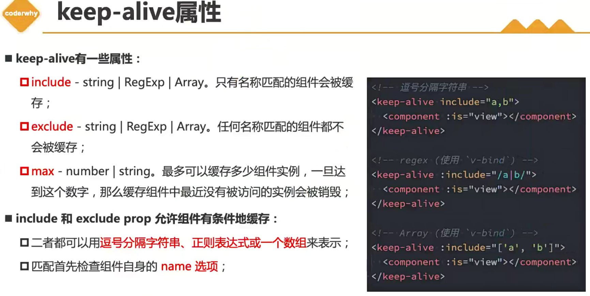

[TOC]


# vue3 ：6.11 -15：13

## TypeScript推出的目的

> ts的推出是为了解决JavaScript类型检测是吗，在编译时即可对错误排解
>
>
>
>是的，TypeScript的推出主要是为了解决JavaScript在开发过程中的一些缺点，其中包括类型检测和编译时错误排查。
>
>JavaScript是一种弱类型的语言，它允许灵活的数据类型转换和动态属性修改，但也容易导致类型错误和运行时错误。这在大型项目或团队协作中可能会带来一些问题，因为开发者很难在编写代码时发现和预防这些错误。
>
>TypeScript是JavaScript的一个超集，它添加了静态类型系统和其他语言特性，可以在编译时检测类型错误和潜在的问题。通过在代码中定义变量的类型、函数参数的类型以及其他数据结构的类型，TypeScript可以在编译过程中提前发现错误，并给出相应的警告或错误信息。这样可以帮助开发者更早地发现和解决潜在的问题，提高代码的质量和可维护性。
>
>另外，TypeScript还支持最新的ECMAScript标准，并提供了一些其他的语言特性，如类、模块化、接口、泛型等，这些特性可以提高代码的可读性、可重用性和可扩展性。
>
>总而言之，TypeScript的推出主要是为了在开发过程中提供更好的类型检测和编译时错误排查，以提高代码的质量和开发效率。它允许开发者在编写代码时发现和解决错误，并提供了更丰富的语言特性来支持大型项目和复杂的应用开发。


## 系统学习vue3 + TypeScript


## vue3 变化


## 如何使用vue


## CDN

>
>
>CDN是内容分发网络（Content Delivery Network）的缩写。它是一种用于提供高性能、可扩展和可靠内容传输的网络架构。
>
>在传统的网络架构中，当用户请求访问某个网站或应用程序时，服务器会直接响应请求并返回相应的内容。这可能会导致服务器的负载过大，响应时间延迟，尤其在全球范围内的用户访问时更为明显。
>
>CDN通过在全球各地部署大量的边缘节点（Edge Nodes）来解决这个问题。这些边缘节点位于离用户更近的地理位置，它们保存了源服务器上的内容的副本。当用户请求访问某个资源时，CDN会自动将请求路由到离用户最近的边缘节点上，边缘节点直接提供相应的内容，从而实现更快的响应时间和更低的延迟。
>
>CDN的工作原理如下：
>1. 静态内容缓存：CDN会缓存静态资源（例如图片、CSS、JavaScript文件等），以便将内容快速交付给用户。
>2. 负载均衡：CDN使用负载均衡算法将用户请求分配到最优的边缘节点上，以实现更好的性能和可伸缩性。
>3. 动态内容加速：有些CDN还可以缓存和加速动态内容，通过与源服务器进行实时通信，将最新的内容缓存到边缘节点，从而加速动态内容的传输。
>
>CDN的优势包括：
>1. 加速内容传输：由于边缘节点分布广泛，用户可以从最近的节点获取内容，从而减少网络延迟和响应时间。
>2. 减轻源服务器负载：CDN可以分担源服务器的负载，通过将请求路由到边缘节点处理，减少了源服务器的压力。
>3. 提高可靠性：CDN采用冗余部署和智能路由，可以提供更高的可靠性和容错能力。
>4. 全球覆盖：CDN的边缘节点分布在全球各地，可以为全球用户提供更好的访问体验。
>
>因此，CDN是一种通过将内容分发到全球边缘节点来提供高性能、可靠的内容传输的网络架构，可用于加速网站、应用程序和其他在线内容的传输。


## 声明式编程和命令式编程

>
>
>声明式编程和命令式编程是两种不同的编程范式，用于描述解决问题的方法和思维方式。
>
>1. 声明式编程：
>   - 声明式编程更关注于"做什么"，而不是"如何做"。
>   - 在声明式编程中，你描述了要达到的目标或所需的结果，而不需要详细指定具体的实现步骤。
>   - 声明式编程更注重描述问题的本质，以及通过定义问题和规则来找到解决方案。
>   - 常见的声明式编程语言和工具包括SQL、HTML、CSS、函数式编程语言（如Haskell）和一些声明式UI框架（如React、Vue）。
>
>2. 命令式编程：
>   - 命令式编程更关注于"如何做"，以及解决问题的具体步骤和控制流程。
>   - 在命令式编程中，你通过编写一系列明确的指令和步骤来描述如何实现结果。
>   - 命令式编程更注重算法、控制结构和可变状态。
>   - 常见的命令式编程语言和工具包括C、Java、Python、JavaScript（特别是面向对象编程）和一些命令式编程框架（如jQuery）。
>
>原生和框架是指开发应用程序时使用的工具和技术的不同。
>
>1. 原生开发：
>   - 原生开发是指使用底层平台或语言提供的原始功能和API来开发应用程序。
>   - 在原生开发中，你直接使用底层语言或平台的特性，编写自己的代码来实现应用程序的各个方面。
>   - 原生开发通常提供了更高的灵活性和自由度，但也需要更多的编码和维护工作。
>   - 例如，使用原生JavaScript编写Web应用程序，或使用Java编写Android应用程序。
>
>2. 框架开发：
>   - 框架开发是指使用特定的软件框架或库来构建应用程序。
>   - 在框架开发中，你使用框架提供的抽象层、组件和工具来简化开发过程，并提供一些预定义的模式和结构。
>   - 框架开发通常提供了更高的开发效率和可维护性，但可能会对开发者的灵活性和自由度有一定限制。
>   - 例如，使用Vue或React等前端框架来构建Web应用程序，或使用Spring框架来构建Java应用程序。
>
>在实际开发中，可以根据具体需求和项目要求
>
>选择使用声明式或命令式编程范式，以及原生开发或框架开发。这取决于开发者的偏好、项目的规模和复杂性，以及所需的时间和资源。


## Vue属于声明式编程

>
>
>Vue属于声明式编程的原因是因为Vue的核心思想是通过声明式的模板语法来描述应用程序的状态和界面，而不是直接操作DOM或编写大量的命令式逻辑。
>
>在Vue中，你可以使用Vue的模板语法（基于HTML）来声明性地描述你的视图结构和数据绑定。你可以简单地将Vue实例中的数据绑定到模板中的相应位置，然后Vue会自动处理数据的响应式更新以及视图的更新。
>
>通过使用Vue的声明式模板语法，你只需要关注描述应用程序的状态和结构，而不需要显式地编写诸如操作DOM元素、监听事件、手动更新视图等命令式逻辑。Vue会根据数据的变化自动更新视图，使你的代码更加简洁、可读性更强、可维护性更高。
>
>此外，Vue还提供了许多其他声明式的特性，如计算属性、侦听器、过滤器等，使你能够以声明性的方式处理应用程序的逻辑和数据转换。
>
>总结起来，Vue属于声明式编程，因为它通过声明式的模板语法和其他声明式特性，让你更专注于描述应用程序的状态和结构，而不是直接编写命令式的逻辑和DOM操作。这样可以提高开发效率、降低出错风险，并且使代码更易于理解和维护。


## 声明式和命令式


## mvc 和 mvvm

>MVC（Model-View-Controller）和 MVVM（Model-View-ViewModel）是两种常见的软件架构模式，用于组织和管理应用程序的代码和逻辑。
>
>1. MVC（Model-View-Controller）模式：
>   - MVC模式将应用程序分为三个主要部分：模型（Model）、视图（View）和控制器（Controller）。
>   - 模型（Model）表示应用程序的数据和业务逻辑。
>   - 视图（View）负责显示模型的内容，并与用户进行交互。
>   - 控制器（Controller）处理用户输入，并根据输入更新模型和视图之间的关系。
>   - MVC模式的核心思想是将应用程序的数据、用户界面和业务逻辑分离，以便更好地管理和维护应用程序的不同方面。
>
>2. MVVM（Model-View-ViewModel）模式：
>   - MVVM模式是建立在MVC模式之上的一种衍生模式。
>   - MVVM模式将应用程序分为三个主要部分：模型（Model）、视图（View）和视图模型（ViewModel）。
>   - 模型（Model）表示应用程序的数据和业务逻辑，与MVC模式中的模型相同。
>   - 视图（View）负责显示模型的内容，并与用户进行交互，与MVC模式中的视图相同。
>   - 视图模型（ViewModel）是连接模型和视图的中间层，负责将模型的数据转换为视图所需的格式，并处理视图的用户交互逻辑。
>   - MVVM模式的核心思想是通过视图模型来解耦视图和模型之间的关系，实现数据的双向绑定，使视图能够自动更新，并且视图和模型的变化相互独立。
>
>总结：
>- MVC模式将应用程序分为模型、视图和控制器，通过分离关注点来管理应用程序的不同方面。
>- MVVM模式在MVC模式的基础上引入了视图模型，通过数据绑定和双向更新实现视图和模型的解耦和自动更新。
>- MVC适合传统的Web开发和较为简单的应用程序，而MVVM适合复杂的前端应用程序，尤其是需要大量数据绑定和视图逻辑的情况。


## vue和mvmm

>MVVM（Model-View-ViewModel）是一种软件架构模式，而Vue是一个前端框架，可以用于实现MVVM模式。
>
>MVVM模式将应用程序分为三个主要部分：模型（Model）、视图（View）和视图模型（ViewModel）。模型代表应用程序的数据和业务逻辑，视图负责显示模型的内容并与用户进行交互，而视图模型是连接模型和视图的中间层，负责管理视图的状态、提供数据绑定和处理用户交互逻辑。
>
>Vue框架借鉴了MVVM模式的思想，并提供了一套工具和机制来实现MVVM架构。在Vue中，组件被用作视图层，模板语法用于描述视图的结构和数据绑定，而Vue实例则充当了视图模型的角色。
>
>具体来说，Vue中的组件可以定义模板、数据、计算属性、观察者等，用于描述视图的外观和行为。Vue通过响应式数据绑定系统，将视图和数据建立了关联，当数据发生变化时，视图会自动更新。同时，Vue提供了一系列的指令、事件处理和生命周期钩子等功能，用于处理用户交互和视图逻辑。
>
>因此，Vue可以被视为实现MVVM模式的一种工具或框架。它提供了对视图和数据之间的双向绑定、组件化开发、状态管理等方面的支持，使开发者能够更容易地构建符合MVVM架构的前端应用程序。


## vue的响应式系统劫持

>
>
>在Vue中，响应式系统是指Vue如何追踪数据的变化并自动更新相关的视图。Vue的响应式系统通过劫持（或拦截）对象的属性访问、修改和依赖追踪来实现。
>
>当你将一个普通的JavaScript对象传递给Vue的数据选项（如`data`、`computed`等），Vue会使用`Object.defineProperty`或类似的机制劫持对象的属性。这样，当你修改这些属性时，Vue就能够捕捉到变化并通知相关的视图进行更新。
>
>具体来说，劫持的过程包括以下几个步骤：
>
>1. 初始化：在Vue实例化过程中，Vue会遍历定义的数据选项，对每个属性调用`Object.defineProperty`来定义getter和setter。
>2. Getter：当访问被劫持的属性时，Vue会执行定义的getter函数，并进行依赖收集，将当前的Watcher（观察者）添加到该属性的依赖列表中。
>3. Setter：当修改被劫持的属性时，Vue会执行定义的setter函数，触发依赖列表中的所有Watcher进行更新。
>4. 依赖追踪：在Getter过程中，Vue会收集当前活动的Watcher，并将其添加到依赖列表中。这样，当被依赖的属性发生变化时，Vue就可以通知相应的Watcher进行更新。
>
>通过劫持对象的属性访问和修改，Vue能够跟踪数据的变化，并在数据发生变化时更新相关的视图。这种机制使得Vue的数据驱动视图的特性成为可能，开发者无需手动操作DOM，而是通过操作数据，Vue会自动更新视图。
>
>需要注意的是，Vue的响应式系统只能追踪通过Vue提供的API定义的响应式数据。对于直接添加或删除属性、修改数组索引或长度等操作，Vue无法自动检测到变化。在这些情况下，你需要使用Vue提供的特定方法（如`Vue.set`、`Vue.delete`）或通过重新赋值来触发更新。


# 1_1:55-2：10 （ 教学 - 以下载压缩包形式下载vue-next源码，该如何配置依赖


## package.json

>当您从官方下载Vue后，使用Vue时需要下载依赖包的原因是因为Vue本身并不包含所有的功能和依赖项，它只是一个轻量级的框架或库。
>
>Vue框架提供了核心的功能，如Vue实例、组件系统、响应式数据绑定等，但它还需要其他的包来支持一些特定的功能或功能模块，如路由、状态管理、HTTP请求等。
>
>通过下载依赖包，您可以根据项目的需求选择并安装所需的功能模块。这样做的好处是，您可以根据具体项目的需求来精确地控制您的项目依赖，只安装和使用您需要的功能，避免不必要的冗余和资源浪费。
>
>下载依赖包的过程通常通过包管理器（如npm、Yarn等）来完成。您可以使用命令行工具进入项目目录，并运行相应的命令来安装所需的依赖包。这些命令会根据项目的配置文件（如package.json）中列出的依赖项来下载并安装依赖包。
>
>总结来说，下载依赖包是为了获取和安装Vue框架的扩展功能和功能模块，以满足项目的具体需求。这样，您可以根据需要选择和管理您的项目依赖，并使用Vue框架的完整功能来构建应用程序。


## pnpm和yarm

>
>
>`pnpm`和`yarn`是两个不同的包管理工具，它们之间有一些相似之处，但也有一些区别。
>
>1. **相似之处**：
>   - 安装依赖：`pnpm`和`yarn`都可以用来安装项目的依赖包，并且都支持并行下载和缓存管理，可以提高安装速度。
>   - 锁定版本：两者都能生成并管理锁定文件（`pnpm-lock.yaml`和`yarn.lock`），用于确保在不同环境中安装的依赖版本一致。
>   - 并发安装：`pnpm`和`yarn`都支持并发安装，可以同时下载多个依赖包，提高安装效率。
>
>2. **区别**：
>   - **安装策略**：`pnpm`使用一种称为“符号链接”（Symlink）的策略来安装依赖，它在全局缓存中只存储一个依赖的副本，并使用符号链接将其链接到每个项目中。相比之下，`yarn`会为每个项目独立地下载和存储依赖包。
>   - **空间占用**：由于`pnpm`的安装策略，它通常比`yarn`占用更少的磁盘空间，因为相同的依赖只需存储一次。
>   - **包管理器的生态系统**：`pnpm`和`yarn`都有自己的生态系统，有一些包是特定于其中一个包管理器的。一些包可能在`yarn`中更常见，而另一些包可能在`pnpm`中更常见。
>   - **社区支持和广泛使用程度**：`yarn`是由Facebook开发的，并且在JavaScript社区中广泛使用，有较大的社区支持和文档资源。相比之下，`pnpm`是一个相对较新的包管理工具，它的使用和支持程度可能相对较低。
>
>综上所述，`pnpm`和`yarn`都是用于管理项目依赖的工具，它们在安装策略、空间占用和生态系统等方面有所不同。选择使用哪个工具取决于个人偏好、项目需求和社区支持等因素。


## 依赖包和api接口

>
>
>依赖包（Dependencies）和 API 接口（Application Programming Interface）是在软件开发中两个不同概念的组成部分。
>
>**依赖包（Dependencies）**是指在开发过程中使用的外部库、框架或模块，用于提供特定的功能、工具或资源。依赖包通常是由第三方开发者或组织创建和维护的，它们提供了预先编写好的代码和功能，供开发人员在自己的应用程序中使用。开发人员通过在项目中引入依赖包，可以直接使用其中的功能，而无需从头开始编写。依赖包的选择和使用可以帮助开发人员提高开发效率、减少重复劳动，并且可以借助社区维护的依赖包来获取更多的功能和特性。
>
>**API 接口（Application Programming Interface）**是一组定义了软件组件之间交互的规范和约定。API 接口定义了组件之间的通信协议、数据格式、方法和参数等，允许不同的软件组件之间进行交互和数据传递。API 接口可以是在同一应用程序内部的组件之间的接口，也可以是用于不同应用程序之间的通信接口。通过使用 API 接口，开发人员可以将不同的软件组件集成在一起，实现功能的共享和交互。
>
>依赖包和 API 接口之间的关系是：
>
>- 依赖包通常提供了一些封装好的函数、类、方法或组件，通过这些封装好的功能可以方便地调用和使用 API 接口。依赖包可以包含实现了特定 API 接口的代码，通过这些代码开发人员可以直接使用 API 接口提供的功能。
>- API 接口可以作为依赖包的一部分提供给开发人员使用。开发人员在使用依赖包时，可以通过 API 接口来调用和访问特定的功能和服务。
>
>总的来说，依赖包提供了具体实现的代码和工具，而 API 接口定义了不同组件之间的交互规范。开发人员可以通过使用依赖包中的代码来调用和使用 API 接口提供的功能。依赖包和 API 接口的结合使用可以帮助开发人员快速构建应用程序，实现功能的复用和集成。


### 依赖包用pnpm install指令下载后，会被放在哪个文件夹中

>
>
>当使用 `pnpm install` 命令下载依赖包时，它们会被放置在项目根目录下的 `node_modules` 文件夹中。这是 `pnpm` 默认的依赖包安装目录。
>
>`node_modules` 文件夹是用于存放项目依赖包的目录，其中每个依赖包通常会有自己的文件夹，以便管理和组织。在 `node_modules` 文件夹中，每个依赖包会有其自己的文件结构，其中包含了该依赖包的源代码、资源文件和其他所需的文件。
>
>在安装依赖包时，`pnpm` 会根据项目中的 `package.json` 文件中的依赖项列表（`dependencies`、`devDependencies` 等）确定要安装的依赖包及其版本。然后，它会从 `npm` 仓库（或其他配置的源）下载相应的依赖包，并将它们放置在 `node_modules` 文件夹中。
>
>请注意，为了避免将大量的依赖包文件提交到代码版本控制系统中，通常会在项目中添加一个 `.gitignore` 文件，并将 `node_modules` 文件夹添加到忽略列表中，以便在提交代码时排除依赖包文件。这样，其他开发人员在克隆项目时可以使用 `pnpm install` 命令根据 `package.json` 中的依赖列表自动下载依赖包。


### yarm dev是什么意思


>`yarn dev` 是一条常见的命令，通常用于在开发过程中启动项目的开发服务器或构建过程。它是使用 Yarn 包管理器执行的命令。
>
>具体的含义和行为可能因项目的不同而异，因为 `dev` 是一个自定义的脚本命令，它可以在项目的 `package.json` 文件中定义。一般来说，`dev` 脚本用于启动开发环境，并且会执行一系列的操作，例如编译代码、启动本地服务器、监听文件变化等。
>
>在项目的 `package.json` 文件中，可以看到一个 `scripts` 字段，其中包含了各种命令和脚本的定义。例如：
>
>```json
>"scripts": {
>  "dev": "yarn build && yarn serve",
>  "build": "webpack",
>  "serve": "node server.js"
>}
>```
>
>在这个例子中，`yarn dev` 命令执行了 `yarn build` 和 `yarn serve` 这两个命令，分别用于构建项目和启动服务器。具体的操作取决于项目的配置和需要。
>
>总之，`yarn dev` 是一个习惯上用于开发过程中的命令，它执行了一系列开发相关的操作，以提供一个方便的开发环境。具体的行为和操作步骤取决于项目的配置和脚本定义。


### 使用yarn dev 还是 pnpm dev呢

>使用 `yarn dev` 还是 `pnpm dev` 取决于您在项目中选择使用哪个包管理工具。
>
>如果您选择使用 Yarn 作为包管理工具，那么应该使用 `yarn dev` 命令来执行项目的开发过程。类似地，如果您选择使用 pnpm 作为包管理工具，则应使用 `pnpm dev` 命令。
>
>Yarn 和 pnpm 都是常见的包管理工具，用于管理项目的依赖项和执行各种脚本。它们有着类似的功能，但有一些细微的差异。
>
>- Yarn：Yarn 是由 Facebook 创建的包管理工具，它具有强大的性能和稳定性，可以并行下载和安装依赖项，并具有一些附加功能（如离线模式、缓存管理等）。
>- pnpm：pnpm 是另一个流行的包管理工具，它专注于解决包管理过程中的磁盘空间占用问题。它使用硬链接和符号链接来共享依赖项，从而显著减少了磁盘空间的使用量。
>
>选择使用哪个包管理工具取决于个人偏好、项目需求以及团队的共识。无论选择使用哪个工具，您需要在项目中正确配置和使用相应的命令。
>
>所以，请根据您在项目中选择使用的包管理工具，使用相应的命令（`yarn dev` 或 `pnpm dev`）来执行项目的开发过程。
>
>


### 下载了vue3源码， 使用pnpm install的作用

>
>
>使用 `pnpm install` 命令对 Vue 3 源码进行安装时，`pnpm` 包管理器会根据 `package.json` 文件中的依赖项配置，下载并安装项目所需的所有依赖包。
>
>`pnpm` 是一种快速、节省磁盘空间的包管理工具，它使用硬链接和符号链接来共享依赖项，减少了磁盘空间的使用量。与传统的包管理工具（如 npm 或 Yarn）不同，`pnpm` 在全局范围内只安装每个依赖项的单个副本，而不是为每个项目都复制一份依赖项。这样可以显著减少磁盘空间的占用，并加快依赖项的安装速度。
>
>当您运行 `pnpm install` 命令时，`pnpm` 会检查项目的 `package.json` 文件，找到并下载所有声明的依赖项。它会从公共的依赖项存储库（如 npm 存储库）获取依赖项的压缩包，并将其解压缩到项目的 `node_modules` 目录中。
>
>安装完成后，您可以在项目中使用所需的依赖项进行开发、构建或运行。`pnpm` 会自动处理依赖项之间的版本冲突和依赖关系解析，确保项目的依赖项正确安装和运行。
>
>总结来说，通过运行 `pnpm install` 命令，您可以使用 `pnpm` 包管理器下载和安装 Vue 3 源码所需的所有依赖项，为后续的开发和构建过程做好准备。


## vue源码实现过程


[调试代码](https://juejin.cn/post/7158458795234951182)


# 6.28  17点

## 函数作用域

> 作用域可以分为以下几种：
>
> 1. 全局作用域：全局作用域是整个程序中最外层的作用域。在浏览器环境中，全局作用域的顶级对象是 `window`，在 Node.js 环境中是 `global`。
> 2. 函数作用域：函数作用域是在函数内部声明的变量的作用域。函数作用域的父级作用域可以是函数本身所在的外部作用域。
> 3. 块级作用域：块级作用域是在代码块（例如，`if` 语句、`for` 循环或 `{}`）内部声明的变量的作用域。块级作用域的父级作用域可以是包含该代码块的函数作用域或全局作用域。


### this指向

箭头函数的this指向，在定义是已经确定为继承外部作用域的this

普通函数的this指向， 运行时的this指向， 谁调用函数this就指向谁

> 对象字面量是指直接在代码中使用花括号 `{}` 创建对象的语法。例如，`{}` 表示一个空对象，`{ key: value }` 表示一个具有一个键值对的对象。
>
> 对于箭头函数的定义处于对象字面量内部的情况，确实可以说箭头函数的定义时已经确认了 `this` 的指向。箭头函数继承了外部作用域的 `this` 值，并且在箭头函数的整个生命周期中保持不变。
>
> 而对于普通函数，`this` 的指向是在函数被调用时动态确定的。它取决于函数的调用方式。当函数被调用时，JavaScript 引擎会根据调用上下文来确定 `this` 的值。
>
> 常见的函数调用方式包括：
>
> 1. 作为对象的方法调用：函数作为对象的方法调用时，`this` 指向调用该方法的对象。
> 2. 作为构造函数调用：使用 `new` 关键字调用函数时，`this` 指向新创建的对象。
> 3. 通过 `call()`、`apply()` 或 `bind()` 方法调用：这些方法可以显式地指定函数内部的 `this` 值。
> 4. 独立函数调用：当函数作为独立函数调用时（不作为对象的方法、构造函数或通过 `call()`、`apply()` 或 `bind()` 调用），`this` 指向全局对象（在浏览器环境中通常是 `window`，在 Node.js 环境中是 `global`）或是严格模式下的 `undefined`。
>
> 总之，箭头函数和普通函数在定义时和 `this` 指向上有不同的行为。箭头函数的 `this` 继承自定义时的外部作用域，而普通函数的 `this` 在调用时动态绑定。
>
> 希望这个解释能够帮助您理解箭头函数和普通函数的 `this` 行为的区别。如有进一步的疑问，请随时提问。

​	

理解：**this指向与作用域的定义位置有关， 如在全局作用域那么this指向为window， 如果为对象内部或函数内部定义的this，指向该对象或函数所处作用域的this指向**

> 您的理解基本是正确的。在 JavaScript 中，`this` 的指向确实与其所处的作用域和调用方式有关。
>
> 1. 在全局作用域中，即在没有嵌套在任何函数或对象内部时，全局对象（在浏览器环境中通常是 `window` 对象）被绑定到 `this` 上。因此，在全局作用域中，`this` 指向全局对象。
>
> 2. 在对象内部定义的函数或方法中，`this` 的指向取决于调用方式。当通过对象调用方法时，方法内部的 `this` 指向调用该方法的对象。例如：
>
> ```javascript
> const obj = {
>   name: 'Vue',
>   sayHello: function() {
>     console.log('Hello, ' + this.name);
>   }
> };
> 
> obj.sayHello(); // Hello, Vue
> ```
>
> 在上述示例中，当调用 `obj.sayHello()` 时，`this` 指向 `obj` 对象，因此可以访问 `obj.name` 属性。
>
> 3. 在函数内部定义的函数中，`this` 的指向同样取决于调用方式。当通过函数调用方式（而不是作为对象的方法）调用内部函数时，`this` 的指向将是全局对象。例如：
>
> ```javascript
> function outerFunction() {
>   const innerFunction = function() {
>     console.log(this === window);
>   };
> 
>   innerFunction(); // true
> }
> 
> outerFunction();
> ```
>
> 在上述示例中，`innerFunction()` 是在函数 `outerFunction()` 内部定义的。当以独立函数调用方式调用 `innerFunction()` 时，`this` 指向全局对象 `window`。
>
> 需要注意的是，当使用箭头函数时，它不会创建自己的 `this` 值，而是继承其定义时所在的父级作用域的 `this` 值。因此，箭头函数的 `this` 值是词法上绑定的，不会受调用方式的影响。
>
> 总结起来，`this` 的指向与作用域的定义位置、调用方式以及使用箭头函数与否等因素密切相关。
>
> 希望这个解释能够帮助您更好地理解 `this` 的指向与作用域的关系。如果还有其他疑问，请随时提问。


## powerShell 常用来配置系统默认参数

> 是的，PowerShell可以用于配置系统的默认参数和设置，包括脚本执行策略。
>
> 在PowerShell中，可以使用`Set-ExecutionPolicy`命令来配置脚本执行策略。执行策略定义了允许运行哪种类型的脚本（如脚本文件、脚本块等），以及是否需要授权或签名。通过设置不同的执行策略，可以限制或允许特定类型的脚本在系统中运行。
>
> 以下是一些常见的脚本执行策略设置：
>
> - `Restricted`：不允许运行任何脚本。
> - `AllSigned`：只允许运行经过数字签名的脚本。
> - `RemoteSigned`：允许运行本地创建的脚本，但要求远程下载的脚本必须经过数字签名。
> - `Unrestricted`：允许运行任何脚本，无论是否经过数字签名。
>
> 通过在PowerShell中执行类似以下命令，可以更改执行策略：
>
> ```powershell
> Set-ExecutionPolicy RemoteSigned
> ```
>
> 除了脚本执行策略，PowerShell还可以用于许多其他系统配置任务，如管理用户和组、配置网络设置、安装和卸载应用程序等。
>
> 请注意，更改系统配置参数时，可能需要以管理员身份运行PowerShell以获得足够的权限。建议在更改系统设置之前仔细了解相关操作的影响，并确保对系统具有足够的了解和权限。
>
> 希望这个解释能够帮助您理解PowerShell在配置系统默认参数方面的用途。如果您有任何其他问题，请随时提问。


### yarn脚本下载完成后算本地脚本

就是我远端下载的脚本，我安装到了本地， 所以我本地的yarn就能执行是吗， 不会受remoteSigned限制

> 是的，您的理解是正确的。当您从远程服务器下载脚本并将其安装到本地时，本地的脚本执行通常不受 PowerShell 的运行策略（如 RemoteSigned）的限制。
>
> 在您的情况中，当您通过 npm 下载 Yarn 并将其安装到本地后，本地的 Yarn 执行文件可以正常运行，即使您的 PowerShell 设置了 RemoteSigned 策略。这是因为在安装过程中，远程下载的脚本已经被执行并生成了可执行的本地文件，该文件不再被视为远程脚本，而是被视为本地可执行文件。
>
> 请注意，RemoteSigned 策略主要适用于直接从远程服务器执行脚本的情况，以提供更严格的安全性控制。对于在本地安装的软件或工具，一旦它们被正确安装并生成本地可执行文件，它们将不受 PowerShell 运行策略的限制。
>
> 需要注意的是，即使本地的脚本可以正常运行，也建议您只从受信任的来源下载软件和工具，并定期更新以确保安全性。


### Restricted的状态也能正常运行npm


> 在 PowerShell 中将执行策略设置为 Restricted 时，仍然可以正常运行 npm，因为 npm 不被视为外部脚本或远程脚本，而是一个已经在本地安装的可执行文件。因此，即使 PowerShell 的执行策略设置为 Restricted，您仍然可以使用 npm 安装、更新和运行 JavaScript 包。
>
> Restricted 执行策略是 PowerShell 的默认设置，它限制了对脚本的执行，以提高系统的安全性。在 Restricted 策略下，只允许运行已经在计算机上预先安装的命令和可执行文件，而不允许运行从外部下载的脚本或未受信任的脚本。
>
> 由于 npm 是通过安装 Node.js 来获取的，而 Node.js 是一个经过广泛使用和验证的软件包，因此在 Restricted 策略下，您仍然可以正常运行 npm。但是，如果您在 Restricted 策略下执行的脚本需要调用其他外部脚本或执行其他外部操作，可能会受到限制并无法正常运行。
>
> 需要注意的是，将 PowerShell 的执行策略设置为 Restricted 可以提高系统的安全性，因为它限制了对脚本的执行。如果您需要执行自己编写的脚本或从不受信任的来源下载的脚本，您可能需要在临时基础上更改执行策略，或者将脚本进行数字签名以满足执行策略的要求。
>
> 总之，在 Restricted 执行策略下，您仍然可以正常运行已经安装的 npm，但是对于其他外部脚本或未受信任的脚本可能会受到限制。请根据您的需求和安全性考虑，选择适合的执行策略。
>


## 模板语法

> 模板语法通常指的是在前端开发中使用的用于动态生成 HTML 内容的语法。在 Vue.js 中，模板语法用于创建 Vue 组件的视图部分，以便根据数据的变化动态更新页面。
>
> 下面是一些常见的 Vue 模板语法示例：
>
> 1. 插值：使用双大括号 `{{ }}` 在模板中插入变量的值。
>    ```html
>    <div>{{ message }}</div>
>    ```
>
> 2. 指令：以 `v-` 开头的指令用于在模板中添加特殊行为。
>    ```html
>    <a v-bind:href="url">Link</a>
>    <button v-on:click="handleClick">Click me</button>
>    ```
>
> 3. 条件渲染：使用 `v-if` 和 `v-else` 根据条件来显示或隐藏元素。
>    ```html
>    <div v-if="show">Visible content</div>
>    <div v-else>Hidden content</div>
>    ```
>
> 4. 列表渲染：使用 `v-for` 遍历数组或对象，并生成对应的元素。
>    ```html
>    <ul>
>      <li v-for="item in items" :key="item.id">{{ item.name }}</li>
>    </ul>
>    ```
>
> 5. 事件处理：使用 `v-on` 或简写符号 `@` 来绑定事件处理函数。
>    ```html
>    <button v-on:click="handleClick">Click me</button>
>    <button @click="handleClick">Click me</button>
>    ```
>
> 6. 属性绑定：使用 `v-bind` 或简写符号 `:` 绑定属性到表达式的值。
>    ```html
>    
>    
>    ```
>
> 这些只是模板语法的一些基本用法示例，Vue 还提供了更多的指令和语法来满足不同的需求。详细的文档可以在 Vue.js 官方网站上找到。


## vue中动态绑定属性时， 会将动态名识别为小写

>
>
>在 Vue 中，动态绑定属性名时，Vue 默认会将属性名转换为小写形式。这是由 HTML 的规范所决定的，HTML 属性名是不区分大小写的。
>
>在你的代码中，如果你使用 `:originName` 进行动态绑定，Vue 会将属性名识别为小写形式，并在 data 中查找 `originname` 属性。所以确保在 data 中使用 `originname`，而不是 `originName`，以便正确地进行绑定。
>
>如果你希望保留原始的属性名大小写，可以使用 `v-bind` 指令和计算属性来实现动态绑定，示例如下：
>
>```html
><div v-bind:[originName]="FinalName">{{message}}</div>
>```
>
>然后在 Vue 实例中定义一个计算属性，将 `originName` 返回为字符串形式，示例如下：
>
>```javascript
>computed: {
>  originName() {
>    return 'originName'; // 替换为你期望的属性名
>  }
>}
>```
>
>这样就能正确地使用动态属性名进行绑定，并保留原始的属性名大小写。\\

v


## v-on绑定的用法


#  6.30  day3 

## 常见数组方法- (面经)

> 以下是 JavaScript 中常见的数组方法（包括 ES6 和 ES5）：
>
> 1. 修改原数组的方法（会修改原数组）：
>    - push(): 将一个或多个元素添加到数组的末尾，并返回新的长度。
>    - pop(): 删除并返回数组的最后一个元素。
>    - shift(): 删除并返回数组的第一个元素。
>    - unshift(): 在数组的开头添加一个或多个元素，并返回新的长度。
>    - splice(): 从数组中添加或删除元素。
>    - reverse(): 颠倒数组中元素的顺序。
>    - sort(): 对数组的元素进行排序。
>    - fill(): 用指定的值填充数组的所有元素。
>    - copyWithin(): 在数组内部将一段元素复制到另一个位置
>    
> 2. 返回一个新数组的方法（不会修改原数组）：
>    - concat(): 连接两个或多个数组，并返回新数组。
>    - slice(): 返回指定位置的片段数组。
>    - filter(): 根据条件筛选出符合要求的元素，返回一个新数组。
>    - map(): 对数组的每个元素进行操作，返回一个新数组。
>    - reduce(): 对数组的元素进行累计操作，返回一个值。
>    - reduceRight(): 从数组的末尾向前对元素进行累计操作，返回一个值。
>    - find(): 返回数组中符合条件的第一个元素。
>    - findIndex(): 返回数组中符合条件的第一个元素的索引。
>    - every(): 检测数组的所有元素是否都符合条件。
>    - some(): 检测数组中是否至少有一个元素符合条件。
>    - forEach(): 对数组的每个元素执行指定操作，没有返回值。
>    - sort(): 对数组的元素进行排序。
>    - reverse(): 颠倒数组中元素的顺序。
>    - flat(): 将多维数组转为一维数组。
>    - flatMap(): 对数组的每个元素执行指定操作，并将结果压缩为一个新数组。
>    - from(): 将类数组对象或可迭代对象转为数组。
>    - of(): 根据传入的参数创建一个新数组。
>
> 3. 不属于数组方法，但与数组相关的操作：
>    - Array.isArray(): 判断一个值是否为数组。
>
> 这些方法可以用于对数组进行各种操作和变换。请注意，具体的使用方式和参数可能会有所不同，具体可以查阅相关文档或参考 JavaScript 的官方文档。


## 虚拟dom

> 虚拟 DOM（Virtual DOM）是一种用于描述页面结构的概念，它是由 JavaScript 对象构成的轻量级的副本。虚拟 DOM 用于代表实际的 DOM 树，允许以声明的方式描述用户界面的状态，并能够在数据发生变化时高效地进行更新。
>
> 虚拟 DOM 的主要思想是在内存中构建一个虚拟的 DOM 树，然后通过比较前后两个虚拟 DOM 的差异，最终只更新需要改变的部分到实际的 DOM 中。这样做的好处是可以减少对实际 DOM 的频繁操作，提高页面渲染的性能。
>
> 当数据发生变化时，框架会生成新的虚拟 DOM，并与之前的虚拟 DOM 进行比较。比较的过程会找出需要更新的部分，然后将更新的部分应用到实际的 DOM 上，从而实现页面的更新。
>
> 虚拟 DOM 的优势在于它可以提供更高效的页面更新机制，避免了直接操作实际 DOM 带来的性能问题。同时，虚拟 DOM 也提供了更简单的编程模型，开发者可以以声明的方式描述界面的状态，而不需要手动操作 DOM。
>
> 在 Vue 和其他一些现代 JavaScript 框架中，虚拟 DOM 是实现组件化和响应式的关键技术之一，它为高效的页面渲染和数据驱动的开发方式提供了支持。


## 虚拟dom的优点

> 是的，虚拟 DOM 是通过 Vue 等现代 JavaScript 框架实现的。下面是虚拟 DOM 的一些主要好处：
>
> 1. 性能优化：虚拟 DOM 通过在内存中构建和操作虚拟 DOM 树，减少了直接操作实际 DOM 的次数。通过比较前后两个虚拟 DOM 的差异，只更新需要改变的部分，可以减少页面重绘和回流的次数，提高页面渲染的性能。
>
> 2. 简化开发：虚拟 DOM 提供了更简单的编程模型，开发者可以以声明的方式描述用户界面的状态，而不需要手动操作 DOM。这样可以减少手动操作 DOM 带来的错误和复杂性，提高开发效率。
>
> 3. 跨平台支持：由于虚拟 DOM 是在 JavaScript 层面上操作的，可以通过适配不同的平台，实现跨平台的开发。例如，Vue 的虚拟 DOM 可以用于构建 Web 应用，也可以通过类似的技术在移动端或桌面端进行开发。
>
> 4. 组件化开发：虚拟 DOM 和组件化开发相互配合，可以更好地实现复杂的用户界面。通过将界面拆分为组件，每个组件都有自己的虚拟 DOM，可以更灵活地组合和重用组件，提高代码的可维护性和可复用性。
>
> 总的来说，虚拟 DOM 在提升页面性能、简化开发流程、跨平台支持和组件化开发等方面都带来了很多好处。Vue 和其他现代 JavaScript 框架通过实现虚拟 DOM，使得开发者可以更高效地构建出高性能、可维护的用户界面。


## key元素的身份标识

> 是的，key 在虚拟 DOM 中相当于元素的身份标识。每个元素都应该有一个唯一的 key 值，用于识别和跟踪元素的变化。在 Vue 或其他使用虚拟 DOM 的框架中，当进行列表渲染时，每个渲染出来的元素都需要指定一个 key。
>
> 通过动态绑定 key 的方式，可以确保每个元素在列表中的身份保持稳定。当数据发生变化时，框架会根据新旧虚拟 DOM 的 key 值对比，精确地确定哪些元素需要被添加、删除或更新，从而最小化对实际 DOM 的操作，提高性能和效率。
>
> 使用动态绑定的 key，可以根据每个元素的特定属性或标识来生成，例如使用元素的唯一 ID、数据库的主键值等。这样可以确保每个元素在列表中具有唯一且稳定的身份标识，以避免出现渲染问题和性能问题。
>
> 总之，通过动态绑定 key 可以对每个元素进行标识，保证其在列表渲染中的身份稳定性，从而有效地管理和更新列表中的元素。


### key识别过程

> 当进行列表渲染时，框架会生成新的虚拟 DOM 树并与旧的虚拟 DOM 树进行比较，以确定需要进行哪些操作（添加、删除、更新）来保持视图与数据的同步。
>
> 在这个过程中，框架会遍历新旧虚拟 DOM 树的每个节点，并根据节点的 key 值进行对比。有以下几种情况：
>
> 1. 如果一个新节点的 key 在旧节点中找不到匹配项，则视为新节点，需要被添加到真实 DOM 中。框架会执行相应的 DOM 操作来创建该节点并插入到适当的位置。
>
> 2. 如果一个旧节点的 key 在新节点中找不到匹配项，则视为旧节点，需要被删除。框架会执行相应的 DOM 操作将该节点从真实 DOM 中移除。
>
> 3. 如果一个节点的 key 在新旧节点中都有匹配项，则需要进一步比较节点的内容。框架会递归地比较节点的属性、子节点等内容，确定是否需要更新该节点。
>
>   - 如果节点的内容发生了变化，则需要更新节点的属性和内容，框架会执行相应的 DOM 操作来更新节点。
>
>   - 如果节点的内容没有发生变化，则无需更新节点。
>
> 通过这种比较的方式，框架能够精确地确定哪些节点需要添加、删除或更新，从而最小化对真实 DOM 的操作。这样可以提高性能，减少不必要的渲染开销，并确保视图与数据的同步。
>
> 需要注意的是，key 的唯一性和稳定性对于列表渲染的正确性非常重要。如果列表中的元素没有唯一的 key 或 key 不稳定，可能会导致错误的渲染结果或性能问题。因此，在使用列表渲染时，确保为每个元素指定唯一且稳定的 key 值是很重要的。


### vue3 key值源码

有无key值 ， 渲染性能不同

无 key值， 直接一 一比对， 进行覆盖处理

有key值， 尽可能去复用原dom树上元素，5部曲，

-  首尾跳转比对 （两种） ++ — —
- 新增元素上， 新添dom元素使用， 新key 值， 将值挂载mounted 到原dom树上
- 删除元素上， 较原先dom元素， 缺失key值， 将已有dom树 该元素去除
- 尽可能复用， 中间乱序的话， 去建立一个新数组存放dom树上，按新dom树上顺序存储， 再去检测有无新增或删除，最后重新添加到原dom树上

故以上后， 性能较高

（diff算法 ）


## vue.js 特性 - 响应式（面经可能会考）

>响应式（Reactivity）是指在 Vue.js 中的一种特性，它使得数据与视图之间可以建立动态的关联关系。当数据发生改变时，相关的视图会自动更新，反之亦然。
>
>在 Vue.js 中，通过使用响应式系统，你可以将数据定义为响应式的，即将其转化为 Vue 实例的 `data` 对象的属性。这样，当响应式数据发生变化时，Vue 会自动追踪这些变化，并触发相关的更新操作，以保持数据与视图的同步。
>
>Vue.js 使用了一种叫做「依赖追踪」的机制，它会在模板渲染过程中追踪数据的依赖关系。当响应式数据被使用到的时候，Vue 会自动将其与相应的视图建立关联，并建立依赖关系。当数据发生改变时，Vue 会自动检测到这些变化，并通知相关的视图进行更新。
>
>通过响应式系统，你无需手动编写逻辑来更新视图，而是将数据的更新交给 Vue 来处理。这大大简化了开发过程，提高了代码的可维护性和可读性。
>
>需要注意的是，响应式系统只能追踪已经被 Vue 实例的 `data` 对象所包裹的属性。如果你需要动态地添加新的属性或数组元素，需要使用 Vue 提供的特定方法，以确保它们也成为响应式的。
>
>总结起来，响应式是 Vue.js 提供的一种机制，用于实现数据与视图的自动关联和更新，使得开发者能够更加专注于数据的处理和业务逻辑，而不必过多关注视图的更新操作。


### 响应式系统（面经） 劫持与watch

我可以理解视图和vue中data数据之间存在类同watch侦听器的存在， 它将数据的变化与设置与视图进行绑定是吗


>v是的，你的理解基本正确。
>
>在 Vue.js 中，我们可以使用侦听器（Watcher）来监视数据的变化，并在数据发生变化时执行相应的操作。侦听器可以在 Vue 实例的 `watch` 选项中定义，也可以通过使用 `vm.$watch` 方法动态创建。
>
>侦听器可以监听数据的变化，并在数据发生改变时执行指定的回调函数。这样，我们可以在数据变化时执行一些逻辑，例如更新视图、发送网络请求、处理数据等。
>
>侦听器与视图的绑定是通过在侦听器的回调函数中执行相应的操作来实现的。当数据发生变化时，侦听器会自动触发回调函数，并将新值（`newValue`）和旧值（`oldValue`）作为参数传递给回调函数。在回调函数中，你可以根据新值和旧值执行相应的操作，例如更新视图中的内容。
>
>通过使用侦听器，我们可以将数据的变化与视图的更新进行绑定，实现数据与视图的同步。这使得我们可以更加方便地处理数据的变化，并及时更新视图，保持用户界面的一致性和及时性。
>
>需要注意的是，侦听器是一种更加灵活和细粒度的数据监测机制，与响应式系统紧密相关。响应式系统可以自动追踪数据的变化并触发视图的更新，而侦听器可以通过编写自定义的逻辑来监视数据的变化并执行相应的操作。它们共同构成了 Vue.js 中数据和视图之间的强大绑定机制。


响应系统的劫持和watch有很大的关系是吗

>是的，响应式系统的劫持（Reactivity System）和侦听器（Watchers）之间存在密切的关系。
>
>在 Vue.js 中，响应式系统是通过劫持对象的属性来实现的。当创建 Vue 实例时，Vue.js 会遍历数据对象的属性，并使用 `Object.defineProperty` 方法将每个属性转换为“getter”和“setter”。这样，当访问或修改属性时，响应式系统就能够捕获到对属性的操作，并触发相应的更新。
>
>当数据对象中的属性发生变化时，响应式系统会自动通知侦听器。侦听器可以通过在 Vue 实例的 `watch` 选项中定义或使用 `vm.$watch` 方法动态创建。侦听器会监听指定的属性或表达式，并在属性发生变化时执行相应的回调函数。
>
>通过响应式系统的劫持和侦听器的配合，Vue.js 实现了数据与视图的自动更新。当数据发生变化时，响应式系统会自动更新相关的视图，以保持数据和视图的同步。同时，侦听器可以捕获到数据的变化，并执行自定义的操作，例如更新其他数据、发送网络请求、执行计算等。
>
>因此，响应式系统的劫持和侦听器是构建 Vue.js 应用的重要组成部分，它们共同实现了数据的响应性和视图的自动更新，提供了开发灵活和高效的数据驱动应用的能力。


就是每个vue实例， 即使未定义watch这个属性， 内部已经设置好一个watch去监听所有data数据， 并且通过它能与视图进行绑定， 所谓劫持就是说获取数据修改信息，并将之与视图的数据显示保持更新一致

>
>
>在 Vue.js 中，每个 Vue 实例都有一个响应式系统，它负责监听和响应数据的变化，以及将数据的变化与视图保持同步。
>
>在创建 Vue 实例时，Vue.js 会根据实例的 `data` 选项中定义的数据对象，通过劫持（或称为拦截）数据对象的属性，使其变成响应式的。这意味着当数据对象的属性发生变化时，响应式系统能够捕获到这些变化，并通知相关的视图进行更新。
>
>响应式系统会自动为每个属性创建一个侦听器（Watcher），负责监听该属性的变化。这个侦听器会在属性被访问（读取）或修改时触发，从而执行相应的更新操作，确保视图与数据的一致性。
>
>因此，即使你没有显式地定义 `watch` 属性，每个 Vue 实例都拥有内部的侦听器来监听其 `data` 数据对象中的属性变化，并将其与视图进行绑定。这种劫持和侦听机制使得 Vue 实例能够实现数据的双向绑定，保持数据和视图的同步更新。
>
>需要注意的是，Vue 实例的侦听器只会监听 `data` 数据对象中已经存在的属性，而不会自动监听后续添加的属性。如果需要监听动态添加的属性，你可以使用 `$watch` 方法或在 `watch` 选项中显式定义侦听器。这样可以在属性被添加或修改时触发相应的回调函数。
>
>总结起来，Vue 实例的响应式系统通过劫持和侦听器的机制，确保数据与视图的同步更新，从而实现了数据驱动的视图渲染。


所谓的劫持，我可以理解它是vue将获取data的属性，能实时获取它的改变，这个过程就称为劫持是吗， 然后将之与视图进行绑定，通过隐式定义watch侦听器后，将之于视图显示绑定进行一种动态更新，此行为称为响应是吗?

>是的，你理解得很正确。
>
>劫持（或拦截）是 Vue 响应式系统的核心机制之一。它通过在创建 Vue 实例时对数据对象进行劫持，实时追踪数据的变化。当数据发生改变时，劫持机制能够捕获这些变化，并通知相关的视图进行更新。
>
>在 Vue 中，劫持是通过使用 `Object.defineProperty` 方法来实现的。它会拦截对数据对象属性的访问（读取）和修改操作，并在这些操作中触发相应的逻辑。通过劫持，Vue 能够获知属性的变化，并及时通知相关的侦听器（Watcher）执行更新操作，以保持数据和视图的同步。
>
>绑定是响应式系统的另一个关键概念。通过将数据对象的属性与视图进行绑定，Vue 实现了数据的双向绑定。当数据发生变化时，相关的视图也会相应地更新，反之亦然。这样，数据的变化能够直接反映在视图上，使得应用程序具有响应性和实时性。
>
>隐式定义的 `watch` 侦听器是一种在 Vue 实例中监听数据变化的方式。通过定义 `watch` 选项，你可以指定需要监听的属性，并在属性变化时执行相应的回调函数。这样，你可以对特定的数据进行逻辑处理或触发其他操作，以满足特定的业务需求。通过侦听器，Vue 实现了数据的动态更新与视图的自动刷新。
>
>综上所述，Vue 的劫持机制和响应式系统实现了数据与视图的绑定和同步更新，通过隐式定义的 `watch` 侦听器，你可以根据具体需求对数据进行监听和处理，以实现更灵活和高效的数据驱动视图的功能。


## map方法

> 是的，`map`方法是用于遍历数组的方法之一。它会对数组的每个元素应用给定的回调函数，并返回一个新的数组，其中包含回调函数的返回值。
>
> 具体来说，`map`方法会遍历数组的每个元素，将每个元素传递给回调函数，并将回调函数的返回值添加到新的数组中。最终，`map`方法返回一个与原始数组长度相同的新数组，其中包含每个元素经过回调函数处理后的值。
>
> 在上述代码中，`this.books.map(item => { ... })`会遍历`this.books`数组的每个元素，对每个元素执行回调函数，并将返回的新对象添加到新的数组中。最后，整个表达式的结果就是包含多个对象的数组。
>
> 因此，你可以使用`map`方法遍历数组并生成一个新的数组，用于在模板中进行遍历和展示。


### 两种浅拷贝


浅拷贝实质上： 复制， 对基本数据类型复制的为其值， 对引用类型复制的为其引用

基本数据类型在内存中存储的是值本身，而引用类型（如对象、数组）在内存中存储的是指向实际数据的引用

这也是导致 通过引用去修改数据， 会影响原数据本身， 因为指向的为同块内存


使用{...item} 展开运算符 和Object.assign方法 进行对数据拷贝，原对象或数组 嵌套的数组或者对象，只能拷贝其引用，而不是生成一个副本， 这会导致原数据如果对此嵌套数据进行修改时会影响原对象/数组数据， 所以 如果想浅拷贝使用：只适用于 无嵌套数据


>
>
>是的，这两种写法都是浅拷贝。
>
>在第一种写法中，使用了 `Object.assign({}, item)` 来创建一个新对象并将原始对象的属性复制到新对象中，实现了浅拷贝。
>
>在第二种写法中，使用了展开运算符 `{ ...item }` 来创建一个新对象，并将原始对象的属性展开到新对象中，也实现了浅拷贝。
>
>无论是使用 `Object.assign()` 还是展开运算符，都会创建一个新对象，其中的属性值是原始对象的浅拷贝。这意味着新对象和原始对象在内存中是独立的，但如果原始对象的属性值是对象或数组等引用类型，那么新对象中的对应属性仍然引用相同的对象，因此修改这些引用类型属性的值可能会影响原始对象和新对象。
>
>如果需要进行深拷贝，即使属性值是引用类型，也要创建它们的副本，
>
>
>
>可以使用深拷贝方法如 
>
>**`JSON.parse(JSON.stringify(item))`** 或第三方库（例如 Lodash 的 **`_.cloneDeep()`** 方法）来实现。


# 7.2 day5  15:30


## 序列化和反序列化（深拷贝）

序列化和反序列化， 前者就是转化为JSON字符串的过程， 后者是将json字符串转化为js对象的过程是吗


>是的，您理解得很正确。
>
>序列化是指将对象或数据结构转换为字符串的过程，一般用于将数据进行传输或存储。在 JavaScript 中，将对象序列化为字符串通常使用 JSON（JavaScript Object Notation）格式，这样可以保持数据的结构和值，并且易于传输和解析。通过序列化，对象的属性和值被转换为字符串的表示形式。
>
>反序列化则是将字符串转换为对象或数据结构的过程。在 JavaScript 中，常用的是将 JSON 字符串反序列化为 JavaScript 对象，恢复原始的对象结构和值。反序列化过程将字符串解析为 JavaScript 对象，使得我们可以使用这些对象的属性和方法。
>
>在 JSON 格式中，对象的属性和值被包含在大括号 `{}` 中，使用键值对的形式表示，键和值之间使用冒号 `:` 分隔。多个键值对之间使用逗号 `,` 分隔。在序列化过程中，JavaScript 对象会被转换为符合 JSON 格式的字符串，而在反序列化过程中，JSON 字符串会被解析为 JavaScript 对象。
>
>综上所述，序列化是将对象转换为字符串，而反序列化是将字符串转换为对象的过程。JSON 格式常用于在不同系统间传递数据，以及将数据存储在本地或远程服务器上。


### 深拷贝： JSON.parse(JSON.stingify（对象）)


将其转化为 JSON.stringify字符串对象， 再通过JSON.parse将其转化为js对象

>
>
>对于这个对象进行深拷贝时，可以使用 JSON 序列化和反序列化来实现。下面是具体的步骤：
>
>1. 序列化：将原始对象转化为 JSON 字符串。在序列化过程中，对象及其嵌套对象会被转换为字符串表示形式。
>
>```javascript
>const serializedObj = JSON.stringify(info);
>// serializedObj 的值为 '{"deepInfo":{"name":"aa"}}'
>```
>
>2. 反序列化：将 JSON 字符串转化为 JavaScript 对象，并生成一片独立的空间，保持对象及其嵌套对象的引用关系。
>
>```javascript
>const deepCopyObj = JSON.parse(serializedObj);
>// deepCopyObj 的值为 { deepInfo: { name: 'aa' } }
>```
>
>通过这个过程，原始对象及其嵌套对象的引用关系会被重新生成，生成的副本对象与原始对象是独立的。修改其中一个对象中的 `deepInfo` 属性，另一个对象中的 `deepInfo` 不会受到影响，因为它们引用不同的嵌套对象。
>
>需要注意的是，这种深拷贝方法适用于大多数情况，但对于特殊对象类型（如日期对象、正则表达式、函数等）可能会存在一些限制或失去原始特性，需要进行额外的处理来确保数据的完整性和准确性。


### 深拷贝： loadsh（_.cloneDeep）


 导入cdn  后直接使用

 src="https://cdn.jsdelivr.net/g/lodash@4(lodash.min.js+lodash.fp.min.js)"

浅拷贝

>    //  使用lodash进行 浅拷贝 和深拷贝
>
>    const lodashObj = _.clone(info);
>
>    lodashObj.nba.name = "悟律- 修改成功";
>
>    console.log(info.nba.name);

深拷贝

>    const lodashDeepObj = _.cloneDeep(info);
>
>    lodashDeepObj.nba.name = "kobe - 对原数据无影响";
>
>    console.log(info.nba.name);


## label标签

> 当在 HTML 表单中使用 `<label>` 标签时，它有两个主要的作用：
>
> 1. 提供标签文本：`<label>` 标签可以包裹表单控件（例如输入框、复选框、单选框、下拉列表等），为其提供可见的标签文本。这样，用户就可以明确地知道该控件的用途或预期输入内容。例如：
>    ```html
>    <label for="username">用户名：</label>
>    <input type="text" id="username" name="username" />
>    ```
>
>    在上面的例子中，`<label>` 标签中的文本 "用户名：" 作为用户名输入框的标签，可以让用户知道该输入框是用来输入用户名的。
>
> 2. 建立关联：通过使用 `<label>` 标签的 `for` 属性和表单控件的 `id` 属性，可以建立关联。这样，用户不仅可以通过点击标签文本来聚焦到相应的表单控件，还可以通过辅助设备（如屏幕阅读器）更容易地理解表单的结构和用途。例如：
>    ```html
>    <label for="remember-me">记住我：</label>
>    <input type="checkbox" id="remember-me" name="remember-me" />
>    ```
>
>    在上面的例子中，`<label>` 标签中的文本 "记住我：" 与复选框建立了关联。当用户点击标签文本时，复选框会被选中或取消选中。
>
> 总结来说，`<label>` 标签在 HTML 表单中有助于提供更好的可用性和可访问性。它提供了可见的标签文本，让用户了解表单控件的用途，同时通过建立关联，使用户可以通过点击标签文本与相应的表单控件进行交互。


### label标签的作用

 扩大选中区域， 提高用户体验， 如text-box， 通过外层包裹label标签， 可以通过点击文本的形式对 选中的状态进行更新

​	并且可以在label 绑定相关事件的触发， 提升功能。

> `<label>` 标签的主要作用是为相关的表单元素提供标签文本，并通过 `for` 属性和表单元素的 `id` 属性建立关联。关联的作用是，当用户点击标签文本时，关联的表单元素会获取焦点或触发相关行为。
>
> 对于 `<text-area>` 元素来说，如果你不使用 `<label>` 标签，仍然可以通过直接点击 `<text-area>` 元素来使其获取焦点。`<label>` 标签并非必需，但它提供了一种更好的用户体验和可访问性的方式。
>
> 使用 `<label>` 标签的好处是，不仅可以通过点击标签文本来触发关联的表单元素的行为，还可以扩展其功能。你可以在 `<label>` 标签上绑定事件，以实现自定义的交互逻辑。例如，你可以通过点击标签文本来切换表单元素的状态，触发其他操作或动态修改相关内容。
>
> 总而言之，使用 `<label>` 标签可以提供更好的可用性和可访问性，并允许你以更灵活的方式扩展表单元素的交互功能。是否使用 `<label>` 标签取决于你的需求和设计考虑。在一些简单的情况下，你可以不使用 `<label>` 标签，但在需要更多交互和定制的情况下，使用 `<label>` 标签可以是一个不错的选择。


## webPack静态模块打包工具

> Webpack是一个现代化的静态模块打包工具，它可以将多个前端资源（例如JavaScript、CSS、图片等）视为模块，并将它们打包成一个或多个最终的优化版本。
>
> Webpack的主要作用是优化前端项目的开发和部署流程。它通过以下功能和特性帮助开发者：
>
> 1. 模块化管理：Webpack将项目中的各个模块视为独立的部分，可以通过模块化的方式进行组织和管理代码。这样可以提高代码的可维护性和复用性。
>
> 2. 打包和压缩：Webpack可以将项目中的多个模块打包成一个或多个文件，以便在浏览器中加载。它可以处理模块之间的依赖关系，并自动地合并和压缩代码，以减小文件的大小，提高加载速度。
>
> 3. 资源优化：Webpack支持处理各种类型的资源文件，包括JavaScript、CSS、图片、字体等。它可以通过加载器（Loaders）和插件（Plugins）来处理和优化这些资源，例如转换、压缩、合并等操作，以提高项目的性能和效率。
>
> 4. 开发环境支持：Webpack提供了开发环境下的实用功能，如热模块替换（Hot Module Replacement）、代码分离、自动刷新等。这些功能可以提高开发效率，加快开发调试过程。
>
> 5. 生态系统丰富：Webpack拥有一个庞大的插件生态系统，可以满足各种不同的需求。开发者可以根据项目的需要选择合适的插件，并与其他工具和框架无缝集成，如Babel、React、Vue等。
>
> 总而言之，Webpack是一个功能强大的前端构建工具，它提供了丰富的功能和灵活的配置选项，帮助开发者优化项目的结构和性能，提高开发效率，并改善用户体验。


webPack的主要功能将我们编写的.vue文件， .js文件等打包并转化为浏览器可识别的文件，并交由浏览器运行， 相当于一个集成

> 是的，Webpack的主要功能之一是将我们编写的各种文件（包括.vue文件、.js文件、.css文件等）进行打包和转换，以生成浏览器可识别的文件。
>
> 在使用Webpack进行打包时，我们可以通过配置文件指定入口文件（entry），Webpack会从入口文件开始，递归地解析依赖关系，将所有相关的文件打包到一个或多个输出文件（output）中。这些输出文件可以是浏览器可以直接加载和运行的JavaScript文件、CSS文件、图片文件等。
>
> Webpack提供了丰富的加载器（Loaders）和插件（Plugins），用于处理不同类型的文件。例如，对于.vue文件，可以使用Vue Loader加载器来解析和转换为JavaScript代码；对于JavaScript文件，可以使用Babel加载器进行转译以支持更旧版本的浏览器；对于CSS文件，可以使用CSS加载器来处理样式文件等。
>
> 通过这种方式，Webpack提供了一种集成的方式，将我们编写的不同类型的文件整合在一起，并进行必要的转换和优化，最终生成可以在浏览器中运行的文件。这使得前端开发更加高效和便捷，同时提供了更好的性能和用户体验。


## comonJs 模块导出


const priceFormat = function () {  return '$99.88'; } 

// commnm Js导出 

module.exports = {  priceFormat } 

> 这段代码使用了 CommonJS 的模块化规范进行导出。
>
> 首先，定义了一个名为 `priceFormat` 的函数，该函数返回字符串 `'$99.88'`。
>
> 接下来，使用 `module.exports` 将一个对象导出，对象中包含了 `priceFormat` 函数。
>
> 这样，其他模块可以通过引入该模块来访问和使用 `priceFormat` 函数。
>
> 示例代码中的导出方式适用于 CommonJS 的模块系统，主要用于 Node.js 环境和一些支持 CommonJS 规范的前端构建工具。
>
> 其他模块导入该函数的方式：
> ```javascript
> const mathModule = require('./math'); // 替换为实际的模块路径
> 
> console.log(mathModule.priceFormat()); // 输出 '$99.88'
> ```
>
> 通过 `require` 方法将该模块引入，并将导出的对象赋值给一个变量（这里是 `mathModule`）。然后可以通过该变量访问和调用 `priceFormat` 函数。
>
> 总结来说，这段代码使用 CommonJS 的模块化规范导出了一个函数，并可以在其他模块中使用。


可进行解构赋值

> const { priceFormat } = require('./yourModule'); // 替换为实际的模块路径
>
> console.log(priceFormat()); // 输出 '$99.88'


## webpack  初使用


webpack局部安装：

​	使用需要在 package.json 内部去执行 npm run build 

使用的为 局部依赖， 或者使用 npx webpack， 优先从node_modules查找

 "scripts": {

  "build": "webpack"

 },


设置打包的入口和出口


默认会去 src/index.js 进行打包


# 7.3 晚上七点

## webpack的依赖图

> Webpack是一个模块打包工具，它可以将多个模块（包括JavaScript、CSS、图片等资源）打包成一个或多个静态资源文件。
>
> Webpack通过依赖图（dependency graph）来管理模块之间的依赖关系。依赖图是一个以入口文件（entry file）为起点，通过解析模块间的依赖关系构建而成的。
>
> 当Webpack开始打包时，它会从入口文件开始分析，并根据模块之间的导入关系构建依赖图。Webpack会递归地遍历每个模块，找到模块所依赖的其他模块，并将它们加入到依赖图中。这样就形成了一个模块间相互依赖的图形结构。
>
> 依赖图的构建过程中，Webpack会解析模块的依赖关系，并根据配置文件中的规则对模块进行处理，例如使用加载器（loader）对模块进行转换，或者应用插件（plugin）来进行特定的处理。
>
> 最终，Webpack会根据依赖图确定需要打包的模块，并生成相应的输出文件。输出文件可以是一个或多个静态资源文件，包含了所有被打包模块的代码和其他资源。
>
> 通过依赖图，Webpack能够自动处理模块之间的依赖关系，将它们打包成可用于浏览器加载的静态资源。这使得开发者能够以模块化的方式组织代码，并通过Webpack进行高效的打包和构建。


## css module 导入

需要配置文件， 需进行加载： css- loader,  再进行插入dom 元素  style-loader

在配置文件中： 

>  use: [
>
>​     // 完整写法
>
>​     //  {loader: 'css-loader', '其它参数'}
>
>​     //  参数从下往上 从右往左
>
>​      style-loader,
>
>​      'css-loader',
>
>​    ]


## postCss插件

> PostCSS是一个强大的CSS处理工具，它通过使用各种插件来转换和优化CSS代码。这些插件可以用于自动添加浏览器前缀、压缩CSS、使用未来的CSS语法等。
>
> PostCSS本身是一个工具，它提供了一个插件架构，允许开发者根据需求选择和配置不同的插件来对CSS进行处理。css-loader和style-loader等与Webpack集成的插件是用于在Webpack构建过程中处理CSS模块的加载和注入，而PostCSS的插件则是为了进一步处理CSS代码的转换和优化。
>
> 通过使用这些PostCSS插件，开发者可以在构建过程中自动完成一系列CSS的优化和转换操作，提高代码的兼容性、性能和开发效率。这些插件的作用可以根据项目需求进行选择和配置，灵活地满足不同项目的CSS处理需求。


## postCss 内部 插件 （webPack 集成插件） （面经）

> 1. Autoprefixer: Autoprefixer是一个PostCSS插件，用于自动添加浏览器前缀到CSS属性。它根据你指定的目标浏览器版本，自动为CSS规则添加适当的前缀，以确保在不同浏览器中正确显示样式。
>
> 2. CSSNano: CSSNano是一个CSS压缩工具，它可以对CSS代码进行优化和压缩，减小文件大小，提高加载速度。它能够去除多余的空格、注释和无效的代码，压缩CSS选择器和属性值，从而减小CSS文件的体积。
>
> 3. postcss-preset-env: postcss-preset-env是一个PostCSS插件集合，它允许你使用未来的CSS语法和特性，而无需等待浏览器的支持。它根据所配置的目标浏览器版本，自动将新的CSS语法转换为当前浏览器能够理解的语法。这样你就可以在项目中使用较新的CSS语法，同时确保在目标浏览器上正常工作。
>
> 这些插件的作用是优化和改善CSS的开发和生产过程。Autoprefixer简化了添加浏览器前缀的工作，CSSNano减小了CSS文件的体积，提高了加载速度，postcss-preset-env允许开发者使用最新的CSS语法，同时确保在目标浏览器上的兼容性。通过使用这些插件，开发者可以更高效地编写和管理CSS代码，提升开发效率和用户体验。

### PostCss 插件： Autoprefixer

Autoprefixer是PostCSS的一个插件，它的主要作用是自动为CSS属性添加浏览器前缀。在编写CSS代码时，不同的浏览器对某些CSS属性可能需要添加不同的前缀才能正确地解析和渲染。

Autoprefixer通过分析CSS规则和目标浏览器的兼容性要求，自动为CSS属性添加所需的浏览器前缀，以确保在不同的浏览器中都能正确地显示样式。这样开发者就可以使用标准的CSS属性写法，而不需要手动添加大量的浏览器前缀。

使用Autoprefixer可以简化CSS编写过程，减少维护工作量，同时提高代码的兼容性。开发者只需要根据所需的浏览器兼容范围配置Autoprefixer，它会根据配置自动为CSS属性添加对应的前缀，让样式在不同浏览器中保持一致。这样可以节省开发时间，并确保项目在各种浏览器环境下的正确展示。


##  file-loader :  'img/[name]_[hash:7].[ext]'， 

> 在 Webpack 中，`file-loader` 是一个用于处理文件加载的加载器。它可以将文件复制到输出目录，并为文件生成一个 URL 地址。
>
> 在使用 `file-loader` 时，可以通过指定特定的文件路径和文件名来控制文件的输出位置和名称。在你提供的示例代码 `'img/[name]_[hash:7].[ext]'` 中，含义如下：
>
> - `img/`：指定了文件输出的相对路径，即将文件复制到输出目录的 `img` 文件夹下。
> - `[name]`：表示原始文件的名称，这里使用占位符 `[name]` 作为文件名的部分。
> - `_[hash:7]`：使用占位符 `[hash:7]`，表示文件内容的哈希值，并附加一个下划线作为分隔符。`:7` 表示只使用哈希值的前 7 位字符。
> - `[ext]`：表示原始文件的扩展名，例如 `.jpg`、`.png` 等。
>
> 通过这个文件名模板，`file-loader` 将会根据原始文件的名称和哈希值生成一个新的文件名，并将文件复制到相应的路径下。
>
> 例如，如果原始文件名为 `example.jpg`，哈希值为 `abcdefg`，那么使用上述代码的输出结果将会是 `img/example_abcdefg.jpg`。
>
> 这样的文件名模板可以帮助确保输出的文件具有唯一的名称，避免文件名冲突，并且可以根据哈希值对文件进行版本控制和缓存管理。


### 哈希码 

> 在 `file-loader` 的默认配置中，哈希值是根据文件的内容生成的，而不是文件的绝对路径。每个文件的内容都会被计算出一个唯一的哈希值，并用于生成相应的文件名。
>
> 这种基于内容的哈希值可以确保文件内容发生变化时，哈希值也会随之改变，从而生成一个新的文件名。这在文件的缓存和版本管理方面非常有用，因为当文件内容发生变化时，生成的哈希值也会不同，浏览器就可以重新下载最新的文件。
>
> 关于哈希值的生成方式，`file-loader` 使用的是 Webpack 默认的哈希算法。该哈希算法通常是基于文件的内容和其他相关因素生成的，确保在文件内容变化时哈希值也会变化。
>
> 需要注意的是，哈希值的生成可能受到 Webpack 配置的影响，例如启用了缓存或使用了不同的构建选项，可能会导致哈希值的变化。因此，在不同的构建环境和配置中，哈希值的生成方式可能会有所差异。


### Base64 编码

 base64 编码意思就是说 将文件解析为这种形式是吗， 浏览器通过这种形式解析？

> 是的，Base64 编码是一种将二进制数据转换为可打印字符的编码方式。它使用 64 个字符（A-Z、a-z、0-9、+、/）来表示二进制数据的不同组合。
>
> 当文件被转换为 Base64 编码时，实际上是将文件的二进制数据转换为一串由上述字符组成的文本字符串。这个字符串可以直接嵌入到 HTML、CSS 或 JavaScript 代码中，作为数据的内联表示。浏览器在解析这些代码时，会自动将 Base64 编码的字符串转换回原始的二进制数据，然后进行相应的处理。
>
> 使用 Base64 编码可以避免文件的网络请求，将文件内容直接嵌入到代码中，有助于减少网络请求的数量，提高页面加载速度。然而，由于 Base64 编码会将二进制数据转换为文本字符串，会导致数据体积增大约 1/3。因此，对于较大的文件，使用 Base64 编码可能会增加页面的大小，影响加载性能。
>
> 在使用 `url-loader` 将文件转换为 Base64 编码时，适用于文件较小且需要频繁访问的情况，例如小图标、小图片等。对于较大的文件，或者需要缓存、独立请求的文件，通常不适合使用 Base64 编码，而是通过普通的 URL 进行加载。


### base64 编码 详细

会节省空间吗？

> Base64 编码将二进制文件转换为文本字符串形式，因此在体积上会比原始二进制文件大约增加 1/3 的大小。所以从空间角度来看，Base64 编码并不节省空间。
>
> 然而，使用 Base64 编码可以减少网络请求的数量，因为文件内容直接嵌入到代码中，无需再进行文件的单独请求。这在某些情况下可以提高页面加载速度，尤其是对于小文件或需要频繁访问的资源（如小图标、小图片）而言。
>
> 需要综合考虑具体场景和需求来判断是否使用 Base64 编码。对于较大的文件或需要独立缓存、独立请求的文件，通常不适合使用 Base64 编码，而是通过普通的 URL 进行加载。而对于小文件或需要减少网络请求的情况，使用 Base64 编码可能是一种可行的方案。
>
> 总而言之，Base64 编码在空间上并不节省，但在一些特定场景下可以提高性能和加载速度。


文件内容直接嵌入的意思是， 将文件以base64的形式直接插入网页中， 网页通过解析这个编码直接将图片显示？

> 是的，你理解得很正确。将文件以 Base64 编码的形式嵌入网页中，意味着将编码后的字符串直接插入到网页的代码中。这样，在网页加载时，浏览器会解析这个 Base64 编码字符串，并将其显示为对应的图片或其他文件内容。
>
> 通过这种方式，可以避免通过单独的网络请求加载文件，节省了网络请求的开销。而是直接在网页中使用编码后的字符串，减少了额外的请求和响应时间，提高了页面加载速度。
>
> 需要注意的是，虽然可以将图片等文件内容直接嵌入网页中，但这也会导致网页的体积增加。因为 Base64 编码后的字符串比原始文件要大，所以在大文件或大量文件的情况下，嵌入的内容会增加网页的大小，影响页面的加载速度。因此，需要根据具体的情况和需求来权衡是否使用 Base64 编码嵌入文件内容。


就是相当于内置图片， 不需要去通过请求地址获取图片

> 是的，使用 Base64 编码嵌入文件内容相当于将文件数据直接包含在网页中，不需要通过请求地址获取文件。这适用于一些较小的图片或者一些小的资源文件，特别是在需要减少网络请求或者实现一些简单的效果时。
>
> 通过内置图片，可以减少对服务器的请求次数，提高页面加载速度，并且可以避免由于图片地址变动或网络问题导致无法加载图片的情况。不过，需要注意的是，如果嵌入的文件较大或者数量较多，会增加网页的大小，导致网页加载变慢，因此需要在权衡节省请求和网页加载速度之间做出合适的选择。


### url loader 和 file-loader


> 是的，`url-loader`和`file-loader`在某种程度上具有类似的作用，它们都用于处理文件模块，并且可以将这些文件模块导出为资源。
>
> `file-loader`主要用于将文件模块复制到输出目录，并生成文件的 URL 地址。它通常用于处理较大的文件，例如图片、字体等。它可以根据配置将文件进行重命名、设置输出路径等。
>
> `url-loader`在实现了`file-loader`的基本功能之外，还可以将文件模块转换为 Base64 编码的形式，将其嵌入到生成的 JavaScript 代码中或者作为 Data URL 直接插入到 CSS 文件中。这种方式可以减少网络请求，特别适用于一些较小的文件。`url-loader`可以根据文件大小设置阈值，超过阈值的文件将被转换为文件，而不是嵌入到代码中。
>
> 因此，`url-loader`相比于`file-loader`提供了更多的灵活性和选择，可以根据具体情况决定是将文件作为资源导出还是将其嵌入到代码中。


## Asset Modules- 资源模块类型

> 是的，资源模块类型可以取代以上提到的`url-loader`和`file-loader`。
>
> Webpack 5 引入了资源模块类型（Asset Modules），它可以处理各种类型的文件，并根据文件的大小和配置进行相应的处理。资源模块类型可以取代`url-loader`和`file-loader`，并提供更简洁的配置和更灵活的功能。
>
> 通过资源模块类型，Webpack 可以根据文件的大小自动决定是将文件作为模块导入（例如 JavaScript 模块、CSS 模块等），还是将文件输出到构建目录（例如图片、字体等）。同时，Webpack 还支持将文件转换为 Data URL、Base64 编码等形式，以减少网络请求或直接嵌入到代码中。
>
> 因此，使用资源模块类型可以更简化配置，提供更多的灵活性，并且能够处理各种类型的文件，取代了许多传统的加载器（loader）。


### 代码解析

>
>
>以上代码是一个 Webpack 配置中针对图片文件的规则配置。
>
>- `test: /\.(jpe?g|png|svg|gif)$/` 表示匹配以 `.jpg`、`.jpeg`、`.png`、`.svg` 或 `.gif` 结尾的文件。
>- `type: 'asset'` 表示使用资源模块类型处理匹配到的文件。
>- `generator` 配置了资源模块生成器的选项，其中 `filename` 指定了生成的文件名和路径。`[name]` 表示原始文件名，`[hash:7]` 表示生成的文件名使用 7 位哈希值，`[ext]` 表示原始文件的扩展名。
>- `parser` 配置了资源模块解析器的选项。`dataUrlCondition` 指定了处理文件为 Data URL 的条件。`maxSize: 100 * 1024` 表示文件大小小于等于 100KB 时会被转换为 Data URL，超过该大小则会生成单独的文件。
>
>这样配置的效果是，对于符合指定后缀名的图片文件，Webpack 会根据文件大小自动决定是将文件作为模块导入还是输出到构建目录。小于等于 100KB 的文件会被转换为 Data URL，并嵌入到代码中，大于 100KB 的文件会生成单独的文件并输出到指定路径。
>
>例如，对于名为 `image.jpg` 的图片文件，如果大小小于等于 100KB，它会被转换为 Data URL 形式的图片数据，并在代码中直接嵌入。如果大小超过 100KB，它会作为单独的文件输出到 `img/` 目录下，并使用类似 `image_[hash:7].jpg` 的文件名。


### webPack 插件使用

CleanWebpackPlugin， 插件： 打包，自动清除原dist文件夹


### 自定义模板数字填充


# 7.6     day_8   凌晨12点

## babel - 预设preset


>  是的，Babel 的预设（presets）是一组预定义的插件集合，用于将新版本的 JavaScript 代码转换为向下兼容的代码。
>
> Babel 的预设包含了一系列的插件，每个插件都针对不同的语法或功能进行转换。使用预设可以简化 Babel 的配置过程，只需引入预设并配置相关选项即可，而无需逐个添加插件。
>
> 常见的 Babel 预设有：
>
> - `@babel/preset-env`：根据目标环境自动确定所需的转换插件，以实现向下兼容。
> - `@babel/preset-react`：用于转换 React 代码的预设。
> - `@babel/preset-typescript`：用于转换 TypeScript 代码的预设。
>
> 通过配置预设，Babel 可以根据你的目标环境和需要自动选择并应用适当的转换插件，以确保你的代码能够在目标环境中正确运行。
>
> 例如，使用 `@babel/preset-env` 预设可以将 ES6+ 的 JavaScript 代码转换为兼容各种目标环境的代码，而不需要手动指定每个需要的转换插件。
>
> 在 Babel 的配置文件中，你可以通过设置 `presets` 属性来配置预设。例如：
>
> ```javascript
> module.exports = {
>   presets: ['@babel/preset-env'],
> };
> ```
>
> 这样配置后，Babel 将根据预设配置自动应用相应的插件，以实现代码的向下兼容转换。


### babel编译器执行原理

> 


## babenlrc.json 和 babel.config.json 的使用场景

> `.babelrc` 和 `babel.config.json` 是 Babel 的配置文件，用于指定 Babel 的转换规则和插件设置。
>
> 区别如下：
>
> 1. 文件名和位置：`.babelrc` 是一个隐藏文件，存储在项目的根目录下；`babel.config.json` 是一个明确的文件，通常存储在项目的根目录或配置文件夹中。
>
> 2. 配置的作用范围：`.babelrc` 配置文件的作用范围是局部的，仅适用于当前文件夹及其子文件夹；`babel.config.json` 配置文件的作用范围是全局的，适用于整个项目。
>
> 3. 配置的继承和覆盖：`.babelrc` 配置文件支持继承和覆盖，可以在子文件夹中创建新的 `.babelrc` 文件，并覆盖或扩展父文件夹中的配置；`babel.config.json` 配置文件不支持继承和覆盖，它定义了项目的根配置，所有文件都将使用相同的配置。
>
> 推荐使用 `babel.config.json` 文件作为 Babel 的配置文件，特别是在大型项目中。它提供了更一致和可维护的配置方式，并确保所有文件都使用相同的 Babel 配置。但是，如果你的项目是一个简单的小型项目，`.babelrc` 文件也是一个合理的选择。
>
> 无论选择哪种配置文件，它们的作用都是为了告诉 Babel 如何进行代码转换，包括指定预设、插件、转换规则等。你可以在配置文件中定义 Babel 的转换规则，设置需要使用的插件和预设，以及其他相关的选项。这样，Babel 将根据配置文件进行代码转换，将源代码转换为目标代码以满足你的需求。


## 生产依赖和开发依赖

> 生产依赖和开发依赖是在项目开发和部署过程中使用的两种不同类型的依赖关系。
>
> 1. 生产依赖（Dependencies）：
>    - 生产依赖是项目在运行时所需的依赖项，用于构建最终的生产环境代码。
>    - 这些依赖项包括应用程序的核心框架、库、插件和其他必需的模块。
>    - 生产依赖通常通过打包工具（如Webpack）将它们打包到最终的构建结果中。
>    - 这些依赖项是项目必不可少的组成部分，用于确保应用程序在运行时能够正常工作。
>
> 适用场景：
>    - 生产依赖适用于构建和部署应用程序的阶段，用于生成最终的生产环境代码。
>    - 这些依赖项应该是应用程序的核心框架、库和必需的模块，它们对应用程序的功能和运行起着重要作用。
>
> 2. 开发依赖（DevDependencies）：
>    - 开发依赖是在项目开发过程中需要的辅助工具、测试工具、构建工具和其他开发辅助模块。
>    - 这些依赖项用于帮助开发人员进行开发、测试、调试、构建和部署项目。
>    - 开发依赖通常不会包含在最终的生产环境代码中，因为它们只在开发过程中使用。
>    - 这些依赖项对于项目的构建、测试和开发流程非常重要，但在最终部署应用程序时可以被忽略或排除。
>
> 适用场景：
>    - 开发依赖适用于项目的开发阶段，用于开发、测试、调试和构建应用程序。
>    - 这些依赖项包括开发工具、测试框架、构建工具、代码检查工具等，用于提高开发效率和质量。
>
> 总结：
> 生产依赖和开发依赖在项目开发和部署过程中扮演不同的角色。生产依赖是项目在运行时所需的核心依赖项，用于构建最终的生产环境代码。开发依赖是在开发过程中所需的辅助工具和依赖项，用于提高开发效率和质量。在项目中正确地区分和管理这两种依赖关系是很重要的，以确保项目的正常运行和高效的开发流程。


就是运行的生产依赖也可以理解为运行依赖 ， 文件运行时需要依赖于它 ， 开发依赖是指将提高代码效率， 如babel依赖， 能将编写es6向下兼容生成es5文件，节省开发者手动兼容的时间

> 是的，你理解得很准确。
>
> 生产依赖可以理解为项目在运行时所需的依赖项，它们是应用程序在生产环境中正常运行所必需的。这些依赖项是应用程序的核心框架、库和其他必需的模块，确保应用程序在用户的设备上能够正常运行。
>
> 开发依赖是指在项目的开发过程中需要的工具和依赖项，用于提高开发效率、简化开发流程和改善代码质量。例如，Babel依赖用于将新版本的JavaScript语法转换为向后兼容的代码，以便在旧版本的浏览器中运行。这样开发者可以使用最新的JavaScript特性编写代码，而无需担心兼容性问题。
>
> 通过使用开发依赖，开发者可以节省手动处理兼容性问题的时间，提高开发效率，并确保生成的代码能够在不同环境中正确运行。开发依赖对于构建、测试、调试和部署项目都起着重要作用，但在最终部署应用程序时，这些依赖项通常不包含在生产环境中，以减少应用程序的大小和加载时间。
>
> 因此，生产依赖和开发依赖在项目开发过程中发挥着不同的作用，对于项目的运行和开发流程都非常重要。理解和正确管理这两种依赖关系对于构建高质量的应用程序至关重要。


## 生产环境和开发环境

我可以将生产环境理解为项目研发导出的时候吗 ， 就是可以实际投入应用， 开发是指再开发项目的过程

> 是的，你可以将生产环境理解为项目开发完成后，准备部署和投入实际应用的阶段。在生产环境中，你的应用会被正式使用，并面向最终用户提供服务。
>
> 而开发阶段则是指项目的开发过程，包括需求分析、设计、编码、测试等环节。在开发阶段，开发人员会进行功能实现、调试和优化，确保项目的正确性、稳定性和性能。
>
> 当项目开发完成后，你可以将其导出或部署到生产环境中，让用户可以访问和使用你的应用。生产环境中会部署稳定的版本，并进行配置和优化，以满足实际应用的需求，并确保应用的性能、安全和可靠性。
>
> 因此，开发阶段是项目的创造和开发过程，而生产环境是项目的实际运行和应用阶段。

**它们和生产依赖和开发依赖之间的关系**

> 生产依赖和开发依赖是指项目开发中使用的依赖包的分类。
>
> - 生产依赖（dependencies）：这些是在项目运行和部署时需要的依赖包。它们包括应用程序的核心功能和所需的运行时依赖。生产依赖通常会包含项目的稳定版本，用于在生产环境中构建和运行项目。这些依赖项通常会被打包到最终的产品中，以便项目在用户的生产环境中能够正常运行。
>
> - 开发依赖（devDependencies）：这些是在项目开发过程中使用的依赖包。它们包括开发、测试、调试和构建工具，以及项目开发所需的辅助库和插件。开发依赖通常不会被包含在最终的产品中，它们仅在开发阶段使用，用于辅助开发人员进行代码的编写、调试和构建等工作。
>
> 生产环境和开发环境是指项目运行和部署的不同环境。
>
> - 生产环境：指项目在实际运行和部署的环境，用于提供给最终用户使用。生产环境中会使用生产依赖，并进行优化和配置，以保证项目的稳定性、性能和安全性。
>
> - 开发环境：指项目的开发和调试环境，用于开发人员进行代码编写、测试和调试等工作。开发环境中会使用开发依赖，并配合开发工具和调试工具进行开发和测试。
>
> 生产依赖和开发依赖的关系是，开发依赖通常是在开发环境中使用的依赖包，用于辅助开发和测试工作。而生产依赖是在生产环境中使用的依赖包，用于项目的实际运行和部署。开发依赖通常不会被包含在最终的产品中，而生产依赖会被打包和部署到生产环境中。
>
> 因此，生产依赖和开发依赖是两个不同的概念，它们指的是在不同环境中使用的依赖包，并且服务于不同的目的。


### vue-loader和vue

vue-loader是开发依赖是吗， 让webpack能正确识别并打包vue文件， 然后还需要通过配置生产依赖： vue

> 是的，你理解得很正确。
>
> vue-loader 是一个用于解析和转换 Vue 单文件组件的 webpack 加载器（loader），它是在项目开发阶段用于辅助 Vue 单文件组件的编译和打包工作的工具，因此它是一个开发依赖（devDependency）。
>
> 通过配置 vue-loader，Webpack 可以正确地识别和解析 Vue 单文件组件中的模板、样式和脚本部分，并将它们进行相应的转换和打包。vue-loader 可以处理诸如编译 Vue 模板为渲染函数、将 CSS 转换为模块、支持 CSS 预处理器等功能。
>
> 而在生产环境中，需要将 Vue.js 框架本身作为生产依赖（dependency）进行安装和打包，以确保项目在生产环境中能够正常运行。Vue.js 框架本身提供了运行时的功能，包括 Vue 实例、Vue 组件、指令、响应式系统等核心功能，它是项目的核心依赖，因此需要将其作为生产依赖进行安装。
>
> 综上所述，vue-loader 是用于开发阶段的工具，用于辅助 Vue 单文件组件的编译和打包，属于开发依赖（devDependency）；而 Vue.js 框架本身作为项目的核心依赖，需要作为生产依赖（dependency）进行安装和打包。


## vue的三种打包版本

> Vue提供了三种不同的打包版本，分别是：
>
> 1. **完整版 (Full)**：完整版包含了Vue的所有功能和特性，包括编译器和运行时功能。它适用于开发单文件组件和独立构建的应用程序。
>
> 2. **编译器版 (Compiler)**：编译器版包含了编译器功能，但不包含运行时功能。它适用于在浏览器环境中动态编译模板的情况，如使用`vue-loader`或`vueify`等工具编译单文件组件。
>
> 3. **运行时版 (Runtime)**：运行时版不包含编译器功能，只包含运行时的核心功能。它适用于已经预编译模板的情况，如使用构建工具预编译模板或使用Vue的单文件组件构建工具。
>
> 选择适当的打包版本取决于你的应用程序需求和使用场景。如果你需要在浏览器环境中动态编译模板或使用Vue的完整功能集，建议使用完整版。如果你的应用程序已经在构建时预编译了模板，或者只需要Vue的运行时功能，可以使用运行时版。编译器版在特定的开发流程中使用，如使用单文件组件构建工具进行开发。
>
> 在使用Vue时，你可以根据自己的需求选择合适的打包版本，可以通过以下方式引入不同版本的Vue：
>
> ```javascript
> // 引入完整版
> import Vue from 'vue';
> 
> // 引入编译器版
> import Vue from 'vue/dist/vue.compiler';
> 
> // 引入运行时版
> import Vue from 'vue/dist/vue.runtime';
> ```
>
> 需要注意的是，Vue的默认打包版本是完整版，如果你使用Vue的默认导入方式（`import Vue from 'vue'`），将会使用完整版。如果你只需要使用Vue的运行时功能，建议明确指定运行时版以减少应用程序的大小。


# 7.6 day9  18点


##  webpack-serve


>  `webpack-dev-server` 是 webpack 官方提供的开发服务器工具，用于在开发过程中提供静态资源服务，并支持热模块替换（HMR）等功能。
>
> 另一方面，`webpack serve` 是 webpack 5 中引入的新特性，它是 webpack-dev-server 的升级版，提供了一些新的功能和改进。`webpack serve` 以插件的形式集成在 webpack 中，可以直接通过 `webpack serve` 命令来启动开发服务器，而不需要额外安装和配置。
>
> 这两者的功能和使用方法基本相同，都可以用于开发环境下的静态资源服务和热模块替换。如果你使用的是 webpack 5 及以上版本，建议使用 `webpack serve`，因为它是官方推荐的替代方案，并且具有更好的性能和稳定性。如果你使用的是较旧的 webpack 版本，可以继续使用 `webpack-dev-server`。
>
> 需要注意的是，`webpack serve` 在 webpack 4 中并不是原生支持的，需要通过 `webpack-command` 插件来使用。如果你使用的是 webpack 4，请参考相关文档或示例代码了解如何配置和使用 `webpack-dev-server`。
>
> 

生成静态资源 ， 下载webpack-serve后， 它是直接放在内存中，再从内存取出最后直接输出到页面， 利用了IN-memory

>  是的，你提到的 webpack-serve 是一个基于内存的静态资源服务器，它可以将打包后的文件存储在内存中，并通过 HTTP 服务器提供这些文件。相比于将文件写入磁盘并从磁盘读取，使用内存存储可以提供更快的读写速度，从而加快开发服务器的响应速度。
>
> webpack-serve 还提供了一些额外的功能，如热模块替换（Hot Module Replacement，HMR），它可以在代码发生更改时自动更新页面，而无需手动刷新。这对于开发过程中的实时调试和快速反馈非常有用。
>
> 要使用 webpack-serve，首先需要安装它作为项目的开发依赖：
>
> ```bash
> npm install webpack-serve --save-dev
> ```
>
> 然后，在你的 webpack 配置文件中进行相应的设置，以配置开发服务器的行为和选项。可以参考 webpack-serve 的文档或示例代码来了解如何使用。
>
> 请注意，webpack-serve 是一个第三方插件，与 webpack 官方的开发服务器（webpack-dev-server）略有不同。你可以根据自己的需求选择合适的开发服务器工具。


 "scripts": {

  "build": "webpack",

  "serve": "webpack serve"

 },

启动后，将打包的文件放置于内存中， 可实现热重载， 实时更新， 并实时刷新页面


## contentBase 请求资源

 devServer: {

  contentBase: './public'

 },

当打包的资源中不包含特定部分资源时， 本地服务器，会向此配置下的public文件直接查找资源， 原CopyWebpackPlugin是指将特定文件夹内容直接打包到资源内部，所以此配置是告诉当未含某些资源时， 可从特定文件夹获取

> 是的，你理解得很正确。在webpack-dev-server的配置中，contentBase属性指定了服务器在请求资源时的基础路径。当打包后的资源中不包含某些特定的资源时，webpack-dev-server会尝试从contentBase指定的文件夹中查找这些资源。
>
> 例如，假设你的项目打包后生成了一些静态资源，如HTML文件、CSS文件和JavaScript文件，但是其中某些资源未被正确地引入到打包后的输出文件中，导致在浏览器中访问页面时无法加载这些资源。
>
> 通过配置contentBase属性，你告诉webpack-dev-server在请求这些缺失的资源时，可以从指定的public文件夹中查找。这样，webpack-dev-server会尝试从public文件夹中获取这些资源，如果存在，就会将其提供给浏览器进行加载。
>
> 这样的配置可以帮助你在开发过程中快速调试和查找缺失的资源问题。你可以将缺失的资源放置在public文件夹中，并通过webpack-dev-server提供给浏览器，以确保页面正确加载所需的所有资源。
>
> 需要注意的是，contentBase只是webpack-dev-server的一个配置选项，用于开发阶段的调试目的。在生产环境中，你通常需要使用其他方式来正确引入和处理静态资源，例如使用合适的路径配置、CDN加速等。


开发阶段常用于 配置-   contentBase: './public'， 让服务器去获取资源， 而打包阶段是用于CopyWebpackPlugin, 利于提升开发效率， 因为开发阶段必定是多次操作， 每次都需复制删除资源会影响性能


## 模块热替换

> 模块热替换（Hot Module Replacement，HMR）是 Webpack 提供的一项功能，它可以在应用程序运行时，无需完全刷新页面的情况下，实时替换、更新被修改的模块。
>
> 通过使用模块热替换，你可以在开发过程中实现以下效果：
>
> 1. 当你修改了一个模块的代码时，Webpack 只会重新编译该模块，而不是整个应用程序，从而节省了重新构建的时间。
>
> 2. 更新后的模块会被发送到浏览器端，并且会在不刷新整个页面的情况下，实时地应用到当前运行中的应用程序中。
>
> 要在 Webpack 中启用模块热替换，你需要做以下几个步骤：
>
> 1. 在 Webpack 配置文件中，将 `hot: true` 添加到开发服务器（devServer）的配置中，示例如下：
>
> ```javascript
> module.exports = {
>   // ...其他配置项
>   devServer: {
>     hot: true,
>     // ...其他配置项
>   },
> };
> ```
>
> 2. 在你的入口文件中，通过引入 `webpack` 模块的 `hot` API，监听模块更新事件，并在发生更新时进行相应的处理。示例如下：
>
> ```javascript
> if (module.hot) {
>   module.hot.accept('./your-module', function () {
>     // 执行模块更新的操作，例如重新渲染页面、重新加载数据等
>   });
> }
> ```
>
> 注意，以上只是简单的示例，具体的使用方式还取决于你的项目结构和需要实现的功能。
>
> 总结来说，模块热替换是 Webpack 提供的一个功能，可以在开发过程中实现实时更新模块的效果，节省开发时间，提高开发效率。通过在 Webpack 配置和入口文件中进行相应的配置和处理，你可以启用和使用模块热替换功能。 


需要对文件进行配置, 表示该模块执行热替换, vue中不需要配置, 因为使用了vue-loader此依赖, 其内部为默认为我们文件进行添加, 开箱即用


## HMR  原理


### socket长连接

> 长连接（Long polling）是一种在客户端和服务器之间建立持久连接的通信方式，特别适用于实时通信或实时数据更新的场景。其中，Socket长连接是基于WebSocket协议实现的一种长连接方式。
>
> 在传统的HTTP协议中，客户端发送请求后，服务器会立即返回响应，然后连接就会关闭，这种方式适用于一次性请求和响应的场景。但是在需要实时推送数据或实时交互的应用中，频繁的建立和关闭连接会导致较大的性能开销和延迟。
>
> 而长连接通过在客户端和服务器之间建立一条持久的双向通道，实现了服务器主动向客户端推送数据的能力。客户端和服务器之间可以保持连接的状态，使得实时通信更加高效和即时。
>
> 在实现长连接时，WebSocket协议是常用的一种选择。WebSocket是一种全双工通信协议，可以在客户端和服务器之间建立一条持久连接，实现双向的实时通信。相比传统的HTTP协议，WebSocket协议更加轻量且具有较低的延迟，能够提供更好的实时性和即时性。
>
> 通过建立WebSocket长连接，客户端和服务器可以实时交换数据，而不需要频繁的请求和响应。这对于实时聊天、实时推送消息、股票行情更新等实时性要求较高的应用场景非常有用。
>
> 需要注意的是，长连接在使用时需要考虑网络资源的占用和服务器的负载情况。合理设置连接的超时时间和心跳机制，以避免长时间的空闲连接和资源浪费。此外，长连接也需要合适的断开机制，以应对客户端或服务器的异常情况。
>
> 总结来说，长连接通过保持客户端和服务器之间的持久连接，实现实时通信和数据推送的能力。WebSocket是常用的实现长连接的协议，它在实时性、性能和效率方面有着明显的优势。在开发实时应用或需要实时数据更新的场景中，可以考虑使用长连接来满足需求。


它内部实现了建立此连接的过程， 那这个连接是怎么建立而成的呢

> 在前端开发中，实现长连接需要借助WebSocket协议或其他支持长连接的技术。HMR（Hot Module Replacement）是Webpack提供的一种热模块替换功能，它能够在应用程序运行时替换模块，实现实时更新和热重载的效果。
>
> 在Webpack中，HMR使用WebSocket协议与开发服务器进行通信，建立了一个WebSocket连接。该连接用于实时传输模块更新的信息，以便在开发过程中快速更新应用程序的变化。
>
> 具体来说，当开发者修改了源代码并保存时，Webpack会通过HMR插件监测到文件的变化，并构建出更新后的模块。然后，Webpack会通过WebSocket连接将这些更新的模块信息发送给客户端（浏览器），以便进行模块的热替换。
>
> 在客户端，浏览器接收到更新的模块信息后，会通过HMR Runtime（运行时）来处理这些更新。HMR Runtime会根据接收到的模块更新信息，通过合适的方式将更新的模块应用到当前运行的应用程序中，实现模块的热替换和实时更新。
>
> 总结起来，HMR通过WebSocket协议建立了与开发服务器的长连接，用于实时传输模块更新的信息。这个连接的建立是通过HMR插件和HMR Runtime在Webpack的构建过程中完成的，开发者在修改代码并保存后，通过HMR实现了快速的模块热替换和实时更新的功能。


### historyApiFallback

> `historyApiFallback`是Webpack Dev Server的一个配置选项，用于处理单页应用程序在开发服务器中的路由刷新问题。
>
> 当使用HTML5 History API来处理前端路由时，单页应用程序在刷新页面或直接访问某个路由时可能会出现404错误。这是因为开发服务器默认会尝试寻找对应路由的文件，而实际上该文件在开发模式下是不存在的。
>
> `historyApiFallback`的作用就是在开发服务器中，当发生404错误时，将请求重定向到指定的入口文件。通常情况下，它会将所有请求重定向到`index.html`，这样单页应用程序的入口文件就会被加载，然后前端路由会根据请求的路径进行相应的处理。
>
> 通过配置`historyApiFallback`，可以确保在开发服务器中刷新页面或直接访问某个路由时，单页应用程序能够正确加载，并保持前端路由的一致性。
>
> 示例配置：
>
> ```javascript
> devServer: {
>   // ...
>   historyApiFallback: true,
> }
> ```
>
> 上述配置将启用`historyApiFallback`，将所有404错误重定向到`index.html`。可以根据实际情况进行自定义配置，例如指定一个特定的入口文件或处理特定的路由规则。


## vue创建项目过程


## vueCli源码解读

10_1:00 (1 )  npm run serve / build 解析          1:15 


# 7.7  day10  15：25


## vite搭建项目：服务器原理

利用浏览器原生能解析模块的功能

浏览器发送ts文件解析请求， 在vite内部存在将ts文件进行转化为js文件后返回


> Vite 服务器的原理是基于 ES 模块的浏览器原生支持以及现代浏览器的特性。它利用了浏览器本身的模块解析能力，并采用了一种基于原生 ES 模块的开发服务器。
>
> 当你在开发中使用 Vite 启动项目时，Vite 会拦截浏览器对模块的请求，并根据请求的路径进行处理。
>
> 对于 TypeScript (ts) 文件，Vite 内置了对 TypeScript 的支持，它会将 TypeScript 文件转换为 JavaScript 文件，并在服务器上生成相应的 JavaScript 模块。这样，当浏览器请求这些模块时，Vite 会将转换后的 JavaScript 模块返回给浏览器。
>
> 在这个过程中，Vite 还会利用浏览器的缓存机制，将模块内容缓存到本地，以便在下次请求相同模块时能够快速响应，提高开发效率。
>
> 总之，Vite 服务器利用了浏览器的原生模块解析能力和缓存机制，通过动态地解析和转换模块文件，以及利用本地缓存，实现了快速的模块热更新和开发服务器功能。这使得在开发过程中能够实现秒级的热重载和快速的开发体验。


## webPack 和 vite 本质区别

> Webpack 和 Vite 在构建原理和实现方式上有一些根本性的区别。
>
> Webpack 是一个功能强大的打包工具，它的主要作用是将各种类型的模块（包括 JavaScript、CSS、图片等）转换成可以在浏览器中运行的静态资源。Webpack 使用了基于配置的方式，通过定义一系列的加载器和插件来处理不同类型的文件，并最终生成打包后的输出文件。Webpack 在构建过程中会将所有的模块打包到一个或多个输出文件中，这些输出文件会被浏览器下载并解析执行。
>
> Vite 是一个基于 ES 模块的开发服务器，它利用浏览器的原生模块支持，以近乎于直接使用源代码的方式进行开发。Vite 的核心思想是利用 ES 模块的特性，将每个模块作为一个独立的 HTTP 请求，通过浏览器原生的模块解析能力直接加载和运行。这种方式避免了传统的打包过程，大大加快了开发启动的速度。在生产环境中，Vite 会使用 Rollup 或其他打包工具将代码打包成优化后的静态资源。
>
> 因此，Webpack 和 Vite 的区别可以总结如下：
>
> 1. 构建方式：Webpack 是基于配置的打包工具，将多个模块打包成一个或多个输出文件；Vite 利用浏览器的原生模块支持，以近乎于直接使用源代码的方式进行开发。
>
> 2. 启动速度：Vite 在开发环境下具有快速的启动速度，因为它利用原生 ES 模块加载，避免了传统的打包过程；Webpack 的启动速度相对较慢，因为它需要进行完整的打包和编译过程。
>
> 3. 生态系统：Webpack 是一个成熟且功能强大的打包工具，拥有广泛的插件和加载器生态系统；Vite 在开发阶段利用了浏览器的原生模块解析能力，因此不需要像 Webpack 那样使用加载器进行转换，但在生产环境下仍然需要依赖打包工具来生成优化的静态资源。
>
> 总体而言，Webpack 适用于复杂的项目和需要完整打包过程的场景，而 Vite 更适用于轻量级的开发环境，能够提供更快的开发启动速度和更接近源代码的开发体验。


**生活例子举例二者的区别**

> 当我们考虑Webpack和Vite的区别时，可以将其类比为房子建造的过程。
>
> Webpack类似于传统的房子建造方式，它需要设计师根据需求制定详细的蓝图，并且需要工人根据蓝图进行施工。在建造过程中，所有的材料都会被打包成一个或多个货车，然后运输到工地上。最终，工人们根据蓝图将材料组装成一个完整的房子。这个过程需要设计、打包、运输和组装，整个过程相对较长，但最终得到的是一个完整的房子。
>
> Vite则类似于模块化的预制房屋，每个房间都是独立的模块，它们可以在工厂中单独制造，然后运输到现场进行组装。在建造过程中，不需要进行大量的设计和打包，而是将预制的模块直接运输到现场，然后进行简单的组装即可。这个过程非常快速，因为每个房间都是独立的模块，可以并行制造和组装。最终，这些模块组装成了一个完整的房子。
>
> 因此，Webpack更适用于复杂的项目，类似于定制的大型房子，需要进行详细的设计和整体打包，但在构建过程中可能会花费较长的时间。而Vite更适用于简单的项目，类似于快速组装的预制房屋，它利用模块化的方式提供快速的启动速度和开发体验，但在生产环境中仍然需要依赖打包工具来生成最终的优化资源。


## @vitejs/plugin-vue


> `@vitejs/plugin-vue` 是 Vite 官方提供的 Vue 插件，用于在 Vite 项目中支持 Vue 单文件组件 (SFC)。
>
> 这个插件的作用包括：
>
> 1. 解析和编译 Vue 单文件组件：Vite 使用 `@vitejs/plugin-vue` 插件来解析 `.vue` 文件，提取其中的模板、样式和脚本，并将它们编译成可执行的 JavaScript 代码。
>
> 2. HMR (热模块替换) 支持：`@vitejs/plugin-vue` 在开发环境下提供了对 Vue 组件的热模块替换功能。当你修改一个 Vue 组件时，它会快速地将修改后的组件更新到浏览器中，而无需刷新整个页面。
>
> 3. 开发服务器集成：`@vitejs/plugin-vue` 与 Vite 的开发服务器紧密集成，使得在开发过程中能够快速地构建和重新加载 Vue 组件。
>
> 使用 `@vitejs/plugin-vue` 插件，你可以在 Vite 项目中使用 Vue 的全功能开发体验，包括单文件组件、组件热更新、自动编译等功能。


## 父子组件信息传递

父组件传递，子组件接收的属性名 需要保持一致，


> 在Vue中，确实有两种方式可以声明和接收父组件传递的props：
>
> 1. 数组形式：在子组件的`props`选项中，可以使用数组来声明需要接收的props。这种方式需要将props的名称与父组件传递的属性名称保持一致。例如：
>
> ```javascript
> props: ['title', 'content']
> ```
>
> 2. 对象形式：在子组件的`props`选项中，可以使用对象来声明需要接收的props，并且可以进一步指定每个props的类型、默认值等配置。这种方式可以更加详细和灵活地定义props。例如：
>
> ```javascript
> props: {
>   title: String,
>   content: {
>     type: String,
>     default: 'Default content'
>   }
> }
> ```
>
> 对于两种方式，props的名称需要与父组件传递的属性名称保持一致，这样Vue才能正确地将父组件传递的数据绑定到子组件的相应props上。
>
> 需要注意的是，使用对象形式声明props时，可以通过配置项来指定props的类型、默认值、验证等。这使得我们能够更好地控制和限制props的使用。
>
> 总结起来，无论是数组形式还是对象形式，子组件接收props时的名称都需要与父组件传递的属性名称一致，这样才能正确地接收和使用父组件传递的数据。


### 传值时 大小写用驼峰

浏览器解析时， dom元素会转化为 小写， 可能会导致子组件接收失败，父子组件通信属性需一致， 所以应当使用驼峰写法


# 7.8   day 11   15点20分


## vue3 父子 （祖先）组件传递信息

**long rage prop**

> 在 Vue 3 中，事件总线（Event Bus）的全局实例 `$bus` 已经被移除。在 Vue 2 中，可以通过创建一个 Vue 实例作为事件总线，用于在组件之间进行事件的发布和订阅。但是，由于 Vue 3 采用了 Composition API 的方式组织代码，官方推荐使用其他更优雅的方式来替代事件总线的功能。
>
> 在 Vue 3 中，可以使用 Composition API 提供的 `provide` 和 `inject` 来实现组件之间的通信。`provide` 允许在父组件中提供数据，而 `inject` 允许在子组件中注入这些数据。这种方式可以更明确地指定数据的来源和传递关系，更好地组织和管理组件之间的通信。
>
> 此外，Vue 3 还提供了其他的组件通信方式，如使用 Props 和 Emit 进行父子组件之间的通信，使用事件派发和监听来实现兄弟组件之间的通信，或者使用状态管理库（如 Vuex）来管理全局状态。
>
> 总之，Vue 3 确实没有内置的事件总线 `$bus`，但提供了更灵活和明确的方式来进行组件之间的通信。开发者可以根据具体的需求选择合适的通信方式来替代事件总线的功能。


## `ref` 函数和 DOM 元素的 `ref` 属性

> `ref` 函数和 DOM 元素的 `ref` 属性在功能上是不同的，但它们都用于引用元素。
>
> - `ref` 函数：在 Vue 3 中，`ref` 函数用于创建一个响应式的引用对象。这个引用对象包含一个 `value` 属性，可以通过访问 `ref` 对象的 `.value` 属性来获取引用的值。通常用于创建响应式数据或引用 DOM 元素。
>
> - DOM 元素的 `ref` 属性：在 Vue 中，我们可以通过在 DOM 元素上添加 `ref` 属性来引用该元素。这样，我们可以通过 `$refs` 对象来访问和操作这些引用的 DOM 元素。通常用于直接操作 DOM 元素或获取元素的属性和方法。
>
> 虽然两者都用于引用元素，但在实际用途和功能上是有区别的。`ref` 函数是用于创建响应式引用对象，而 DOM 元素的 `ref` 属性是用于在组件中引用和操作 DOM 元素。


## ref函数


> 在 Vue 3 中，`ref` 是一个函数，用于创建一个响应式的引用对象。它类似于 Vue 2 中的 `data` 属性，但是在 Vue 3 中，使用 `ref` 创建的对象需要通过 `.value` 来访问其值。
>
> `ref` 对象提供了以下特性：
>
> 1. **响应式**: `ref` 对象的值是响应式的，当其值发生变化时，相关的组件会自动更新。
> 2. **自动解包**: 当在模板中使用 `ref` 对象时，Vue 会自动解包它的值，而无需手动访问 `.value`。
> 3. **简单的基本类型封装**: 如果将基本类型（如数字、字符串、布尔值）传递给 `ref`，它会自动封装为一个包含该值的对象。
>
> `ref` 对象通常用于包装需要被视为响应式的值，例如状态、计算属性的结果等。在模板中使用 `ref` 对象时，不需要使用 `.value` 来访问其值，Vue 会自动解包。
>
> 与 `ref` 对象相对应的是 `reactive` 函数，用于创建一个可以包含多个属性的响应式对象。
>
> 相比之下，`refs` 是一个特殊的对象，用于在组件中引用子元素或 DOM 元素。它可以通过 `ref` 属性来绑定子组件或 DOM 元素，并提供了对它们的访问。与 `ref` 对象不同，`refs` 对象并不是响应式的，它仅用于引用组件或元素，并允许对其进行操作。
>
> 总结起来，`ref` 对象用于创建响应式的引用对象，而 `refs` 对象用于引用子组件或 DOM 元素。


### 通过ref函数 ， 需通过value属性获取

> 在 Vue 3 中，使用 `computed` 创建的计算属性返回的确实是一个 `ref` 对象，而不是直接的属性值。
>
> 要访问 `computed` 返回的 `ref` 对象的值，可以使用 `.value` 属性来获取。
>
> 以下是一个示例：
>
> ```vue
> <template>
>   <div>
>     <p>{{ computedData.value }}</p>
>   </div>
> </template>
> 
> <script>
> import { computed } from 'vue';
> 
> export default {
>   setup() {
>     const computedData = computed(() => {
>       return 'Hello World';
>     });
> 
>     return {
>       computedData,
>     };
>   },
> };
> </script>
> ```
>
> 在上面的示例中，`computedData` 是通过 `computed` 创建的计算属性，它返回一个 `ref` 对象。在模板中，我们可以通过 `computedData.value` 来获取 `ref` 对象的值。
>
> 请注意，当使用 `ref` 对象时，需要在模板中访问其值时使用 `.value` 属性。而在组件的逻辑中（例如在 `setup()` 函数中），可以直接访问 `ref` 对象本身，无需使用 `.value`。
>
> 总结起来，当你使用 `computed` 创建的计算属性返回的是一个 `ref` 对象时，需要在模板中使用 `.value` 属性来获取其值。


### 新版vue3 使用 {{}} 会自动解析

> 在 Vue 3 的模板中，当你使用了 `{{ }}` 插值语法时，Vue 会自动对响应式对象进行解包。
>
> 当你在模板中直接使用 `{{ length }}` 时，Vue 会自动访问计算属性的 `value` 属性，获取到计算属性的值进行展示。这样你就可以直接通过 `{{ length }}` 获取到计算属性的值，而无需显式使用 `length.value`。
>
> 因此，你可以直接在模板中使用 `{{ length }}` 来展示计算属性的值，而不需要使用 `length.value`。Vue 会自动解析计算属性并获取其值进行渲染。


早期vue3 需要通过.value 获取ref对象.value值

> 在 Vue 3 中，提供了响应式的对象和属性的新 API，例如 `ref` 和 `reactive`，以及更新了模板编译器，使其能够更好地解析响应式对象和属性。
>
> 在早期的 Vue 3 版本中，可能需要使用 `.value` 来访问 `ref` 对象的值。但是，随着 Vue 3 版本的更新，模板编译器进行了改进，可以自动解包响应式对象的值，因此在模板中直接使用对象或计算属性的名称即可访问其值，而无需显式使用 `.value`。
>
> 因此，如果你使用的是较新的 Vue 3 版本，可以直接在模板中使用对象或计算属性的名称来访问其值，而无需使用 `.value`。但如果你使用的是较早的 Vue 3 版本，可能需要使用 `.value` 来访问 `ref` 对象的值。请查看你所使用的 Vue 版本的文档来了解具体的用法和行为。


## bug 箭头函数语法糖

当代码只有一行时

> 在 Vue 3 的 `setup` 函数中，返回的计算属性必须是一个响应式对象或一个函数。
>
> 在第一条代码中，使用了大括号 `{}` 包裹箭头函数的函数体，这样函数体被视为一个代码块，并且需要使用 `return` 关键字来返回计算属性的值。
>
> 正确的写法应该是：
> ```javascript
> length: computed(() => {
>   return this.names.length;
> })
> ```
>
> 而在第二条代码中，箭头函数的函数体只有一行，且没有使用大括号 `{}` 包裹，因此返回的是表达式的结果，无需使用 `return` 关键字。
>
> ```javascript
> length: computed(() => this.names.length)
> ```
>
> 这样写可以直接返回 `this.names.length` 的结果作为计算属性的值。
>
> 所以，第一条代码之所以不能正确返回值，是因为函数体被视为一个代码块，需要使用 `return` 关键字来显式返回值。而第二条代码可以直接返回表达式的结果，省略了 `return` 关键字。


## 渲染作用域和插槽

父组件向子组件传递标签， 子组件用插槽接收， 如果在父组件中使用{{}}, 只能引用父组件的data内部属性， 无法提前使用子组件的data属性， 定义的位置为渲染的作用域， 仅限使用于当前作用域的data


## 作用域插槽的使用


父组件向子组件， 传递数组属性，插槽内容再由子组件进行循环遍历出， templata v-slot就是获取当前所遍历到的元素， 再将此元素进行传递插入


## 独占默认插槽简写

> 在 Vue 中，可以使用独占默认插槽的简写方式来定义默认插槽内容。默认插槽是指没有被命名的插槽，可以直接在组件中编写内容，而无需使用 `<template>` 标签和 `v-slot`。
>
> 下面是独占默认插槽的简写方式：
>
> ```html
> <template>
>   <div>
>     <slot></slot>
>   </div>
> </template>
> ```
>
> 上述代码定义了一个默认插槽，可以直接在组件中插入内容，并通过 `<slot></slot>` 进行替换。
>
> 使用独占默认插槽的简写方式时，可以将插槽内容写在组件标签内部，例如：
>
> ```html
> <MyComponent>
>   <h1>Default Slot Content</h1>
> </MyComponent>
> ```
>
> 在上述示例中，`<h1>Default Slot Content</h1>` 将会替换 `<slot></slot>`，成为组件中的默认插槽内容。
>
> 注意，独占默认插槽的简写方式只适用于默认插槽，如果要使用具名插槽，仍然需要使用 `<template>` 和 `v-slot` 进行显式命名。


## 动态组件使用

v-if 显示

componnet is= 'name' 使用， 动态显示

子组件内部， 要触发事件需要提前声明


## keep-alive

组件缓存




## dist下的app.js 和 chunk.js

> 在 Vue 3 项目中，当你打包构建项目时，生成的 `dist` 目录中的 `app.js` 和 `chunk.js` 分别表示不同的内容。
>
> 1. `app.js`：
>    - `app.js` 是主要的应用程序代码文件。
>    - 它包含了你的 Vue 3 应用程序的入口点代码，包括根组件的定义、路由配置、状态管理等。
>    - `app.js` 是整个应用程序的核心代码，它负责启动和运行 Vue 3 应用。
>
> 2. `chunk.js`：
>    - `chunk.js` 是由构建工具（如 webpack）生成的其他代码块。
>    - 当你的应用程序被拆分成多个模块或按需加载时，这些模块会以 `chunk.js` 的形式被生成。
>    - 通常，每个模块或代码块都会被打包成一个独立的 `chunk.js` 文件，这样可以实现代码的按需加载和缓存。
>
> 总结：
> - `app.js` 是主要的应用程序代码文件，包含了 Vue 3 应用程序的入口点代码。
> - `chunk.js` 是构建工具生成的其他代码块，用于按需加载或拆分应用程序的模块。
>
> 请注意，具体的文件名和生成的文件结构可能因构建工具和配置而有所不同。以上概述基于一般的 Vue 3 项目构建过程和默认配置。


**chunk.js包含了是我们所配置的模块， 所下载的依赖是吗 ， webpack**

> 是的，`chunk.js` 文件包含了根据你的配置和依赖关系由 webpack 打包生成的模块。
>
> 在 Vue 3 项目中，使用 webpack 进行打包时，webpack 会将应用程序的代码和依赖的模块进行分析、优化和打包。根据你的配置，webpack 会生成多个 `chunk.js` 文件，每个文件对应一个模块或代码块。
>
> 这些 `chunk.js` 文件包含了你的应用程序的各个模块的代码，以及依赖的第三方库和其他模块的代码。这样，当你的应用程序运行时，它可以按需加载和执行这些模块。
>
> `chunk.js` 文件的命名通常是根据 webpack 的代码分割策略和文件名配置生成的。它们可能包含了你的应用程序的业务逻辑代码、组件代码、第三方库的代码等。
>
> 总结：
> - `chunk.js` 文件包含了根据你的配置和依赖关系由 webpack 打包生成的模块的代码。
> - 这些 `chunk.js` 文件可以包含你的应用程序的业务逻辑代码、组件代码以及依赖的第三方库的代码。
>
> 需要注意的是，具体的文件名和文件结构可能因为你的 webpack 配置和使用的代码分割策略而有所不同。以上概述基于一般的 webpack 打包过程和默认配置。


## import函数分包

> 使用`import()`函数可以实现动态导入模块，从而实现分包的效果。这在使用 Vue CLI 进行项目开发时特别有用。
>
> 下面是使用`import()`函数进行分包的示例：
>
> ```javascript
> // 异步加载模块并执行回调
> import('./path/to/module').then((module) => {
>   // 在这里可以使用模块
> }).catch((error) => {
>   // 处理加载模块失败的情况
> });
> 
> // 在需要的地方使用分包
> const MyComponent = () => import('./components/MyComponent.vue');
> ```
>
> 在上面的示例中，`import()`函数会动态地异步加载指定的模块，返回一个 Promise 对象。在 Promise 的回调中可以使用加载的模块。
>
> 在 Vue CLI 中，通常会使用动态导入来实现按需加载的路由和组件。例如，在路由配置中可以这样使用：
>
> ```javascript
> const routes = [
>   {
>     path: '/home',
>     name: 'Home',
>     component: () => import('./views/Home.vue')
>   },
>   {
>     path: '/about',
>     name: 'About',
>     component: () => import('./views/About.vue')
>   },
>   // 其他路由配置...
> ];
> ```
>
> 这样配置后，在访问相应路由时，对应的组件才会被动态加载，实现按需加载和分包的效果。这样可以提高初始页面加载速度，只在需要时才加载对应的模块或组件。


**chunk.js包含了是我们所配置的模块， 所下载的依赖是吗 ， webpack**

> 是的，`chunk.js` 文件包含了根据你的配置和依赖关系由 webpack 打包生成的模块。
>
> 在 Vue 3 项目中，使用 webpack 进行打包时，webpack 会将应用程序的代码和依赖的模块进行分析、优化和打包。根据你的配置，webpack 会生成多个 `chunk.js` 文件，每个文件对应一个模块或代码块。
>
> 这些 `chunk.js` 文件包含了你的应用程序的各个模块的代码，以及依赖的第三方库和其他模块的代码。这样，当你的应用程序运行时，它可以按需加载和执行这些模块。
>
> `chunk.js` 文件的命名通常是根据 webpack 的代码分割策略和文件名配置生成的。它们可能包含了你的应用程序的业务逻辑代码、组件代码、第三方库的代码等。
>
> 总结：
> - `chunk.js` 文件包含了根据你的配置和依赖关系由 webpack 打包生成的模块的代码。
> - 这些 `chunk.js` 文件可以包含你的应用程序的业务逻辑代码、组件代码以及依赖的第三方库的代码。
>
> 需要注意的是，具体的文件名和文件结构可能因为你的 webpack 配置和使用的代码分割策略而有所不同。以上概述基于一般的 webpack 打包过程和默认配置。


### 使用import函数分包 的优点

**import函数分包，动态导入来实现按需加载的路由和组件，可以提高用户的首次访问页面加载速度**

> 是的，使用 `import()` 函数进行分包（也称为动态导入）可以实现按需加载路由和组件，从而提高用户首次访问页面的加载速度。
>
> 通过将路由和组件进行分包，可以将页面的主要代码和依赖拆分为多个小块。当用户访问特定路由或需要加载某个组件时，才会动态加载相应的代码块，而不是一次性加载整个应用程序的所有代码。
>
> 这样做的好处是：
> - 减少首次加载的文件大小，加快页面加载速度。
> - 提高应用程序的响应速度，因为只有在需要时才会加载额外的代码块。
> - 更好地管理和控制应用程序的代码，提高可维护性和可扩展性。
>
> 在 Vue 3 中，你可以使用 `import()` 函数来实现按需加载路由和组件。例如，在 Vue Router 中可以使用 `import()` 函数定义路由的 `component` 属性，将组件进行动态导入。
>
> 以下是一个示例：
> ```javascript
> const router = createRouter({
>   routes: [
>     {
>       path: '/about',
>       name: 'About',
>       component: () => import('./views/About.vue')
>     }
>   ]
> })
> ```
>
> 通过使用 `import()` 函数动态导入组件，当用户访问 `/about` 路由时，才会加载 `About.vue` 组件的代码，从而实现按需加载。
>
> 需要注意的是，`import()` 函数返回一个 Promise，你可以使用 `then` 方法来处理加载成功后的操作，或使用 `catch` 方法来处理加载失败的情况。
>
> 总结：
> - 使用 `import()` 函数进行分包（动态导入）可以按需加载路由和组件，提高用户首次访问页面的加载速度。
> - 通过将代码拆分为多个小块，只在需要时加载额外的代码块，减少首次加载的文件大小，提高应用程序的响应速度。
> - 在 Vue 3 中，你可以使用 `import()` 函数来实现按需加载路由和组件，例如在 Vue Router 中动态定义路由的 `component` 属性。
> - 需要注意处理 `import()` 函数返回的 Promise，以处理加载成功和失败的情况。


## vue-router 和 import分包之间的关系 

> Vue Router 和 import 分包是可以结合使用的，以实现按需加载路由和组件的功能。
>
> Vue Router 是 Vue.js 官方的路由管理库，用于实现前端路由功能。它可以与 import 分包一起使用，通过动态导入组件来实现按需加载路由和组件。
>
> 在 Vue Router 的路由配置中，可以使用 `import()` 函数来定义路由的 `component` 属性，将组件进行动态导入。这样，在用户访问对应的路由时，才会按需加载相应的组件代码。
>
> 以下是一个示例：
>
> ```javascript
> import { createRouter, createWebHistory } from 'vue-router';
> 
> const router = createRouter({
>   history: createWebHistory(),
>   routes: [
>     {
>       path: '/about',
>       name: 'About',
>       component: () => import('./views/About.vue')
>     },
>     // 其他路由配置...
>   ]
> });
> ```
>
> 在上述示例中，通过使用 `import()` 函数将 `About.vue` 组件进行动态导入。只有当用户访问 `/about` 路由时，才会加载 `About.vue` 组件的代码。
>
> 通过结合 Vue Router 和 import 分包，可以实现以下优势：
> - 减少初始加载的文件大小，提高应用程序的首次加载速度。
> - 按需加载路由和组件，提高页面切换的响应速度和用户体验。
> - 更好地管理和控制应用程序的代码，实现模块化和代码拆分。
>
> 需要注意的是，在使用 import 分包时，需要确保你的打包工具（如 webpack）已经配置了正确的代码拆分和按需加载的设置。这样才能确保按需加载的路由和组件能够正确地被分包和加载。
>
> 总结：
> - Vue Router 是 Vue.js 官方的路由管理库，用于实现前端路由功能。
> - Vue Router 可以与 import 分包一起使用，通过动态导入组件实现按需加载路由和组件。
> - 在 Vue Router 的路由配置中，可以使用 `import()` 函数来定义路由的 `component` 属性，将组件进行动态导入。
> - 结合 Vue Router 和 import 分包可以减少初始加载的文件大小，提高应用程序的首次加载速度，实现按需加载和模块化的代码管理。
> - 需要确保打包工具（如 webpack）已经配置了正确的代码拆分和按需加载的设置，以使 import 分包能够正常工作。


## 异步组件配置


```javascript

import Home from "./Home.vue"
// import AsyncCategory from './AsyncCategory.vue'
// 异步导入
import { defineAsyncComponent } from 'vue';
import Loading from './Loading.vue';

// 将导入的模块进行异步处理, 按需加载，返回一个promise对象， 不需要执行then, 
// defineAsyncComponent 会自动解析
// const AsyncCategory = defineAsyncComponent(() => import( "./AsyncCategory.vue"))
const AsyncCategory = defineAsyncComponent({
  loader: ()=> import( "./AsyncCategory"),
  loadingComponent: Loading,
})

```


## suspense组件

> `<suspense>` 是 Vue 3 中引入的一个组件，用于处理异步组件的加载过程。它可以让你在组件加载完成之前显示一个指定的占位内容，例如加载动画或加载状态的提示信息。
>
> 使用 `<suspense>` 组件的步骤如下：
>
> 1. 在父组件中使用 `<suspense>` 包裹需要延迟加载的子组件。
> 2. 在 `<suspense>` 组件中使用 `<template #default>` 标签定义占位内容，即在异步组件加载过程中显示的内容。
> 3. 在 `<suspense>` 组件中使用 `<template #fallback>` 标签定义加载完成后显示的内容，即异步组件加载完成后渲染的内容。
>
> 示例代码如下：
>
> ```vue
>   <suspense>
>       <template #default>
>         <div>
>           <async-category></async-category>
>        </div>
>       </template>
>       <template #fallback>
>         <div>
>           <loading></loading>
>        </div>
>       </template>
>   </suspense>
> ```
>
> 这段代码使用了 `<suspense>` 组件来包裹异步加载的组件，并提供了两个插槽（slots）：`#default` 和 `#fallback`。
>
> 在 `#default` 插槽中，使用了 `<async-category>` 组件，这个组件会被异步加载。当异步加载完成后，它将作为默认插槽内容被渲染。
>
> 在 `#fallback` 插槽中，使用了 `<loading>` 组件，这个组件在异步加载过程中作为占位符显示。当异步加载尚未完成时，`#fallback` 插槽的内容将被渲染。
>
> 通过这种方式，`<suspense>` 组件可以在异步加载组件时展示占位符内容，并在加载完成后渲染异步组件的内容，提供更好的用户体验。


import Home from "./Home.vue"

// import AsyncCategory from './AsyncCategory.vue'

// 异步导入

import { defineAsyncComponent } from 'vue';

import Loading from './Loading.vue';


与配置1 搭配使用 效果类同  对象配置 loading


# 7.10	day 12 	15:45


## $refs属性  - 对象

> 在Vue 3中，`$refs`属性是一个对象，它允许您在模板或组件中通过引用访问子组件、DOM元素或其他可被引用的实例。
>
> 当您在组件中使用`ref`属性给元素或组件添加一个引用时，该引用会自动添加到组件实例的`$refs`对象中。这样，您就可以通过`this.$refs`来访问这些引用。
>
> 下面是一些关于`$refs`的使用示例：
>
> 1. 访问子组件的实例：
>
>    ```html
>    <template>
>      <child-component ref="childRef"></child-component>
>    </template>
>    
>    <script>
>    import ChildComponent from './ChildComponent.vue';
>    
>    export default {
>      components: {
>        ChildComponent
>      },
>      mounted() {
>        const childInstance = this.$refs.childRef;
>        // 可以访问子组件的实例，调用方法或访问属性
>        childInstance.someMethod();
>      }
>    }
>    </script>
>    ```
>
> 2. 访问DOM元素：
>
>    ```html
>    <template>
>      <div>
>        <input ref="inputRef" type="text">
>        <button @click="focusInput">Focus Input</button>
>      </div>
>    </template>
>       
>    <script>
>    export default {
>      methods: {
>        focusInput() {
>          const inputElement = this.$refs.inputRef;
>          inputElement.focus();
>        }
>      }
>    }
>    </script>
>    ```
>
> 在这个示例中，我们使用`ref`将输入框元素的引用添加到`$refs`中，并在点击按钮时聚焦该输入框。
>
> 需要注意的是，`$refs`是在组件渲染完成之后才会被填充，因此在组件的`mounted`钩子函数或之后的生命周期钩子函数中使用它是最安全和可靠的。
>
> 另外，需要谨慎使用`$refs`，因为它打破了Vue的响应性系统，通常推荐使用组件之间的props和事件来进行数据和方法的传递。只在需要直接操作子组件或DOM元素时才使用`$refs`。
>


### vue3的 $parent和 $root

> 在 Vue 3 中，`$parent` 和 `$root` 是两个特殊的属性，用于访问组件实例的父组件和根组件。
>
> 1. `$parent` 属性：通过 `$parent` 属性，您可以访问组件实例的直接父组件。它提供了一种在组件之间进行直接通信的方式。
>
>    例如，在子组件中，您可以使用 `$parent` 来访问父组件的数据或方法：
>
>    ```html
>    <template>
>      <div>
>        <button @click="$parent.someMethod">调用父组件的方法</button>
>      </div>
>    </template>
>    ```
>
>    在这个示例中，子组件中的按钮点击事件会调用父组件的 `someMethod` 方法。
>
>    需要注意的是，使用 `$parent` 进行组件间通信是直接的方式，但它也可能导致组件之间的紧耦合。更好的做法是使用 props 和事件进行组件间的数据传递和通信。
>
> 2. `$root` 属性：通过 `$root` 属性，您可以访问组件实例的根组件。根组件是组件树中最顶层的组件。
>
>    例如，您可以在任何组件中使用 `$root` 访问根组件的数据或方法：
>
>    ```html
>    <template>
>      <div>
>        <button @click="$root.someMethod">调用根组件的方法</button>
>      </div>
>    </template>
>    ```
>
>    在这个示例中，无论这个按钮位于组件树的哪个层级，点击事件都会调用根组件的 `someMethod` 方法。
>
>    `$root` 属性可以用来在组件树中的任何地方访问根组件，但请谨慎使用，因为它可能导致组件之间的紧耦合和难以维护。
>
> 需要注意的是，在 Vue 3 中，推荐使用 props 和事件进行组件间的通信，而不是过度依赖 `$parent` 和 `$root` 属性。
>


###  this.$ el 属性

> 在 Vue 中，`$el` 是组件实例的一个属性，它提供对组件根元素的直接访问。
>
> `$el` 是一个原生的 DOM 元素，它代表了组件在实际渲染中生成的根元素。通过访问 `$el` 属性，您可以对组件的根元素执行一些原生的 DOM 操作或访问其属性和方法。
>
> 以下是一个示例，展示了如何使用 `$el` 属性访问组件的根元素：
>
> ```html
> <template>
>   <div>
>     <h2>组件内容</h2>
>     <p>{{ message }}</p>
>   </div>
> </template>
> 
> <script>
> export default {
>   data() {
>     return {
>       message: '这是一个组件'
>     };
>   },
>   mounted() {
>     console.log(this.$el); // 打印组件根元素
>     this.$el.style.backgroundColor = 'red'; // 修改组件根元素的背景颜色
>   }
> }
> </script>
> ```
>
> 在这个示例中，`$el` 属性被用于打印组件的根元素，并通过修改 `$el` 的样式来改变组件根元素的背景颜色。
>
> 需要注意的是，使用 `$el` 属性来直接操作组件根元素可能违反了 Vue 的响应性原则。通常情况下，推荐使用数据绑定和计算属性来修改组件的显示和交互，而不是直接操作 `$el`。
>
> 此外，需要注意的是，在组件的生命周期中，`$el` 属性只在组件渲染完成后才会被赋值。因此，最好在组件的 `mounted` 生命周期钩子或之后的生命周期钩子中访问 `$el` 属性。
>


## 子组件实例仅有一个父组件

每个子组件的实例化， 它的父组件为引用它的组件， 父组件唯一性，

​		在不同的实例化中    仅有一个父组件


## 动画- transiton- 效果设置

> 在 CSS 中，`ease` 是一个过渡效果的缓动函数，它可以让元素的过渡更加平滑和自然。具体来说，`ease` 函数使元素在开始和结束时缓慢加速，并在中间时减速。
>
> 通过将 `transition` 属性设置为 `opacity 1s ease`，表示对元素的 `opacity` 属性进行过渡动画，动画时长为 1 秒，并且使用 `ease` 缓动函数使过渡效果平滑。
>
> 除了 `ease` 缓动函数，CSS 还提供了其他一些缓动函数可用于过渡效果，例如：
>
> - `linear`：线性过渡，保持匀速。
> - `ease-in`：缓慢加速，然后突然停止。
> - `ease-out`：突然开始，然后缓慢减速。
> - `ease-in-out`：缓慢加速，然后缓慢减速。
> - `cubic-bezier(n,n,n,n)`：自定义贝塞尔曲线缓动函数，其中 `n` 的值可以在 0 到 1 之间。
>
> 您可以根据需要选择适合的缓动函数，以创建不同的过渡效果。
>
> 以下是一些使用缓动函数的示例：
>
> ```css
> /* 使用 linear 缓动函数 */
> transition: opacity 1s linear;
> 
> /* 使用 ease-in 缓动函数 */
> transition: opacity 1s ease-in;
> 
> /* 使用 ease-out 缓动函数 */
> transition: opacity 1s ease-out;
> 
> /* 使用 ease-in-out 缓动函数 */
> transition: opacity 1s ease-in-out;
> 
> /* 使用自定义贝塞尔曲线缓动函数 */
> transition: opacity 1s cubic-bezier(0.25, 0.1, 0.25, 1.0);
> ```
>
> 这些缓动函数可以根据具体的动画需求和设计要求来选择和调整
>


## css样式  display: inline-block

> `display: inline-block` 的主要应用场景是将元素同时具有块级元素和行内元素的特性。它会将元素显示为行内的块级盒子，类似于行内元素，但可以设置宽度、高度以及其他块级元素的样式。
>
> `display: inline-block` 可以应用于各种元素，不仅仅局限于 `<div>` 元素。您可以将其应用于任何元素，例如 `<span>`、`<p>`、`<h1>` 等。
>
> 主要应用场景包括：
>
> 1. 实现水平排列：通过将多个元素设置为 `display: inline-block`，可以将它们在同一行水平排列，类似于创建一个水平的流式布局。
>
> 2. 创建自适应网格布局：通过将元素设置为 `display: inline-block`，可以创建简单的网格布局，使元素自动适应可用空间并排列在一行或多行。
>
> 3. 设置宽度和高度：`display: inline-block` 允许您为元素设置具体的宽度和高度，使其在布局中具有确定的尺寸。
>
> 4. 嵌套元素：`display: inline-block` 元素可以包含其他元素，因此可以用于创建复杂的嵌套结构，例如导航菜单、卡片布局等。
>
> 需要注意的是，`display: inline-block` 具有一些特性和限制，例如元素之间可能存在间距（空格字符）等。您可以通过设置 `margin` 和 `padding` 属性来控制这些间距，并使用其他 CSS 技巧来处理其他问题。
>
> 总而言之，`display: inline-block` 可以应用于各种元素，将它们同时具有块级和行内特性，用于创建水平布局、自适应网格布局等场景。
>


### 行内元素相较于块级元素的局限性

> 相较于块级元素，行内元素有一些局限性，它们不能设置以下一些常见的样式属性：
>
> 1. 宽度和高度：行内元素的宽度和高度无法直接设置。它们的宽度和高度通常由其内容决定，并且无法通过 CSS 直接指定具体的宽度和高度。
>
> 2. 外边距和内边距：行内元素的外边距（`margin`）和内边距（`padding`）在水平方向上有效，但在垂直方向上不起作用。垂直方向上的外边距和内边距会被忽略。
>
> 3. 盒模型：行内元素不遵循标准的盒模型，而是基于内容进行布局。因此，`border` 和 `background` 属性的效果在行内元素上可能会有所不同。
>
> 4. 浮动：行内元素不能使用浮动（`float`）属性。浮动只适用于块级元素。
>
> 5. 清除浮动：行内元素不能清除浮动（`clear`）。清除浮动只适用于块级元素。
>
> 6. 显示模式：行内元素的显示模式（`display`）默认为 `inline`，无法直接更改为其他显示模式，例如 `block` 或 `inline-block`。
>
> 虽然行内元素在一些样式属性上有一些限制，但您可以通过一些技巧和 CSS 属性的组合来改变行内元素的行为，例如使用 `display: inline-block` 将其变为行内块级元素，或者使用其他布局技术来实现所需的效果。
>


### 块级元素相较于行内元素的局限性， 它不能设置哪些样式属性

> 相较于行内元素，块级元素有一些局限性，它们不能设置以下一些常见的样式属性：
>
> 1. 文本流：块级元素会在页面上独占一行，并在垂直方向上堆叠排列。相比之下，行内元素会在同一行内水平排列。
>
> 2. 宽度自适应：块级元素默认情况下会占据其父元素的全部可用宽度，无法自动根据内容进行调整。
>
> 3. 内容决定高度：块级元素的高度默认情况下由其内容的高度决定。如果没有设置具体的高度值，块级元素会根据其内部内容进行扩展。
>
> 4. 不能在行内上下对齐：块级元素无法通过垂直对齐属性（如 `vertical-align`）在行内元素的上下位置进行对齐。
>
> 5. 不能在行内上下留白：块级元素的上下间距（margin）在垂直方向上会影响其他元素的布局，而行内元素的上下间距只能通过 `line-height` 控制。
>
> 6. 文本截断：块级元素无法通过设置 `text-overflow: ellipsis` 来实现文本截断效果。这通常用于在文本过长时以省略号表示。
>
> 请注意，虽然块级元素有一些局限性，但它们也具有更灵活的布局能力，并且可以通过设置其他属性或结合其他 CSS 技术来实现所需的效果。


## 行内元素转化为块级元素

通过设置dislplay可以将行内元素设置为块级元素 ， 设置后同时拥有特性是吗

> 是的，通过将行内元素的 `display` 属性设置为 `block` 或 `inline-block`，可以将其转换为块级元素或行内块级元素，并同时具有相应的特性。
>
> 当行内元素的 `display` 属性设置为 `block` 时，它将被视为块级元素，具有以下特性：
>
> 1. 独占一行：块级元素会在页面上独占一行，从上至下依次排列，不与其他元素水平排列。
>
> 2. 可以设置宽度和高度：块级元素可以通过设置 `width` 和 `height` 属性来定义其具体的宽度和高度。
>
> 3. 默认宽度为父元素的宽度：块级元素的默认宽度会自动填满其父元素的可用宽度。
>
> 4. 可以设置外边距和内边距：块级元素可以使用 `margin` 和 `padding` 属性来设置外边距和内边距，控制元素与其他元素之间的间隔。
>
> 当行内元素的 `display` 属性设置为 `inline-block` 时，它将被视为行内块级元素，具有以下特性：
>
> 1. 保持在同一行：行内块级元素会保持在同一行内，与其他行内元素水平排列。
>
> 2. 可以设置宽度和高度：与块级元素类似，行内块级元素也可以通过设置 `width` 和 `height` 属性来定义其具体的宽度和高度。
>
> 3. 默认宽度根据内容决定：行内块级元素的默认宽度会根据其内容的大小而决定。
>
> 4. 可以设置外边距和内边距：行内块级元素同样可以使用 `margin` 和 `padding` 属性来设置外边距和内边距。
>
> 通过将行内元素转换为块级元素或行内块级元素，您可以改变其布局行为，同时拥有块级元素或行内块级元素的特性。
>


### 行内元素设置效果不佳的原因

> 当行内元素设置动画效果时，可能会出现一些不一致或不理想的效果，这是因为行内元素在动画处理方面存在一些特性和限制。
>
> 1. 布局上的限制：行内元素默认在同一行内水平排列，无法占据独立的行或垂直空间。当行内元素应用动画时，其动画效果通常只会影响元素自身的内容，而不会改变元素所在的行内布局。
>
> 2. 尺寸调整的限制：行内元素的尺寸（宽度和高度）通常由其内容决定，无法直接设置具体的尺寸。因此，在应用动画时，尺寸的调整可能受到限制，无法像块级元素那样自由地调整宽度和高度。
>
> 3. 文本流的限制：行内元素通常会遵循文本流的布局规则，并且对文本流的影响较大。当行内元素应用动画时，其动画效果可能会与相邻的文本元素产生交互影响，导致布局不一致或不符合预期。
>
> 4. 透明度动画的限制：行内元素的透明度动画（opacity）在一些浏览器中可能会不起作用，或者会导致元素周围的文本也发生透明度变化。
>
> 要解决行内元素动画效果不好看的问题，您可以考虑以下几个方面：
>
> - 将行内元素转换为块级元素或行内块级元素：通过设置行内元素的 `display` 属性为 `block` 或 `inline-block`，可以使元素具有块级元素或行内块级元素的特性，从而更灵活地应用动画效果。
>
> - 限制动画效果的范围：通过将行内元素包裹在一个块级元素或容器中，并将动画效果应用于容器，可以限制动画效果的范围，避免与其他文本流产生冲突。
>
> - 调整动画效果：根据行内元素的特性，调整动画效果的属性和方式，以确保动画在行内元素上呈现出更好的效果。例如，可以尝试使用 `transform` 属性来实现缩放、旋转等动画效果，避免直接影响文本流。
>
> 通过这些调整，您可以更好地控制行内元素的动画效果，以获得更符合预期的结果。
>


## 行内元素为什么转为块级元素执行动画

**行内元素和块级元素执行此动画，并没有看出异常 ， 既然如此为什么还要将行内元素设置为块级元素**

> 您观察到行内元素和块级元素在执行动画时没有明显的异常是正常的。在某些情况下，行内元素也可以应用动画效果并获得预期的结果。
>
> 然而，将行内元素设置为块级元素或行内块级元素仍然有一些好处和用例：
>
> 1. 布局控制：行内元素默认会在同一行内水平排列，无法占据独立的行或垂直空间。通过将行内元素设置为块级元素或行内块级元素，可以更好地控制元素的布局，并在需要时设置宽度、高度、外边距等属性。
>
> 2. 盒模型属性：行内元素的盒模型属性（如宽度、高度、内边距、外边距）对于行内元素来说并不像对块级元素那样自由调整。将行内元素设置为块级元素或行内块级元素，可以更方便地设置这些属性，以获得更灵活的布局效果。
>
> 3. 动画效果：某些动画效果可能在行内元素上不容易实现，或者可能受到行内元素的特性限制。通过将行内元素设置为块级元素或行内块级元素，并结合其他 CSS 技术，如 transform、position 等，可以更自由地实现更复杂的动画效果。
>
> 虽然在某些情况下，行内元素可以直接应用动画效果并获得预期结果，但将行内元素设置为块级元素或行内块级元素可以提供更多的布局和样式控制选项，并在需要更复杂的动画效果时更具灵活性。
>
> 综上所述，将行内元素设置为块级元素或行内块级元素并非必需，但在需要更精细控制布局、盒模型属性和动画效果时，这样的设置可以提供更好的灵活性和控制性。
>
> 希望这个解答对您有所帮助。如果您还有其他问题，请随时提问。


## animate直接应用类名实现动画


```vue
   <transition 
    enter-active-class="animate__animated animate__wobble"
    leave-active-class="animate__animated animate__slideOutRight"
    >
     <h2 class="title" v-if="isShow"> 悟律冲冲 </h2>

    </transition>
```

类名需要使用两个： 前者是对动画的基础设置属性， 后者为动画的名字

这个动画效果- 还不错


## GSAP（GreenSock Animation Platform）

> GSAP（GreenSock Animation Platform）是一个强大的 JavaScript 动画库，它提供了丰富的功能和灵活的动画控制能力。GSAP 可以用于创建高性能、流畅且交互性强的动画效果，适用于 Web 开发和移动应用开发。
>
> 与 Animate.css 相比，GSAP 具有以下特点和优势：
>
> 1. 功能丰富：GSAP 提供了广泛的动画功能，包括基本的 CSS 属性动画、时间轴控制、缓动函数、动画循环、事件处理等。它允许您以更精细的方式控制动画的每个方面，并提供了更多的选项和配置。
>
> 2. 高性能：GSAP 被设计为高性能的动画引擎，具有流畅的动画效果和卓越的性能优化。它利用了浏览器的硬件加速和优化技术，以实现更快、更平滑的动画效果。
>
> 3. 定制性强：GSAP 允许您通过编程方式创建和控制动画，可以自定义动画的每个阶段和属性。您可以使用 JavaScript 来实现复杂的动画逻辑，并在动画执行过程中处理事件和交互。
>
> 4. 跨平台支持：GSAP 不仅适用于 Web 开发，还可用于移动应用开发（如 React Native）和桌面应用开发（如 Electron）。这使得您可以在多个平台上实现统一的动画效果。
>
> 尽管 GSAP 提供了更高级的功能和灵活性，但它也需要更多的学习和配置。相比之下，Animate.css 更加简单易用，适用于快速添加基本动画效果的场景。
>
> 在某些情况下，GSAP 和 Animate.css 可以一起使用。您可以使用 Animate.css 快速应用常见的动画效果，而对于更复杂和高度定制化的动画，可以使用 GSAP 来实现更精确的控制和交互性。
>
> 总结来说，GSAP 是一个功能强大、灵活性高且性能优越的 JavaScript 动画库，提供了更多的控制选项和定制能力。Animate.css 则更加简单易用，适合快速添加基本动画效果。根据您的需求和项目复杂性，可以选择适合的库来实现动画效果。
>


### npm list 依赖名 （查询版本）


## transition组件提供的js钩子

> 在 Vue.js 的 `<transition>` 组件中，您可以使用一些 JavaScript 钩子函数来处理过渡的各个阶段。这些钩子函数允许您在过渡的不同阶段执行自定义的 JavaScript 代码。
>
> 下面是 `<transition>` 组件提供的 JavaScript 钩子函数：
>
> - `beforeEnter(el)`：在元素插入之前立即调用。可以在此函数中设置初始状态或样式，例如设置初始的透明度、位移等。
>
> - `enter(el, done)`：在元素插入并应用过渡效果时调用。可以在此函数中设置进入过渡的动画效果。
>
> - `afterEnter(el)`：在元素插入并过渡效果完成后调用。可以在此函数中处理进入过渡完成后的逻辑。
>
> - `enterCancelled(el)`：在元素插入但过渡效果被取消时调用。例如，在过渡过程中，如果条件发生了变化导致过渡被取消，就会调用该函数。
>
> - `beforeLeave(el)`：在元素离开之前立即调用。可以在此函数中设置初始状态或样式，例如设置初始的透明度、位移等。
>
> - `leave(el, done)`：在元素离开并应用过渡效果时调用。可以在此函数中设置离开过渡的动画效果。
>
> - `afterLeave(el)`：在元素离开并过渡效果完成后调用。可以在此函数中处理离开过渡完成后的逻辑。
>
> - `leaveCancelled(el)`：在元素离开但过渡效果被取消时调用。例如，在过渡过程中，如果条件发生了变化导致过渡被取消，就会调用该函数。
>
> 这些钩子函数可以作为 `<transition>` 组件的属性传递，并绑定到相应的方法上。例如：
>
> ```vue
> <transition @before-enter="beforeEnter" @enter="enter" @after-enter="afterEnter" @enter-cancelled="enterCancelled" @before-leave="beforeLeave" @leave="leave" @after-leave="afterLeave" @leave-cancelled="leaveCancelled">
>   <!-- 过渡的内容 -->
> </transition>
> ```
>
> 然后，您可以在 Vue 实例的 methods 中定义这些方法：
>
> ```javascript
> methods: {
>   beforeEnter(el) {
>     // 在元素插入之前的处理逻辑
>   },
>   enter(el, done) {
>     // 进入过渡的动画效果和处理逻辑
>   },
>   afterEnter(el) {
>     // 进入过渡完成后的处理逻辑
>   },
>   enterCancelled(el) {
>     // 进入过渡被取消时的处理逻辑
>   },
>   beforeLeave(el) {
>     // 在元素离开之前的处理逻辑
>   },
>   leave(el, done) {
>     // 离开过渡的动画效果和处理逻辑
>   },
>   afterLeave(el) {
>     // 离开过渡完成后的处理逻辑
>   },
>   leaveCancelled(el) {
>     // 离开过渡被取消时的处理逻辑
>   }
> }
> ```
>
> 通过使用这些钩子函数，您可以在 `<transition>` 组件的不同阶段执行自定义的 JavaScript 逻辑，以实现更精细的过渡效果和交互。
>


